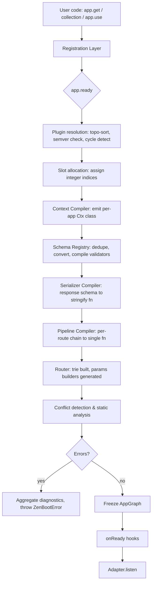
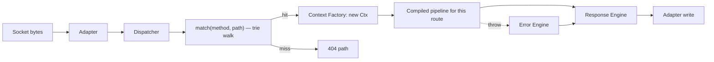
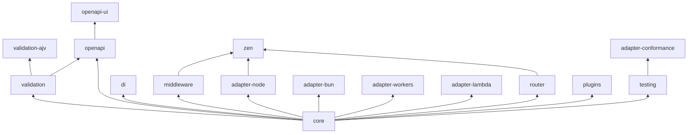

# RFC 0001 — Zen

**A Framework Architecture for the Next Decade of Node.js HTTP**

| Field | Value |
| --- | --- |
| RFC | 0001 |
| Title | Zen Core Architecture |
| Status | **Draft** — the 0.1 alpha implements a large part of it; the README's [Status](./README.md#status) section tracks what is built |
| Target | `@erenthedeveloper0/zen@1.0`, first MVP `@erenthedeveloper0/zen@0.1` |
| Runtime floor | Node 22 LTS (built); Bun 1.1, Deno 2, Workerd (designed, §14.2) |
| Language | TypeScript 5.0+ for consumers, checked in CI against the published declarations; 5.9 to build (`erasableSyntaxOnly`) |
| Supersedes | — |
| Discussion | [GitHub issues](https://github.com/erenthedeveloper0/zen/issues) |

---

## Table of Contents

**Part I — Foundations**
1. [Core Philosophy](#1-core-philosophy)
2. [High-Level Architecture](#2-high-level-architecture)
3. [Internal Module Boundaries](#3-internal-module-boundaries)
4. [Request Lifecycle: From TCP to Response](#4-request-lifecycle-from-tcp-to-response)

**Part II — The Routing Layer**

5. [Route Registry Design](#5-route-registry-design)
6. [Collection System Design](#6-collection-system-design)

**Part III — The Execution Layer**

7. [Context API Specification](#7-context-api-specification)
8. [Middleware Pipeline Specification](#8-middleware-pipeline-specification)
9. [Hook System Specification](#9-hook-system-specification)

**Part IV — The Extension Layer**

10. [Plugin API Specification](#10-plugin-api-specification)
11. [Validation Engine Architecture](#11-validation-engine-architecture)
12. [Error Handling Architecture](#12-error-handling-architecture)
13. [Serialization Architecture](#13-serialization-architecture)

**Part V — The Platform Layer**

14. [Adapter Abstraction](#14-adapter-abstraction)
15. [Dependency Injection Strategy](#15-dependency-injection-strategy)
16. [Configuration System](#16-configuration-system)
17. [CLI Architecture](#17-cli-architecture)

**Part VI — Non-Functional Architecture**

18. [Performance Optimization Plan](#18-performance-optimization-plan)
19. [Security Model](#19-security-model)
20. [Testing Strategy](#20-testing-strategy)

**Part VII — Surfaces**

21. [Public API Examples](#21-public-api-examples)
22. [Internal Interfaces](#22-internal-interfaces)
23. [Folder Structure](#23-folder-structure)
24. [Monorepo Package Split](#24-monorepo-package-split)

**Part VIII — Programme**

25. [Roadmap: MVP to v1.0](#25-roadmap-mvp-to-v10)
26. [Comparison Matrix](#26-comparison-matrix)
27. [Architectural Trade-offs](#27-architectural-trade-offs)
28. [Remaining Weaknesses & Future Work](#28-remaining-weaknesses--future-work)

**Part IX — Extended Subsystems**

29. [OpenAPI & Code Generation](#29-openapi--code-generation)
30. [Realtime: WebSockets, SSE, Jobs](#30-realtime-websockets-sse-jobs)
31. [Observability](#31-observability)
32. [First-Party Middleware](#32-first-party-middleware)

**Annexes**

- [Annex A — Glossary](#annex-a--glossary)
- [Annex B — Error Code Catalogue](#annex-b--error-code-catalogue)
- [Annex C — Benchmark Methodology](#annex-c--benchmark-methodology)
- [Annex D — Open Questions](#annex-d--open-questions)

---

## Abstract

Express won because it was small enough to hold in your head. It is now 15 years old, and the things it could not have anticipated — TypeScript, async/await, schema-first validation, edge runtimes, OpenAPI, structured observability — have each been bolted on by the ecosystem in mutually incompatible ways. The result is that a modern Express application is a pile of `declare global { namespace Express { interface Request { user?: User } } }` and `any`.

The successors each solved a slice. Fastify solved throughput and schema-driven serialization but inherited `req`/`reply` mutation and a plugin-encapsulation model that is powerful and routinely mis-taught. Hono solved portability and ergonomics but its type system leans on a builder chain that degrades under real application size. NestJS solved architecture but bought it with decorators, `reflect-metadata`, and a boilerplate tax that many teams never amortise. Elysia solved end-to-end types but is Bun-first. Nitro solved deployment but is a meta-framework, not a server framework.

Zen is an attempt to take the union of what those got right, under a single coherent model, with an explicit rule: **every dynamic behaviour is resolved at boot, not per request.** The application graph — routes, middleware chains, validators, serializers, the context shape itself — is *compiled* when the app starts (or ahead-of-time by `zen build`), and what runs per request is generated, monomorphic, allocation-lean code.

This document specifies that architecture. It is intentionally long: the point of an RFC is that the arguments are inspectable, including the ones that did not win.

---

# Part I — Foundations

## 1. Core Philosophy

### 1.1 The Nine Invariants

These are not slogans. Each is a testable constraint that a PR can violate, and reviewers are expected to cite them by number.

**I1 — Nothing is discovered at request time that could be discovered at boot time.**
Route matching, middleware ordering, validator selection, serializer selection, error-mapper selection, and the shape of the context object are all functions of static registration. They are resolved once, into generated code. The per-request path contains no registry lookups, no `Array.prototype.filter`, no `Object.keys`, no regex compilation, no `instanceof` chains over a plugin list.

**I2 — No framework object is mutated by user code.**
There is no `req.user = x`. There is no `app.locals`. There is no `res.locals`. Extension happens through *declared, typed slots* (§7.4) resolved to array indices at boot. The consequence is not aesthetic: it is that V8 sees one hidden class per context per application, forever.

**I3 — Control flow is a value, not a side effect.**
A handler returns a response. A middleware returns `undefined` (continue) or a response (short-circuit). There is no `res.send()` that may or may not have already happened, no `next()` that may or may not have been called, no request that hangs because someone forgot both. "Did this handler respond?" is answered by reading its return type, not by tracing every branch.

**I4 — Types are derived, never declared twice.**
A schema is the single source of truth for: runtime validation, TypeScript types, OpenAPI documentation, the generated client, and the response serializer. If you find yourself writing an `interface` that mirrors a schema, the framework has failed.

**I5 — Magic is opt-in and locally visible.**
Filesystem routing, DI, decorators, and auto-registration are all real features, and all of them are packages you import. The core has no behaviour you cannot trace by reading the file in front of you. Grep must work.

**I6 — Every subsystem is an interface with at least two implementations.**
Router, validator, serializer, error formatter, logger, adapter, cache store, rate-limit store, session store. The second implementation is not hypothetical — it exists in-tree and is run against the same conformance suite. A subsystem with one implementation is an unproven abstraction.

**I7 — Failure is typed and stable.**
Every error carries a stable machine-readable `code`. Codes are part of the public API and are covered by semver. Error responses conform to RFC 9457 (Problem Details) by default. Two different validation libraries produce error envelopes of the same *shape*; the issue `code` inside them is inferred from the library's message text today, so it is not yet byte-identical across libraries (§11.2).

**I8 — The framework never widens what it did not narrow.**
No public API returns `any`. `unknown` is used where a value genuinely is unknown, and the user is given a typed way to narrow it. `as` inside framework internals requires a comment justifying it; `as` in the public type surface is a bug.

**I9 — Cost is visible.**
Any feature that costs an allocation, a closure, a promise tick, or a microsecond in the hot path is documented as costing that, in the reference docs, in a "Performance" callout. Users should be able to predict their p99 from their route definition.

### 1.2 What "Express-simple" actually means

The Express hello-world is five lines and requires understanding two concepts (`app.METHOD`, `res.send`). That is the bar. Not "similar API" — *the same conceptual budget for a beginner.*

```ts
import { zen } from '@erenthedeveloper0/zen'

const app = zen()

app.get('/', () => 'Hello world')

app.listen(3000)
```

Two concepts: `app.METHOD(path, handler)`, and *the handler returns the response*. That is one fewer concept than Express, because there is no response object to learn. A beginner can be productive before encountering a `Context`, a schema, a plugin, or a type parameter.

The gradient from there is designed so each step is additive and none of it is retroactive:

```ts
app.get('/users/:id', ctx => `Hello ${ctx.params.id}`)            // + context
app.get('/users/:id', { params: IdSchema }, ctx => db.get(ctx.params.id))  // + validation
app.get('/users/:id', { params: IdSchema, response: { 200: User } }, ...)  // + contracts
```

At no point does the earlier form stop working, and at no point does adopting a later form require rewriting the earlier ones.

### 1.3 Anti-goals

Explicitly out of scope, permanently:

| Anti-goal | Reasoning |
| --- | --- |
| Being a full-stack/meta framework | Zen serves HTTP. It does not own your frontend build, SSR, or file-based pages. Nitro/Next occupy that space; competing there means competing on bundler politics. Zen must be *embeddable* in those instead. |
| An ORM | Data access is a domain with irreconcilable opinions. Zen ships DI good enough to hold yours, and adapters for lifecycle (`onClose` for pool drain). |
| Decorators in core | `reflect-metadata`, `experimentalDecorators`, and stage-3 decorators are three mutually incompatible worlds. Core stays in the intersection: plain functions and objects. `@erenthedeveloper0/zen-decorators` exists for those who want it. |
| Runtime-agnostic *at the cost of* Node performance | Hono's model treats Node as one target among many, which costs a `Request` object construction per request on the platform where 90% of production traffic lives. Zen's abstraction lives *above* the request representation, so the Node adapter can skip it entirely (§14.3). |
| Backward compatibility with Express middleware, in core | An `express-compat` shim exists (§14.7) and is honest about its cost: it materialises `req`/`res` façades. It is a migration tool, not an architecture. |
| A DSL | No custom file format, no config language, no codegen you must check in. TypeScript is the DSL. |

### 1.4 The compilation thesis

The central bet of this design is worth stating baldly, because if it is wrong, most of what follows is wrong:

> A web framework is a compiler with an HTTP server attached.

Registration is the source language. The generated per-request pipeline is the target language. Everything expensive — reflection, ordering, matching, schema traversal, key enumeration — belongs in the compile step, which runs once.

This is not novel in isolation. `fast-json-stringify` compiles serializers; `find-my-way` compiles a radix tree; Fastify compiles validation with Ajv. Zen's contribution is applying it *uniformly and to the composition itself*: the middleware chain, the hook phases, and the context object's own memory layout are compilation outputs too, and there is a single `Compiler` subsystem (§3.4) that owns all of it, with one shared escape hatch for environments where code generation is forbidden (§14.5).

The falsifiable prediction: **Zen's per-request work should be within noise of a hand-written `http.createServer` handler that does the same job.** If that is not true in benchmarks, the thesis has failed and we should say so.

---

## 2. High-Level Architecture

### 2.1 Layer map

```
┌──────────────────────────────────────────────────────────────────────────────┐
│                              APPLICATION CODE                                │
│         routes · collections · handlers · schemas · services · plugins       │
└──────────────────────────────────────────────────────────────────────────────┘
                                      │ registration (boot only)
                                      ▼
┌──────────────────────────────────────────────────────────────────────────────┐
│                            REGISTRATION LAYER                                │
│   ┌──────────┐ ┌────────────┐ ┌──────────┐ ┌──────────┐ ┌────────────────┐   │
│   │  Route   │ │ Collection │ │  Schema  │ │  Plugin  │ │    Service     │   │
│   │ Registry │ │  Registry  │ │ Registry │ │ Registry │ │   Container    │   │
│   └──────────┘ └────────────┘ └──────────┘ └──────────┘ └────────────────┘   │
│   ┌──────────┐ ┌────────────┐ ┌──────────┐ ┌──────────┐ ┌────────────────┐   │
│   │   Hook   │ │  Metadata  │ │   Slot   │ │  Error   │ │  Config Store  │   │
│   │ Registry │ │  Registry  │ │ Registry │ │ Registry │ │                │   │
│   └──────────┘ └────────────┘ └──────────┘ └──────────┘ └────────────────┘   │
└──────────────────────────────────────────────────────────────────────────────┘
                                      │ freeze() → immutable AppGraph
                                      ▼
┌──────────────────────────────────────────────────────────────────────────────┐
│                            COMPILATION LAYER                                 │
│  ┌───────────┐  ┌────────────┐  ┌────────────┐  ┌──────────┐  ┌───────────┐  │
│  │  Router   │  │  Pipeline  │  │ Validator  │  │Serializer│  │  Context  │  │
│  │ Compiler  │  │  Compiler  │  │  Compiler  │  │ Compiler │  │  Compiler │  │
│  └───────────┘  └────────────┘  └────────────┘  └──────────┘  └───────────┘  │
│         emits: match(method,path) · pipeline[] · validate() · stringify()     │
│                · class Ctx { …fixed shape… }                                  │
└──────────────────────────────────────────────────────────────────────────────┘
                                      │ artefacts
                                      ▼
┌──────────────────────────────────────────────────────────────────────────────┐
│                              RUNTIME LAYER                                   │
│    Dispatcher → Context Factory → Pipeline Executor → Response Engine        │
│                             ↕ Error Engine                                   │
└──────────────────────────────────────────────────────────────────────────────┘
                                      │ Request/Reply IR
                                      ▼
┌──────────────────────────────────────────────────────────────────────────────┐
│                              ADAPTER LAYER                                   │
│      Node http/http2 · Bun.serve · Deno.serve · workerd · Lambda · Vercel    │
└──────────────────────────────────────────────────────────────────────────────┘
```

The load-bearing property of this diagram is the **one-way arrow between Registration and Compilation, and the `freeze()` on it.** After `app.ready()` resolves, no registry accepts writes. Attempting `app.get(...)` post-boot throws `ZEN_APP_FROZEN`. This is what makes the compilation thesis safe: the compiler's output can never be stale, because its input can never change.

### 2.2 Boot-time dataflow



Two properties worth calling out:

- **K happens before the app can serve traffic.** Route conflicts, unreachable routes, missing plugin dependencies, schemas that cannot be converted to JSON Schema for an OpenAPI-enabled app, response schemas that cannot serialize a declared type — all fail at boot, loudly, with every diagnostic reported at once rather than one-per-restart (§12.7).
- **`zen build` runs A→N ahead of time** and serialises the artefacts, so production boot is `read manifest → link → listen`. This is what makes Zen viable on Workers (no `new Function`) and on Lambda (cold start).

Step J is narrower than its box once said. The router builds its trie at boot and **generates** each route's params builder, but matching is an interpreted walk of that trie, not generated code: the `charCodeAt`-scanning matcher of §18.3 C1 is designed and not built (§28.8).

### 2.3 Per-request dataflow



The compiled pipeline for a route is a *single generated function*. It inlines: the global before-hooks, the collection middleware, the route middleware, body parsing (only if the route declares a body), validation (only for declared sources), the handler call, serialization (via the route's compiled stringifier), and the after-hooks. A route with no middleware, no body, and no validation compiles to roughly:

```js
// generated, illustrative
async function route_7(ctx) {
  const r = handler_7(ctx)
  return (r !== null && typeof r === 'object' && typeof r.then === 'function')
    ? r.then(finish_json_7)
    : finish_json_7(r)
}
```

There is no array iteration, no `next` closure, no `await` on a value that was never a promise.

### 2.4 The three artefact tiers

| Tier | Produced by | Contents | Consumed by |
| --- | --- | --- | --- |
| **AppGraph** | Registration `freeze()` | Immutable, serialisable description of every route, hook, plugin, schema, slot, service, health check, and the resolved configuration with its provenance — **already redacted** (§16.1) | Compilers, OpenAPI generator, `zen routes`, `zen inspect`, `explainConfig`, client codegen |
| **Compiled artefacts** | Compilation layer | JS closures / generated source | Runtime layer |
| **Build manifest** | `zen build` | AppGraph (JSON) + pre-generated source modules | Production boot, edge bundling |

That the AppGraph is *serialisable* is deliberate and load-bearing. It means every developer tool (`routes`, `inspect`, `doctor`, OpenAPI, SDK generation, the route inspector UI, the LSP plugin) reads one canonical structure rather than re-implementing route introspection. Express's lack of this is why `express-list-endpoints` exists and is wrong about half the time.

Serialisable also means **a secret must not be in it**, which is why the configuration snapshot is redacted at the source rather than by each printer (§16.2). A projection that has to remember to hide something eventually forgets; a projection that was never given it cannot. The unredacted values exist in exactly one place — `app.config` — and reaching them requires naming the key you want, which is what a database driver does and a log line does not.

---

## 3. Internal Module Boundaries

### 3.1 Dependency rule

Modules are arranged in strata. **A module may only import from its own stratum or a lower one — never upward.** This is enforced in CI by `scripts/check-strata.ts`, which reads every import in `@erenthedeveloper0/zen-core` and fails the build on one that points up. Until `0.1.0-alpha.4` this sentence named `dependency-cruiser` and a `zen-layers.cjs` that did not exist, and the rule held by convention alone.

```
Stratum 5   adapters/*            (may import 0-4)
Stratum 4   runtime/*             (may import 0-3)
Stratum 3   compile/*             (may import 0-2)
Stratum 2   registry/*            (may import 0-1)
Stratum 1   contracts/*           (may import 0)   ← interfaces only, zero runtime code
Stratum 0   primitives/*          (may import nothing)
```

Inside `@erenthedeveloper0/zen-core` the ladder is `primitives` 0, `contracts` and `errors` 1, `registry` and `di` 2, `compile` 3, `runtime` 4 and `api` 5; `index.ts` re-exports every stratum and is not on it. Two modules at one stratum may import each other, as two files in one directory do. The upward edges that exist are the compilers whose output must call exactly what their interpreted twins call (I6) — the context compiler, the pipeline compiler and the validation compiler import their twins' helpers from `runtime/` — and each is named in the script with its reason, so a new one fails the build until somebody writes down why it is not a slip.

`contracts/` deserves emphasis: it contains **only** `interface`, `type`, and `const enum`-equivalent declarations. It compiles to zero bytes. Every cross-subsystem reference goes through it, which is what makes I6 (two implementations of everything) mechanically possible — a `Router` implementation imports `contracts/router` and nothing else from the framework.

### 3.2 Subsystem catalogue

| # | Subsystem | Package | Stratum | Responsibility | Explicitly NOT responsible for |
| --- | --- | --- | --- | --- | --- |
| 1 | **Primitives** | `core` | 0 | `Result`, `Maybe`, typed `Brand`, byte utils, LRU, radix helpers, `HeaderName` interning | Anything HTTP-aware |
| 2 | **Contracts** | `core` | 1 | All cross-subsystem interfaces | Any implementation |
| 3 | **Route Registry** | `core` | 2 | Route records, path parsing, uniqueness, metadata attachment | Matching (that is Router) |
| 4 | **Collection Registry** | `core` | 2 | Nesting, prefix composition, inherited middleware/metadata resolution | Route storage |
| 5 | **Schema Registry** | `validation` | 2 | Schema identity, dedup, JSON-Schema conversion, `$ref` naming | Validation execution |
| 6 | **Plugin Registry** | `core` | 2 | Manifests, dependency graph, topo-sort, scope tree | Executing plugin logic (that is Lifecycle) |
| 7 | **Hook Registry** | `core` | 2 | Phase→handler lists, scope resolution, ordering, phase availability | Phase execution |
| 8 | **Slot Registry** | `core` | 2 | Slot declaration → integer index, collision detection | Slot values (per-request) |
| 9 | **Metadata Registry** | `core` | 2 | Arbitrary typed route/collection metadata keyed by symbol | Interpreting metadata |
| 10 | **Service Container** | `di` | 2 | Tokens, providers, lifetimes, dependency graph | Instantiation timing at request scope (that is Context) |
| 11 | **Config Store** | `core` (`registry/config-store.ts`) | 2 | Layered resolution with per-value provenance, env validation, deep freeze, redaction (§16) — **built** | Reading files, and reading `process` (that is the CLI, the adapter, or fifteen lines of application code) |
| 12 | **Router Compiler** | `router` | 3 | Trie construction, generated params builders, conflict analysis. Matching is an interpreted trie walk; a generated matcher is designed (§18.3 C1) and not built | Route semantics |
| 13 | **Pipeline Compiler** | `core` | 3 | Chain flattening, phase ordering, codegen, sync fast-path | Middleware semantics |
| 14 | **Validation Compiler** | `validation` | 3 | Strategy selection (Ajv vs native), coercion profile binding | Schema libraries |
| 14b | **Coercion Compiler** | `compile/coercion-*` | 3 | Schema shape → coercion plan → one generated function per (route, source); interpreted twin (§11.4) | JSON Schema probe (§13.3) |
| 15 | **Serializer Compiler** | `core` | 3 | Response-schema → `stringify`, content negotiation table | Streams |
| 16 | **Context Compiler** | `core` | 3 | Per-app `Ctx` class codegen with fixed shape | Request data |
| 17 | **Dispatcher** | `core` | 4 | match → context → pipeline → reply | HTTP parsing |
| 18 | **Context Factory** | `core` | 4 | Allocate/initialise/release `Ctx`, slot array | |
| 19 | **Pipeline Executor** | `core` | 4 | Run compiled pipeline, propagate abort/timeouts | |
| 20 | **Response Engine** | `core` | 4 | `Reply` IR → body source, headers, cookies, negotiation | Writing bytes (that is Adapter) |
| 21 | **Error Engine** | `core` | 4 | Catch → classify → map → format → status | Logging (delegates) |
| 22 | **Lifecycle Manager** | `core` | 4 | Boot orchestration, readiness, graceful shutdown, drain | |
| 23 | **Adapter Layer** | `adapter-*` | 5 | Platform I/O, `Reply` → wire | Any application semantics |
| 24 | **OpenAPI Generator** | `openapi` | 3 | AppGraph → OAS 3.1 document, `$ref` dedup, diffing, and a dependency-free viewer | Deciding what a route means — it only reads the graph |

### 3.3 Boundary contracts that matter

Three boundaries carry most of the design's weight. If these leak, the architecture degrades into Express.

**B1 — Registry ⇄ Compiler.** Compilers read a frozen `AppGraph`; they never call back into registries and never hold references to registry objects. Consequence: a second router implementation can be dropped in with no knowledge of how routes were registered, and the AppGraph can be produced by something other than the fluent API (a manifest file, a codegen step, a test fixture).

**B2 — Runtime ⇄ Adapter.** The runtime never sees `http.IncomingMessage`, `Request`, or a Lambda event. It sees `RawRequest` (§22.6) — a narrow interface of method, path, header accessor, body source, and remote address. Consequence: `@erenthedeveloper0/zen-core` has zero platform imports and can run in a test harness with a fake adapter, in-process, with no sockets (§20.2).

**B3 — Core ⇄ Schema library.** Core never imports Zod, Valibot, ArkType, or TypeBox. It imports the [Standard Schema](https://standardschema.dev) interface (`~standard`), which those libraries implement natively. Consequence: the framework's dependency tree does not fork on your schema choice, and adding a schema library is a userland act, not a framework release.

### 3.4 The Compiler as a first-class subsystem

Rather than each subsystem doing ad-hoc `new Function`, all code generation goes through a single `CodeGen` facility:

```ts
interface CodeGen {
  /** Build a source unit with hygienic identifiers and captured externals. */
  unit(name: string): CodeUnit
  /** Compile, or fall back to the interpreter when caps.eval === false. */
  materialise<T>(unit: CodeUnit, fallback: () => T): T
  /** Emit to disk for `zen build` / source-map-backed stack traces. */
  emit(unit: CodeUnit, outDir: string): Promise<EmittedUnit>
}
```

Centralising this buys four things that scattered `new Function` calls cannot:

1. **A single eval-free fallback switch.** `caps.eval === false` (workerd, some CSP-locked environments) flips *every* subsystem to its interpreted implementation at once.
2. **Source maps for generated code.** Generated frames in a stack trace point back to the user's route definition file and line, not to `<anonymous>:14:22`. This is the difference between "beautiful errors" as a marketing claim and as a fact.
3. **`zen build` gets one integration point.** Emitting artefacts ahead of time is a matter of calling `emit` instead of `materialise`.
4. **Differential testing is systematic.** Every `materialise` call site has a `fallback`, so the fuzzer can run both and assert equivalence (§20.5).

### 3.5 Extension points inventory

Per I6 and deliverable §20, every subsystem exposes a replacement seam. The complete list, so that "everything is extensible" is a checkable claim rather than a vibe:

| Seam | Interface | Default | Alternate in-tree |
| --- | --- | --- | --- |
| Route matching | `Router` | `CompiledRadixRouter` | `InterpretedRadixRouter` |
| Path syntax | `PathParser` | `ZenPathSyntax` | `ExpressPathSyntax` (compat) |
| Validation | `ValidationStrategy` | `StandardSchemaStrategy` | `AjvStrategy`, `NoopStrategy` |
| Schema conversion | `JsonSchemaConverter` | per-library | user-registered |
| Serialization | `Serializer` | `CompiledJsonSerializer` | `JsonStringifySerializer`, `CborSerializer` |
| Body parsing | `BodyParser` | per media type | user-registered by MIME |
| Error formatting | `ErrorFormatter` | `ProblemDetailsFormatter` | `LegacyJsonFormatter`, `DevFormatter` |
| Context creation | `ContextFactory` | `CompiledContextFactory` | `PlainContextFactory` |
| Pipeline execution | `PipelineCompiler` | `OptimizedPipeline` | `SimplePipeline` (reference semantics) |
| Logging | `Logger` | `pino`-shaped | `ConsoleLogger`, `NoopLogger` |
| DI resolution | `Container` | `ZenContainer` | user-supplied (Awilix/tsyringe bridge) |
| Config source | `ConfigSource` | env + file | Vault/SSM/Doppler plugins |
| Runtime | `RuntimeAdapter` | per-platform | test adapter |
| Cache/rate-limit/session store | `Store` | in-memory — **built** (§32.4) | Redis, SQLite, D1, Durable Object |
| Plugin config access | `Registrar.config` | the resolved tree (§16.3) | — |
| Response media encoding | `MediaEncoderFactory` | JSON-family, via §13.3's compiled serializer — **built** (§13.4.4) | user-registered per media type (`text/csv`, `application/xml`) |

---
## 4. Request Lifecycle: From TCP to Response

This section traces one request end to end. It is the reference for what "hot path" means everywhere else in this document. Node/`http` is used as the concrete example; §14 covers how other runtimes differ.

### 4.1 The eleven stages

```
   ┌─────────────────────────────────────────────────────────────────────────┐
 0 │ ACCEPT      kernel → libuv → net.Socket                                 │  adapter
 1 │ PARSE       llhttp → method, url, headers                               │  adapter
 2 │ INGRESS     RawRequest wrapper; guards: size, count, timeout            │  adapter
 3 │ MATCH       compiled matcher → RouteRecord + params                     │  runtime
 4 │ ACQUIRE     Context Factory → Ctx (fixed shape, slot array)             │  runtime
 5 │ PRE         onRequest · onRoute · middleware   (global → scope → route) │  pipeline
 6 │ INTAKE      onParse · body read + parse (only if route declares body)   │  pipeline
 7 │ VALIDATE    preValidation · params→query→headers→cookies→body · postV.  │  pipeline
 8 │ HANDLE      preHandler · around-wrap → handler · postHandler            │  pipeline
 9 │ EGRESS      after · onSerialize · onSend · bind contract → write        │  response
10 │ SETTLE      onResponse hooks, release ctx, metrics                      │  runtime
   └─────────────────────────────────────────────────────────────────────────┘
                  any stage may throw → ERROR PATH (§4.6) → 9
                  6, 7, 8 begin with a deadline boundary → onTimeout (§4.4)
```

Stages 5–8 are not distinct runtime steps; they are *regions of one generated function*. The numbering exists so hooks, docs, traces, and profiler output share vocabulary.

### 4.2 Stage-by-stage

**0 — Accept.** Owned entirely by the platform. Zen configures `server.maxRequestsPerSocket`, `keepAliveTimeout`, `headersTimeout`, and `requestTimeout` from `config.http` (§16) with hardened defaults (§19.3). No Zen code runs.

**1 — Parse.** `llhttp` produces `IncomingMessage`. Zen does not read `req.headers` here — accessing that getter forces Node to materialise the full lowercase header object. Deferring it is worth ~400ns and one object per request for handlers that only read two headers.

**2 — Ingress.** The adapter constructs a `RawRequest` (§22.6). This is a thin struct, not a copy:

```ts
interface RawRequest {
  readonly method: string          // interned, uppercase
  readonly url: string             // raw request-target, undecoded
  header(name: LowercaseName): string | undefined
  headerNames(): Iterable<string>
  readonly body: BodySource        // pull-based, not yet read
  readonly remote: RemoteInfo
  readonly native: unknown         // escape hatch, typed per adapter
}
```

Ingress guards run here because they must run before any allocation proportional to attacker input: header count cap, header size cap, URL length cap, and the `requestTimeout` arm. A request rejected at ingress never allocates a `Ctx`.

**3 — Match.** The compiled matcher is called with `(method, path)` where `path` is the URL up to the first `?`, found with `indexOf` rather than `new URL()` (the WHATWG URL constructor is ~2µs and allocates; we need a `slice`). A request target in the absolute form — `GET http://host/path`, which RFC 9112 §3.2.2 requires a server to accept and a client behind a forward proxy sends — is reduced to its path first; the origin form pays one character comparison for that (`benchmarks/request-path`).

The matcher returns a `MatchResult`:

```ts
type MatchResult =
  | { route: RouteRecord; params: ParamsObject | null }   // params object has the route's exact shape
  | { route: null; allowed: readonly string[] }           // path matched, method did not → 405 with Allow
  | null                                                  // no match → 404
```

The 405 distinction is free: the trie node already knows which methods it holds. Express returns 404 for a wrong method, which is technically wrong and practically annoying.

**4 — Acquire.** `ContextFactory.acquire(raw, match)` returns a `Ctx`. Whether this is `new Ctx()` or a pooled instance is a configuration decision, discussed in §18.5 — the important part is that the shape is identical either way, because the class was generated in §2.2 step F with every slot, decorator, and lazy cache field initialised in the constructor in a fixed order.

Everything derived from the request is *lazy and memoised*: `ctx.query`, `ctx.cookies`, `ctx.headers` are getters that compute once and cache into a pre-declared private field. A route that never touches `ctx.cookies` never parses a `Cookie` header.

**5 — Pre.** `onRequest` hooks, then `onRoute`, then the route's phase and `around` middleware. These run before body intake, which is what makes them the correct place for auth, rate limiting, and CORS preflight: rejecting here means never reading the body of a request you were going to refuse. A hook returning a `Reply` short-circuits directly to stage 9.

Stages 6, 7 and 8 each begin with a **deadline boundary** on routes that declared a timeout (§4.4): the stage is marked, and a request that is already over stops there rather than continuing. On routes that declared none, no such code is emitted.

Global `onRequest` hooks also run when stage 3 matched nothing. Rate limiting and CORS live in this phase, and a rate limiter that only sees matched routes is bypassed by requesting a path that does not exist (§9.2).

**Content negotiation runs here too**, between the hooks and the route's middleware, and only on routes that declare more than one representation (§13.4.2). Same argument as the two above: a 406 is knowable from one header and the frozen graph, so answering it after the handler has queried a database would make the refusal cost more than the success. The consequence worth knowing is that `ctx.negotiated` is set before any application code runs, which is what lets an `around` middleware use it as a cache key.

**6 — Intake.** Skipped entirely unless the route's compiled pipeline includes it, which it does only if the route declares `body` in its schema *or* opts in with `body: 'raw' | 'stream' | 'auto'`. This is the single biggest divergence from Express, where `express.json()` reads and parses every body on every matched route regardless of need.

The body source is pull-based; the parser is selected by `Content-Type` against the `BodyParser` registry at compile time when the route declares a single content type, or at request time from a small perfect-hash when it declares several. Limits (`maxBodySize`, per-route override) are enforced *during* read, aborting the stream rather than after buffering.

**7 — Validate.** Bracketed by `preValidation` and `postValidation`. Sources are validated in a fixed order — params, query, headers, cookies, body — chosen so that cheap, small, already-in-memory sources fail first. Each validated source *replaces* the lazy getter's cache with the parsed, coerced output, so `ctx.query.page` is `number`, not `string`, and there is no second "validated" object to keep in sync (which is the flaw in the `req.validated.body` pattern many Express middlewares use). The coercion that makes that sentence true runs *inside* this stage, immediately before the source's validator and only where the schema declared a type the wire cannot carry — §11.4.

All source failures are collected into one `ValidationError` with per-source issues rather than failing on the first — one round trip should tell a client everything that is wrong.

**8 — Handle.** `preHandler`, the handler, `postHandler`. If the route has `around` middleware, the compiled pipeline builds the wrapping chain here (the only place per-request closures are created, and only for routes that use it, §8.4). Otherwise the handler is called directly.

**9 — Egress.** The handler's return value becomes a `Reply` (§13.2). The epilogue then runs, in this order: `after` middleware, `onSerialize` hooks (which transform the payload), `onSend` hooks (which transform the reply — this is where compression and encryption plug in), and finally the response contract, which binds the route's compiled stringifier if a schema exists for the status.

The contract is attached **last** on purpose, and it is a security property rather than an ordering detail: §13.3's guarantee then covers whatever is actually being sent — short-circuited replies, hook-substituted replies, everything — rather than only what the handler first produced. The direct consequence is that an `onSerialize` hook cannot smuggle an undeclared field past the response schema, because the serializer runs after it.

**10 — Settle.** `onResponse` hooks run *after* the last byte is flushed, so they see real timing and cannot affect output. The deadline is disarmed *before* this stage, not after: it bounds the work, not the write (§4.4). `ctx.aborted` and `ctx.timedOut` are published here. Request-scoped services are disposed in reverse creation order — including on the timeout path, because a request that gave up still has to release what it took. The `Ctx` is released. Metrics are recorded.

### 4.3 Timeline with realistic budgets

Measured against the target in §18.2 for a JSON echo route with a validated body, on Node 20, one core, in-process:

| Stage | Budget | Allocations |
| --- | --- | --- |
| 2 Ingress | 0.4 µs | 1 (`RawRequest`) |
| 3 Match | 0.3 µs | 1 (params object) |
| 4 Acquire | 0.2 µs | 2 (`Ctx`, slot array) — 0 when pooled |
| 5 Pre (2 hooks) | 0.2 µs | 0 |
| 6 Intake (1 KB) | 1.8 µs | 2 (chunk, string) |
| 7 Validate | 0.9 µs | 1 (output object) |
| 8 Handle | user | user |
| 9 Egress | 1.1 µs | 2 (string, headers) |
| 10 Settle | 0.2 µs | 0 |
| **Framework total** | **≈ 5.1 µs** | **≈ 9** |

These are targets, not measurements — the point is that they are *stated in advance* so the benchmark suite (Annex C) can falsify them. For comparison, an Express app with `json()` + one validation middleware sits around 28–40 µs and 60+ allocations on the same workload, most of it in `req`/`res` property churn and the parser running unconditionally.

One line is deliberately absent, because it is opt-in: a route that declares a **deadline** adds roughly a microsecond and five allocations at stage 4 — a timer, an `AbortController`, a listener on the connection signal, a promise, and the race — plus about a nanosecond at each of the three stage boundaries. Measured in `benchmarks/deadlines/run.ts` rather than estimated here, because it is the one cost in this table large enough that a reader deciding whether to bound a route deserves a real number (§4.4).

### 4.4 Deadlines, cancellation, backpressure

> **Status: built.** Deadlines resolve from the app / collection / route scope chain at boot, the arm answers on time, the compiled pipeline stops abandoned work at the §4.1 stage boundaries, and `onTimeout` fires with the stage it blew in. Runnable in `examples/deadlines`; measured in `benchmarks/deadlines/run.ts`. Off by default — see the last subsection for why that is a position and not an oversight. <!-- claim: deadlines -->

Every `Ctx` carries a real `AbortSignal`, wired to client disconnect (`req.on('aborted')` / `close`) **and** to the request deadline. It is not decorative: it is passed to `fetch`, to DB drivers that accept one, and to `ctx.stream()`. On abort, the pipeline stops at the next stage boundary, `onResponse` still runs (with `ctx.aborted === true`), and disposal happens. This closes the "client hung up but we kept querying Postgres for 30 seconds" hole that every Express app has.

#### A timeout is a duration; a deadline is an instant

The distinction is load-bearing rather than pedantic. A duration cannot be handed to anything downstream. A service told "you have 30 seconds" that forwards *30 seconds* to each of four sequential calls has silently promised two minutes; one that forwards the time actually remaining has not.

So a route declares a **timeout** and a request carries a **deadline**:

```ts
createApp({ timeout: { default: '30s', header: 'x-request-timeout' } })
app.collection('/reports', { timeout: '10s' }, …)
app.get('/status', { timeout: '250ms' }, handler)
app.get('/feed',   { timeout: false },    handler)   // refuses the inherited one
```

```ts
ctx.deadline   // performance.now() at expiry, or null
ctx.timeLeft   // ms remaining; Infinity when unbounded, so arithmetic always works
ctx.timedOut   // published at settle, alongside ctx.aborted
```

`timeLeft` is `Infinity` rather than `null` so that `Math.min(ctx.timeLeft, 2000)` is correct on every route and no call site needs a ternary. `false` is distinct from omitting the key for the same reason `timeout: 0` is a boot error rather than a synonym for it: omitting *inherits*, and a streaming route under a bounded collection has to be able to refuse.

Resolution is the same shape as §9.3's hook resolution and §6.3's middleware flattening — outermost to innermost, at boot, onto `RouteRecord.timeout` — with one difference: **the innermost declaration wins outright** rather than accumulating. Middleware composes because every layer is meant to run; two budgets in scope cannot both apply, so the only question is which, and the answer that matches how people read code is the nearest one.

#### Two mechanisms, because one is not enough

**The arm** is a timer that fires at the deadline, aborts the signal, and answers the request whether or not the pipeline has finished. This is what makes the *connection* bounded, and it is the half that closes the production hole: without it, a handler that never returns holds its socket and its place in the event loop until the process restarts, and nothing in the framework, the logs, or the metrics says so.

The arm cannot make the *work* stop. You cannot interrupt a running `await`, and any framework claiming otherwise is claiming something JavaScript does not offer.

**The stage checks** are emitted by the pipeline compiler at the boundaries of §4.1, so a request whose deadline has already blown — or whose client has already left — stops at the next boundary instead of validating a body and querying a database for an answer nobody will read. This is the half a compiled framework gets nearly free and an interpreted middleware chain cannot get at all: the boundaries are known statically, so the checks are two or three branches on routes that declared a deadline and **no emitted text at all** on routes that did not. Same rule as §9.4, checked the same way — `benchmarks/deadlines/run.ts` fails the build unless the pipeline for a route with no deadline is byte-identical to one compiled in an app that never heard of the feature.

The granularity is the stage, not the step. A check between every middleware would cost a branch per step on every bounded route to win only where several consecutive steps are each slow, which is not the shape of a real chain.

The pipeline also *marks* the stage it is entering — one store of an interned literal — which is why a blown deadline can report **where** it went rather than only that it went. "This endpoint is slow" and "validation is where this endpoint is slow" are different bugs with different fixes, and the second one is normally a profiling exercise.

#### What the deadline covers

| | |
| --- | --- |
| Stages 5–9 (pre, intake, validate, handle, egress preparation) | Covered. |
| Stage 10, the write | **Not** covered, and disarmed before it. Cancelling a 2 GB download halfway is not a timeout, it is a corrupt response — the status line has already gone out. |
| The headers timeout | The adapter's (`server.headersTimeout`). It fires before a `Ctx` exists. |
| A fully synchronous pipeline | Cannot time out, because it never yields, so its timer cannot run. It also cannot hang, which is the only reason a deadline was wanted. §8.4's fast path skips the race entirely. |

The last row is worth stating plainly because it sounds like a hole and is not.

#### The status, and the phase

A blown deadline runs every `onTimeout` hook, innermost first; the first to return a `Reply` answers the request. If none does, it becomes an ordinary `ZEN_TIMEOUT` error and takes the §4.6 error path, so error mappers, `onError` hooks, the RFC 9457 envelope and `onSend` all cover it exactly as they cover a bad body. A timeout that skips half the error machinery is how a service ends up with timeouts no dashboard counts.

Two statuses, because the two situations are not the same failure and should not page the same person. Time spent in **intake** is time spent reading from the client's socket, so a request that dies there is the client being slow — **408**, and a retry may work. Everything after intake is time we spent, and an immediate retry will fail the same way — **504**. Annex B's "408/504" for `ZEN_TIMEOUT` is this split.

A request abandoned because its *client* left is answered **499** (nginx's code). Non-standard because the situation is: there is no client left to receive a status, so the code exists purely to be counted. `ctx.aborted` and `ctx.timedOut` decompose the outcome — `aborted && timedOut` is a deadline we blew, `aborted && !timedOut` is a client that left — and counting only one of them is how "we have no slow requests" and "8% of clients give up" end up on the same dashboard.

#### Propagation

`timeout: { header: 'x-request-timeout' }` reads an inbound budget and **shortens** the deadline to it. This is the other half of a distributed deadline: a caller with 400 ms left should not be told to wait 30 s for an answer it will discard.

The clamp is one-way and that is the security property. Honouring a shorter inbound budget is cooperative. Honouring a *longer* one hands any client the ability to pin a connection for as long as it likes, which is slowloris with a friendlier header name. Reading the header at all is opt-in, because trusting a request header is a decision and silently honouring one nobody enabled is how a header becomes an attack surface.

#### Why the default is off

Arming a deadline costs a timer, an `AbortController`, a listener on the connection's signal, and a promise — about a microsecond, published in `benchmarks/deadlines/run.ts` rather than described as negligible. Against a route that does nothing that is a large fraction of a small number; against a route that talks to a database it is under half a percent.

Zen does not levy costs that were not asked for: a route with no body declares no intake, a phase with no hooks emits no code, and a service with no configured budget arms no timers. But §19.2's hardened-defaults table says 30 s, the README says to set it, and `examples/deadlines` sets it — because for anything public this is the wrong thing to save. §16 has landed and `defineConfig` is where this belongs; the hardened *profile* that sets it by default is still unbuilt, so for now it is one line at the composition root — `zen({ config, timeout: '30s' })`.

The known optimisation is a coarse timer wheel — one interval with requests bucketed by expiry, the way Node schedules `keepAliveTimeout` itself — which would trade deadline precision for a near-zero per-request cost. It is not built, and quoting a number that assumes it would be quoting a number nobody can reproduce.

#### Backpressure

Backpressure is the adapter's job and is never abstracted away: `ctx.stream()` returns a sink whose `write` returns a promise resolving on drain. Streams are piped with `stream.pipeline`, so an error at any stage destroys the whole chain and leaks nothing.

### 4.5 Graceful shutdown

On `SIGTERM`, the Lifecycle Manager (§22.9) runs a documented sequence:

1. Flip the health endpoint to `draining` (so the load balancer stops sending traffic) — then wait `config.shutdown.drainDelay` (default 5 s) *before* refusing anything. Skipping this delay is the number-one cause of 502s during rolling deploys, and most frameworks skip it.
2. Stop accepting new connections; set `Connection: close` on in-flight keep-alive responses.
3. Await in-flight requests up to `config.shutdown.timeout` (default 30 s).
4. Run `onClose` hooks in reverse registration order (so plugins tear down after their dependents).
5. Dispose singleton services in reverse dependency order.
6. Force-destroy remaining sockets; exit.

Each step is observable and individually overridable.

> **Status: built, and it used to run inverted.** Steps 4 and 5 executed *first*, so the singletons — connection pools, clients, anything with a `dispose` — were torn down during the window in which the load balancer is still sending traffic. The default `drainDelay` of 0 kept it invisible: the window was empty, so nothing arrived to fail. It opened only for someone who set the delay this section tells them to set. <!-- claim: graceful-shutdown -->
>
> It stayed wrong through writing, implementing and reviewing because nothing could ask it a question. Step 1 is unobservable without a readiness endpoint, and there was none until §31.4. `scripts/smoke.ts` now asserts the ordering over a real socket, mid-shutdown, and `examples/health` lets you watch it: `/readyz` goes 503 immediately and the process keeps answering for the whole drain window.
>
> The drain delay must be longer than your orchestrator's `periodSeconds × failureThreshold` for readiness, or the socket closes while traffic is still being routed. `examples/health` does that arithmetic out loud, because in most deployments the value is 0 and the sum was never done.

### 4.6 The error path

Any throw at stages 2–9 enters the Error Engine (§12), which is itself a compiled dispatch: the route's error mappers, its scope's mappers, then global mappers, resolved at boot into an ordered array with a class→index map. The error path never allocates a new pipeline and never re-enters user middleware. Errors thrown *inside* the error path are caught by a last-resort handler that emits a minimal 500 and logs at `fatal` — the framework must never crash the process because an error formatter had a bug.

---

# Part II — The Routing Layer

## 5. Route Registry Design

### 5.1 The RouteRecord

The atom of the system. Everything downstream — matcher, pipeline, OpenAPI, client codegen, `zen routes` — is a projection of this.

```ts
interface RouteRecord<S extends RouteSchema = RouteSchema> {
  /** Stable identity. Explicit `name`, else `${method}:${fullPath}`. Used by
   *  url generation, metrics labels, OpenAPI operationId, client method names. */
  readonly id: RouteId
  readonly name: string | undefined

  readonly method: HttpMethod
  /** Fully composed, including all ancestor prefixes. Normalised, no trailing slash. */
  readonly path: string
  /** Parsed segments — the compiler's input. */
  readonly segments: readonly PathSegment[]

  readonly schema: S                       // params/query/headers/cookies/body/response
  readonly handler: Handler<S>

  /** Flattened at boot: ancestors' middleware + own, in execution order. */
  readonly middleware: readonly MiddlewareRef[]
  /** Flattened hooks per phase. */
  readonly hooks: PhaseTable

  /** What this route can produce, in preference order, or `null` when it
   *  declares one representation and is therefore not negotiated (§13.4.1).
   *  Here for the same reason `hooks` and `timeout` are: it is a function of
   *  static registration, so the step the pipeline emits, the line
   *  `explainRoute` prints and the `content` map @erenthedeveloper0/zen-openapi writes all read
   *  one structure and cannot disagree about which media types this route
   *  serves. */
  readonly negotiation: NegotiationRecord | null

  readonly meta: MetadataMap               // symbol-keyed, typed via declaration merging
  readonly collection: CollectionId | null
  readonly version: VersionSpec | null

  /** Provenance for diagnostics: file, line, and whether generated. */
  readonly origin: SourceOrigin
}
```

> **Not built.** `origin` is designed below and is `undefined` on every record today, as is every middleware's (§28.8); the diagnostics that would quote it name the route instead. <!-- gap: route-origin -->

`origin` is not optional and is not debug-only. It is designed to be captured at registration via a cheap stack-frame parse (one `Error().stack` read, only during boot) and it is what makes every downstream error message able to say *"route registered at `src/routes/users.ts:42`"* instead of pointing into framework internals. This is the single highest-leverage DX decision in the registry.

### 5.2 Path syntax

Deliberately small, statically analysable, and unambiguous. **No regex in paths** — regex paths defeat trie compilation, cause ReDoS (the `path-to-regexp` CVEs), and cannot be reflected into OpenAPI.

| Syntax | Meaning | Type inferred |
| --- | --- | --- |
| `/users` | static segment | — |
| `/users/:id` | required param | `string` |
| `/users/:id<int>` | typed param, matcher-enforced | `number` |
| `/users/:id<uuid>` | typed param | `string & Brand<'uuid'>` |
| `/files/*path` | named wildcard (tail) | `string` |
| `/posts/:slug?` | optional trailing param | `string \| undefined` |
| `/v:version<int>/users` | param inside a segment | `number` |

Built-in param types: `int`, `float`, `uuid`, `ulid`, `date` (ISO-8601), `slug`, `hex`, plus user-registered types:

```ts
app.paramType('objectId', {
  test: (s: string) => s.length === 24 && HEX24.test(s),
  parse: (s) => new ObjectId(s),
  jsonSchema: { type: 'string', pattern: '^[0-9a-f]{24}$' },
})
```

A param type contributes three things at once: a matcher predicate compiled into the trie (so `/users/abc` cleanly 404s rather than reaching your handler with garbage), a parse function, and a JSON Schema fragment for OpenAPI. One declaration, three consumers — I4. A fourth arrived with URL generation (§5.7): the same predicate tests every value `app.url` writes into a path, so a link the matcher would refuse is never built.

For the third consumer to actually get it, the registry is published on the built router and carried on the frozen `AppGraph` as `graph.paramTypes`. `@erenthedeveloper0/zen-openapi` must not depend on `@erenthedeveloper0/zen-router` (§24.3), and the alternative — a second copy of the built-in table inside the OpenAPI package — is the shorter path and the one where "three consumers, one declaration" quietly becomes two declarations.

Path templates are also *typed at the type level*: `ExtractParams<'/users/:id<int>/posts/:slug'>` resolves to `{ id: number; slug: string }` via template literal types, so `ctx.params` is typed **even with no schema at all**. Adding a `params` schema refines it further, and it is checked against the path at boot (since `0.1.0-alpha.4`): declaring `params: z.object({ userId: ... })` on `/users/:id` is the boot error `ZEN_PARAM_MISMATCH`, with *did you mean to name it "id"?* — before it, that route booted and answered every request 400. A required key only an optional segment supplies is an error too, and so is a path parameter a closed schema (`additionalProperties: false`) would refuse; one an open schema would drop is a warning, and an `integer` schema on an untyped segment is reported once, as information, because `:id<int>` makes `/users/abc` a 404 at the matcher where the schema makes it a 400 after validation. A schema that cannot be described is left to `@erenthedeveloper0/zen-openapi`, which already reports it. <!-- claim: params-mismatch -->

> **Designed, not built** — and until `0.1.0-alpha.3` this paragraph said it was. Today such a route boots and answers every request 400, because the schema requires a key the router never supplies. The code exists and has a producer now, from the other direction: `app.url()` raises it for parameters its route's template cannot carry (§5.7). The boot-time check is §28.8's.

### 5.3 Registration surface

Three overloads, one semantic:

```ts
app.get('/health', handler)                              // 1: path + handler
app.get('/users/:id', { params, response }, handler)     // 2: path + spec + handler
app.route({ method: 'GET', path: '/users/:id', ... })    // 3: object form (codegen-friendly)
```

Form 3 is the canonical one; 1 and 2 desugar to it. This matters because filesystem routing, the `express-compat` layer, plugin-registered routes, and deserialisation from a build manifest all target form 3 — there is exactly one code path that creates a `RouteRecord`.

`app.route()` accepts a `RouteDefinition` that is a plain serialisable object except for `handler` and schema references, which is what lets `zen build` round-trip the graph.

### 5.4 Storage and indexing

```ts
class RouteRegistry {
  #byId       = new Map<RouteId, RouteRecord>()
  #byName     = new Map<string, RouteRecord>()          // for url generation
  #byMethod   = new Map<HttpMethod, RouteRecord[]>()    // compiler input
  #byPath     = new Map<string, Map<HttpMethod, RouteRecord>>()  // conflict detection & 405
  #frozen     = false
}
```

Four indices, all built during registration, all discarded after compilation except `#byId` and `#byName` (kept for URL generation and introspection). Registration is O(1) amortised per route; a 2,000-route app registers in single-digit milliseconds.

### 5.5 Conflict detection

Express resolves routes by first-registered-wins with silent shadowing. This is the source of a genuinely common production bug: `/users/new` registered after `/users/:id` is unreachable, and nothing tells you.

Zen classifies every pair of routes at boot:

| Class | Example | Behaviour |
| --- | --- | --- |
| **Duplicate** | `GET /users/:id` twice | **Boot error** `ZEN_ROUTE_DUPLICATE`, both origins reported |
| **Shadowed** | `GET /users/:id` then `GET /users/new` | **Not an error.** Static beats dynamic by priority (§5.6); the intent is unambiguous |
| **Ambiguous** | `GET /:a/b` vs `GET /a/:b` for `/a/b` | **Boot error** `ZEN_ROUTE_AMBIGUOUS` — no priority rule makes this obviously right, so we refuse to guess |
| **Unreachable** | `GET /*path` then `GET /files/x` | Static still wins; no error, but `zen doctor` warns |
| **Overlapping wildcards** | `/a/*x` and `/a/*y` | **Boot error** `ZEN_ROUTE_DUPLICATE` |

The ambiguity check is a bounded pairwise analysis on the trie, not a full path-space intersection: two routes are ambiguous iff they have equal segment count, differ in at least one position where one is static and the other is dynamic, *and* neither dominates the other in every position. Cost is O(n·k) for n routes of depth k with grouping by segment count, comfortably under 5 ms for 10,000 routes.

Two more classes, both found by the pre-release audit and both boot errors:

- **Two routes sharing a `name`** — `ZEN_ROUTE_DUPLICATE`. A route's id is its name when it has one, and the id is what the compiled route table, the OpenAPI `operationId` and every metrics label are keyed by. Before the check, the second registration silently replaced the first in the table and each route answered the other's requests.
- **Two different parameter types in one position that can match one value** — `/items/:id<int>` and `/items/:key<slug>` both accept `42`. Both rank "typed param" (§5.6), so no rule separates them, and it is `ZEN_ROUTE_AMBIGUOUS`, naming the value. Whether two predicates intersect is undecidable in general, so the check searches *witnesses* — values each builtin type is known to accept, and an application type's `jsonSchema.examples` — against the other type's test. A pair nothing can decide is reported as the warning `ZEN_ROUTE_TYPES_UNDECIDED` rather than guessed at.

### 5.6 Priority

Deterministic, positional, and documented — decided **left to right per segment**, not by whole-route score (whole-route scoring is what makes other routers' behaviour hard to predict):

```
static  >  typed param  >  param  >  optional param  >  wildcard
```

The first segment where two candidates differ decides. Registration order is never a factor, which means splitting routes across files can never change behaviour — a property Express does not have and which is why large Express apps are afraid of reordering imports.

That sentence was false in one place until the pre-release audit: two typed parameters in the same position were tried in the order they were inserted into the trie, which *is* registration order. Overlapping types are now a boot error (§5.5), and the pairs nothing can decide are tried in type-name order — the same on every boot, whichever file was imported first.

### 5.7 URL generation

Because names and segments are in the registry, reverse routing is free:

```ts
app.url('user.show', { id: 42 })                  // → '/users/42'
app.url('user.show', { id: 42 }, { q: 'x' })      // → '/users/42?q=x'
```

What makes it worth having over `` `/users/${id}` `` is a guarantee rather than a convenience: **a URL `app.url` returns is one the named route answers, with the parameters it was given — or it throws.** A template literal goes wrong in three ways, and each is closed here:

- **A value escapes its segment.** `/files/${name}` with a name of `a/b`, `x?y` or `#top` is a different path, a query or a fragment. Every value is percent-encoded as exactly one segment. `.` and `..` cannot be — a browser resolves them before it sends the request, `%2E%2E` included, so `/files/..` is a link to `/` — and are refused, as is an empty value, whose path is another route's.
- **The route would not match the value.** The parameter's own type tests it: `:id<int>` given `'7a'` is a refusal in the handler that built the link rather than a 404 for whoever clicked it. §5.2's one declaration has a fourth consumer.
- **Another route answers it.** `/users/:id` given `me` is `/users/me`, and `GET /users/me` outranks it (§5.6). Ranking is the router's to decide, so the compiled router is asked — one `match` per call — and an answer that belongs to any other route is `ZEN_PARAM_MISMATCH`, naming the route that won.

The query string is written the way the route parses it: percent-encoded rather than form-encoded, because `parseQuery` reads `+` as a space; and a list repeated, comma-joined or bracketed as the route's coercion plan says (§11.4) — the same plan the OpenAPI generator reads for `style: form, explode: false`, so the link, the document and the parser agree because there is one answer. What the parser would drop or reshape is refused rather than sent: a `__proto__` key, a nested object, a comma-list element that holds a comma, more pairs than `maxQueryParams`.

The result is always a path on the application's origin. It is therefore what `isLocalUrl` accepts and what `ctx.redirect()` sends without consulting `redirect.allowExternal` (§19.5.2). An absolute URL — for an email, say — is the application's to make, from an origin it configured; the request's `Host` header is the client's.

> **Built in `0.1.0-alpha.3`, with three corrections to this section's first draft.**
>
> **Checked when it is called, not by `tsc`.** The first draft had `app.url` typed by route name, with a missing or wrongly-typed parameter a compile error. That needs every route's name accumulated into the app's type, and a collection's callback — `app.collection('/users', users => …)` — cannot pass a type back out; accumulating names through the builder chain is also exactly the mapped-type growth §10.4 and §28.2 warn about. So a name nothing registered is `ZEN_ROUTE_UNKNOWN`, with the name that was probably meant, and a parameter that cannot build the link is `ZEN_PARAM_MISMATCH` — both at the first call, in the first test that renders the link, which is the bargain §19.5.1 makes for an `html` template. The values are typed (`UrlValue`: a string, number, bigint, boolean or `Date` — never "anything with a `toString`", because a plain object's is `[object Object]` and an untyped `:slug` would carry it); the names are not.
>
> **Names are written in full.** §6.2 and §6.3 had a collection's `name` dot-joined onto the names of its routes. It never was, and by the time something read names as keys every example had namespaced its routes by hand — `pages.note` inside a collection named `pages` — so composing them now would rename every one of those routes: its OpenAPI `operationId`, its metrics labels and its links. A route's name is the string it was given, and a collection's is the collection's own.
>
> **A refusal never quotes a value.** It names the route, the parameter, its type and the shape of what arrived — `a value of 20 characters for :token<hex>` — and, when another route outranks the link, that route rather than the path. A link is where a password-reset token or a signed id lives, and a refusal is logged; the header check reports a code point and the redirect check an origin for the same reason (§19.5).
>
> **Reachable from where routes are written.** A feature module is handed a `Collection` and never sees the app, so `Collection#url` is the same function, and `Registrar.url` is it for a plugin's handlers. Route names are the application's, so either reaches any route. During a plugin's `setup` it is `ZEN_APP_NOT_READY`: nothing is compiled until every plugin has run.
>
> Nothing here generates code, so there is no interpreted twin (§20.5); the oracles are the router and the WHATWG URL parser. `url.test.ts` builds 2,000 links from hostile values over a table of shadowing traps, sends what a browser would make of each through the application, and requires the named route to answer with the values given — or the call to have refused, with its coverage asserted per kind of refusal. `benchmarks/url` gates the same property in CI and measures the price: ~60 ns for a static route and ~0.5 µs for one `<int>` parameter, about half of which is the router's `match` — the part that is the guarantee (§28.8).
>
> The client SDK generator (§29.6) is designed to emit the same thing for the browser, and is not built.

### 5.8 Versioning

Versioning is a first-class route dimension rather than a naming convention, because it affects matching, OpenAPI grouping, and deprecation reporting:

```ts
app.collection('/users', { version: 'v1' }, c => { ... })
app.collection('/users', { version: 'v2' }, c => { ... })
```

Three strategies, chosen per-app in config, all compiling to the same registry shape:

| Strategy | Wire form | Matching |
| --- | --- | --- |
| `prefix` (default) | `/v1/users` | version becomes a leading static segment |
| `header` | `Accept-Version: v1` | version becomes a secondary dispatch on the matched node |
| `media-type` | `Accept: application/vnd.api+json;version=1` | parsed in ingress, then as `header` |

For `header`/`media-type`, the trie node holds a small version map; resolution is one `Map.get`. Deprecated versions can carry `{ deprecated: '2026-01-01', sunset: '2026-07-01' }`, which emits `Deprecation`/`Sunset` headers automatically and surfaces in OpenAPI and in `zen routes --deprecated`.

---

## 6. Collection System Design

### 6.1 Rationale

Express `Router` instances are objects you must create, configure, and mount — three steps, and the mounting is where the prefix lives, so a route's real path is not visible at its definition. Laravel's route groups are a closure that receives a builder; the prefix is stated once, at the top, and everything inside inherits it lexically. The Laravel form is better and Zen adopts it.

```ts
collection('/users', users => {
  users.get('/', listUsers)
  users.post('/', createUser)
  users.patch('/:id<int>', updateUser)
})
```

A collection is **not** a runtime object in the request path. It is a registration-time scope that contributes prefix, middleware, hooks, metadata, and schema fragments to the `RouteRecord`s created inside it. After boot, collections exist only in the AppGraph for introspection and OpenAPI grouping. **There is no per-request cost to nesting collections twenty deep.** This is the key architectural difference from Express's `Router`, where each mounted router is a real middleware layer that every request traverses.

### 6.2 Options

```ts
interface CollectionOptions<Ctx = {}> {
  prefix?: string
  name?: string                       // the collection's own, on the AppGraph — route names are written in full (§5.7)

  use?: Middleware[]                  // applied to every route within
  hooks?: Partial<PhaseHandlers>

  schema?: {                          // merged into every child route's schema
    headers?: StandardSchema
    query?: StandardSchema
    response?: Partial<Record<StatusCode, StandardSchema>>  // e.g. shared 401/403/500
  }

  meta?: MetadataInit                 // arbitrary, typed
  tags?: string[]                     // OpenAPI
  version?: VersionSpec
  authorize?: Policy | Policy[]       // §19.6
  rateLimit?: RateLimitSpec
  plugins?: Plugin[]                  // scoped: registered for this subtree only
  when?: (env: Env) => boolean        // conditional registration, evaluated at boot
}
```

`when` is evaluated **once, at boot** — not per request. `when: env => env.NODE_ENV !== 'production'` means the routes are not merely blocked, they do not exist in the trie, do not appear in OpenAPI, and cost nothing. Conditional-at-request-time middleware is a separate feature (§8.7).

### 6.3 Inheritance semantics

Ambiguity in inheritance is the main way "route groups" go wrong, so each field's merge rule is specified exactly:

| Field | Rule | Rationale |
| --- | --- | --- |
| `prefix` | concatenate, normalise slashes | Only sane option |
| `name` | **not inherited** — a route's name is the string it was given | This row said "dot-join", and it was never built. By the time a reader of names existed (§5.7) every application had namespaced its routes by hand, and composing them would rename each one: its `operationId`, its metrics labels and its links |
| `use` | **outer-first append**, deduped by middleware identity + config hash | Auth before authorization before handler is the near-universal intent |
| `hooks` | append per phase, outer-first for the pre-family, **total reversal for the post-family** | Symmetry: an onion, not a queue. An outer hook that opened a transaction must close it after the inner ones. "Total" matters: two pairs registered A then B on one scope must run A,B in and B,A out, or the onion has a seam |
| `schema.headers/query` | **intersect** (all constraints apply) | Adding a constraint at an inner level must not weaken an outer one |
| `schema.response` | inner overrides outer per status code | An inner route legitimately returns a more specific 200 |
| `meta` | shallow merge, inner wins | Predictable; deep merge is where surprise lives |
| `tags` | union | OpenAPI semantics |
| `version` | inner overrides | |
| `authorize` | **conjunction** (all must pass) | Security must not be weakenable by nesting. A child can never *remove* a parent's policy |
| `rateLimit` | **most restrictive wins** | Same reasoning |
| `plugins` | scoped to subtree; duplicate registration is an error unless the plugin declares `multiple: true` | |

The two rules in bold — `authorize` conjunction and `rateLimit` restrictiveness — are deliberate asymmetries with the rest of the merge table. Security controls compose by strengthening only. If a route genuinely needs to escape an ancestor policy, it must be moved out of that collection, which makes the exception visible in the file structure rather than hidden in an override flag.

Nesting is real: a `Collection` can declare another, and `prefix`, `use`, `hooks` and `tags` compose down the chain. It stayed unimplemented longer than it should have because nothing exercised it — tag inheritance is what finally did, since an operation's tags are the union of every collection it sits inside (§29.2). Still zero runtime cost: these are registration-time scopes, so twenty levels of nesting compile to the same pipeline as none, unlike Express `Router` instances which are real middleware layers every request traverses.

`hooks` are declarable two ways — with the collection (`{ hooks: { onRequest: h } }`) or inside it (`api.hook('onRequest', h)`) — and they resolve identically. The first reads better for a property of the whole subtree ("every route under `/admin` is audited"), which is the case Express cannot express at all: its response middleware is global-by-position, so the equivalent is a path check inside a global handler that every other route also pays for.

### 6.4 Resource routing

```ts
app.resource('/posts', PostController, {
  only: ['index', 'show', 'store', 'update', 'destroy'],
  param: 'id<int>',
  shallow: true,
})
```

Expands to a normal collection with conventional paths and names (`posts.index` → `GET /posts`, etc.). `PostController` is **a plain object of functions**, not a class with decorators:

```ts
export const PostController = {
  index:   { query: ListQuery, response: { 200: PostList }, handler: ctx => ... },
  show:    { params: IdParam,  response: { 200: Post, 404: Problem }, handler: ctx => ... },
  store:   { body: NewPost,    response: { 201: Post }, handler: ctx => ... },
} satisfies ResourceController
```

`satisfies` gives full checking with no inference loss and no decorator machinery. Nested resources compose (`app.resource('/posts.comments', ...)`), and `shallow: true` produces the Rails-style flattening (`/posts/:postId/comments` for index/create, `/comments/:id` for member actions).

### 6.5 Module routing

For teams that want feature folders and a NestJS-ish shape without the boilerplate:

```ts
// features/billing/index.ts
export default defineModule({
  name: 'billing',
  prefix: '/billing',
  plugins: [StripePlugin],
  services: [BillingService, InvoiceService],
  routes: [invoiceRoutes, subscriptionRoutes],
  hooks: { onReady: ctx => ctx.resolve(BillingService).warmCache() },
})

// app.ts
app.module(BillingModule)
```

A module is a collection plus a service scope plus a lifecycle participant. It is 40 lines of core code, not a subsystem: `app.module(m)` is sugar over `collection(m.prefix, c => { c.plugins(m.plugins); c.provide(m.services); m.routes.forEach(r => c.route(r)) })`. That it decomposes into existing primitives is the test of whether the primitives were right.

### 6.6 Filesystem routing

Provided by `@erenthedeveloper0/zen-fs-router`, not core. It is a **build/boot-time source that emits `RouteDefinition`s** — it does not introduce a second routing mechanism.

```
routes/
  users/
    index.ts          → GET  /users        (export const GET = ...)
    [id].ts           → GET  /users/:id
    [id]/posts.ts     → GET  /users/:id/posts
    _middleware.ts    → collection middleware for /users/**
    _layout.ts        → collection options for /users/**
  [...path].ts        → GET  /*path
  (admin)/            → group without URL segment
    dashboard.ts      → GET  /dashboard
```

Each directory maps to a collection; `_layout.ts` supplies its `CollectionOptions`. `zen build` resolves the tree statically and emits explicit registrations, so production has no filesystem scanning, no dynamic `import()` of unknown paths, and full tree-shaking. In dev, the scan is incremental and watched.

The rule that keeps this honest: **anything filesystem routing can express, the programmatic API can express, and `zen routes --explain` prints the programmatic equivalent of any file-based route.** No file-based route can do something you could not have written by hand.

### 6.7 Composition example

```ts
const api = app.collection('/api', {
  version: 'v2',
  use: [requestId(), logger()],
  schema: { response: { 500: ProblemSchema } },
  tags: ['api'],
})

api.collection('/admin', {
  use: [requireAuth()],
  authorize: [Policy.role('admin')],
  rateLimit: { limit: 100, window: '1m' },
  schema: { response: { 401: ProblemSchema, 403: ProblemSchema } },
}, admin => {
  admin.resource('/users', UserController)

  admin.collection('/reports', {
    authorize: [Policy.permission('reports.read')],   // AND with role('admin')
    rateLimit: { limit: 10, window: '1m' },           // more restrictive → wins
  }, reports => {
    reports.get('/revenue', { query: RangeQuery, response: { 200: Revenue } }, handler)
  })
})
```

`GET /api/v2/admin/reports/revenue` resolves at boot to: middleware `[requestId, logger, requireAuth]`; policies `[role('admin'), permission('reports.read')]` (both required); rate limit 10/min; response schemas `{200: Revenue, 401, 403, 500}`; tags `['api']`; and a name only if the route states one, in full — `{ name: 'api.admin.reports.revenue' }` (§6.3, §5.7). All of it flattened into one `RouteRecord`, all of it visible in `zen routes --explain api.admin.reports.revenue`.

---
# Part III — The Execution Layer

## 7. Context API Specification

### 7.1 Design constraints

The `Context` is the single most-touched object in the framework, and every past framework's worst decisions live on it. The constraints, in priority order:

1. **One hidden class per app.** Every `Ctx` V8 ever sees for a given application must have identical shape. This forbids `ctx.foo = bar` anywhere, by anyone, ever — including plugins.
2. **Extension without mutation.** Plugins must be able to add `ctx.user`, `ctx.db`, `ctx.tenant` — with types — without touching a global `declare module`.
3. **Lazy by default.** Nothing derived from the request is computed unless read.
4. **Typed end to end.** `ctx.body`, `ctx.query`, `ctx.params`, `ctx.headers`, `ctx.cookies` all take their types from the route's schema; `ctx.state`/slots from declarations; plugin decorations from the plugin's type.
5. **Small surface.** If it can be a standalone function taking `ctx`, it is not a method. `ctx` is data plus a handful of response builders, not a utility belt.

### 7.2 Surface

```ts
interface Context<S extends RouteSchema = {}, X extends ContextExtensions = {}> {
  // ── Request data (lazy, memoised, typed by S) ───────────────────────────
  readonly method:   HttpMethod
  readonly path:     string                  // pathname only, decoded
  readonly url:      URL                     // lazy; constructing this is ~2µs
  readonly params:   InferParams<S>
  readonly query:    InferQuery<S>
  readonly headers:  InferHeaders<S>
  readonly cookies:  InferCookies<S>
  readonly body:     InferBody<S>            // `never` if route declares no body
  readonly raw:      RawRequest              // adapter escape hatch

  // ── Connection ──────────────────────────────────────────────────────────
  readonly ip:        string                 // trust-proxy aware (§19.4)
  readonly ips:       readonly string[]      // the trusted chain, client first, peer last — ips[0] is ip
  readonly protocol:  'http' | 'https'        // `secure` as a scheme; same trust rule
  readonly secure:    boolean
  readonly host:      string
  readonly signal:    AbortSignal            // disconnect *and* deadline (§4.4)
  readonly aborted:   boolean

  // ── Deadline (§4.4) ─────────────────────────────────────────────────────
  readonly deadline:  number | null          // performance.now() at expiry
  readonly timeLeft:  number                 // ms left; Infinity when unbounded
  readonly timedOut:  boolean                // published at settle, like `aborted`

  // ── Content negotiation (§13.4) ─────────────────────────────────────────
  /** The chosen media type, without parameters — `'text/csv'`, not
   *  `'text/csv; charset=utf-8'`. `null` on a route that declares one
   *  representation and is therefore not negotiated: that is "nothing to
   *  decide", not "the client did not say". Set at stage 5, so it is readable
   *  from every middleware and every hook, including as a cache key. */
  readonly negotiated: string | null

  // ── Identity & timing ───────────────────────────────────────────────────
  readonly id:        RequestId              // ULID or inherited trace id
  readonly startTime: number                 // monotonic
  readonly route:     RouteInfo | null       // id, name, path template, meta
  readonly log:       Logger                 // designed pre-bound with request id + route — today the app's logger (§31.1)

  // ── Typed mutable channel ───────────────────────────────────────────────
  get<T>(slot: Slot<T>): T                   // throws ZEN_SLOT_EMPTY if unset & no default
  find<T>(slot: Slot<T>): T | undefined
  set<T>(slot: Slot<T>, value: T): void
  has(slot: Slot<unknown>): boolean
  readonly state: InferState<X>              // not built — proposed for removal (below)

  // ── Services (§15) ──────────────────────────────────────────────────────
  resolve<T>(token: Token<T>): T
  resolveAsync<T>(token: Token<T>): Promise<T>

  // ── Response builders (pure — they return, they do not send) ────────────
  json<T>(body: T, init?: ReplyInit): Reply<T>
  text(body: string, init?: ReplyInit): Reply<string>
  html(body: SafeHtml, init?: ReplyInit): Reply<string>   // built with html`…` — §19.5.1
  empty(status?: 204 | 205 | 304): Reply<null>
  redirect(to: string, init?: RedirectStatus | RedirectInit): Reply<null>   // same-origin unless allowed — §19.5.2
  file(path: string, init?: FileReplyInit): Reply<FileBody>
  stream(source: StreamSource, init?: ReplyInit): Reply<StreamBody>
  sse(init?: SseInit): SseChannel
  ws(handler: WsHandler): Reply<UpgradeBody>                  // not built
  respond<T>(reply: ReplyLike<T>): Reply<T>

  // ── Response metadata (staged; applied at egress) ───────────────────────
  readonly res: ReplyBuilder                 // .header() .cookie() .status() .vary()

  // ── Escape hatch ────────────────────────────────────────────────────────
  hijack(): RawConnection                    // opt out of the response engine entirely — not built
}
```

Three members of that listing are design rather than code: `state`, `ws` and `hijack` are not built, and `state` is proposed for removal — it would be a second way to do what slots and decorations already do, with types that are either global or need the same declarations a slot does (§7.4, Annex D question 1). `ips` and `protocol` are built since `0.1.0-alpha.4`, as getters, so neither context class gains a field (I2); both believe the forwarding headers exactly as far as `trustProxy` does (§19.4).

Note what is absent: no `ctx.send()`, no `ctx.end()`, no `ctx.next()`, no `ctx.app`, no `ctx.throw()` (throw a real error — `throw new NotFound()`), no `ctx.assert()`, no `ctx.is()`/`ctx.accepts()` (those are free functions in `@erenthedeveloper0/zen-http` operating on `ctx`, so they tree-shake). Keeping this list short is a design activity, not an oversight; each method added to `Context` is a method every user must learn and every alternative implementation must provide.

### 7.3 The immutability model — precisely

"Immutable context" is frequently claimed and rarely defined. Zen's definition:

| Category | Mutability | Enforcement |
| --- | --- | --- |
| Request-derived data (`method`, `path`, `params`, `query`, `headers`, `cookies`, `body`, `ip`) | **Immutable after first read.** Values are computed lazily then frozen into a private field; the public accessor has no setter | `readonly` in types; `Object.freeze` on the value in dev; no setter exists at all in the generated class |
| Validation output | Replaces the lazy value exactly once, during stage 7, before user code runs | Generated class writes the private field directly; write path is not reachable from user code |
| Slots (`ctx.set`) | **Mutable, typed, explicit.** This is the sanctioned channel for per-request data | Type of value fixed by the `Slot<T>` declaration |
| Response staging (`ctx.res.header(...)`) | Mutable until egress, then frozen | `ReplyBuilder` throws `ZEN_REPLY_SENT` after egress — built in `0.1.0-alpha.4`: egress replaces `ctx.$stage` with one shared frozen builder whose every method throws, and a builder kept from before egress checks for it on each call, so neither shape of late write is accepted and discarded |
| Everything else | Not mutable — the property does not exist | Generated class is created with `Object.seal` in dev; in prod, sealing is unnecessary because no code path assigns |

> **Status: the type-level half is built; the development-mode half is not.** No setter exists for request data in either context class, and a staging call after egress throws. Development mode does not seal the class or freeze request-derived values — those two cells describe the design — so an assignment to an undeclared property in development is not caught today (§28.8). <!-- claim: reply-sent -->

The critical claim: **immutability is enforced by the type system and by the absence of setters, not by runtime freezing.** `Object.freeze` on hot objects pushes V8 into slower property access paths and costs on every request. Dev mode freezes (catching mistakes during development); production does not (paying nothing for a guarantee the compiler already gave). This is the same trade React makes with `Object.freeze` on props in development only.

### 7.4 Slots: the replacement for `req.user = x`

A slot is a compile-time-registered, typed, integer-indexed cell on the context.

```ts
// declare once, export, import where needed — no globals, no module augmentation
export const CurrentUser = slot<User>('auth.user')
export const Tenant      = slot<Tenant>('tenant', { default: () => PUBLIC_TENANT })
export const TxSlot      = slot<Transaction>('db.tx', { dispose: tx => tx.rollback() })

// write
app.use(async ctx => { ctx.set(CurrentUser, await authenticate(ctx)) })

// read — typed, no cast, no optional chaining forced on you
app.get('/me', ctx => ctx.get(CurrentUser))
```

Mechanics:

- `slot<T>(name, opts)` creates an opaque token. During boot the Slot Registry assigns each declared slot a **dense integer index**.
- The generated `Ctx` constructor allocates `this.$s = new Array(SLOT_COUNT)` — one array, fixed length, per request.
- `ctx.get(s)` compiles to `this.$s[s.i]`, `ctx.set(s, v)` to `this.$s[s.i] = v`. Both are monomorphic array accesses.
- Slots with `dispose` are tracked in a small dirty-list so stage 10 can tear them down in reverse order. A slot with no `dispose` whose *value* implements `Symbol.asyncDispose` or `Symbol.dispose` is released through that, `asyncDispose` preferred as `await using` prefers it (§15.3) — checked with one `typeof` per `set` of an object, and nothing for a primitive. The list records *values*, not slots: a slot set twice holds two things that each need releasing, and reading the slot's current value at settle time — which is what the first implementation did — disposed the second value twice and leaked the first.
- A slot read before write throws `ZEN_SLOT_EMPTY` naming the slot and the route — vastly better than `undefined` propagating three layers into your business logic, which is the actual daily experience of `req.user`.

Why this beats the alternatives:

| Alternative | Problem |
| --- | --- |
| `req.user = x` (Express) | Hidden class churn; global type augmentation; collisions between libraries; `user?: User` forever |
| `AsyncLocalStorage` | Real cost (5–15% throughput on Node under load), invisible dataflow, and it breaks across some stream/native boundaries. Zen *supports* ALS for tracing propagation but never requires it for request data |
| `Map<string, unknown>` on ctx | Allocation per request, string hashing per access, `unknown` casts |
| `ctx.state.user` with declaration merging (Koa) | Types are global and unscoped; two libraries claiming `state.user` silently conflict |

`ctx.state` still exists, but as a **typed façade generated over declared slots**, so `ctx.state.user` and `ctx.get(CurrentUser)` are the same cell — familiar syntax, none of the looseness.

### 7.5 Plugin decorations

Plugins add first-class properties without mutation, because the class is generated after plugins register:

```ts
const AuthPlugin = definePlugin({
  name: 'auth',
  setup(app) {
    const userSlot = app.slot<User>('auth.user')
    app.decorate('user', ctx => ctx.get(userSlot))   // getter on generated Ctx prototype
    app.hook('onRequest', async ctx => ctx.set(userSlot, await authenticate(ctx)))
    return { provides: { user: {} as User } }        // type-level contribution
  },
})

const app = zen().use(AuthPlugin)
app.get('/me', ctx => ctx.user)     // ✅ typed as User, no augmentation, no `any`
```

`app.decorate(name, accessor)` appends to the Context Compiler's input. Collisions are boot errors (`ZEN_DECORATOR_CONFLICT`) naming both plugins, rather than last-write-wins.

### 7.6 The generated Context class

For an app with two plugins and four slots, the Context Compiler emits approximately:

```js
// .zen/context.js — emitted, source-mapped back to plugin definitions
class Ctx {
  constructor(raw, route, params, app) {
    // fixed field order → one hidden class, no dictionary mode, no transitions
    this.raw = raw; this.route = route; this.app = app
    this.method = raw.method; this.path = null
    this.$params = params; this.$query = UNSET; this.$headers = UNSET
    this.$cookies = UNSET; this.$body = UNSET; this.$url = UNSET
    this.$s = [undefined, undefined, undefined, undefined]   // 4 slots
    this.$reply = null; this.$disposers = null
    this.id = null; this.startTime = 0
    this.signal = null; this.aborted = false
    this.log = null
  }
  get params() { return this.$params }
  get query()  { return this.$query !== UNSET ? this.$query : (this.$query = parseQuery(this.raw.url)) }
  get user()   { return this.$s[0] }        // ← AuthPlugin decoration, inlined to an index
  get db()     { return this.$s[1] }        // ← DbPlugin decoration
  get(s)       { const v = this.$s[s.i]; if (v === undefined && !s.optional) throw slotEmpty(s, this); return v }
  set(s, v)    { this.$s[s.i] = v; if (s.dispose) trackDisposer(this, s, v) }
  json(b, i)   { return reply(200, b, i, JSON_KIND) }
  /* … */
}
```

Every plugin decoration became a getter over a constant index. There is no lookup, no `Object.defineProperty` at runtime, no prototype chain walk beyond one level, and the shape is fixed at construction.

Under `caps.eval === false`, `PlainContextFactory` provides the same semantics using a hand-written class plus a `Map` for decorations — slower (roughly 2× on context access microbenchmarks), semantically identical, and covered by the same conformance suite.

### 7.7 Type inference

```ts
type Handler<S extends RouteSchema, X extends ContextExtensions> =
  (ctx: Context<S, X>) => MaybePromise<ResponseOf<S>>

type InferBody<S>   = S extends { body: infer B }   ? StandardOutput<B> : never
type InferQuery<S>  = S extends { query: infer Q }  ? StandardOutput<Q> : Record<string, string | string[]>
type InferParams<S> = S extends { params: infer P } ? StandardOutput<P>
                    : S extends { __path: infer P extends string } ? ExtractParams<P>
                    : Record<string, string>
```

Three properties fall out:

- `ctx.body` is `never` when the route declares no body, so *reading it is a compile error* rather than a runtime `undefined`.
- `ctx.params` is typed from the **path template** even with no schema, via `ExtractParams`.
- `ResponseOf<S>` constrains the *return type* to the declared response schemas' union, so returning an object missing a field the 200 schema requires is caught by `tsc`, not by a runtime 500.

The type-checking cost of this is real and is discussed honestly in §28.2.

---

## 8. Middleware Pipeline Specification

### 8.1 The problem with every existing model

| Model | Strength | Failure |
| --- | --- | --- |
| Express `(req,res,next)` | Familiar | `next()` is untyped control flow; forgetting it hangs the request; calling it twice is UB; errors need `next(err)`; async throws are silently swallowed pre-5.x |
| Koa `async (ctx,next)` | True onion, composes beautifully | Closure per middleware per request; every middleware is `async` even when it does nothing; error semantics depend on everyone awaiting `next()` |
| Fastify hooks | Fast, well-ordered | No "around" — you cannot wrap a handler in a `try/finally` or a transaction without a separate mechanism; hook/plugin encapsulation is subtle |
| Hono `(c,next)` | Small, fast | Same closure cost as Koa; ordering across `app.use` and `app.route` is a common source of confusion |

The insight: **roughly 90% of real middleware never needs to wrap the downstream chain.** Auth, CORS, rate limiting, request ID, body limits, header injection, feature flags — all of them are "do a thing, maybe short-circuit, otherwise continue." Only the remaining 10% — timing, transactions, error boundaries, ALS scoping, response transformation — genuinely need to be *around* the rest.

Charging every middleware the cost of the 10% case is Koa's mistake. Refusing to support the 10% case is Fastify's.

### 8.2 Two forms

**Form A — Phase middleware** (the default; the one in every tutorial):

```ts
type PhaseMiddleware<S, X> = (ctx: Context<S, X>) => void | Reply | Promise<void | Reply>
```

Return `undefined` → continue. Return a `Reply` → short-circuit; the rest of the chain and the handler do not run; `after` phases and `onResponse` still run. Throw → error path. **Zero closures. No `next`.**

```ts
app.use(ctx => {
  if (!ctx.headers.authorization) return ctx.json({ error: 'unauthorized' }, { status: 401 })
})
```

**Form B — Around middleware** (explicit, opt-in):

```ts
type AroundMiddleware<S, X> = (ctx: Context<S, X>, next: Next) => Promise<Reply>
type Next = () => Promise<Reply>
```

```ts
app.around(async (ctx, next) => {
  const tx = await db.begin()
  ctx.set(TxSlot, tx)
  try   { const reply = await next(); await tx.commit(); return reply }
  catch (e) { await tx.rollback(); throw e }
})
```

`next` returns the downstream `Reply` — so an `around` middleware can inspect and replace it, which is the thing Express cannot do without monkey-patching `res.end` (the technique used by every response-logging middleware ever written, and the reason they all break on streams).

The API makes the cost legible: `app.use` is free, `app.around` allocates. A developer choosing between them is choosing between two clearly named things, not falling into a trap.

**Form C — `after` middleware**, sugar for the common `around` case of "look at the response":

```ts
app.after((ctx, reply) => reply.status >= 500 ? ctx.json(SAFE_BODY, { status: 500 }) : reply)
```

Compiles into the phase machinery, not into a closure chain.

#### 8.2.1 One wrinkle: `noImplicitReturns`

Phase middleware returns a `Reply` to short-circuit and nothing to continue. Written the obvious way, that trips TypeScript's `noImplicitReturns` — a flag plenty of strict codebases turn on:

```ts
app.use((ctx) => {
  if (!ctx.headers.authorization) return ctx.json(DENIED, { status: 401 })
})                              // ✖ TS7030: Not all code paths return a value
```

An explicit bare `return` fixes it and costs one line:

```ts
app.use((ctx) => {
  if (!ctx.headers.authorization) return ctx.json(DENIED, { status: 401 })
  return
})                              // ✔
```

This is recorded rather than hidden because it is a real papercut in the *most common* middleware shape, and because the alternatives are worse. Making the signature `=> Reply | undefined` and requiring `return undefined` is noisier at every call site; recommending users disable the flag is telling them to weaken their own settings to suit a framework. The wrinkle stays, documented, until there is a better answer.

It was found by type-checking the examples, which the build had not been doing — a gap worth naming: an example that does not compile is worse than no example, and examples are now part of `npm run typecheck` and of CI.

### 8.3 Compilation

For each route, the Pipeline Compiler flattens: global hooks → collection chains (outer→inner) → route middleware → handler, and emits one function. Given

```ts
app.use(requestId)            // phase
app.use(cors)                 // phase
app.around(timing)            // around
api.use(requireAuth)          // phase, collection-scoped
route.use(checkOwnership)     // phase, route-scoped
```

the emitted pipeline for that route is approximately:

```js
// .zen/pipelines/route_7.js
async function pipeline_7(ctx) {
  let r
  r = mw_requestId(ctx);      if (r !== undefined) return finish(ctx, r)
  r = mw_cors(ctx);           if (r !== undefined) return finish(ctx, r)
  return mw_timing(ctx, next_7_1)                    // ← the only closure-bearing hop
}
async function next_7_1(ctx) {
  let r
  r = await mw_requireAuth(ctx);     if (r !== undefined) return r
  r = await mw_checkOwnership(ctx);  if (r !== undefined) return r
  await intake_7(ctx)                                 // body read+parse (route declares body)
  validate_7(ctx)                                     // compiled validator
  const out = await handler_7(ctx)
  return serialize_7(ctx, out)                        // compiled stringifier
}
```

Properties of the generated form:

- **No array iteration.** The chain is unrolled. A 6-middleware route has 6 call sites, not a loop with an index and a bounds check.
- **No dynamic dispatch.** `mw_cors` is a direct reference captured in the module scope; V8 can inline small ones.
- **Absent stages vanish.** No body declared → no `intake_7` call in the source at all. Not a runtime `if`; the branch does not exist.
- **Short-circuit is a `return`.** Not an exception, not a flag, not a mutated sentinel.

### 8.4 The sync fast path

> **Status: reachable through `markSync()` only.** The classifier and the `sync` and `async` rows below are built; the `maybe` row is not. A function that is neither `async` nor marked is emitted on the async path, so an ordinary handler never reaches the fully synchronous pipeline — which is why the listing in the README's "The idea" marks every function it shows. Emitting the `maybe` row speculatively, so plain functions reach the fast path, is designed and not built (§28.8). <!-- claim: sync-fast-path -->

Most phase middleware are synchronous (a header check, a flag read). Marking them `async` forces a promise allocation and a microtask tick per hop; `await`ing a non-promise costs an extra tick even in modern V8.

The compiler classifies each middleware at boot:

```ts
function classify(fn: Function): 'sync' | 'async' | 'maybe' {
  if (fn.constructor.name === 'AsyncFunction') return 'async'
  if (fn[kZenSync] === true) return 'sync'        // explicit opt-in via markSync()
  return 'maybe'
}
```

and emits per class:

| Class | Emitted |
| --- | --- |
| `sync` | `r = mw(ctx); if (r !== undefined) return finish(ctx, r)` |
| `async` | `r = await mw(ctx); if (r !== undefined) return r` |
| `maybe` | `r = mw(ctx); if (isThenable(r)) return r.then(k) ; if (r !== undefined) return finish(ctx, r)` |

A pipeline whose members are *all* `sync` and whose handler is `sync` compiles to a **fully synchronous function** — no promise is allocated for the entire request. For a static-JSON route this is the difference between ~5 µs and ~2 µs.

**This is the riskiest optimisation in the document**, because mixed sync/async control flow is where subtle bugs breed. Three mitigations, all mandatory:

1. `SimplePipeline` — a straightforward, always-async, no-codegen reference implementation — exists in-tree and is the semantic definition. `OptimizedPipeline` must match it exactly.
2. A differential fuzzer (§20.5) generates random pipelines (mixing sync/async/throwing/short-circuiting middleware) and asserts identical observable behaviour, including error ordering and hook invocation counts.
3. A `pipeline: 'simple'` config switch lets any user opt out in one line if they ever suspect it.

The `maybe` classification is also trampolined: a chain of ≥32 consecutive sync hops yields to avoid unbounded stack growth on pathological middleware counts.

One interaction with `around` has to be stated, because it was a defect first. `Next` is typed `() => Promise<Reply>`, and the segment `next()` calls may be one this section compiled fully synchronous — which returns a bare `Reply`, and throws rather than rejecting. `next().then(…)` failed on exactly the optimised routes. So a synchronous segment is reached through an `async` wrapper: one promise, on a path that already allocates a closure, and nothing extra where the segment is async already. `benchmarks/request-path` asserts both halves against the emitted source.

### 8.5 Ordering

Ordering is fully determined at boot and printable. `explainRoute(record)` is built (`npm run explain`); the CLI wrapper waits on §17.

```
$ zen routes --explain 'GET /admin/orders'

GET /admin/orders                     → admin.orders
  registered  src/app.ts:64

  onRequest       [global]      metrics.start
  onRequest       [root/admin]  requireAdminKey
  onRoute         [global]      metrics.route
  around          [global]      timing
  phase           [root/admin]  checkOwnership
  preValidation   [global]      metrics.preValidation
  validate                      params, query
  postValidation  [global]      metrics.postValidation
  preHandler      [global]      metrics.preHandler
  handler                       listOrders
  postHandler     [global]      metrics.postHandler
  after           [global]      auditLog
  onSerialize     [global]      stampGeneration
  onSend          [global]      metrics.serverTiming
  serialize                     200 (compiled)
  onResponse      [root/admin]  auditLog
  onResponse      [global]      metrics.finish
  onError         [global]      metrics.error
```

That output is generated directly from the AppGraph. "I can't tell what middleware runs on this route" — the single most common complaint about mature Express codebases — becomes one command.

Two corrections this section needed once the chain could actually be printed. The original listing interleaved hooks with middleware scope by scope, which contradicts §9.1's "phase-level" granularity and §9.3's "ordering within a phase"; resolution is phase-major, and the sample above is what the implementation prints. And `after` middleware appeared positionally among the phase steps, where the compiler in fact hoists it into the epilogue so that it runs even when an earlier step short-circuits (§8.2) — describing an order that never happens is the specific failure mode a generated explanation exists to prevent.

The property that makes it worth having rather than nice to have: `explainRoute` reads `record.middleware` and `record.hooks`, which are *the same arrays the pipeline compiler consumes*. There is no second model of the ordering to keep in sync, so the explanation cannot drift from the pipeline — it can only be wrong by the pipeline being wrong. The test suite pins that down by comparing the printed chain against the order the steps actually ran in.

### 8.6 Middleware as configured factories

```ts
export const rateLimit = defineMiddleware({
  name: 'rateLimit',
  options: RateLimitOptions,               // schema-validated at boot, not at request
  setup(opts, app) {
    const store = app.resolve(opts.store ?? MemoryStore)
    return ctx => {                         // returned closure is created ONCE, at boot
      const hit = store.hit(keyOf(ctx, opts))
      if (hit.count > opts.limit) return ctx.json(TOO_MANY, { status: 429, headers: hit.headers })
    }
  },
})

app.use(rateLimit({ limit: 100, window: '1m' }))
```

`setup` runs at boot; the returned function is what gets compiled into pipelines. Options are validated at boot with the same engine as request validation, so `rateLimit({ limt: 100 })` fails at startup with a spelling suggestion, not at 3 a.m. under load.

### 8.7 Conditional middleware

```ts
app.use(compression(), { when: ctx => ctx.headers['accept-encoding']?.includes('br') })  // runtime
app.use(devToolbar(),  { when: env => env.NODE_ENV === 'development' })                  // boot-time
```

> **Not built.** `MiddlewareOptions.when` is declared, documented `@experimental — not read`, and read by nothing: `app.use()` takes `{ name }` alone, so a `when` passed today omits and guards nothing (§28.8). For a subtree that exists only in some environments, a collection's `when` is built (§6.2). <!-- gap: middleware-when -->

The compiler is designed to distinguish by arity/marker: an `Env`-typed predicate is evaluated at boot and the middleware is either inlined or **omitted from the generated source entirely**; a `Context`-typed predicate compiles to a guarded call. Same API, two very different costs, and `zen routes --explain` shows which one you got.

### 8.8 Error boundaries

```ts
api.use(errorBoundary({
  catch: [DatabaseError, TimeoutError],
  handle: (err, ctx) => ctx.json({ error: 'service_unavailable' }, { status: 503 }),
}))
```

Compiles into a `try/catch` region in the generated pipeline scoped exactly to the collection's subtree, so a boundary declared on `/api` does not catch errors thrown by `/admin` middleware that happens to run earlier. This scoping is *not expressible* in Express, where error middleware is global-by-position.

---

## 9. Hook System Specification

> **Status: built.** All twelve request phases fire. `onTimeout` was refused at boot until the deadline arm of §4.4 existed; deleting its one row from `UNAVAILABLE_PHASES` is the entire change that made it live, which was the point of making that table data. All three scopes, the mirror ordering, and the zero-cost property of §9.4 are implemented and tested. Runnable in `examples/observability` and `examples/deadlines`; measured in `benchmarks/hooks/run.ts`. <!-- claim: hooks, onboot-hook -->

### 9.1 Hooks vs middleware

Both run code around requests, so the boundary must be sharp:

| | Middleware | Hooks |
| --- | --- | --- |
| Purpose | Application logic in the request path | Cross-cutting observation & policy |
| Can short-circuit | Yes | Yes (most phases) |
| Registered by | App/collection/route authors | Mostly plugins and infrastructure |
| Granularity | Route-level | Phase-level, including phases with no middleware equivalent (`onSerialize`, `onSend`, `onResponse`, `onTimeout`) |
| Ordering | Position in chain | Phase, then registration order within scope |
| Typed against | The route's schema — `ctx.body` is the declared type | The framework context only |

Rule of thumb published in the docs: *middleware decides what happens to the request; hooks observe or adjust how the framework processes it.* When in doubt, use middleware.

The last row is enforced rather than advised, and it is worth saying why. A hook signature receives `Context<never, X>`: framework surface plus plugin decorations, no route schema. It is not a limitation that a type could be made to work around — a hook runs on *every* route in its scope, so there is no single schema for it to be typed against. If a cross-cutting concern needs `ctx.body` typed, it is not cross-cutting; it is middleware on a route.

### 9.2 Canonical phases

Twelve request phases and five application phases. Names are canonical; the mapping from the informal `beforeX`/`afterX` vocabulary is given so documentation and discussion converge on one set.

| # | Phase | Signature | Can short-circuit | Informal name |
| --- | --- | --- | --- | --- |
| 1 | `onRequest` | `(ctx) => void \| Reply` | ✅ | beforeRequest |
| 2 | `onRoute` | `(ctx, route) => void \| Reply` | ✅ | beforeRoute / afterRoute |
| 3 | `onParse` | `(ctx, raw: BodySource) => void \| unknown` | ✅ (return parsed body) | — |
| 4 | `preValidation` | `(ctx) => void \| Reply` | ✅ | beforeValidation |
| 5 | `postValidation` | `(ctx) => void \| Reply` | ✅ | afterValidation |
| 6 | `preHandler` | `(ctx) => void \| Reply` | ✅ | — |
| 7 | `postHandler` | `(ctx, result) => void \| Reply` | ✅ | afterRoute |
| 8 | `onSerialize` | `(ctx, payload) => unknown` | ➖ transform only | beforeResponse |
| 9 | `onSend` | `(ctx, reply) => void \| Reply` | ➖ transform only | beforeResponse |
| 10 | `onResponse` | `(ctx, reply) => void` | ❌ (already flushed) | afterResponse / afterRequest |
| 11 | `onError` | `(ctx, err) => void \| Reply` | ✅ | — |
| 12 | `onTimeout` | `(ctx, info: TimeoutInfo) => void \| Reply` | ✅ | — |

Application phases: `onRegister(plugin)` (beforePlugin), `onReady()` (afterPlugin / boot complete), `onListen(addr)`, `onClose(reason)`, `onBoot(graph)` — the last giving plugins a final look at the frozen AppGraph before compilation, which is how OpenAPI and the route inspector work.

Two things this table deliberately does *not* have:

- **No `afterRequest` distinct from `onResponse`.** There is exactly one "the response is done" phase. Two would immediately raise "which one runs when the client disconnected?" — and the answer would be different for each, which is how frameworks accumulate folklore.
- **No `beforePlugin`/`afterPlugin` pair.** Plugin registration is synchronous and ordered; `onRegister` fires before each plugin's `setup`, and plugin completion is observable through the dependency graph. A second phase would only exist to let plugins race each other.

Four details that only became decisions once the phases had to actually run:

**A transform hook returning `undefined` means "no change".** One rule, matching phase middleware's "return `undefined` to continue", so `app.hook('onSend', (ctx, reply) => { reply.headers.set('x-a', 'b') })` is one line and cannot blank a body by forgetting to return it. Removing a body is `ctx.empty()` from `onSend`, which says so.

**`onSerialize` receives the payload, not the reply, and only when there is one.** Streams, files, byte bodies and 204s are skipped: there is no structured value to hand a hook, and inventing one — the Buffer? the stream itself? — would make the phase mean something different per body kind. Byte-level work (compression, encryption) belongs in `onSend`, which sees the whole reply.

**`onParse` only runs on routes that declare a body.** Intake is emitted into the pipeline solely because the route declares one (§4.2 stage 6); a parse hook cannot resurrect a stage the route does not have. This is what keeps a GET-heavy service paying nothing for a multipart plugin someone installed. Composed into the intake function rather than unrolled, because the phase is dominated by the read.

**Global `onRequest` hooks run on requests that matched no route.** This one was a defect, found by building `examples/observability` and noticing that 404s produced no metrics. `onRequest` is the documented home for rate limiting, CORS and auth — and a rate limiter that only sees matched routes is bypassed by requesting a path that does not exist. Only the global scope can apply, because there is no route and therefore no collection chain to inherit from; a hook returning a `Reply` answers the request, so a preflight or a 429 can be produced without a route existing.

> This is now load-bearing rather than defensive. §32 built the middleware pack on it, and the counts are in §32.1: over a matched `GET`, an unmatched path and a preflight, a `.use()` middleware ran **1 of 3** times and a global `onRequest` hook ran **3 of 3**. The rate-limit case is a bypass; the CORS case is worse to debug, because a preflight nobody answers surfaces as a failure on the *next* request.

**`onTimeout` takes a report, not a bare kind, and its `stage` names a §4.1 stage.** The original signature was `(ctx, kind: 'headers' | 'body' | 'handler')`. Building the arm changed two things about it. `'headers'` is gone permanently: the adapter's `headersTimeout` fires before a `Ctx` exists, so a hook taking it could never be called, and §9.7's rule — a case that cannot occur should not be in the type — applies to parameters as much as to phases. And a bare `kind` turned out to be useless on its own; the three facts a report needs are the stage, the budget and the elapsed time, and any one of them alone is a shrug. `TimeoutInfo` carries all three plus the route template.

**Every `onTimeout` hook runs; only the first `Reply` answers.** This deliberately differs from `onError`, which ends its chain at the first `Reply`. An error is a value that one handler owns, and `catch` semantics are the right model for it. A deadline is an *event about the request*, and "who answers it" and "who records it" are different jobs held by different scopes: under `catch` semantics a global timeout counter would go silent the moment any route started degrading gracefully, reading zero on exactly the routes that handled their deadlines best, and looking correct until somebody added a route hook. That is the failure §9.7 refuses to allow when a phase can never fire — a phase that *stops* firing is the same failure with a longer fuse. Found by building `examples/deadlines`, where the route hook serving partial results silenced the plugin that was counting timeouts.

### 9.3 Scoping

Hooks register at three scopes, and the resolution is lexical, not dynamic:

```ts
app.hook('onRequest', h)                              // global: every route
api.hook('onRequest', h)                              // collection: routes under /api
app.collection('/admin', { hooks: { onRequest: h } }, …)  // ditto, declared with the collection
app.get('/x', { hooks: { onRequest: h } }, handler)   // route
```

A list is accepted anywhere a function is (`onRequest: [a, b]`), so two hooks for one phase do not need two keys — and cannot silently overwrite one another, which is what a duplicate key in an object literal would do.

Ordering within a phase:

- **Pre-family** (`onRequest`, `onRoute`, `onParse`, `preValidation`, `postValidation`, `preHandler`): outermost scope first, then registration order.
- **Post-family** (`postHandler`, `onSerialize`, `onSend`, `onResponse`): innermost scope first — the mirror image.
- `onError`: **innermost first**, and the first hook returning a `Reply` wins (nearest handler semantics, like `catch` blocks).

The mirror is *total*, not merely per-scope: two pairs registered A then B on one scope run A,B going in and B,A coming out. Anything else and hook pairs would not nest, which is the single property everybody assumes "before/after" has.

Resolution is **phase-major**: all of a phase's hooks run together, wherever they were registered, and middleware occupies its own fixed position in the lifecycle. The sample `zen routes --explain` output in §8.5 originally implied the opposite — hooks interleaved with middleware, scope by scope. §9.1 calls hook granularity "phase-level" and this section orders "within a phase", so the normative text wins and the sample output was the thing that was wrong; it has been corrected.

The whole resolution happens once, at boot, and lands on `RouteRecord.hooks` next to `RouteRecord.middleware` — for the same reason middleware is flattened there. Both are functions of static registration, so both belong on the record the compiler reads. The consequence is §8.5's `explainRoute`: it renders the same arrays the compiler consumed, so the printed chain cannot drift from the pipeline.

### 9.4 Compilation

Hooks are compiled into the pipeline, not iterated at runtime:

- Phases with zero hooks emit **no code**. An app that registers no `onRoute` hook pays literally nothing for the phase's existence — no empty array, no `length === 0` check, no property load.
- Phases with hooks are unrolled like middleware, with the same sync/async classification. A hook call site and a phase-middleware call site are the same generated text apart from which array the function is loaded from.
- `onResponse`, `onError` and `onSend`-on-the-error-path are held per route and invoked by the dispatcher rather than emitted into the pipeline, because all three have to be reachable when the pipeline did not finish.

Consequence worth stating plainly: **the hook system's abstraction cost is zero for phases you do not use.** Frameworks with runtime hook arrays pay a small per-phase cost per request forever; the compiled model does not.

That is a falsifiable claim, so it is checked structurally rather than only timed. `benchmarks/hooks/run.ts` compiles a route in an app with no hooks and the same route in an app with eight phases registered on a different collection, and fails the build unless the two generated pipelines are **byte identical**. A benchmark inside the noise is weaker evidence than an assertion that the bytes are not there.

### 9.5 Hook contracts

Three rules keep hooks from becoming a second, worse middleware system:

1. **Transform phases must be pure with respect to control flow.** `onSerialize` and `onSend` return a value; they cannot short-circuit, redirect, or throw a `Reply`.
2. **`onResponse` cannot fail the request.** It runs post-flush; a throw is caught, logged at `error`, and reported to the metrics sink. It must never affect the client.
3. **The instrumentation cannot become the failure.** An `onError` hook that throws is logged and skipped, and the *original* error still reaches the client — the client is owed the failure that happened, not the one the reporter caused. The same applies to `onSend` on the error path.

### 9.6 The error path

`onError` hooks run innermost-first; the first to return a `Reply` wins. Then `onSend` runs on the resulting reply, so compression and header stamping cover failures as well as successes.

`after` middleware does **not** run on the error path. §4.6 says the error path never re-enters user middleware, and this is where the hook/middleware distinction earns itself: **hooks observe the error path; middleware does not.** A response transform that has to cover 500s is therefore an `onSend` hook, and the type system says which one you wrote.

A request that matched no route still reaches `onError` and `onResponse` at the global scope. 404s are the most under-instrumented class of response in most services, precisely because there is no route object to hang a handler on.

### 9.7 Phases this build cannot fire

Registering a hook for a phase that cannot fire is a **boot error**:

```
ZEN_HOOK_PHASE_UNAVAILABLE
  The "onRegister" hook phase cannot fire in this build, but 1 hook(s) are
  registered for it: watchPlugins. Plugin registration order is resolved before
  any hook can be registered, so an onRegister hook would always be too late to
  observe the plugins registered before it.
  fix: Remove the "onRegister" hook until the phase exists. A hook that silently
       never runs is indistinguishable from one whose condition never occurred.
  also: Boot is refused rather than starting an app whose instrumentation is
        quietly dead.
```

This is a small thing that says something about the whole design. The alternative — accept the registration and never call it — is what most frameworks do with a phase they have not finished, and it buys a team a year of believing they have timeout instrumentation. Zen already resolves everything at boot (I1); "can this phase actually happen" is part of everything.

`onRegister` is refused for a permanent reason: plugin order is resolved before any hook can be registered, so the hook would always be too late to observe the plugins registered before it. It is now the only entry in the table.

**`onTimeout` was the other one, and the mechanism worked exactly as designed.** The availability table is *data* (`UNAVAILABLE_PHASES`), so when the deadline arm of §4.4 landed, making the phase live was deleting one map entry. No message to hunt down, no `if` to remember, no second place where the phase name appears. `hooks.test.ts` now asserts that the table contains only `onRegister`, so a future phase cannot be quietly hard-coded past it.

### 9.8 Example: observability as pure hooks

```ts
export const TracingPlugin = definePlugin({
  name: 'tracing',
  setup(app, opts: TracingOptions) {
    const span = app.slot<Span>('tracing.span')

    app.hook('onRequest', ctx => {
      ctx.set(span, tracer.startSpan('http.request', { attributes: { 'http.method': ctx.method } }))
    })
    app.hook('onRoute', (ctx, route) => {
      ctx.get(span).updateName(`${ctx.method} ${route.path}`)   // low-cardinality: template, not URL
    })
    app.hook('onError', (ctx, err) => { ctx.find(span)?.recordException(err) })
    app.hook('onResponse', (ctx, reply) => {
      const s = ctx.find(span); if (!s) return
      s.setAttribute('http.status_code', reply.status)
      s.end()
    })
    return { provides: {} }
  },
})
```

No globals touched, no context mutated, no monkey-patching of `http.Server`, and the span name uses the route *template* — the thing that makes traces aggregate correctly and that most auto-instrumentation gets wrong because it lacks access to the route registry.

`examples/observability` is the full version of this: one plugin, ten phases, a Prometheus endpoint, a structured request log, and a `Server-Timing` header carrying the per-stage breakdown. Three properties it demonstrates that middleware structurally cannot:

- **Real timing.** `onResponse` runs after the last byte is flushed, so its number includes serialization and egress. A response-time middleware stops the clock before both and reports a smaller number than the client experienced. Measured on that example: `Server-Timing: total;dur=3.355` against a logged `3.967ms`.
- **Bounded cardinality by construction.** The label is `route.path` because that is what `onRoute` is handed. `/products/1` and `/products/999` are one series; there is no raw URL available to accidentally label on.
- **Per-stage attribution.** `parse;dur=0.223, validate;dur=1.790, handler;dur=0.940` — Zod validation is 45% of that request, established without a profiler. Stages a route does not have are *absent*, not zero, because the plugin reads the frozen AppGraph in `onBoot` and knows which stages each route's pipeline contains.

### 9.9 Measured cost

`node benchmarks/hooks/run.ts`, Node 26, one core, in-process. The pipeline figures call the compiled pipeline directly; measuring through `inject()` puts ~2 µs of request scaffolding around a effect of tens of nanoseconds, which is how the first version of that file produced a per-hook cost that *fell* as hooks were added.

| Question | Result |
| --- | --- |
| A phase you do not use | **0 bytes of generated code** — byte-identical pipeline, asserted in CI |
| …end to end | +2.6% to +2.8%, inside the run-to-run spread |
| 1 `onRequest` hook | +2 ns over none |
| 16 `onRequest` hooks | +9 to +13 ns over none, i.e. ≈1 ns each |
| Hooks vs phase middleware | Identical generated source after renaming the array; timing inside noise |
| One hook on each of 6 phases vs 6 on one | inside noise — the cost is per hook |
| Compiled pipeline vs the interpreted twin | ≈1.6× — the price of the §8.4 escape hatch |

The hook rows are ranges rather than figures because that is what the harness resolves. A call site at this scale is single-digit nanoseconds and consecutive runs of the same code move by single-digit nanoseconds; quoting one number to two decimal places would be publishing the noise with a straight face. The first row is not a range, because it is not a measurement — it is a comparison of two strings, and that is exactly why it is the row the CI gate watches.

Three things that did not go the way the design expected, recorded because Annex C requires losses and surprises to be published with the same prominence as wins:

- The transform phases (`onSerialize`, `onSend`) were expected to be visibly dearer than a guard phase, since the epilogue has to read the reply body, run the chain and write it back. At this resolution they are not — the body-kind guard is cheap enough to hide.
- The first version of the benchmark timed each arm sequentially and compared bests. Two separately compiled functions tier independently in V8, and the drift between sections of the same file exceeded several of the effects being claimed. Every comparison is now paired: both arms inside every repetition, alternating which goes first, reporting the median of the per-repetition ratios.
- The version before *that* measured through `inject()`, which puts roughly 2 µs of request scaffolding around an effect of tens of nanoseconds. It reported a per-hook cost that *fell* as hooks were added — a plausible-looking curve that was entirely noise. The general lesson is worth more than the number: **where a structural assertion is available, prefer it.** "The generated source is byte identical" is a stronger statement than "the difference was inside the noise", because the second is also true when the cost is real and small.

---
# Part IV — The Extension Layer

## 10. Plugin API Specification

### 10.1 What a plugin is

A plugin is a **manifest plus a `setup` function**. It is data before it is behaviour, which is what allows the Plugin Registry to resolve dependencies, detect conflicts, and report a dependency graph before executing anything.

```ts
export const RedisPlugin = definePlugin({
  name: 'redis',
  version: '1.0.0',
  dependsOn: { config: '^1' },
  conflictsWith: ['ioredis-legacy'],
  options: RedisOptions,                 // StandardSchema — validated at boot
  multiple: false,                       // may this plugin be registered more than once?

  setup(app, opts) {
    const client = new Redis(opts.url)

    app.provide(RedisToken, () => client, { lifetime: 'singleton' })
    app.decorate('redis', () => client)
    app.hook('onClose', () => client.quit())
    app.health('redis', (signal) => client.ping({ signal }).then(() => {}), { timeout: '200ms' })
    app.command(redisCliCommand)

    return {
      provides: { redis: {} as Redis },   // type-level contribution to Context
      exports:  { RedisToken },           // values other plugins can dependOn
    }
  },
})
```

### 10.2 Capability surface

The `app` handle passed to `setup` is a **scoped registrar**, not the application object. It exposes exactly what plugins are allowed to do:

| Method | Registers | Notes |
| --- | --- | --- |
| `app.route/get/post/...` | Routes | Prefixed by the plugin's scope |
| `app.collection(...)` | Collections | |
| `app.use / around / after` | Middleware | Scoped |
| `app.hook(phase, fn)` | Hooks | Scoped |
| `app.slot<T>(name)` | Context slots | Namespaced by plugin name; collisions are boot errors |
| `app.decorate(name, get)` | Context properties | Conflict → `ZEN_DECORATOR_CONFLICT` |
| `app.provide(token, factory, opts)` | Services | §15 |
| `app.schema(name, schema)` | Named schemas | Shared `$ref`s in OpenAPI |
| `app.errorMap(Class, mapper)` | Error mappers | §12.5 |
| `app.command(cmd)` | CLI commands | Appear under `zen <plugin> ...` |
| ~~`app.config(schema, defaults)`~~ | Config namespace — **moved to the manifest** as `config: { namespace, defaults, env }` (§16.1 layer 2). §16.2 requires the environment to be validated before any plugin's `setup` runs, and a declaration only reachable by executing the plugin cannot participate in a check that runs before any plugin has. Data before behaviour, the same reason `dependsOn` is a field | §16 |
| `app.health(name, probe)` | Health checks | §31.4; readiness unless `kind: 'liveness'` |
| `app.probe(kind)` | Run the checks | What a health endpoint serves |
| `app.meta(key, value)` | AppGraph metadata | Consumed by OpenAPI, inspector |
| `app.adapterHook(fn)` | Adapter-level extension | e.g. WebSocket upgrade handling |
| `app.onBoot(fn)` | Final AppGraph inspection | Runs after all registration, before compilation |
| `app.config` | *Reads* the resolved configuration | §16.3. Not a registration — the frozen tree, readable because §16.2 already folded it before any `setup` ran |
| `app.url(name, params, query)` | *Builds* the path of a named route | §5.7. Not a registration either — for the plugin's handlers, at request time; from `setup` it is `ZEN_APP_NOT_READY`, because routes compile after every plugin has run |

Built today: `route`, `use`/`around`/`after`, `hook` (all twelve live phases, §9), `slot`, `decorate`, `provide`, `errorMap`, `health`, `probe`, `meta`, `onBoot`, `exportsOf`, `config`, and `url`. `command` waits on §17; `schema` and `adapterHook` are not built.

Two of those were not true until `0.1.0-alpha.4`, and both were §9.7's failure — a registration that silently does nothing. **`meta`** wrote into the root scope's map, and the graph was handed a fresh empty one, so nothing a plugin wrote could be read; `graph.meta` now carries it, keyed `<plugin>.<key>`, and `@erenthedeveloper0/zen-openapi` merges a plugin's `openapi.securitySchemes` into the document. **`hook('onBoot', fn)`** passed every phase check, was stored, and was never called, because boot ran only the separate list `onBoot(fn)` filled; the two are now one table, run in registration order with the frozen graph. <!-- claim: plugin-meta, onboot-hook -->

The last of those needs a note, because the row above it says `config` was deliberately *removed* from this table. Both are true and they are about different directions. **Declaring** a config namespace is a manifest field, for the ordering reason above: it has to be readable before any plugin runs. **Reading** the resolved tree is a registrar property, and it was missing — so a plugin could declare layer-2 defaults it had no way to read back. §32.5 is how that was noticed: an allowlist is exactly the value that belongs in configuration, so `cors()` wanted it on its first line, and the ordering it depends on had been correct since §16 landed.

`health` earns its place here for a reason worth stating, because it is the argument for every entry on this table. The application cannot write a good check for a plugin's connection pool: it does not know what a cheap query against that client looks like, what counts as degraded, or what budget is reasonable. A capability the plugin lacks is one the application ends up implementing badly, or not at all — and a dependency nobody probes is one whose failure `/readyz` reports as healthy.

A plugin's hooks land at the **global scope**, which is the right default and the one that matches §10.3: a plugin registered at the root is visible to the whole app, and isolating it is a syntactic act. `examples/observability` is the proof that this surface is sufficient — an entire metrics, logging and per-stage-timing stack, built from `hook`, `slot`, `onBoot` and `route`, with nothing patched and no core change required to support it.

`route` is the one that only became real when a plugin needed to serve something. It goes through `#register` like any other route — same conflict analysis, same middleware chain, same AppGraph — which is the point: a docs plugin whose path collides with an application route is a boot error naming both, not a silent shadowing. It is also how a plugin route stays inspectable and how `meta: { hidden: true }` keeps the docs endpoints out of the document they serve.

Explicitly *not* available: mutating other plugins' registrations, reading the global registry, patching `Context.prototype`, or accessing another plugin's private state. If a plugin needs another's functionality it must `dependsOn` it and use its `exports`.

### 10.3 Scoping: explicit, not encapsulated

Fastify's plugin encapsulation is architecturally elegant and is, empirically, the single most common source of "why is my decorator undefined" questions in that ecosystem — because whether a plugin's registrations escape depends on whether it was wrapped in `fastify-plugin`, which is invisible at the call site.

Zen inverts this: **registration is global to the current scope by default; isolation is a syntactic act.**

```ts
app.use(AuthPlugin)                       // visible to the whole app — obvious from reading this line

app.isolate(sandbox => {                  // explicit child scope
  sandbox.use(LegacyPlugin)               // its routes/hooks/decorations stay inside
  sandbox.get('/legacy', handler)
})

app.collection('/admin', { plugins: [AdminPlugin] }, c => { ... })   // scoped to subtree
```

The trade-off: Zen loses Fastify's ability to have two versions of the same plugin coexist implicitly (you must use `isolate`, or a plugin declaring `multiple: true` with distinct `namespace` options). The gain: the visibility of any registration is determined by *the indentation of the file you are reading*. Given that Zen's ordering, decoration conflicts, and slot allocation are all boot-checked with named errors, the safety Fastify's encapsulation buys is recovered through diagnostics rather than through scoping rules that must be memorised.

### 10.4 Type-level accumulation

Plugins contribute to the app's type via the builder chain:

```ts
declare function use<A extends App<any>, P extends Plugin<any, any>>(
  this: A, plugin: P, options?: OptionsOf<P>
): App<ExtensionsOf<A> & ProvidesOf<P>>

const app = zen()
  .use(ConfigPlugin)      // App<{ config: Config }>
  .use(RedisPlugin)       // App<{ config: Config; redis: Redis }>
  .use(AuthPlugin)        // App<{ config: Config; redis: Redis; user: User }>

app.get('/me', ctx => ({ id: ctx.user.id, cached: ctx.redis.status }))   // fully typed
```

Two safeguards against the well-known failure mode of this pattern (unbounded intersection growth destroying `tsc` performance — see §28.2):

1. `ProvidesOf<P>` is a **flat object type**, never a conditional or mapped type over another plugin's output. Intersections of flat object types are cheap; intersections of conditional types are not.
2. A documented escape: `app.seal()` returns `App<Prettify<Extensions>>`, materialising the accumulated intersection into a single resolved object type. Large apps call `seal()` once after plugin registration, and every subsequent route pays a single-type lookup instead of an N-way intersection. `0.1.0-alpha.4` was to deprecate it, on §28.2's −0.4% against a 7% spread — and re-measured it first: −7.8% and −8.1%, each with a 0–3% spread, the first runs in which the harness calls the effect above the noise. It is therefore not deprecated. One machine is not the CI matrix, so Annex D question 5 stays open until the matrix agrees.

### 10.5 Resolution algorithm

```
1. Collect manifests in registration order (per scope).
2. Validate each plugin's options against its `options` schema.       → ZEN_PLUGIN_OPTIONS
3. Build dependency edges from `dependsOn` (name + semver range).
   - missing dependency                                               → ZEN_PLUGIN_MISSING
   - version mismatch                                                 → ZEN_PLUGIN_VERSION
   - `conflictsWith` satisfied                                        → ZEN_PLUGIN_CONFLICT
   - duplicate name without `multiple: true`                          → ZEN_PLUGIN_DUPLICATE
4. Add ordering edges from `before` / `after` hints.
5. Topological sort (Kahn). Cycle → ZEN_PLUGIN_CYCLE with the cycle path printed.
6. Stable tie-break by registration order — boot order is deterministic across runs.
7. Run `onRegister` hook, then `setup` for each plugin in order.
   - `setup` may be async; awaited sequentially (dependencies must be ready).
   - a throw is wrapped in PluginError with the plugin name and origin.
8. Merge `provides` into the Context Compiler's input; `exports` into the export table.
9. Run `onBoot` hooks with the frozen AppGraph.
```

Step 2 is built since `0.1.0-alpha.4`, and was not before it: `Plugin.options` was declared and read by nothing, so `rateLimit({ limt: 100 })` booted with the default limit — the misconfiguration was not merely unreported, it became a different working configuration. Every plugin's options are now checked before any `setup` runs, two ways: the schema's own verdict, awaited when it is async, and every key the schema's JSON Schema does not declare, named with the one it was probably meant to be (`"limt" is not an option of rate-limit — did you mean "limit"?`). An options object is a closed vocabulary, so an absent `additionalProperties` reads as closed here. `setup` receives the schema's *output*, defaults applied. A factory plugin — `cors({ … })` — states the options it was built with as `boundOptions`, which are checked the same way, and an explicit `app.use(plugin, options)` wins over them. A refusal names keys, never values: options are where API keys are passed. <!-- claim: plugin-options -->

Steps 2–6 are pure analysis over data. `zen plugin graph` renders the result as Mermaid or DOT without executing any `setup`, which means you can inspect a plugin tree that fails to boot.

### 10.6 Plugin errors

A plugin that throws during `setup` produces a `PluginError` carrying: plugin name and version, the phase it failed in, the origin (`node_modules/@acme/thing/dist/index.js` → mapped to source), its position in the dependency graph, and the plugins that will now not load. This is what turns "TypeError: cannot read property 'x' of undefined" at boot into "plugin `@acme/thing@2.1.0` failed during setup; `billing` and `reports` depend on it and were not registered."

### 10.7 Distribution conventions

Published plugins must:

- Export the plugin as **default and named**; name the package `zen-plugin-*` (community) or `@erenthedeveloper0/zen-plugin-*` (first-party).
- Declare `zen` as a `peerDependency` with a range, never a dependency.
- Ship `exports` with `types` first, ESM and CJS builds, and no side effects (`"sideEffects": false`).
- Include a `zen.plugin.json` manifest fragment so `zen plugin search` and the registry can index capabilities without executing code.
- Pass `@erenthedeveloper0/zen-plugin-test-kit`'s conformance suite: registers cleanly, tears down cleanly (no open handles after `app.close()`), is idempotent under `isolate`, and declares every slot/decoration it uses.

---

## 11. Validation Engine Architecture

> **Status: partly built.** Standard Schema integration (§11.1), issue normalisation (§11.2) and **coercion profiles (§11.4)** are live. The Ajv strategy of §11.3 is not: every schema takes the `StandardSchemaStrategy` path, and `zen inspect validation` needs the CLI. Response validation (§11.5) exists only as the compiled serializer's guarantee, which is the security-relevant half. `check` (§11.7) is unbuilt. Coercion is runnable in `examples/coercion`; measured and gated in `benchmarks/coercion/run.ts`. <!-- claim: validation-envelopes, coercion -->

### 11.1 Core decision: Standard Schema

Zen's core does not depend on any schema library. It depends on the [Standard Schema](https://standardschema.dev) interface — a ~30-line spec implemented natively by Zod (≥3.24), Valibot (≥1.0), ArkType (≥2), Effect Schema, and others:

```ts
interface StandardSchemaV1<Input = unknown, Output = Input> {
  readonly '~standard': {
    readonly version: 1
    readonly vendor: string
    readonly validate: (value: unknown) =>
      | { value: Output; issues?: undefined }
      | { issues: readonly StandardIssue[] }
      | Promise<...>
    readonly types?: { input: Input; output: Output }
  }
}
```

This is the single most consequential dependency decision in the framework. It means:

- Zero adapters for the three most popular libraries.
- The user's schema library is not in Zen's dependency tree, so it never conflicts, never duplicates, and never forces a major version bump on Zen.
- Type inference works uniformly: `StandardOutput<S>` reads `S['~standard']['types']['output']`.

Libraries predating or outside the spec get thin first-party adapters:

| Library | Path | Compiled? |
| --- | --- | --- |
| Zod, Valibot, ArkType, Effect | Standard Schema, native | Optional (via JSON Schema conversion) |
| TypeBox | Already JSON Schema | ✅ Ajv or TypeCompiler |
| Raw JSON Schema | Direct | ✅ Ajv |
| Yup, Joi, superstruct | `@erenthedeveloper0/zen-validation-adapters` | ❌ native only |
| Hand-written | `defineValidator({ validate })` | ❌ |

### 11.2 The `Validator` contract

Everything the engine consumes reduces to:

```ts
interface Validator<Out> {
  readonly kind: 'sync' | 'async'
  validate(input: unknown, ctx: ValidationContext): ValidationResult<Out>
  readonly jsonSchema?: JSONSchema7 | JSONSchema202012   // for OpenAPI & serializer
  readonly id?: string                                    // for $ref dedup
}

type ValidationResult<T> =
  | { ok: true;  value: T }
  | { ok: false; issues: readonly Issue[] }

interface Issue {                     // normalised, library-independent
  readonly path: readonly (string | number)[]
  readonly code: IssueCode            // 'required' | 'type' | 'format' | 'min' | … | 'custom'
  readonly message: string
  readonly expected?: string
  readonly received?: string
  readonly meta?: Record<string, unknown>
}
```

The `Issue` normalisation is what gives I7 its shape: a Zod app and a Valibot app produce envelopes with the same fields, in the same places. It does not yet give them the same `code`. That is inferred from the message text — Zod 4's `"Too small: expected number to be >=1"` contains "expected" and reads as `type`, not `min` — so a localised library changes every code, and a client should not switch on `issues[].code` across libraries until per-vendor issue mappers exist (§28.8). <!-- gap: issue-codes -->

### 11.3 Strategy selection

At boot, per schema, the Validation Compiler chooses:

```
does the schema expose JSON Schema (TypeBox / raw / convertible)?
├── yes → is `validation.compile` enabled and caps.eval?
│         ├── yes → AjvStrategy: compile to a specialised function   (fastest)
│         └── no  → native validate
└── no  → StandardSchemaStrategy: call the library's own validate
```

For Zod/Valibot, conversion to JSON Schema is **attempted but never assumed**: schemas containing `.refine()`, `.transform()`, or `z.custom()` are not losslessly convertible. The compiler detects this and falls back to native validation for runtime, while still using the *partial* JSON Schema for OpenAPI with a documented lossiness warning surfaced by `zen doctor`. Silently producing wrong OpenAPI is worse than saying "this schema's `refine` cannot be documented."

Measured expectation (to be verified per Annex C): Ajv-compiled validation is 3–10× faster than Zod's native parse for typical request bodies. Applications that care can opt into TypeBox and get it; applications that prefer Zod's ergonomics pay for them knowingly. **The framework does not pick for you, and it tells you what you picked**: `zen inspect validation` lists each route's strategy.

### 11.4 Coercion profiles

Query strings, path params, headers and cookies are always strings on the wire. `?page=2` has no way to say *the number two*; it can only say the character `2`. Every framework handles this badly in a different way, and the failure is always silent: Express hands you `'2'` and it reaches your driver, and the Zod-on-anything pattern makes you write `z.coerce.number()` on every numeric field of every query schema forever — where forgetting it produces no error at all, because `'2' > 1` is `true`.

Zen's position is that **the schema already contains the answer**. A field declared `z.number()` wants a number; a field declared `z.string()` wants the string it was given. So coercion is **schema-guided**: each request source's schema is converted to JSON Schema once at boot — through the same `toJsonSchema` probe the response serializer (§13.3) and the OpenAPI generator (§29.1) use — and a plan is derived from the types it declares.

```ts
interface CoercionProfile {
  numbers: boolean                 // "42"   → 42, where the schema says number/integer
  booleans: boolean | BooleanWords // "true" → true; the word lists are configurable
  dates: boolean                   // see below — false everywhere, and why
  arrays: 'repeat' | 'bracket' | 'comma' | 'none'   // ?a=1&a=2 | ?a[]=1 | ?a=1,2
  emptyStringAsUndefined: boolean
  nested: boolean                  // ?a[b]=1 → { a: { b: 1 } }  — off by default (§19.5)
}
```

Defaults, chosen to match what each wire format actually implies:

| Source | numbers | booleans | dates | arrays | empty→absent | nested |
| --- | --- | --- | --- | --- | --- | --- |
| `params` | ✅ | ❌ | ❌ | — | ❌ | ❌ |
| `query` | ✅ | ✅ | ❌ | `repeat` | ❌ | ❌ |
| `headers` | ❌ | ❌ | ❌ | `comma` | ❌ | ❌ |
| `cookies` | ❌ | ❌ | ❌ | — | ❌ | ❌ |
| `body` (JSON) | ❌ | ❌ | ❌ | — | ❌ | — |
| `body` (form) | opt-in | opt-in | ❌ | opt-in | opt-in | ❌ |

`params` gets numbers but not booleans, because `/users/:id` is a number often and a boolean essentially never. `headers` gets only list-splitting: a header's value is a string by RFC and a numeric-looking one (`x-retry: 007`) is usually an opaque token. `cookies` gets nothing at all — a cookie carries opaque values, and coercing one is how a session id becomes a float.

JSON bodies get **no coercion**, because JSON has real types: coercing there would mean `{"age": "42"}` silently passing an `age: number` schema, which hides a client bug rather than reporting it. Form bodies are a query string wearing a different content type and have exactly the query string's problem, so they are opt-in per route — see the note on media types below.

`nested: false` for query strings is a security decision (§19.5): `qs`-style deep parsing is a prototype-pollution and algorithmic-complexity surface, and almost nobody needs it. `arrays: 'bracket'` covers `?a[]=1`, which is the half people actually use.

Coercion is implemented **inside the compiled validator**, not as a pre-pass, so it costs nothing where it is not used and it composes with union and optional schemas correctly.

#### 11.4.1 The three rules

Everything above is downstream of three rules, and each is a promise that could only be broken silently.

**1 — A position that accepts a string is never coerced.** Checked before anything else. `?zip=01234` against `z.string()` stays `'01234'`; `?v=1.10` stays `'1.10'`; and it holds through unions, so `z.union([z.string(), z.number()])` is left alone because the value already satisfies the schema. This is what makes the postcode case *impossible* rather than merely unlikely, and it is the rule that separates this from every framework that guesses from the value. An **ambiguous** position — one accepting both a number and a boolean — is also left alone: the wire cannot say which `'1'` meant, so neither can the compiler.

**2 — Coercion cannot fail.** A value it will not convert is passed through *unchanged*, and the schema rejects it with the schema's own message, path and issue code. There is exactly one authority on whether a request is valid and it is not the coercer. `?page=banana` produces Zod's "expected number, received string", not a second error format invented by the framework.

The sharpest consequence is precision. `?id=9007199254740993` — an ordinary Postgres `bigint` — becomes `9007199254740992` under `Number()`, and the request then updates the wrong row. An integer-typed value that does not survive the round trip is therefore left as a string, so the schema reports a type error. A visible 400 beats a silent off-by-one on a primary key. The guard is deliberately asymmetric: floats are understood to be approximate and `?ratio=0.1234567890123456789` still converts.

**3 — A source with nothing to coerce emits no code.** Not an empty function; no function. Asserted against the generated bytes in CI, the same way as §9.4's hooks and §4.4's deadlines, for the same reason — a timing result inside the noise is also what a real small cost looks like.

#### 11.4.2 Where the plan lives

The derived plan — not the declared profile — goes on the `RouteRecord`, so `explainRoute`, the OpenAPI generator and the pipeline compiler read one structure (§2.4):

```
  GET /catalog                          → catalog.search

    coerce      query: page → integer, limit → integer, inStock → boolean, tags → array of string (repeat)
    validate    query
    handler     searchCatalog
```

The distinction is the point. A profile says `numbers: true`, which is a *policy*; a plan says `page → integer, and nothing for sku`, which is an *outcome* — and the question people actually have is never "is numeric coercion on" but "why did `?sku=00713` survive and `?page=2` not".

It is also what makes the OpenAPI document tell the truth about parameter serialization. A route with `arrays: 'comma'` is documented as `style: form, explode: false`, from the same plan the coercer was generated from — so a client generated against the document sends what the server actually parses. That is §29.1's guarantee applied to request parameters, and nobody wrote the mapping twice.

Profiles resolve down the scope chain — app → collection → route — and **merge field by field**, which is the one place this deliberately diverges from `resolveTimeout` (§4.4). A deadline is a single value, so two of them in scope is a question of *which*; a profile is six independent switches, so an app saying "no numeric coercion anywhere" and a route saying "but split my lists on commas" are not in conflict and both hold. `coercion: false` at any level turns everything off below it, and an inner scope can turn it back on.

#### 11.4.3 What it cannot do, and why

> **Built, with three corrections.**
>
> **Dates are not coerced, and `dates` is `false` on every source.** No shape language can express "this position wants a `Date`": a schema whose *output* is a `Date` is precisely the schema JSON Schema cannot describe — `z.toJSONSchema(z.date())` throws `Date cannot be represented in JSON Schema` — so the only thing left to guess at is `format: 'date-time'`, which is the one case where the validator provably wants a **string** and coercing would break a schema that works today. `z.coerce.date()` is one call and is checked by the library that owns the type. The switch stays in the profile so the gap is named rather than absent; §28.8 records it.
>
> **`nested` is likewise declared and unimplemented**, for the §19.5 reason above rather than a technical one.
>
> **The `body` row is per media type, and a profile is per source.** So the profile decides whether a route coerces its body at all, and the request's `Content-Type` decides whether that means anything: anything ending in `json` is excluded, everything else is not. Excluding JSON rather than including form-encoding specifically is what lets a custom parser for a string-shaped format (`text/csv`) behave the way its author expects. The cost is one header read on routes that opted in and none elsewhere; the alternative — having intake record which parser ran — means a new field on the context and therefore on the *generated* class too, in the same position (I2), which is a permanent per-request cost to save a lookup on a handful of routes. The normalisation reuses `mediaTypeOf`, the same function intake selects a parser with, so the two cannot disagree about `application/json ; charset=utf-8`.
>
> **Only top-level properties of a plain object are planned.** Not a shortcut: the sources this applies to are flat by construction, and the deep parsing that would create nesting is off by design. A `$ref` or union at the *root* of a query schema yields no plan and is silent about it, because `@erenthedeveloper0/zen-openapi` already reports the same schema as `ZEN_OAS_PARAMS_NOT_OBJECT`, and two warnings from two subsystems about one schema trains people to ignore both.
>
> **An unreadable schema coerces nothing, loudly.** `toJsonSchema` returning `null` — a library with no converter registered and no `toJSONSchema()` method — produces one aggregated boot warning naming the routes, not a silent absence. Aggregated rather than per route for §12.7's reason: fifty identical lines at boot is how a real signal gets filtered out of a log.

#### 11.4.4 Measured

`benchmarks/coercion/run.ts`, and the honest summary is that this feature does not make an application faster:

```
a route with nothing to coerce           byte-identical, 0 coercers   (gate)
a declared string is never converted     ?zip=01234 → "01234"         (gate)

no query schema at all                   2.68 µs
4 string fields, validated               3.67 µs   (+0.99 µs for the validator)
4 integer fields, coerced                4.21 µs   (+65 ns per field converted)
the z.coerce shape, written by hand      inside the harness noise

compiled coercer, 8 fields               259 ns
walking coercer, 8 fields                339 ns    (1.31× — the caps.eval:false path)

boot                                     ~3–6 µs per route
```

Converting a string to a number costs what it costs, and doing it in generated code rather than inside the validator moves the work rather than removing it — the head-to-head against a hand-written `z.coerce` is inside the noise, which is the correct result and not a disappointing one. The 65 ns per field is confirmed from two directions: as the delta at four fields, and as the slope from one field to sixteen.

What the feature buys is not throughput. It is that the running behaviour is a consequence of the declared type rather than of whether somebody remembered — and that `?tags=sale` arriving as a string while `?tags=sale&tags=new` arrives as an array stops being a bug the application has to know about.

### 11.5 Response validation

Response schemas serve three jobs, and which of them run is configurable:

| Job | Dev default | Prod default | Cost |
| --- | --- | --- | --- |
| TypeScript return-type constraint | always | always | zero (compile-time) |
| OpenAPI documentation | on | on | zero (boot-time) |
| Compiled serializer (drops undeclared fields) | on | on | **negative** — faster than `JSON.stringify` |
| Runtime validation of the response | **on** (throws) | off (or `log`) | ~1 µs |

Full response validation in production is off by default because the compiled serializer already provides the security-relevant guarantee — undeclared fields cannot be emitted — at negative cost. Validation additionally catches *wrong* values (a `string` where the schema says `number`), which is a bug-detection tool best suited to dev and staging. `validation.response: 'error' | 'log' | 'off'` per environment.

### 11.6 Composition and reuse

```ts
const Paginated = <T extends StandardSchema>(item: T) =>
  z.object({ items: z.array(item), total: z.number(), cursor: z.string().nullable() })

app.get('/users', {
  query: Pagination,
  response: { 200: Paginated(UserSchema) },
}, ctx => userService.list(ctx.query))
```

The Schema Registry deduplicates by **identity first** (`WeakMap` on the schema object), then by structural hash. `Paginated(UserSchema)` called in ten routes produces one `PaginatedUser` component in the OpenAPI document with ten `$ref`s, and one compiled serializer shared by ten routes. Names come from `.meta({ id: 'User' })` where available, from the variable name via the build step where not, and from a stable structural hash as a last resort (`Schema_a3f9c1`) with a `zen doctor` nudge to name it.

> **Built, with two corrections** (§29.5). There is no standalone Schema Registry: deduplication lives in the OpenAPI generator, because it is the only consumer that needs *names*, and one shared serializer per schema is not yet implemented (each route compiles its own). And the middle naming rule — recovering a name from the variable via the build step — is not merely unbuilt but questionable: it would make a component's published name depend on a local identifier that a refactor can rename without anyone noticing the API changed. The current fallback is an automatic name plus a diagnostic asking for a real one.

### 11.7 Custom validation and business rules

Schema validation answers "is this well-formed"; it must not be stretched to answer "is this allowed" — the latter needs services, DB access, and produces different HTTP semantics (422 vs 409 vs 403).

```ts
app.post('/users', {
  body: NewUser,                                  // 400 on malformed
  check: async (ctx) => {                         // 422 on invalid-in-context
    if (await users.emailTaken(ctx.body.email))
      return issue('email', 'taken', 'Email already registered')
  },
}, handler)
```

`check` runs after validation, before `preHandler`, has full context and services, and returns issues in the same normalised shape — so the client sees one consistent error format for both classes of failure while the status code correctly distinguishes them.

---

## 12. Error Handling Architecture

### 12.1 Principles

1. **Every error has a stable `code`.** Codes are semver-protected public API. Clients switch on codes; humans read messages; messages may change, codes may not.
2. **`throw` is the idiom.** Node developers throw. A `Result` type is offered (`ok`/`err` helpers, §22.8) for those who want it, but the framework never requires it — forcing a functional error model onto an ecosystem built on exceptions produces two error paths, and two error paths produce bugs.
3. **Exposure is explicit.** Every error declares whether its message may reach a client. Nothing leaks by accident, and nothing useful is hidden by accident either.
4. **One envelope.** All error responses are RFC 9457 Problem Details by default.

### 12.2 Taxonomy

```
Error
└── ZenError                       code, status, expose, cause, details, meta, origin
    ├── HttpError                  4xx/5xx with named constructors
    │   ├── BadRequest (400)         ValidationError (400/422)
    │   ├── Unauthorized (401)        Forbidden (403)
    │   ├── NotFound (404)            MethodNotAllowed (405)
    │   ├── NotAcceptable (406)     ← §13.4, thrown at stage 5
    │   ├── Conflict (409)            PayloadTooLarge (413)
    │   ├── UnsupportedMediaType(415) UnprocessableEntity (422)
    │   ├── TooManyRequests (429)     RequestTimeout (408)
    │   └── Internal (500)            ServiceUnavailable (503)
    ├── FrameworkError             not the user's fault, never exposed
    │   ├── BootError                ← aggregates diagnostics (§12.7)
    │   ├── RouterError              PluginError
    │   ├── ConfigError              SerializationError
    │   └── AdapterError
    └── DomainError                user-defined via defineError()
```

```ts
class ZenError extends Error {
  readonly code: string          // 'ZEN_VALIDATION' | 'APP_INSUFFICIENT_FUNDS' | …
  readonly status: number
  readonly expose: boolean       // may `message`/`details` reach the client?
  readonly details?: unknown     // structured, machine-readable
  readonly meta?: Record<string, unknown>   // internal only, goes to logs
  readonly cause?: unknown       // native `cause`, chain-preserved
  readonly retryable?: boolean   // → Retry-After / client SDK retry policy
}
```

### 12.3 Domain errors

```ts
export const InsufficientFunds = defineError({
  code: 'BILLING_INSUFFICIENT_FUNDS',
  status: 402,
  expose: true,
  message: (d: { required: number; available: number }) =>
    `Insufficient funds: need ${d.required}, have ${d.available}`,
  details: (d) => ({ required: d.required, available: d.available, shortfall: d.required - d.available }),
})

throw new InsufficientFunds({ required: 5000, available: 1200 })
```

`defineError` produces a class with a **typed constructor**, so the payload required to build the error is checked at compile time, and `details` is a pure projection of it — you cannot throw a `BILLING_INSUFFICIENT_FUNDS` without the numbers that make it actionable. The error is registered in the Error Registry, which means it appears automatically in the OpenAPI document for every route that declares it (`errors: [InsufficientFunds]`) and in the generated client's discriminated union of failure types.

### 12.4 The error pipeline

```
throw
  ↓
Pipeline catch region (innermost error boundary first, §8.8)
  ↓
Classification:  ZenError? → use it
                 known mapped class? → mapper
                 AbortError / TimeoutError? → by whose it was:
                     the request's own abort → ZEN_TIMEOUT
                     an upstream's AbortSignal.timeout() → ZEN_SERVICE_UNAVAILABLE (503, retryable)
                     any other abort → ZEN_INTERNAL (500)
                 unknown? → wrap in Internal(500, expose:false, cause: original)
  ↓
onError hooks (innermost scope first; first Reply wins)
  ↓
ErrorFormatter (environment-dependent)
  ↓
Response Engine → status, headers (Retry-After, WWW-Authenticate), body
  ↓
Logger (level by status: 5xx→error, 429/408→warn, other 4xx→info/debug)
  ↓
onResponse hooks
```

Every step is a documented extension point. Crucially, the pipeline is designed to be **compiled per route** like everything else: the set of applicable mappers and boundaries known at boot, so error handling does not scan a global list.

> **Built today: global mappers only.** `app.onError(Class, map)` and a plugin's `errorMap` register app-wide, looked up by constructor and then by `instanceof` in registration order; route- and scope-level mappers and §8.8's error boundaries are designed and not built (§28.8). The abort rule above is built since `0.1.0-alpha.4`; before it, every `AbortError` became a 408 — telling the client *it* had been slow, when what had happened was the application's own `AbortController` around an upstream call.

### 12.5 Typed error mappers

```ts
app.onError(PrismaClientKnownRequestError, (err, ctx) => {
  switch (err.code) {
    case 'P2002': return new Conflict('Resource already exists', { details: { fields: err.meta?.target } })
    case 'P2025': return new NotFound('Resource not found')
    default:      return undefined            // fall through to the next mapper
  }
})

app.onError(ZodError, (err) => ValidationError.fromZod(err))   // if a library throws directly
```

Mappers are keyed by constructor and resolved at boot into a `Map<Function, Mapper[]>` plus an ordered list for `instanceof`-based subclass matching. Lookup at request time is one `Map.get` on `err.constructor` with a short fallback walk — not a linear scan through every registered mapper, which is what `if (err instanceof X)` chains in Express error middleware degrade into.

### 12.6 Formatting

**Production** (RFC 9457):

```json
{
  "type": "https://errors.example.com/validation",
  "title": "Validation failed",
  "status": 422,
  "detail": "The request body did not match the expected schema.",
  "instance": "/api/v2/users",
  "code": "ZEN_VALIDATION",
  "requestId": "01JC8X4M9K2Q7T",
  "errors": [
    { "path": ["email"], "code": "format", "message": "Invalid email", "expected": "email" },
    { "path": ["age"],   "code": "min",    "message": "Must be ≥ 18",  "expected": ">=18", "received": "16" }
  ]
}
```

Non-exposed errors collapse to title/status/code/requestId. The `requestId` is always present and always logged alongside the full internal detail — so support can turn a user's screenshot into the exact stack trace without ever having shipped that stack to the user.

**Development** — the same JSON, plus a `debug` object. Built today, it carries the stack, the cause, the route and the error's `meta`; the source frame with a code excerpt, the resolved middleware chain, the suggestions and the hyperlinked terminal rendering below are designed and not built (§28.8):

```
  ZEN_VALIDATION  Validation failed (422)     POST /api/v2/users     req 01JC8X4M9K2Q7T

  body.email   format   Invalid email               received "not-an-email"
  body.age     min      Must be ≥ 18                received 16

  ┌ src/features/users/routes.ts:31
  │  29 │ app.post('/users', {
  │  30 │   body: NewUserSchema,
  │  31 │ }, async ctx => {
  │     │    ▲ route registered here
  └

  chain  requestId → cors → requireAuth → validate(body) ✗
  docs   https://github.com/erenthedeveloper0/zen/blob/main/docs/errors.md#zen_validation
```

Terminal output is colourised, hyperlinked (OSC 8), and the file paths are clickable in every modern terminal. Framework frames are elided by default (`--stack=full` to keep them), because 40 lines of `node_modules/zen/dist/...` is how a stack trace becomes unreadable.

### 12.7 Boot diagnostics

Boot errors are **aggregated, not fail-fast**. A misconfigured app should report all of its problems in one run:

```
  ✗ Boot failed: 3 problems

  1. ZEN_ROUTE_AMBIGUOUS   GET /:org/settings  ⇄  GET /admin/:page
     src/routes/org.ts:14        src/routes/admin.ts:9
     Both match "/admin/settings". Disambiguate by making one segment static,
     or add a param type: /:org<slug>/settings

  2. ZEN_PLUGIN_MISSING    'billing' requires 'redis' (^1.0.0), not registered
     src/features/billing/index.ts:6
     Fix: app.use(RedisPlugin) before app.module(BillingModule)

  3. ZEN_SCHEMA_UNCONVERTIBLE  response 200 of GET /reports uses .transform()
     src/features/reports/routes.ts:22
     OpenAPI output will be incomplete. Use .pipe() or annotate with .meta({ jsonSchema })
```

This is a deliberate inversion of the usual "throw the first error" behaviour and it is worth the implementation cost: a developer adding a feature module typically has three or four registration problems at once, and a fail-fast framework turns that into four restart cycles.

### 12.8 Process-level safety

- `unhandledRejection` / `uncaughtException` handlers are installed by default (configurable): log at `fatal` with full context, then initiate graceful shutdown. **Zen never keeps serving after an uncaught exception**, because the process's state is unknown at that point — the "keep the server up" instinct is how corrupted data gets written.
- Errors thrown inside `onResponse`, `onClose`, or the error formatter itself are caught, logged, and never re-enter the pipeline.
- A circuit-breaker on the error path: if the formatter throws more than N times per window, Zen falls back to a hard-coded minimal 500 responder and logs the formatter as broken. *The window is designed, not built:* a formatter that throws degrades that one response to a minimal 500 and is logged at `fatal`, every time, with no latch.

---
## 13. Serialization Architecture

### 13.1 Why responses are values

In Express, `res` is a stateful sink: `res.json(x)` performs I/O as a side effect. That single decision causes double-send bugs, makes response-transforming middleware require monkey-patching `res.end`, makes handlers untestable without a fake `res`, and makes "did we respond?" unanswerable statically.

In Zen a handler **returns** a description of a response. Nothing is written until the Response Engine runs at stage 9. Consequences:

- `around` middleware receives the actual `Reply` from `next()` and can inspect or replace it, including its body, with no patching.
- Testing a handler is calling a function and asserting on the returned value — no HTTP, no mocks.
- Double-response is structurally impossible.
- A handler that forgets to return is a **compile error** (the return type is not `void`), not a hung request.

### 13.2 The `Reply` IR

```ts
interface Reply<T = unknown> {
  readonly status: number
  readonly headers: HeaderBag            // insertion-ordered, multi-value aware
  readonly cookies: readonly SetCookie[]
  readonly body: BodySource
  readonly hint?: SerializationHint      // route id + status → picks the compiled serializer
  readonly $type?: T                     // phantom, for end-to-end client typing
}

type BodySource =
  | { kind: 'empty' }
  | { kind: 'text';     value: string;        media: string }
  | { kind: 'json';     value: unknown;       serializer?: CompiledSerializer }
  | { kind: 'bytes';    value: Uint8Array;    media: string }
  | { kind: 'stream';   value: StreamSource;  media: string; length?: number }
  | { kind: 'file';     path: string; range?: ByteRange; media: string; stat?: Stats }
  | { kind: 'iterator'; value: AsyncIterable<Uint8Array | string>; media: string }
  | { kind: 'sse';      channel: SseChannel }
  | { kind: 'upgrade';  handler: UpgradeHandler }
```

A tagged union rather than a `Response` object, for one decisive reason: **`file` and `stream` must survive to the adapter un-materialised.** A `Response` forces a `ReadableStream`, which on Node means Web-streams bridging and a per-chunk cost; keeping `{ kind: 'file', path }` in the IR lets the Node adapter use `fs.createReadStream` + `stream.pipeline` (and, when the platform supports it, `sendfile`-style paths), while the Workers adapter turns the same IR into a `Response` with zero loss.

Handler return values are normalised at the entry to stage 9:

| Returned | Becomes |
| --- | --- |
| `Reply` | itself |
| `undefined` (declared `void` route) | `{ status: 204, body: empty }` |
| `string` | `text/plain; charset=utf-8` (or `text/html` if the route declares it) |
| `SafeHtml` (`` html`…` ``) | `text/html; charset=utf-8` — recognised in the async-iterable branch, so an object return pays nothing for it (§19.5.1) |
| `Uint8Array`/`Buffer` | `application/octet-stream` |
| `ReadableStream`/`Readable` | `stream` |
| `Response` (WHATWG) | **a 500 today**, `ZEN_SERIALIZATION` — designed as pass-through, adapter-native, and not built (§28.8) <!-- gap: whatwg-response --> |
| anything else | `json` |

### 13.3 The compiled JSON serializer

When a route declares `response: { 200: UserSchema }` and the schema yields JSON Schema, the Serializer Compiler generates a specialised function. This is the real emitted source, printed by `node scripts/show-serializer.ts`:

```js
function f$1(v) {                                    // roles: string[]
  let t0
  if (!Array.isArray(v)) return $notArray(v, "$.roles")
  let s = '['
  for (let i = 0; i < v.length; i++) {
    if (i !== 0) s += ','
    t0 = v[i]
    s += (typeof t0 === 'string' ? $esc(t0) : $str(t0, "$.roles[]"))
  }
  return s + ']'
}

function f$0(v) {
  let t0, t1, t2, t3, t4
  if (v === null || typeof v !== 'object') return $notObject(v, "$")
  let s = '{'
  t0 = v.id
  if (t0 === undefined) $missing("$.id")
  s += "\"id\":" + (typeof t0 === 'number' && (t0 | 0) === t0 ? '' + t0 : $int(t0, "$.id"))
  t1 = v.email
  if (t1 === undefined) $missing("$.email")
  s += ",\"email\":" + (typeof t1 === 'string' ? $esc(t1) : $str(t1, "$.email"))
  t2 = v.roles
  if (t2 === undefined) $missing("$.roles")
  s += ",\"roles\":" + f$1(t2)
  t3 = v.createdAt
  if (t3 === undefined) $missing("$.createdAt")
  s += ",\"createdAt\":" + (typeof t3 === 'string' ? $esc(t3) : $date(t3, "$.createdAt"))
  t4 = v.nickname                                    // optional
  if (t4 !== undefined) { s += ",\"nickname\":" + (typeof t4 === 'string' ? $esc(t4) : $str(t4, "$.nickname")); }
  return s + '}'
}
```

Four wins, in order of importance:

1. **Security.** Only declared fields are emitted. `passwordHash`, `internalNotes`, and `stripeCustomerId` cannot leak by being on the object — the single most common data-exposure bug in JSON APIs, structurally eliminated. This is the *primary* justification; speed is a bonus. The argument is visible in the source above: there is no `Object.keys`, no `for…in`, nothing that could reach a property the schema did not name. A test asserts exactly that about the emitted text, because a behavioural test only proves the fields someone thought to try.
2. **Speed.** Measured below. Real, smaller than this document originally claimed, and the least important of the four.
3. **Correctness.** `Date` handling, `bigint` policy, `undefined`-vs-missing, and `NaN`/`Infinity` are decided once by the schema rather than by whatever `JSON.stringify` happens to do. `bigint` is the clearest case: `JSON.stringify` throws on it, and a schema that says `integer` makes decimal digits the obviously correct answer.
4. **Contract enforcement.** A response that does not satisfy its own declared schema is a bug, and it surfaces here rather than in a client.

#### 13.3.1 The one deliberate deviation from JSON Schema

In JSON Schema, an **absent `additionalProperties` means "extra properties are allowed"**. In Zen it means **drop**.

This is the entire subsystem. A serializer whose default is "emit whatever the object happens to carry" prevents no leaks at all — it would be `JSON.stringify` with extra steps, and every `passwordHash` that has ever shipped in a JSON API shipped from a system with exactly that default. Passing keys through is still available, but it has to be written down: `additionalProperties: true` passes anything, `additionalProperties: <schema>` passes keys whose *values* are filtered by that schema.

The corollary matters too: **keywords that constrain validity but not shape are ignored** — `minLength`, `pattern`, `not`, `if`/`then`, `multipleOf`. Serialization is not validation. The value has already been produced by the handler; re-checking it on the way out would be a second, slower validator with no new authority. But any keyword that *would* change which bytes are emitted and which Zen cannot honour (`patternProperties`, `unevaluatedProperties`, an unresolvable `$ref`) is a boot diagnostic, not a silent difference.

#### 13.3.2 Measured throughput

`node benchmarks/serializer/run.ts`, Node 26, best of 5. Two columns because there are two honest questions, and only reporting the flattering one would be a lie by omission:

| Response | Same fields as declared | Plus undeclared fields |
| --- | --- | --- |
| flat object, 5 fields | **2.1×** | 1.7× |
| list of 50 objects | **1.2×** | 2.6× |
| nested object + arrays | **1.3×** | 4.0× |
| string-heavy (escapes) | **1.7×** | 2.2× |

> **The original claim in this section was 2–5×, and that was too optimistic.** On *identical work* — an object carrying exactly the declared fields, so both engines emit the same bytes — the compiled serializer is **1.2–2.1×** faster than `JSON.stringify`. The larger numbers appear only when there are undeclared fields to skip, where part of the win is doing less work rather than doing the same work faster. Both are worth having; only the second reaches the figure originally published.
>
> The reason is worth recording: V8's `JSON.stringify` is not a naive interpreter. It is a well-tuned C++ fast path, and beating it by 2–5× on identical work with generated JavaScript was never realistic. Two measurements changed the implementation rather than the claim:
>
> 1. **String escaping is only fast below ~96 characters.** `escapeString` scans with a regex and emits `'"' + s + '"'` when clean, which beats `JSON.stringify` by 1.5–2× on short strings and *loses* to it by 2× at 256 characters (`benchmarks/serializer/escape.ts`). The threshold is now measured and applied, not assumed.
> 2. **Inlining the numeric fast paths** (`(x | 0) === x`, `x - x === 0`) took the flat-object case from 1.2× to 2.1×. The per-field function call, not the arithmetic, was the cost.
>
> The interpreted twin runs at **0.7–1.5×** of `JSON.stringify` — roughly 1.7–2.8× the cost of the compiled engine. That is the price of `caps.eval === false`, and it is a price worth naming rather than burying.

#### 13.3.3 Two engines, one IR

JSON Schema is normalised once at boot into a small closed IR (`SerNode`), and *both* engines consume that. Neither ever sees a JSON Schema keyword. This is what makes the differential guarantee tractable: the compiled serializer and the walking serializer cannot disagree about what `type: ['string','null']` means, because neither of them interprets it — everything the fuzzer has to prove reduces to "same tree, two traversal strategies".

The encoders (`escapeString`, the number policy, the strict-mode decisions) are likewise defined exactly once and shared, so the two engines can differ in *control flow* but never in *encoding*.

The suite runs 2 500 generated schema/value pairs and asserts three invariants on each: the engines agree byte for byte (including which error they throw), the output parses as JSON, and no key reaches the wire that the schema did not declare. It has already earned its place — the fuzzer found a degenerate `anyOf: [null, null]` that the union discriminator refused rather than collapsing.

#### 13.3.4 Strict mode, and the one thing that is not optional

`serialization.strict` (default: `dev`) decides what happens when a value does not match its declared *type*: throw, or coerce and carry on. Production defaults to coercing, because a 500 for a nullable field the schema forgot is a worse outcome than a slightly-off body.

**Missing required properties throw in both modes.** The asymmetry is deliberate. A wrong-typed value can be coerced into something a client can still read; an absent required field cannot — it breaks the generated client's types and every consumer that trusted the contract. Omitting it quietly in production would mean the contract holds only in development, which is the half of the promise nobody needs. Fastify's serializer makes the same call.

`SerializationError` is always `expose: false`. The subsystem that exists not to leak fields must not leak its own field names in an error envelope; dev gets the path under `debug`, production gets `Internal Server Error`.

#### 13.3.5 Where the contract is bound

The serializer is attached at the **end** of the pipeline — after `after` middleware, and reading the status through the same rule egress uses, so a staged `ctx.res.status(201)` selects the 201 contract rather than the handler's default 200. Two consequences, both of them the point:

- a middleware that short-circuits with a 200 gets the 200 serializer, so cached and synthesised replies are filtered exactly like handler output;
- an `after` hook that swaps the body value keeps the contract, because the serializer is attached to the reply rather than baked into a string.

#### 13.3.6 Fallbacks, and being honest about them

| Situation | Behaviour |
| --- | --- |
| No `response` schema | `JSON.stringify`. No contract was declared; none is invented. |
| Schema yields no JSON Schema | **Boot warning**, then `JSON.stringify`. |
| Schema uses an unsupported shape keyword | **Boot error**, with the path and a fix. |
| `caps.eval === false` | The walking serializer, byte-identical. |
| Status with no declared schema | `JSON.stringify` for that status only. |

The second row is the one that took thought. A schema that cannot be converted still gives the route its *type-level* contract, so failing the boot would be too harsh — but saying nothing would leave the developer believing responses are filtered when they are not. Half a promise, silently, is precisely what this section is a reaction to. So it boots, loudly, and the warning says which half is missing and how to supply a converter.

Core learns about converters through `registerSchemaConverter(vendor, fn)`, never by importing a schema library (B3). `jsonSchema<T>({ … })` declares a shape directly for the cases where no converter exists; it refuses to validate, and using it on a request source is a boot error rather than a silently-permissive validator.

A converter is asked for a *direction* — `(schema, io)` — because a schema with a default describes two different shapes depending on which way data is flowing. Core's only caller is this serializer, which always asks for `'output'`; §29.4 covers why the distinction matters and the two defects that surfaced when a real library was first plugged in.

There is a trap here that `examples/openapi` documents rather than hides. Zod's converter throws for constructs with no JSON Schema equivalent (`z.transform`, `z.custom`), which row 2 turns into an honest warning. Its `unrepresentable: 'any'` option instead returns `{}` — and `{}` is a *valid* schema meaning "anything", which the IR reads as `kind: 'any'` and the serializer honours by emitting everything. Configuring the converter to be forgiving therefore silently disables the response filter. Loud beats tidy, and the default is loud.

### 13.4 Content negotiation

> **Status: built.** This section was one paragraph before it was built. Seven subsections now, because building it turned that paragraph into decisions somebody has to be able to look up — where in the lifecycle it runs, what happens to a status it does not cover, and which of two defensible readings of `Accept: text/csv;q=0, */*` is the right one. Runnable in `examples/negotiation`; measured and gated in `benchmarks/negotiation/run.ts`. <!-- claim: negotiation -->

```ts
app.get('/sales', {
  response: {
    200: {
      'application/vnd.acme.sales.v2+json': SalesV2,
      'application/vnd.acme.sales.v1+json': SalesV1,
      'text/csv':                            SalesCsv,
    },
    404: ProblemShape,                       // plain form — *not* negotiated
  },
}, ctx => sales.list(ctx.query))
```

The `Accept` header is matched against the route's declared media types — known at boot, so this is a comparison against a small interned list rather than a scan — and the matching writer and `Content-Type` are chosen together. No match → 406 with the available types listed. `Vary: Accept` is staged on every response of a negotiated route.

Everything expensive happens at boot. What is left for the request, on the three shapes real traffic sends, is a string comparison and a reference store: **3–4 ns for an exact type, 4–5 ns for a wildcard, ~1 ns for no header at all**, against ~850 ns to parse a browser's `Accept` (§13.4.4).

#### 13.4.1 The declaration form is the opt-in

`200: UserSchema` is not negotiated. `200: { 'application/json': UserSchema }` — the same single representation, written the other way — is.

There is no `negotiate: true` option, and the absence is the design. An option is a second place to say something the declaration already says, and two places can disagree; the shape of the response record answers "does this route have more than one representation" without anybody having to keep a flag in step with it.

What that buys is §9.4's zero-cost rule, mechanically rather than by intention. The overwhelming majority of routes serve exactly one representation, and they must emit **no negotiation code at all** — no `Accept` read, no `Vary`, no branch. They get that by writing the form they were already writing. `benchmarks/negotiation` asserts it against the generated bytes: a plain route compiled in a process that also contains a negotiated route is byte-identical to one compiled in a process that never heard of the feature.

The corollary is the one honest gap, and it is recorded rather than hidden: **a route with one declared representation ignores `Accept` entirely.** Ask a JSON-only route for `text/csv` and it answers 200 with JSON. RFC 9110 §12.5.1 permits exactly that — *"the origin server can either honor the header field by sending a 406 response or disregard the header field"* — and the alternative is every route in every application parsing a header to discover it has nothing to decide, which is the per-request cost this framework exists to refuse. A route that wants the strict answer opts in by writing the variant form with one media type in it, and then gets a 406.

#### 13.4.2 The offer list belongs to the route, not to the status

Negotiation runs at **stage 5** — after the `onRequest` and `onRoute` hooks, before phase middleware, intake, validation and the handler. Three reasons, in the order they mattered while building it:

1. A 406 is knowable from one header and the frozen graph. Discovering it after the handler has queried a database means the *refusal* costs more than the success, which is the trade §4.2 stage 5 exists to avoid — the same argument that puts auth and rate limiting there.
2. `ctx.negotiated` is therefore set before any application code runs, so an `around` middleware that caches replies can key on it. A cache that cannot see the negotiated type is a cache that serves CSV to a client that asked for JSON, and it would be a cache written correctly against a framework that decided later.
3. Hooks still run first, so a rate-limited or unauthenticated request pays nothing for negotiation.

But the *status* is not known until stage 8. So the offer list has to be a property of the route, and `ready()` refuses a route whose statuses disagree about it:

```
ZEN_NEGOTIATION_INCONSISTENT
  GET /sales offers [application/json, text/csv] for 200 but
  [application/json] for 201.
  fix: Declare the same media types, in the same order, for every status that
       uses the variant form. A status that is not negotiated — an error
       envelope, a 204 — should use the plain form: `404: ProblemSchema`.
  also: The Accept header is matched once, before the handler runs, so the offer
        list cannot depend on the status. Order is part of it: it is the
        server's preference, and it decides ties.
```

Statuses declared in the **plain** form are untouched by this. They have exactly one representation and are not subject to negotiation, which is what lets `{ 200: { json, csv }, 404: ProblemShape }` mean the obvious thing — and it is what stops a 404 problem document going out as `Content-Type: text/csv` because the client asked for CSV on the 200. That is §12.1's *one envelope* seen from the other side, and it is not cosmetic: a CSV parser handed a JSON object reports a parse error at line 1, so the bug report says "the export is corrupt" rather than "the id does not exist".

Key **order** is part of the agreement, not just the key set. Declaration order is the server's preference: it decides what a client sending `Accept: */*` receives and how a tie on quality breaks. It is the only place the server's preference is written down, so two statuses declaring different orders would mean the route has two preferences, and that is a boot error too.

#### 13.4.3 Two rules, and both are ones implementations get wrong

**The most specific matching range decides an offer's quality** — not the first, and not the highest. RFC 9110 §12.5.1 says a more specific media range overrides a less specific one. So:

| `Accept` | over `[application/json, text/csv]` | |
| --- | --- | --- |
| `text/csv;q=0, */*` | `application/json` | *anything except CSV* |
| `*/*;q=0, text/csv` | `text/csv` | *nothing, except CSV* |
| `*/*;q=0` | **406** | *nothing at all* |

Scoring by the maximum `q` over matching ranges — the obvious implementation, and the faster one — reads row 1 as the opposite of what the author wrote and serves the single format the client named and refused. It is a deliberate header: nobody writes `q=0` by accident. This is why the property lives in a **CI gate** (`benchmarks/negotiation`, five shapes of offer list × eight hostile headers) rather than only in the test suite, for the same reason §11.4's string-coercion gate and §19.2's origin-reflection gate do: it is the property a later optimisation is most tempted to trade away.

**Ties go to the server**, in declaration order. The client expresses preference with `q`; when it has expressed none — a bare wildcard, or two types at the same quality — the choice is the server's. A stable sort by `q` would silently make it alphabetical.

Three smaller decisions, each stated because the other choice is defensible:

- **A malformed range is skipped; a header with no readable range is treated as absent.** `Accept: text/csv, garbage` negotiates on `text/csv`. A 400 for a malformed `Accept` turns one proxy's header mangling into a total outage for every client behind it, and the client that sent a range we could not read has still told us about the ranges we could.
- **A malformed `q` is the RFC's default of 1**, not 0. `q=banana` means "I want this" rather than "I refuse it"; refusing on unparseable input lets a typo produce a 406 that looks like a server bug.
- **At most 32 ranges are parsed.** Browsers send between one and five. The adapter caps header *size* (§4.2 stage 2), but an 8 kB `Accept` is still roughly 800 ranges, and parsing 800 ranges per distinct attacker-chosen header is an amplification factor on the cheapest request there is. Ranges past the cap are ignored rather than rejected, for the same reason malformed ones are.

Media-range parameters other than `q` are ignored, which is a genuine simplification of RFC 9110 and the one every implementation makes: offers are `type/subtype` by construction, so there is nothing for a parameter to match against.

#### 13.4.4 One writer per representation, and the seam for the ones core cannot ship

JSON-family media types — `application/json` and anything with the `+json` structured suffix (RFC 6839) — are written by **the compiled serializer of §13.3**. The same one, built through the same call site, with the same guarantee that an undeclared field cannot be emitted.

That is worth stating plainly because it is the cheap half of the feature and the common one: **API versioning by media type costs nothing this subsystem did not already own.** `application/vnd.acme.v2+json` and `application/vnd.acme.v1+json` are two schemas and one writer, so a client pinned to v1 keeps getting v1 from one URL forever, with no `/v2/` prefix, no router entry, no duplicated handler and no dead branch to delete in a year.

Everything else needs an encoder, supplied the way schema conversion is (§13.3.6, B3):

```ts
registerMediaEncoder('text/csv', (schema, { routeId, status, media }) => {
  const columns = Object.keys(schema?.items?.properties ?? {})   // once, at boot
  return (value) => /* per request: appends strings */
})
```

A **factory**, not a function, and that is the load-bearing part of the signature. It is called once per (route, status) at boot with the declared schema already converted to JSON Schema, so an encoder does at boot what §13.3's compiler does: resolve the column list, intern the header row, choose the per-field writers. What runs per request appends strings.

Two properties follow, and both are the reason the seam is shaped this way rather than as `(value) => string`:

- **The security property is inherited, not re-implemented.** The columns come from the schema, so a field the schema does not declare cannot appear in the CSV — exactly as it cannot appear in the JSON. `examples/negotiation` puts an `internalMargin` on every row and asserts it reaches neither format, with nothing in the handler removing it.
- **A per-row `Object.keys` would be a correctness bug, not a slow path.** It produces a different column order for a row with a missing optional field — which appears only on the row where somebody's middle name is absent, and only in the file the finance team opened three days later.

A declared media type with **no** encoder is a boot error, never a silent fallback to JSON:

```
ZEN_MEDIA_TYPE_UNSUPPORTED
  GET /sales response 200 declares "text/csv", and nothing knows how to write it.
  fix: Register an encoder before ready(): registerMediaEncoder('text/csv', …)
  also: Booting anyway would mean sending a JSON body under this Content-Type,
        which is a harder failure to diagnose than a refused boot: the client
        parses what it was told it was getting and fails somewhere else.
```

`serialization.mode: 'off'` turns off the compiled JSON contract here exactly as it does for the plain form — and does **not** turn off the encoder. Disabling response filtering is not the same statement as disabling negotiation, so the chosen representation still decides the `Content-Type`; `Representation` therefore carries the set of statuses it covers separately from the writers it has, because collapsing the two would make a route silently answer `application/json` for a CSV request the moment its schema stopped converting.

Media types are validated at boot with the same strictness §32.4 applies to a CORS allowlist, and for the same reason — an entry that can never match is worse than a missing one, because it looks configured. A parameter (`'text/csv; charset=utf-8'`), a wildcard, a non-media-type (`'json'`) and a duplicate after lowercasing are each `ZEN_MEDIA_TYPE_INVALID`, each with a distinct fix. Zen appends the charset itself: every representation it writes is a UTF-8 string, because `Serializer` returns one, so the parameter is stated rather than guessed.

#### 13.4.5 `Vary: Accept` is staged before the decision, not after it

Exactly the lesson §32.2 records for `Vary: Origin`, and the same bug with a different header. Staging the `Vary` *after* the match means a request that ends in a 406 — or one with no `Accept` header at all — goes out with no `Vary`, which a shared cache is then free to hand to a client that asked for something else.

The header describes what the response *depends on*, which is a property of the route rather than of this particular request. So it is staged unconditionally, on the negotiation step's first line, before anything can throw. It is staged rather than written for the reason §13.6 gives: staged metadata is applied by `prepareForWire` at egress, downstream of success, error and timeout alike — which is what puts `Vary: Accept` on the 406 itself.

A negotiated route in an app that also uses CORS emits **both** `Vary: Origin` and `Vary: Accept`, and they must accumulate rather than overwrite. That is the defect §32.5 found in `@erenthedeveloper0/zen-adapter-node` and in `InjectedResponse`, in its new form: only `scripts/smoke.ts` can see it, because a reader of `entries()` that assigns instead of accumulating drops one value and both in-process readers used to do exactly that. There is a smoke check for the pair.

#### 13.4.6 Measured

`node benchmarks/negotiation/run.ts`, Node 26, best of 9, paired arms.

| | |
| --- | --- |
| a plain route, compiled beside a negotiated one | **byte-identical** (gate) |
| a refused representation, 5 offer shapes × 8 hostile headers | **never served** (gate) |
| 200,000 distinct attacker-chosen `Accept` headers | ~1.5 µs each, cache bounded at 32 (gate) |

Per request, against the same route declared plainly:

```
no Accept header            +0.05 µs   inside noise
Accept: application/json    +0.08 µs   inside noise
Accept: */*                 +0.08 µs   inside noise
Accept: text/csv            +0.23 µs   inside noise
a browser header, parsed    +0.10 µs
```

The matcher itself, which is what those numbers are made of:

```
no Accept header                1 ns
exactly a declared type       3-4 ns    vs   ~180 ns parsed     ~50×
a bare wildcard               4-5 ns    vs   ~110 ns parsed     ~23×
a browser header (cached)    9-10 ns    vs  ~1000 ns parsed    ~105×
parsing a browser header      ~850 ns
```

Ranges rather than single figures because the absolute numbers move ~20% run to
run at this scale and the ratios do not. The ratios are the claim.

The three shortcuts ahead of the cache — no header, an exact declared type, a bare wildcard — are what those ratios are. §13.4's original text called the cache an LRU; it is not, and the difference is deliberate. Real traffic sends a handful of distinct `Accept` values, so every eviction policy behaves identically on the workload the cache exists for. The only workload where they differ is one where the keys are attacker-chosen and *no* policy helps, and there the cheapest correct behaviour is to stop trying: clear the map and stay bounded, rather than pay a delete-and-reinsert per request to maintain a recency order that will never be read. Measured, the cache costs **under 100 ns when it never hits and saves roughly 950 ns when it does**, and the benchmark prints both rows next to each other and subtracts them out loud, because "we added a cache" is not a claim and those two numbers are.

And the number that came out backwards, which is the one worth keeping:

```
a served 200                ~2.9 µs
a refused 406              ~38   µs   ← 13× more expensive
```

That is not a negotiation cost — the matcher answered in the nanoseconds above. It is the `Error` and the problem document, which §28.8 already records for the 404: 8.3 µs of a 404 is `Error.captureStackTrace` alone. A 406 flood is the same cheap hostile traffic a 404 flood is, and it inherited the same amplification.

> **Fixed since.** The decision turned out to have one answer: a routine refusal's stack only ever shows the dispatcher, in any mode, so it is not captured (`withoutStack`), and every `ZenError` captures its stack once instead of twice. A 406 now costs ~3.6× the 200 rather than 13×, and `benchmarks/refusals` gates it structurally — it fails if a framework refusal captures a frame, or if an application's own error stops keeping its stack (§28.8).

#### 13.4.7 What is not negotiated

- **The request body.** `Content-Type` on the way in is §4.2 stage 6's business and is decided by the body-parser registry. `Accept` on the way out is this. Different questions, different answers, and no `Accept-Post` support.
- **Language and encoding.** `Accept-Language` and `Accept-Encoding` use the same grammar and `compile/media-type.ts` would parse them, but nothing consumes them. Compression is modelled as an *adapter* capability (§14.1), which is where `Accept-Encoding` belongs; language negotiation needs a resource model this framework does not have.
- **Charset.** `Accept-Charset` is deprecated by RFC 9110 §12.5.2 and everything Zen writes is UTF-8.

### 13.5 Streaming, SSE, and files

```ts
// Streaming
app.get('/export', ctx => ctx.stream(async function* () {
  yield '['
  let first = true
  for await (const row of db.cursor('SELECT …')) {
    if (!first) yield ','
    yield ser_row(row)          // compiled serializer reused per row
    first = false
  }
  yield ']'
}, { media: 'application/json' }))

// SSE
app.get('/events', ctx => {
  const sse = ctx.sse({ retry: 3000, keepAlive: 15_000 })
  const unsub = bus.subscribe(e => sse.send({ event: e.type, data: e, id: e.id }))
  ctx.signal.addEventListener('abort', unsub)
  return sse
})
```

SSE is first-class rather than a recipe: `SseChannel` handles event framing, `id`/`retry` fields, `Last-Event-ID` resumption (the route can declare a `resume` function), heartbeat comments to defeat proxy idle timeouts, and automatic `Cache-Control: no-cache, no-transform` + `X-Accel-Buffering: no` so it works behind nginx without the config change everyone discovers the hard way.

> **Status: built, except resumption.** `ctx.sse()` frames events per the WHATWG grammar and refuses a line break in `event` or `id` rather than let it forge a field; heartbeats start with the first read, so an unconsumed channel owns no timer; backpressure is the adapter pulling frames, and `maxBuffered` (1 MiB) bounds what a client that stopped reading can make the server hold; and open streams receive a final `event: shutdown` during drain (§30.2). The `resume` function for `Last-Event-ID` is not built — the header reaches the handler, which can resume by hand. <!-- claim: sse -->

Files get conditional-request handling for free: `ETag` (weak, from size+mtime), `Last-Modified`, `If-None-Match`/`If-Modified-Since` → 304, and `Range` → 206. Path traversal is blocked at the IR level: `{ kind: 'file' }` paths are resolved against a declared root and rejected if they escape it — on the *real* path, so a symlink inside the root pointing out of it is refused too — so no plugin can accidentally serve `/etc/passwd`.

> **Status: built, with two narrowings.** One byte range is honoured; a request for several is answered with the whole representation, which RFC 9110 §14.2 permits — `multipart/byteranges` is a known amplification vector (§19.3) for a feature almost nothing uses. And the ETag is weak only: a strong one needs a content hash, which means reading the file to answer a request that may only want to know whether it changed. A missing file, or a path that escapes its root, is an ordinary 404 through the error engine — decided before the status line is written, not a dropped connection. <!-- claim: files -->

### 13.6 Headers, cookies, and interaction ordering

`HeaderBag` stores lowercase names with a small-array backing (real responses have 6–12 headers; a `Map` is slower at that size and allocates more). Multi-value headers are held as arrays only when a second value is added.

Cookies are staged, not stringified, until egress — so a later middleware can override an earlier one's cookie by name rather than emitting two conflicting `Set-Cookie` headers. Signing and encryption are designed to use rotating keys (`keys: [current, ...previous]`, verify against all, sign with first); *neither is built*.

Staged metadata (`ctx.res.*`) is applied here, and "here" is downstream of every path — success, error, timeout, and unmatched alike. That is what makes it the right place for a cross-cutting header rather than an `after` middleware, which §4.6 keeps off the error path entirely: §32.2 builds the whole middleware pack on the distinction, and the observable difference is whether a 404 carries `Access-Control-Allow-Origin`.

It is *checked* when it is staged, though, not here. A header or cookie that could not be written — a line break, a character past U+00FF, a name that is not a token — throws `ZEN_HEADER_INVALID` from the `ctx.res` call that staged it, in the handler, as an ordinary error. Checked only at egress it failed after the handler returned, the error reply inherited the same staged header and failed the same way, and the exchange ended outside the error path: `inject()` threw, and a socket got the adapter's last-resort 500 with no `onResponse`.

A **repeated name** in `HeaderBag.entries()` means one header with several values; the bag stores them as an array and flattens on the way out. Two readers disagreed with that for as long as `Set-Cookie` was the only repeated header anyone produced — the Node adapter called `setHeader` for every other name, and `InjectedResponse` used `Object.fromEntries`, both of which keep exactly one value. §32.5 has the story; the rule is that a reader of `entries()` must accumulate, not assign.

That rule acquired a second producer as soon as §13.4 landed. A negotiated route in an app that also uses CORS stages `Vary: Accept` *and* `Vary: Origin`, from two subsystems that know nothing about each other, and a cache that receives only one of them will serve the wrong representation to the right origin. Two independent producers of one repeated header is the case the flattening rule exists for, and `scripts/smoke.ts` asserts the pair on a real socket — because both in-process readers had the defect, so a test written against `inject()` would have agreed with the bug.

Egress ordering is fixed and documented, because "why did compression run before my ETag" is a real class of bug:

```
serialize → onSerialize hooks → ETag → conditional (304?) → onSend hooks
          → compression → security headers → write
```

Compression runs *after* ETag so the ETag identifies the resource, not its encoding, and `Vary: Accept-Encoding` is added automatically. *That order is the design.* Built today are serialize, `onSerialize` and `onSend`; ETag and the conditional 304 exist for file responses only (§13.5), and compression is not built — every adapter declares `compression: 'none'` (§14.1).

### 13.7 Zero-copy and allocation discipline

> **Designed, not built**, except the second bullet: the compiled serializers do build one string. Pre-encoded static bodies, interned header buffers and frozen 204/304/404 replies do not exist.

- Static bodies (constant JSON, health payloads, redirect shells) are pre-encoded to `Buffer` at boot and written directly — one syscall, zero per-request allocation.
- Compiled serializers build a single string; the adapter converts with `Buffer.from(s, 'utf8')` (one allocation) rather than through a `TextEncoder` + stream.
- Files bypass user space where the platform allows it.
- Common headers (`content-type: application/json`, `cache-control: no-store`) are interned as pre-built buffers keyed by exact value.
- `Reply` objects for common shapes (204, 304, 404) are frozen singletons.

---

# Part V — The Platform Layer

## 14. Adapter Abstraction

### 14.1 The boundary

`@erenthedeveloper0/zen-core` imports nothing from `node:`, has no reference to `Request`/`Response` globals, and does not assume streams exist. It talks to two interfaces:

```ts
interface RuntimeAdapter {
  readonly name: string
  readonly caps: Capabilities

  /** Wire the compiled dispatcher into the platform's server. */
  listen(dispatch: Dispatch, opts: ListenOptions): Promise<ServerHandle>
  /** Serverless/edge entry: one request in, one response out. */
  fetch?(request: unknown, env?: unknown, ctx?: unknown): Promise<unknown>

  /** Reply IR → platform response. The only place platform types appear. */
  send(reply: Reply, conn: Connection): Promise<void> | void

  /** Optional platform services, feature-detected via caps. */
  upgrade?(ctx: Context, handler: WsHandler): void
  file?(path: string, range?: ByteRange): BodySource
  schedule?(spec: CronSpec, fn: () => Promise<void>): Disposable
}

interface Capabilities {
  eval: boolean            // may we use new Function? (workerd: false)
  webStreams: boolean
  nodeStreams: boolean
  fs: boolean
  compression: 'native' | 'library' | 'none'
  http2: boolean
  websocket: 'native' | 'library' | 'none'
  timers: 'full' | 'limited'      // Workers: no setInterval beyond request lifetime
  asyncLocalStorage: boolean
  cpuTimeLimited: boolean         // affects default timeouts & batching strategy
}
```

`Capabilities` is not documentation — it is consumed by the compilation layer, and it is the adapter's: the app reads `opts.caps ?? adapter.caps ?? DEFAULT_CAPABILITIES`, so `Plugin.requires` is checked against what the runtime can do. Until `0.1.0-alpha.4` only an explicit `caps` option was read and the adapter's were ignored, so a plugin requiring `{ fs: true }` would have booted on workerd; and the Node adapter claimed `compression` and `websocket` it implements neither of. It declares `'none'` for both now, as core's defaults do. `eval: false` selects interpreted router, validator, serializer, and context factory. `cpuTimeLimited: true` changes default body-size limits and disables the sync fast-path's long-chain trampolining threshold. Feature detection happens once, at boot, and its results are compiled in.

### 14.2 Supported targets

| Adapter | Package | Entry | Notes |
| --- | --- | --- | --- |
| Node | `@erenthedeveloper0/zen-adapter-node` | `node:http` (`https`/`http2` designed, not built) | Default; the optimised path (§14.3) |
| Bun | `@erenthedeveloper0/zen-adapter-bun` | `Bun.serve` | Native WS, native file streaming |
| Deno | `@erenthedeveloper0/zen-adapter-deno` | `Deno.serve` | |
| Cloudflare Workers | `@erenthedeveloper0/zen-adapter-workers` | `fetch(req, env, ctx)` | `eval: false` → requires `zen build` |
| Vercel Edge / Netlify Edge | `@erenthedeveloper0/zen-adapter-edge` | `fetch(req)` | Web-standard baseline |
| AWS Lambda | `@erenthedeveloper0/zen-adapter-lambda` | handler(event) | API GW v1/v2, ALB, Function URLs, streaming responses |
| Azure / GCP Functions | `@erenthedeveloper0/zen-adapter-faas` | handler | |
| Test | `@erenthedeveloper0/zen-testing` | in-process | No sockets (§20.2) |

**The application code does not change between these.** What changes is the entry file and which optional plugins are compatible (a plugin declaring `requires: { fs: true }` fails at boot on Workers with a clear message, rather than at runtime with `fs is not defined`).

### 14.3 The Node fast path

This is where a naive "web-standard everywhere" design loses. Constructing a WHATWG `Request` from an `IncomingMessage` costs roughly 3–6 µs and several allocations (URL parsing, `Headers` construction with lowercasing and validation, a `ReadableStream` wrapper for the body) — on the platform carrying the overwhelming majority of production Node traffic.

Because Zen's abstraction is `RawRequest` (a lazy accessor interface), not `Request`, the Node adapter wraps `IncomingMessage` directly:

```ts
class NodeRawRequest implements RawRequest {
  constructor(private im: IncomingMessage) {}
  get method() { return this.im.method! }
  get url()    { return this.im.url! }
  header(n: LowercaseName) { return this.im.headers[n] as string | undefined }   // Node lowercases already
  get body()   { return nodeBodySource(this.im) }          // lazy; no stream wrapper until read
  get remote() { return { address: this.im.socket.remoteAddress, port: … } }
  get native() { return this.im }
}
```

Zero header materialisation, zero URL parsing, zero stream construction unless the route reads a body. `ctx.raw.native` remains available for the escape hatches every real application eventually needs (raw socket access, `req.socket.setNoDelay`, integration with a legacy library).

On Web-standard runtimes the same interface is backed by `Request`, and there it *is* zero-cost because the object already exists.

### 14.4 Conformance suite

`@erenthedeveloper0/zen-adapter-conformance` is a package of ~250 executable assertions every adapter must pass, covering: method/path/query fidelity (including encoded slashes and unicode), header multi-value handling, body forms (JSON/form/multipart/raw/empty/chunked), all `BodySource` kinds, status/header/cookie emission, `Range` and conditional requests, abort/disconnect signalling, timeouts, graceful shutdown, WebSocket upgrade where supported, and error propagation.

An adapter is not published until it is green. This is what makes "runs anywhere without changing your code" a testable claim rather than a README bullet. Adapters may declare `skip` for capabilities they do not have (`fs: false` skips the file suite), and the skip list is printed in the adapter's README automatically.

### 14.5 The `eval: false` problem

Cloudflare Workers forbids `new Function`. The compilation thesis (§1.4) appears to be fatal there. It is not, because of `zen build`:

```
zen build --target workers
  → run registration + compilation ahead of time
  → emit .zen/router.js, .zen/pipelines/*.js, .zen/serializers/*.js, .zen/context.js
  → bundle: the "compiled" code is now ordinary static modules
```

Workers therefore get *more* than the interpreted fallback — they get the fully compiled artefacts, produced at build time, with zero boot cost. The interpreted implementations exist for the residual cases: dynamic route registration in tests, environments where a build step is undesirable, and as the differential-testing reference.

### 14.6 Serverless specifics

Cold start is a first-class metric. `zen build --target lambda` produces a manifest that boots without any registration or compilation work; the measured target is **< 15 ms framework init** on Lambda's Node runtime, against 60–120 ms for a typical Express+middleware stack. Lambda response streaming (`awslambda.streamifyResponse`) maps onto the `stream`/`sse` `BodySource` kinds directly. Container reuse is handled by keeping the compiled app in module scope and running `onColdStart` hooks once, with `onWarmStart` available for connection re-validation.

### 14.7 Express compatibility

`@erenthedeveloper0/zen-express-compat` lets an existing Express middleware run inside Zen:

```ts
app.use(fromExpress(helmet()))
app.use(fromExpress(passport.initialize()))
```

It materialises `req`/`res` façades over the context and adapts the `next` protocol. It is honest about the cost — roughly 2–4 µs and several allocations per wrapped middleware — and `zen doctor` lists every compat-wrapped middleware with a link to a native equivalent where one exists. The intent is to make migration incremental (wrap everything, replace one per sprint), not to make Express middleware a permanent architecture.

The reverse also exists: `toExpress(app)` mounts a Zen app inside an existing Express server, so migration can start at the leaf rather than the root.

---

## 15. Dependency Injection Strategy

### 15.1 Position

DI is **optional and unmagical**. A large share of Node applications are well served by module-scoped singletons and closures, and a framework that forces a container on them has made their life worse. Equally, applications with request-scoped tenancy, per-request transactions, or serious test-isolation needs genuinely benefit, and telling them "just use closures" is how you get a homegrown container.

Zen therefore offers four escalating levels, none of which is required by the level below:

```ts
// L0 — module singleton. Nothing framework-related.
import { db } from './db'
app.get('/users', () => db.users.findMany())

// L1 — closure factory. Testable, still no container.
export const userRoutes = (db: Db) => (c: Collection) => { c.get('/', () => db.users.findMany()) }

// L2 — typed tokens, container-managed lifetimes.
const Db = token<Database>('db')
app.provide(Db, () => createDb(config.db), { lifetime: 'singleton', dispose: d => d.end() })
app.get('/users', ctx => ctx.resolve(Db).users.findMany())

// L3 — declarative injection (still no decorators).
app.get('/users', { inject: { db: Db, tenant: TenantService } },
  (ctx, { db, tenant }) => db.users.findMany({ where: { tenantId: tenant.id } }))
```

### 15.2 Tokens

```ts
function token<T>(name: string, opts?: { optional?: boolean }): Token<T>
```

A token is a unique symbol-backed object carrying a phantom type. No `reflect-metadata`, no decorator emit, no class-as-token (which breaks with `isolatedModules`, interfaces, and bundler tree-shaking). Interfaces are first-class citizens — `token<Logger>('logger')` works, whereas class-based DI cannot inject an interface without a runtime artefact.

### 15.3 Lifetimes

| Lifetime | Created | Disposed | Storage |
| --- | --- | --- | --- |
| `singleton` | first resolve (or eagerly if `eager: true`) | app close, reverse dependency order | container map |
| `scoped` | first resolve within a request | stage 10, reverse creation order | **the context's slot array** |
| `transient` | every resolve | caller's responsibility (or `using`) | none |

Request-scoped services reusing the slot array is the key implementation detail: a scoped token is assigned a slot index at boot, so `ctx.resolve(TenantService)` is `this.$s[i] ?? (this.$s[i] = create())` — an array read, not a map lookup, and no per-request container object is allocated. A request that resolves nothing allocates nothing.

> **Status: built — and disposal only since the pre-release audit.** A scoped provider's `dispose` was accepted and never called, so a per-request transaction or pooled connection was dropped rather than released. A scoped instance with a `dispose` now joins the same stage-10 list as a disposable slot's value (§7.4), and is released newest first on every path, including a request that failed and one whose error reply could not be written either. Something acquired *after* its request settled — a handler still running behind a deadline that has already answered, whose transaction finishes opening a moment later — is released on arrival rather than queued on a list nothing will read again. A request that creates nothing disposable still allocates nothing, and awaits nothing to find that out — asserted in `benchmarks/request-path`. <!-- claim: di, intrinsic-dispose -->

Disposal integrates with the explicit resource management proposal where available (`Symbol.asyncDispose`), and falls back to a `dispose` option otherwise.

### 15.4 Graph analysis

The dependency graph is validated at boot:

- **Cycles** → `ZEN_DI_CYCLE` with the full path (`A → B → C → A`), each node's origin.
- **Missing providers** → `ZEN_DI_MISSING` naming the token, who required it, and the nearest similarly-named registered token (`did you mean 'DbToken'?`).
- **Lifetime violations** → `ZEN_DI_LIFETIME`. A singleton depending on a scoped service is a boot error, not a runtime surprise: it is the classic captive-dependency bug (the singleton captures the *first* request's tenant forever) and it should be impossible to ship.
- `zen inspect di` renders the graph, resolution order, and per-token cost.

### 15.5 Testing

```ts
const app = await createTestApp(makeApp, {
  override: [
    [Db, () => inMemoryDb()],
    [Clock, () => fixedClock('2026-01-01T00:00:00Z')],
    [PaymentGateway, () => fakeGateway()],
  ],
})
```

Overrides are applied before compilation, so the app under test is compiled with the fakes and behaves identically to production in every other respect. There is no partial-mock, no module interception, no `jest.mock` hoisting semantics to reason about.

### 15.6 For NestJS refugees

`@erenthedeveloper0/zen-decorators` provides `@Injectable()`, `@Controller()`, `@Get()`, and constructor injection for teams that want it, implemented as a thin layer emitting ordinary `RouteDefinition`s and `provide()` calls. It is a separate package with its own TypeScript configuration requirements, so the core never pays for `emitDecoratorMetadata` and users who do not want decorators never encounter them. The layer is deliberately shallow: it produces the same AppGraph, so `zen routes` works identically and there is no second execution model.

---

## 16. Configuration System

> **Status: built.** Layered resolution with per-value provenance (§16.1), schema-validated environment with aggregated diagnostics (§16.2), typed access on `app.config` and `ctx.config` (§16.3), and deep-freeze with serialisation-time redaction (§16.4) are live. What is **not** built: file *discovery* — core parses `.env` text and states the precedence but does not open files (§3.2 assigns that to the CLI or the host, and `examples/config` shows the fifteen lines); `zen.config.<NODE_ENV>.ts` overlays and CLI flags exist as layers with nothing yet supplying them; `reloadable` keys and `onConfigChange` (§16.4); and secret sources (§16.5). Runnable in `examples/config`; measured and gated in `benchmarks/config/run.ts`. <!-- claim: config -->

### 16.1 Layers

Resolution order, later wins:

```
1. Framework defaults
2. Plugin defaults (from each plugin's `config` declaration)
3. zen.config.ts                          (typed, may be a function of env)
4. zen.config.<NODE_ENV>.ts               (optional overlay)
5. .env files (.env → .env.local → .env.<NODE_ENV> → .env.<NODE_ENV>.local)
6. Process environment
7. CLI flags
8. Programmatic overrides (tests)
```

**These are not eight of the same thing, and the split is the load-bearing part of the design.** Layers 5–7 contribute *environment variables*: strings, keyed by an upper-case name. Layers 1–4 and 8 contribute *configuration values*: a typed tree. So resolution is two phases, and the order between them is fixed — the environment resolves and validates **first**, and the configuration tree is then computed as a pure function of it. That is what `port: env => env.PORT` in §16.2 says when read literally, and it is why §16.4 can freeze the result without giving anything up: a configuration that is a pure function of a validated environment has nothing left to decide at runtime.

Every layer's contribution is recorded, so `explainConfig` — and, when it exists, `zen inspect config` — can print the *provenance* of each value:

```
  Environment

    DATABASE_URL  ********               ← .env.example:12  (redacted)
    PAGE_SIZE     25                     ← .env.example:19
    SMTP_URL      smtp://localhost:1025  ← .env.example:16  (used by mailer)

  Configuration

    server.port             3000                 ← zen.config
    server.host             127.0.0.1            ← default
    database.url            ********             ← zen.config  (redacted)
    mailer.from             orders@example.com   ← mailer
    mailer.timeout          3s                   ← zen.config

  Sources, in precedence order (later wins)

    default   default         0 of   2 kept
    plugin    mailer          2 of   3 kept
    config    zen.config     13 of  13 kept
    dotenv    .env.example    6 of   6 kept
    env       process.env     0 of   0 kept
```

"Where did this value come from" is one of the most frequently asked and least frequently answerable questions in production incidents, and it is **unanswerable by construction** in the implementation everyone reaches for first: layering config by spreading each object over the last produces the right value and destroys the only other thing anybody wants, because the result of `{...a, ...b}` has no memory of `a`.

So the fold here does not produce values, it produces records — `{ value, layer, source }` per leaf — and the plain object the application reads is a *projection* of that map, built last. Provenance is not a debugging feature bolted on beside the resolution; it is the resolution, and `app.config` is the summary.

Three consequences worth stating, because each of them is a line in that table that no other framework can print:

- **A framework default is a real layer.** `server.port` is not an `?? 3000` hiding inside `listen`; it is a contribution from a named source that can lose, and the table says `0 of 2 kept` when it does.
- **A plugin's defaults merge field by field.** The mailer above declares three and the application states one; the other two survive with the plugin named beside them. That is the difference between a default and a template.
- **A source that won nothing says so.** "This file supplied twelve variables and kept none" is worth knowing *before* the next incident rather than during it, and it is the fastest way to discover that the `.env` you have been editing has not been read for a month.

#### The declared environment

The environment section lists what the application **declared** — the `env` schema's properties, plus every variable a plugin's manifest says it reads, plus anything `secrets:` names — and not every variable the process happens to have.

This was found by building the reader. The first run of `examples/config`'s provenance table listed seventy rows of a developer's laptop, and that was wrong in three ways at once: it buried the five relevant rows; it put the *name* of every variable in the process onto the AppGraph, and a name is topology even when the value is withheld; and for a configuration with no `env` schema it would have put the values there too. The declared environment is the application's contract with its deployment. What else happens to be set is not configuration.

The distinction has a second use. A `.env` file is a statement of intent, so a `STIRPE_KEY=` sitting in one that nothing declares is almost certainly a typo and the source table reports it. The process environment is ambient, so the same count is suppressed there — "your laptop has sixty-four variables this service does not read" is noise that trains people to ignore the line.

### 16.2 Schema-validated environment

```ts
// zen.config.ts
export default defineConfig({
  env: z.object({
    NODE_ENV:      z.enum(['development', 'test', 'production']).default('development'),
    PORT:          z.coerce.number().int().min(1).max(65535).default(3000),
    DATABASE_URL:  z.string().url().meta({ format: 'password' }),
    REDIS_URL:     z.string().url().optional(),
    JWT_SECRET:    z.string().min(32).meta({ format: 'password' }),
    LOG_LEVEL:     z.enum(['trace','debug','info','warn','error']).default('info'),
  }),

  server: { port: env => env.PORT, keepAliveTimeout: '65s', bodyLimit: '1mb' },
  logging: { level: env => env.LOG_LEVEL, redact: ['req.headers.authorization', '*.password'] },
})
```

`defineConfig` returns **data**, not behaviour — the same discipline as a plugin manifest (§10). Nothing is read, resolved or validated by the call; a definition can be imported and inspected by a tool that has no application, which is what makes inspecting the configuration of an app that fails to boot possible at all.

A function in the tree is a function *of the environment*. Storing a callable is not a special case: `handler: () => fn` is a thunk returning `fn`. A thunk that returns an object is expanded into leaves, so `limits: env => ({ body: '1mb' })` and `limits: { body: '1mb' }` merge identically — they read as the same declaration, and a fold in which one merges and the other replaces is a rule nobody can hold in their head. `env` and `secrets` are reserved at the top level; a service that genuinely wants `config.env` names it `environment`.

Validation happens **before anything else boots**. That sentence is literal rather than aspirational: environment diagnostics are pushed at the head of `ready()`'s list, and `ready()` does not run a single plugin's `setup` while any diagnostic is outstanding. An app with a missing `JWT_SECRET` therefore fails in the first few milliseconds, with no connection pool opened, and it reports every problem at once because a developer setting up a service for the first time has three of them:

```
Boot failed: 3 problems

  1. ZEN_ENV_INVALID  JWT_SECRET — required, but not set: required
     (expected: string, min length 32)
     fix: Set JWT_SECRET in .env.local, or in your deployment secrets.
     also: Read by jwt, which will not work without it.
     docs: https://github.com/erenthedeveloper0/zen/blob/main/docs/errors.md#zen_env_invalid

  2. ZEN_ENV_INVALID  PORT — "abc" was rejected: expected integer
     (expected: integer, between 1 and 65535)
     at .env:3
     fix: Correct PORT where it is set (.env:3).

  3. ZEN_ENV_INVALID  DATABASE_URL — ******** was rejected: invalid url
     (expected: string, uri)
     at process.env
```

Four things in that output are mechanisms rather than prose.

**`expected:` is read off the schema**, through the same JSON Schema probe the compiled serializer (§13.3), the OpenAPI generator (§29.1) and the coercion planner (§11.4) use. Nobody wrote the sentence "integer, between 1 and 65535", so nobody can forget to update it when the `.max()` changes.

**`at .env:3` is why `parseDotenv` returns line numbers.** "PORT is not a valid integer" sends someone hunting through four files; naming the file and the line does not.

**`used by` comes from the plugin config registry** — the `config.env` field on a plugin's manifest. It is a manifest field rather than a `Registrar` call precisely because of the ordering above: a declaration only reachable by *executing* the plugin cannot participate in a check that runs before any plugin has executed. Data before behaviour, the same reason `dependsOn` is a field.

**A secret's value never appears, and a non-secret's always does.** `PORT="abc"` is only actionable if you can see the `"abc"`; `DATABASE_URL` is only safe if you cannot. One renderer, and the schema decides which case applies.

#### Marking a secret

Earlier drafts of this section wrote the marker as Zod's `.brand('secret')`. That is the one spelling no framework can honour: a brand is erased at runtime and leaves nothing in the schema for anything to read. The markers Zen honours are the ones that survive into JSON Schema and already mean this:

| Marker | Origin |
| --- | --- |
| `format: 'password'` | OpenAPI's own "do not display this" |
| `writeOnly: true` | JSON Schema's "may be sent, never returned" |
| `secret: true` | an explicit keyword, for schemas that carry metadata |
| `secrets: ['stripe.key']` | `defineConfig`, for a value no schema describes |

Reaching for an existing vocabulary rather than inventing a Zen-specific one is the same choice §12.6 makes about RFC 9457 and §31.4 about `application/health+json`.

Secrecy then **propagates by identity**: a config leaf whose value *is* a secret environment variable's value inherits the marking, so `url: env => env.DATABASE_URL` needs no second declaration. A *derived* value does not — `` `${env.DATABASE_URL}?replica=1` `` is a new string and is not marked. That gap is real, is asserted by a test so it cannot move silently, and is not closed on purpose: a substring search would redact anything containing the word `localhost`, and taint tracking would need a proxy around a frozen object. `secrets: ['database.readReplica']` is the answer, and it is one line.

When the environment schema cannot be converted to JSON Schema at all, the markers are invisible and the constraint cannot be shown. That is a silent degradation of a security property, so it is **one aggregated warning** naming the remedy rather than nothing — the same instinct as §11.4's unreadable-schema warning, applied to the half that matters more.

### 16.3 Namespacing and access

Plugins own a config namespace declared in their manifest, merged into the app's config:

```ts
app.config.server.port          // number  — fully typed, no `get('server.port')` string keys
app.config.mailer.from          // contributed by the mailer plugin's manifest
ctx.config.logging.level        // same object, available on context
```

Typed property access rather than a string-keyed getter, because string keys defeat autocomplete, refactoring, and the compiler — and there is no reason to accept that when the shape is known at boot. The mapped type that turns `port: env => env.PORT` into `port: number` is evaluated **once**, at the `defineConfig` call site, and everything downstream carries the flat object type that falls out of it; §10.4 is explicit that flat intersections are cheap for tsc and accumulating conditionals are not, and the M2 gate in `benchmarks/typecheck` is what keeps that from quietly becoming false. `ConfigFrom<typeof config>` reads the resolved type back off the definition, so an application's `AppConfig` alias is a projection of the declaration rather than a second description of it.

`app.config` is readable **before** `ready()`, which is what `app.listen({ port: app.config.server.port })` in §21.2 requires — and reading it does not validate. A missing `JWT_SECRET` is a boot diagnostic reported by `ready()` alongside every other registration problem, not an exception thrown from a property access in the middle of a composition root. Resolution is lazy and re-runs when `use()` adds a plugin, because a manifest can contribute layer-2 defaults and a snapshot taken before that registration would be one layer out of date.

The `server` namespace is the one the framework itself reads: `app.listen()` with no arguments binds `config.server.port` and `config.server.host`, and an explicit argument still wins. That is what makes `app.listen()` the correct call in a deployed service rather than a placeholder somebody has to remember to replace.

#### What `ctx.config` costs

Nothing, and the shape of "nothing" is the interesting part. Configuration is identical for every request in the process and immutable after boot, so `ctx.config` is a **getter over the shared `ContextEnv`** rather than a field on the context: one property load, no constructor store, and no change to the generated class's shape. A field would have been a permanent cost paid by every request in the application in service of a value that cannot differ between them, plus a second place I2's monomorphism fixture has to be kept in step (§7.6).

`benchmarks/config` gates this the way §9.4 and §4.4 gate theirs — against the emitted bytes, because a timing result inside the noise is also what a real small cost looks like. The gate fails if a route that never reads configuration stops compiling to a byte-identical pipeline *or a byte-identical context class*, and the second is the one that matters: it is what stops `ctx.config` from becoming a field.

Against a module-level `const` — the thing five of this repo's own examples used before this section was built — reading `ctx.config.limits.body` measures inside the harness noise. That is the correct result and not a disappointing one: a configuration system that cost anything measurable in the hot path would not be worth having, because the thing it replaces costs nothing. What it buys is at boot and in the diagnostics.

### 16.4 Immutability and reload

Config is **deeply frozen after boot**. Mutating it throws. The reasoning: config that can change at runtime means every subsystem must either re-read it per request (a cost) or subscribe to changes (a complexity), and in practice almost every "dynamic config" need is actually a feature-flag need with different semantics.

Freezing is only half of it. The other half is that the object **redacts itself when serialised**: `toJSON` and `nodejs.util.inspect.custom` are attached, non-enumerably, at every object level — so `console.log(app.config)`, `JSON.stringify(app.config.database)`, a structured logger's serializer and a crash dump all produce `********` for a marked value, while the code that opens the connection still gets the real one by asking for it by name.

Earlier drafts said this redaction would be "applied by the logger's serializer rather than by hoping nobody logs the config object". Making the object redact *itself* is the same intent without requiring a particular logger, and it is strictly stronger, because the failure mode is somebody logging config through a path the framework never sees.

**What it does not cover, stated plainly:** `{...app.config}` copies enumerable own properties and leaves both hooks behind, so a spread serialises unredacted. Closing that would mean per-property getters that lie about their own value, and a config object whose `database.url` is not the database URL breaks the one thing it is for. The mechanism raises the floor; it does not seal the room.

Feature flags are a distinct, explicitly dynamic subsystem:

```ts
app.use(FlagsPlugin({ source: launchDarkly(...) }))
app.get('/x', ctx => ctx.flags.enabled('new-checkout', { userId: ctx.user.id }) ? a() : b())
```

Genuine config reload (rotating a secret without a restart) is specified for explicitly marked `reloadable` keys, triggering an `onConfigChange` hook that owning subsystems implement. **It is not built** — it needs a thirteenth app phase and a subscription model, and building it before anyone has asked would be adding the one thing this section argues against. Everything else requires a restart, and says so.

### 16.5 Secrets

`@erenthedeveloper0/zen-config-secrets` supplies `ConfigSource` implementations for Vault, AWS Secrets Manager, GCP Secret Manager, and Doppler. Sources are async and run in layer 6.5; boot waits for them. Failed secret resolution is a boot failure, never a silent `undefined` — the failure mode where a missing secret becomes an empty signing key is a security incident, not a config warning.

Not built, and the seam it will use is. `EnvSource` is a named list of entries with a layer, so an async source is a `Promise<EnvSource>` awaited before `resolveConfig` — no redesign, and nothing in the resolver needs to know where a value came from beyond its name.

The same principle already applies to the shipped `.env` handling, and `examples/config` demonstrates it as a warning rather than a pattern: that example reads its own `.env.example` as the lowest-precedence layer so it runs from a fresh clone, and says in three places that a real service must not, because a placeholder secret that lets the process boot is worse than a missing one that stops it.

### 16.6 What core does not do

Core does not read files, and does not read `process`. §3.2 assigns file access to the CLI or the adapter; the constraint is concrete rather than procedural, because `fs` and `process` do not exist on workerd, where the environment arrives as an argument to the fetch handler.

So core owns the **policy** and the host owns the **I/O**:

- `dotenvChain(mode)` states the precedence — `.env` → `.env.local` → `.env.<mode>` → `.env.<mode>.local`, and no `.env.local` under `test`, because a test run must produce the same result on a laptop and in CI.
- `parseDotenv(text)` states the grammar and returns line numbers, quoting rules, `export ` prefixes, and the case that matters most: `#` starts a comment after an unquoted value and does *not* inside quotes, because `PASSWORD=hunter#2` is a password and truncating it silently would be the worst available failure mode for a parser in this position.
- The host writes fifteen lines, once. `examples/config/src/config/sources.ts` is the whole of it, and nothing in it is framework code — a Deno, Bun or Lambda deployment writes it differently and gets the same layering.

The `zen` meta-package supplies `process.env` as a default for layer 6, which is the single place in the project that reaches for `process` — it already imports the Node adapter, so it is the right place to know where the environment lives.

---
## 17. CLI Architecture

### 17.1 Structure

The CLI is a thin kernel plus a command registry. It has **two modes**, and the distinction matters:

- **Static commands** (`create`, `build`, `doctor --static`) never load the user's app.
- **Graph commands** (`routes`, `inspect`, `openapi`, `benchmark`) load the app to the point of a **frozen AppGraph and stop** — they never call `listen`, never open a database, never run `onReady`. This is achieved by `loadApp({ upTo: 'graph' })`, which runs registration and boot analysis with a null adapter.

That second mode is why `zen routes` is instant and safe to run against a production build, and why it cannot be broken by an app whose `onReady` connects to a database that is not reachable from your laptop.

```
packages/cli/
  kernel        arg parsing, config discovery, TTY detection, error rendering, update check
  loader        loadApp({ upTo: 'graph' | 'ready' | 'listening' }), TS via native strip/tsx
  commands/     one module per command; each exports a CommandSpec
  ui/           spinners, tables, diffs, code frames, hyperlinks — all degrade for non-TTY/CI
```

Plugins contribute commands through `app.command()`; they appear under `zen <plugin> <cmd>` and are listed in `zen --help` grouped by source. Command specs are declarative (name, args schema, flags schema, description, examples), so `--help`, shell completions, and the docs site are all generated from one definition.

### 17.2 Commands

| Command | Purpose |
| --- | --- |
| `zen create <name>` | Scaffold. Interactive or `--template api\|fullstack\|minimal\|edge\|lambda`, `--schema zod\|valibot\|typebox\|arktype`, `--db`, `--pm`. Templates are real repos, tested in CI, not string templates. |
| `zen dev` | Dev server: watch, fast restart, route diffing, error overlay, request log, `--inspect`, `--profile` |
| `zen build` | AOT compile the AppGraph → `.zen/`; `--target node\|bun\|workers\|lambda\|edge`; `--analyze` for bundle breakdown |
| `zen start` | Run a built app (no TS, no compilation, minimal boot) |
| `zen routes` | Table of every route. `--json`, `--filter`, `--explain <id>` (§8.5), `--diff <git-ref>` for API-change review, `--deprecated` |
| `zen inspect <subsystem>` | `config`, `plugins`, `di`, `hooks`, `schemas`, `validation`, `middleware`, `graph` |
| `zen doctor` | Static + graph diagnostics: conflicts, unreachable routes, missing indices on OpenAPI, express-compat usage, insecure defaults overridden, slow validators, unnamed schemas, unused plugins, N+1 hazards in resolvers |
| `zen openapi` | Emit OAS 3.1. `--out`, `--split` (per-tag files), `--diff <ref>` with breaking-change detection, `--fail-on-breaking` for CI |
| `zen client` | Generate a typed client/SDK. `--lang ts\|python\|go\|rust`, `--style fetch\|axios\|rpc` |
| `zen plugin <sub>` | `search`, `add`, `remove`, `graph`, `doctor`, `init` (scaffold a plugin package) |
| `zen generate <kind>` | `route`, `collection`, `resource`, `plugin`, `middleware`, `schema`, `migration`, `test`. Uses the project's detected conventions, not a fixed template |
| `zen benchmark` | Run the app under load. `--route`, `--compare <ref>`, `--profile`, `--flamegraph`. Emits a machine-readable report for CI gating |
| `zen test` | Thin wrapper over the project's runner, preconfigured with `@erenthedeveloper0/zen-testing`, coverage, and type-tests |
| `zen repl` | Interactive REPL with the app booted to `ready`: `await get('/users/1')`, `resolve(Db)`, `routes()`, `explain('user.show')` |
| `zen upgrade` | Codemod-driven version migration (jscodeshift), with a dry-run diff |

### 17.3 The dev server, honestly

Most frameworks advertise "HMR" for backends. For a stateful HTTP server this is largely a fiction: replacing a module that holds a DB pool, an open WebSocket, or a closure captured in a compiled pipeline is either unsound or requires a level of invalidation tracking that produces heisenbugs. Zen's position:

**Default: fast restart with connection draining.** Because boot is registration + compilation with no I/O, and because the process can be pre-warmed, restart is fast:

```
file change → typecheck (incremental, worker thread)
            → boot a NEW app in a NEW process, listening on a random port
            → when ready, the supervisor flips a proxy to the new process
            → drain and kill the old one
```

Result: **zero dropped requests during reload**, and the observed latency of a change is the boot time (target < 150 ms for a 200-route app), not a full cold start of your dependencies — the supervisor keeps the process pool warm.

**Opt-in: handler-level HMR** (`zen dev --hmr`). Only *handler function bodies* are hot-swapped, via a stable indirection: the compiled pipeline calls `handlers[7]`, and HMR replaces that array entry. Middleware, plugins, schemas, and route definitions still trigger a restart, because changing them changes the compiled graph. This is a narrow, sound subset, and the CLI says exactly which changes are hot and which are not.

Dev-mode extras: a route-change diff on every reload (`+ GET /users/:id/posts`, `- POST /legacy`), an error overlay served at the failing route, request/response logging with timing per pipeline stage, and `--profile` producing a flame graph per route.

### 17.4 `zen build` as the keystone

`build` is not a bundler wrapper. It runs the real registration and compilation phases and serialises the results:

```
.zen/
  manifest.json         AppGraph (routes, hooks, plugins, schemas, slots, config shape)
  context.js            generated Context class
  router.js             generated matcher
  pipelines/*.js        generated per-route pipelines
  serializers/*.js      generated stringifiers
  validators/*.js       compiled validators
  openapi.json          generated document
  meta.json             build id, versions, integrity hashes, source-map index
```

This single artefact set delivers: near-zero production boot, Workers/CSP compatibility (§14.5), inspectable output (you can *read* what your framework generated — a debuggability property that pure-runtime metaprogramming does not offer), reproducible builds (byte-identical output for identical input, verified in CI), and a diffable API surface for review.

### 17.5 Error rendering

All CLI errors go through the same renderer as runtime errors (§12.6): code, message, source frame, cause chain, suggestion, docs link. A stack trace is shown only with `--verbose` or when the error is a framework bug. Every error code in Annex B has an entry in [`docs/errors.md`](./docs/errors.md), and the CLI links it directly — the same link every problem document's `type` carries.

---

# Part VI — Non-Functional Architecture

## 18. Performance Optimization Plan

### 18.1 Position

Performance is a *feature with a maintenance cost*, and the cost is borne in debuggability. The policy: optimise structurally (do less work) before micro-optimising (do the same work faster), and never accept an optimisation that cannot be turned off by a config flag or verified by a differential test.

### 18.2 Targets

Against Fastify 5 on the same hardware, Node 22, `autocannon -c 128 -d 30`:

| Scenario | Target vs Fastify | Rationale |
| --- | --- | --- |
| Static JSON, no schema | **≥ 1.0×** | Both are near the `http` module ceiling; parity is success |
| JSON with response schema | **≥ 1.05×** | Compiled serializer + no per-request hook arrays |
| Route with 5 params | **≥ 1.10×** | Generated matcher with fixed-shape params object |
| POST + body validation (TypeBox) | **≥ 1.05×** | Similar Ajv path; win comes from pipeline unrolling |
| POST + body validation (Zod) | **≥ 1.30×** | Fastify has no first-class Zod path; ours compiles where convertible |
| 10 middleware | **≥ 1.40×** | Unrolled, sync fast path, no closure chain |
| Cold boot, 500 routes | **≤ 0.5×** (i.e. 2× faster) | Compilation is cheap; with `zen build`, ~10× faster |
| Memory, 10k concurrent | **≤ 1.0×** | Slot arrays instead of per-request objects |

And against Express, the numbers that matter to the audience being asked to switch: **3–5× throughput** on realistic routes, **60–80% lower p99**, and **~70% fewer allocations per request**.

If any target is missed at v1.0, the number is published anyway. A benchmark page that only shows wins is marketing; the project's credibility depends on it being an engineering document.

### 18.3 Optimisation catalogue

**Structural (do less):**

| # | Technique | Saves |
| --- | --- | --- |
| S1 | Body parsing only when the route declares a body | Entire parse + allocation on GET-heavy workloads |
| S2 | Lazy `query`/`cookies`/`headers`/`url` | 1–3 objects and several µs per request |
| S3 | Absent pipeline stages emit no code | Branch prediction and instruction cache |
| S4 | Empty hook phases emit no code | Per-phase overhead entirely |
| S5 | Boot-time middleware config validation | Per-request option checks |
| S6 | Boot-time conditional middleware elimination | The middleware itself |
| S7 | Static bodies pre-encoded to `Buffer` | Serialization + encoding per request |
| S8 | Route-scoped error mapper tables | Linear `instanceof` scans |

**Representational (better data layout):**

| # | Technique | Saves |
| --- | --- | --- |
| R1 | Generated Context class, fixed field order | Hidden-class transitions; keeps ICs monomorphic |
| R2 | Slot array instead of `Map`/object for per-request state | Hashing, allocation, megamorphic access |
| R3 | Small-array `HeaderBag` instead of `Map` | Allocation and iteration cost at n≈10 |
| R4 | Generated params object literal with the route's exact keys | Dynamic property addition (the classic dictionary-mode trap) |
| R5 | Interned method strings and header names | String comparison → pointer comparison |
| R6 | Frozen singleton `Reply`s for 204/304/404 | 3 allocations per such response |

**Compilation (specialise):**

| # | Technique | Saves |
| --- | --- | --- |
| C1 | Router → generated matcher with `charCodeAt` scanning | Regex/segment-split allocation |
| C2 | Pipeline → unrolled function | Array iteration, dynamic dispatch, closure chain |
| C3 | Validators → Ajv/TypeCompiler where convertible | 3–10× on validation |
| C4 | Response schema → specialised `stringify` | 2–5× on serialization |
| C5 | Sync fast path when the whole chain is sync | Promise allocation + microtask ticks entirely |
| C6 | Content negotiation table resolved at boot | `Accept` scanning |

**Runtime discipline:**

| # | Technique | Notes |
| --- | --- | --- |
| D1 | Indexed `for` loops in hot paths, never `for…of` over iterators | Iterator protocol allocates |
| D2 | No spread/`Object.assign` on hot objects | |
| D3 | No `try/catch` around code that must be inlined by TurboFan | Modern V8 handles this better; still measured |
| D4 | `String#charCodeAt` over regex in the matcher | |
| D5 | Avoid `async` functions that never await | C5 covers the general case |
| D6 | LRU on `Accept`/`Content-Type`/`Cookie` header parsing keyed by raw string | Real traffic has very low cardinality here |

### 18.4 What Zen deliberately does *not* do

| Rejected | Why |
| --- | --- |
| A custom HTTP parser | `llhttp` is battle-tested and CVE-audited; a hand-rolled parser is a security liability for a few percent |
| Bypassing `http` for raw sockets on Node | Loses HTTP/2, keep-alive correctness, and a decade of edge-case handling |
| `AsyncLocalStorage` for request context | 5–15% throughput cost; slots give the same ergonomics for free (ALS remains available for tracing) |
| Aggressive object pooling by default | See §18.5 |
| `eval` in the request path | Compilation is boot-time only, always |
| Sacrificing error quality for speed | The dev-mode diagnostics are the product |

### 18.5 On object pooling

Pooling `Context` objects is tempting and is a trap in most designs: a pooled object that escapes its request (captured in a closure, a promise that outlives the request, a logger reference) causes cross-request data leakage — a *security* bug, not a performance regression.

Zen's position: **pooling is off by default, available behind `runtime.pool: true`, and safe only because of the design's other properties** — the context has a fixed shape, all mutable per-request state lives in the slot array (which can be nulled in one loop), and escape is detectable. When enabled in dev, a `WeakRef`-based escape detector poisons released contexts and throws `ZEN_CONTEXT_ESCAPED` with the capturing stack if one is touched after release. Production runs without the detector.

Expected gain is 3–8% on small-response workloads. It is offered because some users need it; it is not default because a 5% gain is not worth a class of bug that costs a security advisory. This is exactly the kind of trade-off that should be made in a document rather than discovered in an incident.

### 18.6 Measurement discipline

- Benchmarks live in `benchmarks/`, run on dedicated hardware (not shared CI runners) via a self-hosted runner, pinned CPU governor, isolated cores.
- Every PR reports p50/p90/p99/p99.9, RPS, allocations/request (from `--trace-gc` and heap sampling), RSS, and boot time.
- **A ≥ 3% regression on any tracked scenario fails CI** unless the PR carries a `perf-accepted` label with a justification in the description.
- Results are published per commit to a public dashboard, including the losses.
- Annex C specifies the methodology in full, including the workloads chosen to resemble real applications (auth + validation + DB stub + serialization) rather than only hello-world.

---

## 19. Security Model

### 19.1 Threat model

**In scope:** malicious or malformed HTTP input; resource exhaustion via request shape (bodies, headers, params, JSON depth, multipart parts); injection into responses (XSS via HTML/JSON, header injection, cookie injection); data exposure via over-serialization; CSRF; session and token attacks; path traversal in static/file responses; algorithmic complexity attacks (ReDoS, hash flooding, deep-object parsing); insecure defaults; supply-chain compromise of framework dependencies.

**Out of scope:** application-level authorization logic correctness; SQL injection in the user's queries; TLS termination and certificate management (proxy/platform concern); DDoS at network layer; secrets management beyond redaction and safe sourcing.

The distinction is stated so users know exactly what the framework claims to protect them from.

### 19.2 Secure defaults

The rule: **the secure configuration must be the default, and relaxing it must be an explicit line of code that appears in code review.** Every default below can be changed; every change is visible.

| Control | Default | Why not looser |
| --- | --- | --- |
| Body size limit | 1 MB, app-wide (`body.limit`). Per-route overrides are designed and not built — a route's own limit is ignored today (§28.8) <!-- gap: per-route-body-limit --> | Unbounded bodies are trivial memory exhaustion |
| Header count / size | 64 headers (the Node adapter's `maxHeadersCount`) / Node's default of 16 KB — an 8 KB size limit is designed and not built | Slowloris and hash-flood surface |
| URL length | Node's default; an 8 KB limit is designed and not built | |
| Param count in query | 100 | Hash flooding, `qs` complexity |
| JSON depth | 32 | Stack exhaustion in parsers |
| JSON `__proto__`/`constructor`/`prototype` keys | **stripped** | Prototype pollution; there is no legitimate use in request data |
| Multipart: parts / file size / total | 20 / 10 MB / 25 MB, streamed to disk with random names | Zip-bomb and disk-fill defence |
| `headersTimeout` / `requestTimeout` | 20 s / 30 s | Slowloris. Both belong to the adapter and are on by default |
| Request deadline | 30 s **when configured** | Hung upstreams. Built (§4.4) and *off* unless set: arming costs ~1 µs per request and Zen does not levy costs nobody asked for. This is the one hardened default that is a recommendation rather than a default. §16 is now built, so the hardened profile that would set it is a `ConfigOverlay` at layer 1 and nothing more — it is unbuilt because nobody has decided what else belongs in it, not because there is anywhere left to put it |
| Health-check error text | **withheld** unless `details: true` | A probe's *returned* message was chosen by its author; a driver's exception says `getaddrinfo ENOTFOUND db-primary.internal`, which is topology handed to whoever can reach `/readyz` (§31.4). The check still fails and the text is still logged |
| Health probe budget | 1 s per check, no unbounded option | An unbounded probe is how an endpoint hangs, and a hung `/healthz` gets a live process killed by its own orchestrator |
| `x-powered-by` | absent | Fingerprinting |
| Security headers | `X-Content-Type-Options: nosniff`, `X-Frame-Options: DENY`, `Referrer-Policy: no-referrer`, `Cross-Origin-*` conservative — **built** as `securityHeaders()` (§32.4). `Cross-Origin-Resource-Policy` ships `same-site` rather than `same-origin`: the stricter value is also the one that silently breaks a CDN subdomain serving the same site | Cheap, correct defaults |
| HSTS | **off** unless configured (§32.4) | This row said "on when `secure: true`", and a framework cannot tell: `ctx.secure` reads `X-Forwarded-Proto`, which §19.4 refuses to trust unless `trustProxy` is set, so "on when secure" resolves to "on when an untrusted header says so". HSTS is also not a header you can take back — a browser that has seen `max-age=31536000` refuses plain HTTP to that host for a year |
| CSP | **not set by default**; `zen doctor` warns for HTML responses | A wrong CSP is worse than none; we prompt instead of guessing |
| CORS | **deny all** until configured — **built** (§32.4), and the default is the *absence* of the plugin: with none registered no `Access-Control-Allow-*` header is emitted and every browser denies. Registering it without an allowlist is a boot error, because a silent deny-all is indistinguishable from a bug | The single most-abused permissive default in the ecosystem |
| Cookies | `HttpOnly`, `SameSite=Lax`, `Secure` when HTTPS, `__Host-` prefix for session cookies | |
| HTML responses | `ctx.html()` takes `SafeHtml` only; the `html` tag escapes each hole for where it sits and refuses the positions escaping cannot fix — **built** (§19.5.1) | A string handed to an HTML response is how stored and reflected XSS both start, and "remember to escape" is a rule nobody remembers every time |
| Redirects | same-origin only, until `redirect.allowExternal` names an origin — **built** (§19.5.2) | An open redirect is a phishing link with the application's own domain in it |
| Error responses | messages hidden unless `expose: true` | |
| `trust proxy` | **off** | §19.4 |
| Stack traces | never in production responses | |
| Rate limiting | not on by default, but **built** as `rateLimit()` (§32.4) and one line to add; `zen doctor` will flag unauthenticated write routes without one. §19.4's misconfiguration is detected at runtime, once per process, at the moment it is provably real | Defaults that break local dev get disabled globally |

### 19.3 Parser hardening

Every parser (JSON, urlencoded, multipart, cookie, `Accept`, `Range`) is written to bounded-work rules and is designed to be fuzzed continuously (§20.6; property suites only today):

- Limits are enforced **during** parsing, not after — a 5 GB body is aborted at byte 1,048,577, not buffered then rejected.
- No backtracking regexes anywhere in the request path; the router forbids regex paths entirely (§5.2). `scripts/check-regex.ts` enforces it in CI (since `0.1.0-alpha.4`; this line named an ESLint rule that did not exist): TypeScript's parser finds every regex literal and `RegExp(…)` call in the framework's sources, and an analyser refuses a variable-length repetition inside an unbounded one (`(a+)+`, `(-?[a-z]+)*`) and alternatives under one that can match the same text (`(a|aa)+`) — unless each iteration starts or ends with a character the inner repetition cannot match, which is what keeps `[a-z0-9]+(?:-[a-z0-9]+)*` linear. A `RegExp` built from a value must be listed with its reason. `app.paramType()`'s `test` is the application's code, so in development the same analyser reports a regex in it as `ZEN_REGEX_UNSAFE`, a warning.
- Cookie and header parsing use single-pass scanners with explicit bounds.
- `Range` header parsing caps the number of ranges (multipart range requests are a known amplification vector).
- Multipart streams to disk above a threshold, with `O_EXCL` random filenames in a dedicated directory, cleaned up on `onResponse` even on error paths.

### 19.4 Trust proxy — off by default

`ctx.ip` reads `X-Forwarded-For` only when `trustProxy` is configured. Default off, because a spoofable client IP silently breaks rate limiting, audit logs, and geo-restrictions — and it is the most common security misconfiguration in Node deployments.

Configuration is explicit and typed: `trustProxy: 'loopback' | 'linklocal' | 'uniquelocal' | string[] (CIDRs) | number (hop count)`. `zen doctor` detects the combination "rate limiting enabled + trustProxy off + `X-Forwarded-For` present in traffic samples" and warns, since that specific mix means every request appears to come from the load balancer and the rate limiter is effectively global.

### 19.5 Injection and pollution defences

- **Prototype pollution:** all parsers strip `__proto__`, `constructor`, `prototype` keys, and objects produced by parsers use `Object.create(null)` where they will not be handed to user code as plain objects. `nested: false` for query strings by default (§11.4).
- **Response injection:** a header is validated where it is set — against RFC 9110's grammar for names and values, which is also exactly what Node's `http` enforces, and including one staged on `ctx.res` that egress only applies later — and a bad one throws `ZEN_HEADER_INVALID`, never sanitised silently. A redirect stays on the application's origin unless `redirect.allowExternal` names the target's origin — nothing, by default — closing the open-redirect hole (§19.5.2).
- **XSS:** `ctx.html()` accepts only `SafeHtml`, which two functions produce: the `html` template tag, which escapes every interpolation for the position it sits in and refuses a template that puts one where escaping cannot help, and `unsafeHtml()`, the explicit mark for markup the application vouches for (§19.5.1). JSON responses carry `X-Content-Type-Options: nosniff` (`securityHeaders()`, §32.4); the compiled serializer does **not** escape `<`, `>`, `&` or U+2028/2029 — decided against, below.
- **Over-serialization:** covered by §13.3 — the highest-value control in this list.

> **Status: built** in `0.1.0-alpha.2` — both defences, after two releases in which this section described them and neither existed, which the pre-release audit recorded rather than hid. The serializer escaping stays **decided against**: its output is *byte-identical to `JSON.stringify`* for the fields it emits, on purpose — that identity is what the differential suite and the serializer benchmark assert — and escaping `<` and `&` would send every string containing one down the slow path to protect a use, pasting an API response into a `<script>`, that is the embedding template's to escape. The one place in the framework that does embed JSON in a page — the OpenAPI viewer's data island — escapes `<` as `\u003c` itself, and says so where it marks the page with `unsafeHtml`. <!-- claim: injection-defences -->

#### 19.5.1 HTML escaped by construction

```ts
app.get('/notes/:id<int>', (ctx) =>
  html`<h1>${note.title}</h1><p>${note.body}</p><a href="${ctx.query.from}">Back</a>`)
```

`html` is a tagged template, and the template — not the value — is the unit of analysis. The written text is code and the holes are data, so the first time a template renders, its written text is read once, the way the HTML tokenizer (WHATWG §13.2.5) will read it; each hole is classified by where it sits; and the classification is cached against the template object, which the language makes unique per call site. Every later render is a loop over the holes. That is §1.4 applied to one more thing: what can be known before the first request is not rediscovered on each one.

| A hole in… | gets |
| --- | --- |
| element content | escaped (`& < > " '` → entities). A `SafeHtml` value is written verbatim, which is how fragments nest; `null`, `undefined`, `true` and `false` write nothing, so `` ${isAdmin && html`…`} `` reads as it looks. Inside `<title>`, `<textarea>`, `<noscript>` and HTML's other text elements a fragment that could end the element is refused, and inside `<svg>` or `<math>` one holding a script only HTML can read |
| a quoted attribute value | escaped, `SafeHtml` included — markup means nothing there, and a nested fragment's own quote would end the value |
| a URL attribute (`href`, `src`, `action`, `xlink:href`, …) | escaped, and the value — assembled from every hole and every written piece of it — replaced with `about:invalid#zen-unsafe-url` when its scheme could run script: anything but http, https, mailto, tel, or none |
| `<script src>`, `<base href>`, `<form action>`, `formaction`, `<object data>`, `<embed src>` | the same, and stricter: the value must stay on this origin unless the written text already names the host. A link to another site is ordinary; a script from one is the whole attack |
| `<script>`, `<style>`, an `on*` handler, `srcdoc`, a tag or attribute name, an unquoted value, a comment, an SVG animation's `to`/`values`, a `<meta http-equiv="refresh">` | **refused** — `ZEN_HTML_UNSAFE` on the first render, whatever the values |

The refused positions are the ones where no escaping function exists. `onclick="go('${x}')"` is entity-decoded *before* the JavaScript runs, so an escaped quote is a quote again by the time it matters; an unquoted `href=${x}` ends at the first space in `x`; `<script>var a = ${x}` needs no special character at all to become `alert(1)`. A template that *ends* inside a tag, a comment or a `<script>` is refused too, and so is one that leaves a text element or an `<svg>` open: a fragment is inserted where markup goes, and the template it is nested in was classified on the assumption that the fragment leaves the tokenizer where it found it. Refusals happen at render because a template has no earlier moment — it is called, not registered — but they are structural: the first call in a test, with any values at all, is refused.

Three decisions worth stating, each because the other choice is defensible:

- **Two readings, and a template must mean one thing under both.** HTML reads the content of `<script>` as script, and of `<style>`, `<title>`, `<textarea>`, `<noscript>`, `<iframe>`, `<xmp>`, `<noembed>` and `<noframes>` as text ended by the first `</name` in it, wherever that falls; inside `<svg>` or `<math>` the same names are ordinary elements whose content is markup, ended by a real end tag. Which reading a browser applies depends on where the markup lands — and a fragment can land anywhere — so the reader keeps both. Content is read as markup, which is what stops a `<script>` inside an SVG `<title>` being taken for text. A text element's end tag written where the markup reading does not end the element — inside an attribute value, a comment, a tag — is refused, as is a `<style>` (or a `<script>` inside an `<svg>`) whose text SVG would read as markup, and a CDATA section whose text holds a `>`, which HTML ends early. A fragment is refused where it would break either reading: one that could end the text element it is nested in, and, inside `<svg>` or `<math>`, one holding a `<script>` whose code only HTML reads as code (`if (a<b)`), which stays fine everywhere else.

  The first release said something weaker here — that reading everything but `<script>` and `<style>` as markup "can only mean escaping a string that was safe anyway; the other direction cannot happen" — and it could. `<noscript><p title="</noscript>">` is a `title` to a markup reader and, to HTML, a closed `<noscript>` followed by an `` whose `onerror` holds the value; SVG's CDATA sections and comments could likewise hide the `</script>` a reader stopped at. Each needs the template itself to be written that way, which is why nothing caught them; a property suite now builds random pages — text elements, SVG and MathML and the elements that lead back out of them, fragments nested in fragments — and has a spec-conformant HTML parser judge where every value landed (§20.5).
- **A URL check reads the whole value, the way a browser will.** Leading C0 controls and spaces stripped, tab and newline removed anywhere, a backslash a slash, the scheme case-folded — `primitives/url-reference.ts`, shared with §19.5.2 and differentially tested against the WHATWG parser. Holes are read as the escaped values they are, so an `&` in one is a literal `&`; written text is read as markup, where `&#106;avascript:` *is* `javascript:`, so an `&` there before the scheme is decided makes it undecidable, and the value is neutralised. Neutralised rather than refused, because a URL arrives at request time from data, and a refusal would sell an attacker a 500 per request.
- **`SafeHtml` is nominal twice.** At the type level its brand is a `unique symbol` nothing outside core can produce, so `ctx.html('<p>' + name)` does not compile; at runtime it is a private-field check, which `Object.create` cannot satisfy and a JSON body cannot reach. `unsafeHtml(markup)` is the one way to vouch for a string, spelled so that it reads as a decision in review — §19.2's rule for relaxing a default. A handler may return `` html`…` `` directly, the way it returns a string (§13.2): a fragment is an async iterable of its own markup, so `finalize` meets it in the branch it already takes for streams and `ctx.sse()`, and a JSON handler pays nothing for the check.

Nothing here generates code, so there is no interpreted twin (§20.5); an oracle stands in for one. What it does not do is recorded in §28.8: it does not decide *which* http(s) resource a link, an image, a frame or a stylesheet points at — only the six origin-bound attributes above are held to the origin — and CSS in a `style` attribute is escaped, not parsed.

#### 19.5.2 Redirects that stay home

```ts
zen({ redirect: { allowExternal: ['https://accounts.google.com'] } })
```

The open redirect is the vulnerability in nearly every login flow — `/login?next=https://evil.example` — and a phishing link that carries the application's own domain. So `ctx.redirect()` sends a path, a query or a fragment, and nothing else unless the target's origin is listed. §19.2's rule, applied: the application that redirects to an identity provider adds one line a reviewer can see; the application that did not know it had a `?next=` parameter is no longer an open redirect.

"This origin" is decided without trusting anything the client wrote. A relative reference cannot leave it; an absolute URL to the application's own host is treated as external, because the only thing that could vouch for the host is the `Host` header. `//host`, `/\host`, `\\host`, a tab between two slashes, a leading space and `https:host` are each a spelling that has bypassed a check written as a regular expression somewhere, and each is refused, because the reference is read the way the browser's parser reads the `Location` header — in two characters for a path, with no `URL` object. A protocol-relative target takes the page's scheme, so both of its possible origins must be listed.

A refusal is `ZEN_REDIRECT_EXTERNAL`: a 500, never exposed, and no `Location` sent. A 500 because the application tried — Rails and ASP.NET make the same call — and because the fix is the application's: validate a target that came from the request and fall back, `ctx.redirect(isLocalUrl(next) ? next : '/')`, which is the framework's own check, exported. `{ allowExternal: true }` on one call is the escape for a target the application built entirely itself; the CR/LF check still applies to it. A malformed allowlist entry — a trailing slash, an uppercase host, a default port — is a boot error with the spelling that would have matched, for §32.4's reason: an entry that can never match looks configured.

The policy is data on the shared `ContextEnv`, beside `config`, so configuring it changes no generated byte — gated, like §16.3's.

A target with characters past ASCII — `/café`, `/日本` — goes out percent-encoded as UTF-8. A header cannot carry them raw, and it is what a browser makes of them anyway: the URL parser encodes them in every part of a URL, and percent-decodes a host before turning it into punycode. The policy is decided on the target as written, before it is encoded. A control character is not encoded but refused, with the header check's `ZEN_HEADER_INVALID`: there is no redirect it belongs in.

#### 19.5.3 Measured

`node benchmarks/injection/run.ts` — three gates, then the costs.

| | |
| --- | --- |
| a hostile value in any of seven positions | **never escapes its hole** — 12 payloads × 7, judged by the WHATWG URL parser and an escaped-text grammar (gate) |
| a hostile redirect, under three policies | **never reaches** an origin its policy does not name, on an http page or an https one (gate) |
| configuring a redirect policy | **byte-identical** pipeline and context class (gate) |
| `escapeHtml`, clean text / text to escape | 1.5–2.7× faster than the regex `replace` it replaced |
| `` html`…` `` with six holes and an `href` | 1.6× the same card built by hand with `escapeHtml` — and the hand-built one writes `javascript:` into the `href` |
| a template's first render | ~2.6 µs, once per call site — both readings of §19.5.1 |
| `ctx.redirect('/path')` | +34 ns — two characters, and a look for anything past ASCII to encode |
| `ctx.redirect()` to an allowlisted origin | +0.5 µs — the one case that parses |
| what a JSON handler pays for `` () => html`…` `` | **inside noise** |

Two of those rows came out of the benchmark rather than into it. `escapeHtml` was first a hand-written scan alone, and it lost the clean-text rows by thirty times — a `charCodeAt` loop over a clean kilobyte is ~2 µs, and the regex engine finds "no markup" in ~70 ns — so it now searches first and scans from there. And the first design checked every object a handler returned for `SafeHtml`, which measured **+13.5% of `finalize` for every JSON response in every application**; making a fragment async-iterable is what moved the check off that path. The measurement that caught it had itself been wrong first — its "before" arm was a local copy of `finalize` compared against the real one, which reported +23 ns that was mostly the difference between the arms.

### 19.6 Authentication and authorization

Authentication is a plugin (`@erenthedeveloper0/zen-plugin-auth`) providing strategies (session, JWT, API key, OAuth2/OIDC, mTLS) that all resolve to a slot. Nothing in core knows what a user is.

Authorization is a first-class *route concern* because it must be visible in the AppGraph — for OpenAPI, for `zen routes`, and for the audit question "which endpoints are unauthenticated?":

```ts
const CanEditPost = definePolicy('post.edit', {
  subject: CurrentUser,
  async check(user, ctx: Context<{ params: { id: number } }>) {
    const post = await posts.get(ctx.params.id)
    if (!post) return deny('not_found')
    return post.authorId === user.id || user.roles.includes('editor')
  },
})

posts.patch('/:id<int>', { authorize: [CanEditPost], body: PostPatch }, handler)
```

Policies compose by conjunction through collections (§6.3), evaluate at the `preHandler` phase, and produce 401 vs 403 correctly (unauthenticated vs unauthorised — a distinction most codebases get wrong). `zen doctor --security` lists every route with no policy and no explicit `public: true` marker, turning "is anything accidentally exposed?" into a command.

JWT specifics, because this is where frameworks ship footguns: algorithm is **pinned** at configuration (`alg: 'EdDSA'`), `none` is rejected unconditionally, `kid` is looked up against a fixed key set with no remote fetch unless a JWKS URL is configured with caching and rate limits, `aud`/`iss`/`exp`/`nbf` are verified by default, and clock skew is bounded and configurable.

### 19.7 CSRF

Double-submit cookie plus `Origin`/`Sec-Fetch-Site` verification, on by default for cookie-authenticated non-idempotent requests, automatically skipped for bearer-token requests (where CSRF does not apply) — because a CSRF layer that fires on token-authenticated APIs is the reason people disable CSRF entirely.

### 19.8 Supply chain

- **Zero runtime dependencies in `@erenthedeveloper0/zen-core`.** Not a slogan — a CI check. Router, validation engine, and adapters have small, audited dependency sets with pinned versions and an allowlist reviewed on every change.
- Every release is published with npm provenance/attestation. A signed SBOM (CycloneDX) is designed and not produced.
- `zen doctor --supply-chain` reports the app's transitive dependency count, known advisories, and any package that gained an install script since the last lockfile.
- A published security policy: coordinated disclosure, 90-day window, security advisories for every fix, and backports to the last two minor versions.

### 19.9 Auditability

Two features exist purely so security teams can answer questions without reading code:

```
zen inspect security      → per-route: auth strategy, policies, rate limit, CSRF, body limits,
                            exposure of error details, response schema coverage
zen openapi --security    → the same, as an OpenAPI security requirements report
```

---

## 20. Testing Strategy

### 20.1 Levels

| Level | Tool | Speed | What it proves |
| --- | --- | --- | --- |
| Type | `expectTypeOf` / `tsd` | ms | Inference is correct; no `any` escapes |
| Unit | node:test / vitest | µs | Handlers are functions returning values |
| Injection | `@erenthedeveloper0/zen-testing` | ~50 µs/req | Full pipeline, no sockets |
| Integration | real adapter + ephemeral port | ~1 ms/req | Adapter behaviour |
| Conformance | `@erenthedeveloper0/zen-adapter-conformance` | — | Adapters are interchangeable |
| Differential | fuzzer | — | Compiled ≡ interpreted |
| Contract | OpenAPI snapshot + client codegen | — | The API surface did not change silently |
| Load | `zen benchmark` | — | Performance targets hold |

### 20.2 Injection testing

```ts
const app = await createTestApp(makeApp, { override: [[Db, () => memDb()]] })

const res = await app.get('/users/1', { headers: { authorization: 'Bearer test' } })

expect(res.status).toBe(200)
expect(res.json()).toEqual({ id: 1, email: 'a@b.c' })
expectTypeOf(res.json()).toEqualTypeOf<User>()      // ← response type from the route's schema
```

`res.json()` is typed from the route's declared response schema, so a test asserting on a field the route does not return fails at compile time. This is the payoff of I4 reaching all the way into the test suite.

Injection runs the **entire** pipeline — hooks, middleware, validation, serialization, error handling — through a fake adapter with no sockets, no ports, and no cleanup. It is 20–50× faster than supertest-style testing and has no flaky-port failure mode.

**What it observes must be what the wire observes**, or a passing test is worse than no test. `res.text()` already runs the reply through the compiled serializer for that reason — an `inject()` that showed fields the socket would have filtered would make tests actively misleading about §13.3. The same rule caught a second reader in §32.5: `res.header()` returned the *first* value of a repeated header and `res.headers` kept the *last*, while every HTTP client joins them with `", "` — so an assertion about `Vary` was getting a third of the truth and passing. Both now join the way WHATWG `Headers.get` does, with `Set-Cookie` excluded exactly as the spec excludes it, and `res.headerValues(name)` returns the unjoined list.

There remains one class `inject()` cannot reach at all, and it is worth naming so that the smoke suite's existence is not mistaken for belt-and-braces: anything the *adapter* does. The repeated-header defect above had a twin in `@erenthedeveloper0/zen-adapter-node`, and only a real socket could see it.

With one honest limit, which is why `scripts/smoke.ts` exists alongside it: `inject()` captures the Reply instead of writing it, so the *cost* of egress is not in anything it measures. `onResponse` still fires and still sees the finished reply, but the stage-10 contract — "it ran after the last byte, and it could not have changed anything" — is only genuinely under test over a real socket.

### 20.3 Unit-testing handlers

Because handlers are `(ctx) => Reply`, they are testable in isolation with a builder rather than a mock:

```ts
const ctx = testContext({ params: { id: 1 }, slots: [[CurrentUser, alice]] })
const reply = await showUser(ctx)
expect(reply.status).toBe(200)
```

No `httpMocks`, no fake `res` with 30 stubbed methods, no assertion on "was `res.json` called with".

### 20.4 Type testing

The type surface is a public API and is tested like one. A `types/` suite asserts, among ~200 cases: `ctx.body` is `never` without a body schema; `ctx.params` derives from the path template; plugin `provides` accumulate; `app.url` rejects wrong param types; handler return types are constrained by the response schema; no public type resolves to `any` (enforced by a custom check walking the emitted `.d.ts`).

`tsc` performance is also a tested property: a fixture app with 500 routes and 12 plugins must type-check in under a budget, tracked per commit (§28.2). Type-level performance regressions are as user-visible as runtime ones and are usually noticed far too late.

### 20.5 Differential testing

Every compiled subsystem has an interpreted twin, and a fuzzer asserts equivalence:

```
Router:      random route sets (params, wildcards, optionals, unicode, encoded slashes)
             × random paths → identical match + params
Pipeline:    random chains (sync/async/throwing/short-circuiting/around) × random requests
             → identical reply, identical hook call order, identical error
Hooks:       random plans (which phases, how many, guard vs transform, sync class)
             × random middleware chains → identical reply and identical call order
Deadlines:   random chains with the deadline blowing at a random position
             × random intake/validators/hooks → identical reply *and identical
             stage*: which boundary abandoned the request is what the 504
             reports, so a compiler stopping one stage late would be plausible
             and wrong
Serializer:  random schemas × random values → byte-identical output
Coercion:    random schemas × random profiles × random records → identical output,
             plus three invariants the engines could agree on while both being
             wrong: coercing twice equals coercing once, no key is invented, and
             a position whose schema accepts a string is never converted — that
             last one checked against the *schema* rather than the plan, so a bug
             in the derivation cannot hide behind itself
Validator:   random schemas × random inputs → identical ok/issues (paths and codes)

Config:      *not* a differential suite — nothing is compiled (see below). Random
             layer stacks × random secret sets → six properties: the snapshot and
             the object describe the same paths, the winning layer is the highest
             that supplied it, no path is invented, resolution is deterministic
             and independent of supply order across layers, every object is
             frozen, and no secret appears in any projection
Rate limit:  random request streams over a non-decreasing clock → `MemoryStore`
             ≡ `ReferenceStore` on every count and every reset. The optimised
             store forgets a window when it ends and the reference never forgets
             anything, so the only bug this can have lives at the boundary —
             which is why the coverage assertions count boundaries crossed,
             multi-window jumps, and keys reused across one
Negotiation: *not* a differential of two compilers — nothing is compiled (see
             below). Two suites instead. A **property** suite over random offer
             sets × random `Accept` headers asserts six invariants, of which the
             load-bearing one is that a representation whose most specific
             matching range says `q=0` is *never* chosen — the failure that
             would be silent, because the client gets a 200 with a body it said
             it could not read. And a real **differential**: the cached
             negotiator against the uncached matcher, 2,000 random *streams*
             rather than independent calls, because the whole class of bug a
             cache introduces is order-dependent — an answer that is right in
             isolation and wrong after some other header went through
```

This is the safety net that makes aggressive compilation acceptable. It runs nightly with a large corpus and on every PR with a small one; failing seeds are committed as regression tests.

**Three subsystems have no compiled twin, and should not.** Health (§31.4), configuration (§16) and content negotiation (§13.4) compile nothing — one runs probes, one folds a stack of layers at boot and hands back a frozen object, and one derives an offer list at boot and matches a header against it in a closure — so there is no second implementation for a fuzzer to disagree with, and inventing one would be theatre. The absence is stated here rather than left as a hole in the table, because an unexplained gap in a test matrix reads as an oversight.

Negotiation is the interesting one to have declined, because it is the first subsystem where *not* generating code was a decision rather than an observation. The measurement is in §13.4.6: the matcher answers in under 10 ns on the shapes real traffic sends, against ~850 ns to parse a browser's `Accept`, and what buys that is three string comparisons and a bounded map — none of which a code generator makes faster. Unrolling a loop over two or three offers wins nothing measurable and costs a `new Function` per route at boot. The compilation thesis is that *what the framework knows at boot should not be rediscovered per request*; it is not that everything must be emitted as source, and the offer list being resolved, validated, ordered and interned at boot is the whole of what it asks for here.

What replaces it for configuration is a **property** suite over random layer stacks, which is the same instrument aimed at a different question: the fold is total, deterministic, invents no path, freezes to the leaves, and never lets a secret reach a projection. It earned its place immediately — it caught a scalar-versus-branch collision that the hand-written test for that exact rule passed against, because the resolved *object* was correct and only the snapshot listed a path pair no object can have.

The injection defences (§19.5) are a fourth, and they have something better than a twin: an **oracle** that shares no code with them. The `html` tag analyses a template into a cached plan rather than generated source, so there is nothing for an interpreted twin to execute; what a browser will make of the output, though, is exactly what the WHATWG URL parser says. So the property suite renders hostile values into every position and judges the output with that parser and with a grammar for escaped text — and the reference scanner both defences share (`primitives/url-reference.ts`) is fuzzed as a real differential against the parser, 2,000 random targets, on whether each one stays on the origin. The scanner exists because the parser allocates and the scanner decides a path in two characters; the parser exists to be right. The suite's coverage assertion earned its keep on the first run: the generator had produced a target with a scheme 24 times in 2,000, which is a branch tested by accident.

A third oracle judges whole pages rather than positions, and it was added because the first two could not see what it found. Random templates — HTML's text elements, `<script>` and `<style>`, SVG and MathML and the elements that lead back out of them, attribute values holding end tags — are rendered with hostile values and random fragments nested in each other, and parse5, which implements the WHATWG tree builder, parses every page the tag accepted, with scripting on and off. A value may land in text or in an attribute that cannot run it; anywhere else is a failure. Run against the tag as `0.1.0-alpha.2` was first tagged, it found a value that became an attribute name — the two readings of §19.5.1 disagreeing about where an element ended — in a template no position-by-position check would ever have been shown.

URL generation (§5.7) is the fifth, and its oracle is the application itself. `app.url` builds from a plan read at boot, not from generated source, so again there is nothing for a twin to run; what has to be true is that a browser following the link reaches the named route with the values it was built from. So the property suite builds 2,000 links from hostile values — separators, dot segments, lone surrogates, and the values that collide with a table of shadowing traps — puts each through the WHATWG parser the way a browser treats an `href`, and sends the result to the app through `inject()`: router, params builder and query parser, none of which `url()` shares. Its coverage assertion found its own generator wrong twice before it found anything else. A wildcard piece holding a `/` had come up twice in 2,000 draws; and a `__proto__` query key never had, because the generator wrote it as `out['__proto__'] = v` on a plain object, which sets the prototype instead of a key. That is §19.5's own pollution trap, and it was in the test.

One discipline the hook fuzzer needed and the others should adopt: it asserts its own **coverage**. Every phase must appear in the observed call order at least once across the corpus, and the total number of hook invocations must exceed a floor. A differential fuzzer where both implementations agree because neither ran anything reports a pass and proves nothing, and that failure mode is invisible — the test is green either way. The deadline fuzzer inherited it: it requires both that the deadline fired on a substantial fraction of seeds and that a substantial fraction finished normally, because a corpus that only ever takes one branch tests one branch. So did the coercion fuzzer, which counts the plans it produced, the runs that actually changed a value, and every op kind separately — a generator that drifts into emitting only string schemas would otherwise pass forever while testing nothing. So does the rate limiter's, whose whole subject is a window boundary: a stream that never crossed one would compare two implementations on the only path that cannot be wrong.

Negotiation's property suite made the point sharply enough to be worth recording, because the mechanism that caught it was not a test. It has a branch for an `Accept` header with nothing parseable in it — answered with the server preference rather than a 406 — and an assertion on that branch. The **negative-control script** (`scripts/negative-controls.ts`, and see §20.7) patched that behaviour to return a 406 instead, ran the suite, and the suite *passed*: the generator had never produced an unparseable header, so the branch had executed zero times across 2,000 seeds. The assertion was written, correct, and dead. Coverage assertions are not a nicety on top of a fuzzer; they are the only thing standing between a fuzzer and a green light for code it never ran.

The rate limiter's suite also does something the others have not needed: it **pins the one case where the two implementations legitimately disagree**. On a clock that steps backwards across a boundary the reference still remembers the window it left and the optimised store does not — a property of forgetting, not a defect. Fuzzing a non-decreasing clock and asserting the divergence in one named test is the honest split; a fuzzer that quietly avoided the case would be concealing it, and one that asserted equality there would be asserting something neither implementation promises. The named test also fixes the *direction*: the divergence can only ever undercount, never refuse traffic that was not sent.

### 20.6 Security fuzzing

> **Not built.** What exists are seeded property suites — the coercion fuzzer, the configuration fold, the negotiation and `html` properties — run on every CI build; there is no continuous fuzzing and no `jazzer.js`.

Continuous fuzzing (OSS-Fuzz-style, via `jazzer.js`) of every parser and the router against malformed input, with assertions on: no crash, no unbounded memory, no unbounded time, no prototype pollution, and limit enforcement. Corpus seeded from real-world attack payloads.

### 20.7 What the framework's own tests must demonstrate

Beyond correctness, three properties are asserted directly because they are architectural commitments that silently erode:

1. **No handle leaks.** After `app.close()`, `getActiveResourcesInfo()` must hold nothing the application opened. `packages/core/test/leaks.test.ts` listens on a real port, serves an SSE stream, a deadline kept and one blown, a file and JSON, closes, and fails on any resource left over (since `0.1.0-alpha.4`; this item had no test before it). Running it for every plugin is the conformance suite's job, which is not built.
2. **No cross-request leakage.** The same file issues 500 interleaved requests across plain and deadline-bearing routes, each writing a distinct slot value in a hook and in the handler before an `await` and reading it after, and resolving a scoped service twice — and asserts no request reads another's value or instance. There is no pooling to enable (§18.5).
3. **Monomorphism.** A test using `%HaveSameMap` (via `--allow-natives-syntax`) asserts that contexts from different requests share one hidden class. If a change introduces a dynamic property assignment, this test fails — which is the only reliable way to defend I2 mechanically.
4. **Absence of code.** Several of this design's claims are about what is *not* emitted — an unused hook phase (§9.4), a deadline on a route that declared none (§4.4), an intake stage for a route with no body (§4.2), a validator for a source with no schema, a coercer for a source whose schema declares only strings (§11.4), and any trace of configuration on a route that does not read it (§16.3). Those are asserted against the generated source, not inferred from a benchmark: the CI gate for §9.4 fails unless a hookless route's pipeline is byte-identical whether or not eight phases are registered elsewhere in the app, and the gate for §4.4 fails unless three pipelines are byte-identical — no deadline configured anywhere, a deadline on a sibling collection, and an app-wide default that this route opted out of. A timing result inside the noise is compatible with the cost being there and small; byte-identical output is not.

   §16.3's gate is the one that generalises furthest, because it asserts byte-identity of the *context class* as well as the pipeline. `ctx.config` is a getter over the shared `ContextEnv`, and the thing a future change would most plausibly do is make it a field — which would be invisible in every functional test, cost one store per request forever, and require a second edit to the monomorphism fixture that nothing would prompt. A byte-identical context class is what makes that a build failure.

   The same gate has a second half that is easy to forget: **presence** of code. A compiler change that silently dropped a stage boundary would remove cancellation without failing any status-code test anywhere, because the arm would still answer on time — the request would simply keep working after it had been answered. So the benchmark also asserts which boundaries a bounded route emits, by name and in order.

5. **Behaviours that only exist under load or under shutdown.** Two more CI gates, both in `benchmarks/health/run.ts`, because neither can be expressed as a unit assertion about one call. Five hundred simultaneous polls of `/readyz` must produce **one** probe — single-flight is not an optimisation here, it is what stops the health endpoint adding load to the component least able to take it. And a wedged dependency must not stop the endpoint answering, or hide a healthy sibling's result: a benchmark is the natural home for both, because both are statements about what happens when many things happen at once.

   Shutdown ordering belongs in this list too, and it lives in `scripts/smoke.ts` rather than here, because "readiness went red before the socket stopped accepting" needs a real socket to be open while the process is shutting down. It was unfalsifiable before §31.4 existed, and it was wrong for exactly that long.

6. **That the tests are load-bearing.** `scripts/negative-controls.ts` patches a named defect into one source file, rebuilds, runs one suite, and requires a **failure**. A hundred and twenty-five controls, one per defect this design would be silently wrong about — and a control's suite may be a script, so the strata check, the regex check and the claims ledger are held to the same standard as the tests; a control that *passes* means the assertion it points at is not doing the work its name claims.

   This is a different property from every other entry in this list, and it is the one nothing else in the repo checks. Correctness tests answer "is the code right"; this answers "would we find out if it stopped being right", and the two come apart constantly and invisibly. Every pass of this codebase had run some version of it by hand and written down that it was worth automating; §13.4 was the pass that did.

   It earned that on its first run, catching three things — and the shape of all three is the argument for the script existing:

   - **A property fuzzer whose generator never produced the input one of its own branches existed for.** The assertion was written and had never executed (§20.5).
   - **An assertion aimed at a code path that could not reach the behaviour it claimed to cover.** `replacePayload` preserving the negotiated media type is exercised through a documented surface, but not through the epilogue the test used — `onSerialize` runs *before* the response contract is bound (§13.3.5), so at that moment there is no negotiated media on the body to preserve. The test passed with the code deleted.
   - **A control whose patch did not compile**, which produces a passing suite against the *previous* build and reads exactly like "the control was not caught". The script reports that as its own outcome rather than scoring it, along with a control whose patch site no longer exists — a stale control proves nothing and has been proving nothing since whenever the line moved.

   The last two are the reason this is a script and not a checklist. A human doing it by hand sees a green suite and moves on.

---
# Part VII — Surfaces

## 21. Public API Examples

### 21.1 The five-line app

```ts
import { zen } from '@erenthedeveloper0/zen'

const app = zen()
app.get('/', () => 'Hello world')
app.listen(3000)
```

### 21.2 A realistic feature module

```ts
// src/features/users/schemas.ts
import { z } from 'zod'

// No `z.coerce` anywhere below. `?page=2` is a number because the schema says
// `number` and §11.4 read it at boot — not because somebody remembered.
export const UserId   = z.object({ id: z.number().int().positive() })
export const User     = z.object({
  id: z.number().int(),
  email: z.string().email(),
  name: z.string(),
  createdAt: z.date(),
}).meta({ id: 'User' })
export const NewUser  = User.omit({ id: true, createdAt: true }).extend({ password: z.string().min(12) })
export const ListQuery = z.object({
  page:  z.number().int().min(1).default(1),
  limit: z.number().int().min(1).max(100).default(20),
  sort:  z.enum(['createdAt', 'name']).default('createdAt'),
})
```

```ts
// src/features/users/routes.ts
import { collection, NotFound, Conflict } from '@erenthedeveloper0/zen'
import { CurrentUser } from '../auth/slots'
import { UserService } from './service'

export const userRoutes = collection('/users', {
  name: 'users',
  tags: ['users'],
  schema: { response: { 401: Problem, 500: Problem } },
}, users => {

  users.get('/', {
    query: ListQuery,
    response: { 200: Paginated(User) },
    summary: 'List users',
  }, async ctx => {
    const svc = ctx.resolve(UserService)
    return svc.list(ctx.query)             // ctx.query.page is `number` — §11.4, from the declared type
  })

  users.get('/:id<int>', {
    params: UserId,
    response: { 200: User, 404: Problem },
  }, async ctx => {
    const user = await ctx.resolve(UserService).find(ctx.params.id)
    if (!user) throw new NotFound(`User ${ctx.params.id} not found`)
    return user                            // return type checked against User
  })

  users.post('/', {
    body: NewUser,
    response: { 201: User, 409: Problem },
    check: async ctx => {
      if (await ctx.resolve(UserService).emailTaken(ctx.body.email))
        return issue('email', 'taken', 'Email already registered')
    },
  }, async ctx => {
    const user = await ctx.resolve(UserService).create(ctx.body)
    return ctx.json(user, { status: 201, headers: { location: `/users/${user.id}` } })
  })

  users.patch('/:id<int>', {
    params: UserId,
    body: NewUser.partial(),
    authorize: [CanEditUser],
    response: { 200: User },
  }, async ctx => ctx.resolve(UserService).update(ctx.params.id, ctx.body))

  users.delete('/:id<int>', {
    params: UserId,
    authorize: [Policy.role('admin')],
    response: { 204: null },
  }, async ctx => {
    await ctx.resolve(UserService).remove(ctx.params.id)
    return ctx.empty(204)
  })
})
```

```ts
// src/app.ts
import { zen } from '@erenthedeveloper0/zen'
import { cors, rateLimit, requestId, securityHeaders } from '@erenthedeveloper0/zen-middleware'
import { healthPlugin } from '@erenthedeveloper0/zen'
import { LoggerPlugin, OpenAPIPlugin } from '@erenthedeveloper0/zen-plugins'
import { AuthPlugin } from './features/auth/plugin'
import { userRoutes } from './features/users/routes'
import { billingModule } from './features/billing'

export const makeApp = () => zen({ config, env: envSources() })
  .use(LoggerPlugin)
  .use(healthPlugin, { path: '/healthz', readiness: '/readyz', checks: ['db', 'redis'] })
  .use(AuthPlugin, { strategy: 'jwt', alg: 'EdDSA' })
  .use(OpenAPIPlugin, { title: 'Acme API', version: '2.0.0', ui: '/docs' })

  .use(requestId())
  .use(securityHeaders())
  .use(cors({ origin: ['https://acme.com'], credentials: true }))

  .collection('/api', { version: 'v2', use: [rateLimit({ limit: 1000, window: '1m' })] }, api => {
    api.mount(userRoutes)
    api.module(billingModule)
  })
  .seal()                                   // materialise accumulated plugin types (§10.4)

// src/main.ts
const app = makeApp()
await app.listen()                          // the address comes from config.server (§16.3)
```

`app.listen()` takes no arguments and is still correct: `config.server.port` and `config.server.host` are framework defaults at layer 1 that an application or its environment overrides, and an explicit argument still wins. `app.listen({ port: app.config.server.port })` also works and is what earlier drafts of this section wrote — the shorter form exists so that a deployed service does not carry a line somebody has to remember to change.

`envSources()` is fifteen lines of application code that reads `.env` files and `process.env`; core parses and states precedence but opens no files (§16.6).

### 21.3 Middleware: the three forms side by side

```ts
// phase — free
app.use(ctx => {
  if (ctx.headers['x-api-key'] !== KEY) return ctx.json({ error: 'forbidden' }, { status: 403 })
})

// around — one closure, explicit
app.around(async (ctx, next) => {
  const t = performance.now()
  const reply = await next()
  ctx.log.info({ ms: performance.now() - t, status: reply.status }, 'request')
  return reply
})

// after — response transform without a closure chain
app.after((ctx, reply) => reply.status === 500 && !ctx.config.debug
  ? ctx.json({ error: 'internal' }, { status: 500 })
  : reply)
```

### 21.4 A plugin, end to end

```ts
// packages/plugin-cache/src/index.ts
import { definePlugin, token, slot } from '@erenthedeveloper0/zen'
import { z } from 'zod'

export const CacheToken = token<Cache>('cache')

const Options = z.object({
  store: z.enum(['memory', 'redis']).default('memory'),
  ttl: z.string().default('5m'),
  namespace: z.string().default('zen'),
})

export const CachePlugin = definePlugin({
  name: 'cache',
  version: '1.0.0',
  options: Options,
  dependsOn: { config: '^1' },

  setup(app, opts) {
    const cache = opts.store === 'redis'
      ? new RedisCache(app.resolve(RedisToken), opts)
      : new MemoryCache(opts)

    app.provide(CacheToken, () => cache, { lifetime: 'singleton', dispose: c => c.close() })
    app.decorate('cache', () => cache)
    app.hook('onClose', () => cache.close())
    app.health('cache', (signal) => cache.ping(signal), { critical: false })

    // opt-in route-level HTTP caching driven by route metadata
    app.hook('preHandler', async ctx => {
      const spec = ctx.route?.meta.get(CacheMeta); if (!spec) return
      const hit = await cache.get(keyOf(ctx, spec))
      if (hit) return ctx.respond(hit)          // short-circuit
    })
    app.hook('onSend', async (ctx, reply) => {
      const spec = ctx.route?.meta.get(CacheMeta)
      if (spec && reply.status === 200) await cache.set(keyOf(ctx, spec), reply, spec.ttl)
      return reply
    })

    app.command({
      name: 'cache:clear',
      description: 'Flush the application cache',
      run: async () => { await cache.clear(); console.log('cache cleared') },
    })

    return { provides: { cache: {} as Cache }, exports: { CacheToken } }
  },
})

// usage
app.use(CachePlugin, { store: 'redis', ttl: '10m' })
app.get('/popular', { meta: { cache: { ttl: '1m', vary: ['accept-language'] } } }, handler)
```

### 21.5 Streaming, SSE, WebSocket

```ts
app.get('/export.csv', ctx => ctx.stream(async function* () {
  yield 'id,email,created\n'
  for await (const u of db.users.cursor()) yield `${u.id},${u.email},${u.createdAt}\n`
}, { media: 'text/csv', headers: { 'content-disposition': 'attachment; filename=users.csv' } }))

app.get('/events', ctx => {
  const sse = ctx.sse({ keepAlive: 15_000, retry: 3000 })
  const off = bus.on('update', e => sse.send({ event: 'update', data: e, id: e.seq }))
  ctx.signal.addEventListener('abort', off)
  return sse
})

app.ws('/rooms/:id<int>', {
  params: RoomId,
  message: ChatMessage,                     // validated per message, same engine
  authorize: [CanJoinRoom],
}, {
  open:    (ws, ctx) => rooms.join(ctx.params.id, ws),
  message: (ws, msg, ctx) => rooms.broadcast(ctx.params.id, msg),
  close:   (ws, ctx) => rooms.leave(ctx.params.id, ws),
})
```

### 21.6 Errors

```ts
export const OutOfStock = defineError({
  code: 'SHOP_OUT_OF_STOCK',
  status: 409,
  expose: true,
  message: (d: { sku: string; available: number }) => `${d.sku} is out of stock`,
  details: d => d,
})

app.post('/orders', {
  body: NewOrder,
  errors: [OutOfStock, InsufficientFunds],    // documented in OpenAPI + generated client
}, async ctx => {
  const item = await inventory.reserve(ctx.body.sku, ctx.body.qty)
  if (!item) throw new OutOfStock({ sku: ctx.body.sku, available: 0 })
  return orders.create(ctx.body)
})

app.onError(DatabaseError, (err, ctx) => {
  ctx.log.error({ err }, 'database failure')
  return new ServiceUnavailable('Try again shortly', { retryable: true })
})
```

### 21.7 Deployment portability

```ts
// entry.node.ts
import { serve } from '@erenthedeveloper0/zen-adapter-node'
serve(makeApp(), { port: 3000 })

// entry.workers.ts
import { toFetch } from '@erenthedeveloper0/zen-adapter-workers'
export default { fetch: toFetch(makeApp()) }

// entry.lambda.ts
import { toLambda } from '@erenthedeveloper0/zen-adapter-lambda'
export const handler = toLambda(makeApp())
```

`makeApp()` is byte-identical across all three.

### 21.8 End-to-end typed client

> **Not built, and not as drawn.** `typeof app` carries no routes, by design: routes registered in a collection's callback cannot pass a type back out, and accumulating them through the builder chain is the mapped-type growth §10.4 and §28.2 exist to avoid. A typed client will be generated from the graph rather than inferred through `typeof app`.

```ts
// server
export type AcmeApi = typeof app

// client — zero codegen, types only
import { createClient } from '@erenthedeveloper0/zen-client'
import type { AcmeApi } from '../server/src/app'

const api = createClient<AcmeApi>({ baseUrl: 'https://api.acme.com' })

const users = await api.users.list({ query: { page: 2, limit: 50 } })
//    ^? Paginated<User>
const user  = await api.users.show({ params: { id: 1 } })
//    ^? User  — and the failure union includes NotFound
```

An OpenAPI-based generator (`zen client --lang go`) exists for non-TypeScript consumers; TypeScript consumers get the type-only path, which cannot drift.

---

## 22. Internal Interfaces

The contracts in `packages/core/src/contracts/`. These compile to nothing and are the entire cross-subsystem vocabulary.

### 22.1 Application & graph

```ts
interface App<X extends ContextExtensions = {}> {
  use<P extends Plugin>(plugin: P, options?: OptionsOf<P>): App<X & ProvidesOf<P>>
  use(middleware: PhaseMiddleware<any, X>, opts?: MiddlewareOptions): this
  around(mw: AroundMiddleware<any, X>): this
  after(mw: AfterMiddleware<any, X>): this

  get<P extends string, S extends RouteSchema>(path: P, spec: S, h: Handler<S & { __path: P }, X>): this
  // …post, put, patch, delete, head, options, and all — one ordinary route per method
  route(def: RouteDefinition): this
  collection(prefix: string, opts: CollectionOptions, build: (c: Collection<X>) => void): this
  resource(prefix: string, controller: ResourceController, opts?: ResourceOptions): this
  module(m: Module): this
  mount(c: Collection): this

  hook<P extends Phase>(phase: P, fn: HookFn<P, X>, name?: string): this   // and on Collection
  slot<T>(name: string, opts?: SlotOptions<T>): Slot<T>
  decorate<K extends string, T>(name: K, get: (ctx: Context) => T): App<X & { [k in K]: T }>
  provide<T>(token: Token<T>, factory: Factory<T>, opts?: ProvideOptions): this
  onError<E extends Error>(kind: Ctor<E>, map: ErrorMapper<E>): this

  health(name: string, probe: HealthProbe, opts?: CheckOptions): this   // §31.4
  probe(kind?: ProbeKind): Promise<HealthReport>

  seal(): App<Prettify<X>>
  ready(): Promise<FrozenApp<X>>
  graph(): AppGraph                     // available after ready()
  url(name: string, params?: UrlParams, query?: UrlQuery): string   // §5.7, after ready(); and on Collection
  listen(port: number, host?: string): Promise<ServerHandle>   // app.listen(3000), §1.2
  listen(opts?: ListenOptions): Promise<ServerHandle>           // port, host, signal
  close(reason?: string): Promise<void>
  readonly state: 'starting' | 'live' | 'draining' | 'stopped'          // §4.5
}

interface AppGraph {                    // serialisable; the input to every compiler and tool
  readonly routes: readonly RouteRecord[]
  readonly collections: readonly CollectionRecord[]
  readonly plugins: readonly PluginRecord[]
  readonly hooks: ReadonlyMap<Phase, readonly HookRecord[]>
  readonly slots: readonly SlotRecord[]
  readonly services: readonly ServiceRecord[]
  readonly schemas: ReadonlyMap<SchemaId, SchemaRecord>
  readonly errors: readonly ErrorRecord[]
  readonly checks: readonly CheckRecord[]               // §31.4 — defaults resolved
  readonly paramTypes: ReadonlyMap<string, ParamType>   // §5.2 — the third consumer
  readonly config: ConfigSnapshot
  readonly meta: ReadonlyMap<symbol, unknown>
}
```

### 22.2 Router

```ts
interface Router {
  readonly name: string
  build(routes: readonly RouteRecord[], opts: RouterOptions): CompiledRouter
  analyze(routes: readonly RouteRecord[]): readonly RouteDiagnostic[]
}

interface CompiledRouter {
  match(method: string, path: string): MatchResult
  readonly stats: { nodes: number; static: number; dynamic: number; bytes: number }
  readonly source?: string              // present when compiled; enables `zen build` + source maps
}
```

### 22.3 Pipeline

```ts
interface PipelineCompiler {
  compile(route: RouteRecord, graph: AppGraph, deps: CompilerDeps): CompiledPipeline
}
type CompiledPipeline = (ctx: Context) => Reply | Promise<Reply>

interface CompilerDeps {
  codegen: CodeGen
  validators: ValidatorResolver
  serializers: SerializerResolver
  errors: ErrorResolver
  caps: Capabilities
}

/** The nine phases the pipeline emits. `onResponse`, `onError` and `onTimeout`
 *  are held per route by the dispatcher, because all three must be reachable
 *  when the pipeline did not finish (§9.4). */
type PipelinePhase =
  | 'onRequest' | 'onRoute' | 'onParse' | 'preValidation' | 'postValidation'
  | 'preHandler' | 'postHandler' | 'onSerialize' | 'onSend'

/** Absent or empty ⇒ no code emitted for that phase. Not an optimisation the
 *  compiler has to remember to apply — there is nothing to walk. */
type HookPlan = Readonly<Record<PipelinePhase, readonly Function[]>>

/** A boolean, not a duration: *how long* is the dispatcher's, because an
 *  inbound header can shorten the budget per request and the pipeline is
 *  compiled once. All the compiler needs to know is whether to emit the §4.1
 *  stage marks and abort checks — and on a route without a deadline it emits
 *  neither, so two routes with different budgets produce identical source. */
type PipelineSpec = { /* …steps, handler, intake, validators, serialize, hooks */
  readonly deadline?: boolean
}
```

### 22.3.1 The resolved route

`RouteRecord` carries the *fully flattened* chain, which is what lets one function print it and another compile it from the same data:

```ts
interface RouteRecord {
  // …id, method, path, segments, schema, handler, meta, collection, origin
  readonly middleware: readonly MiddlewareRef[]
  /** Per phase, already in execution order: global scope, then each enclosing
   *  collection, then the route — reversed for the post-family (§9.3). */
  readonly hooks: ReadonlyMap<RequestPhase, readonly HookRecord[]>
  /** The resolved budget and the scope that declared it (§4.4). `null` when
   *  nothing in scope declared one, or the route refused it with
   *  `timeout: false`. One field, read by the compiler that emits the stage
   *  checks, the dispatcher that arms the timer, `explainRoute`, and the
   *  OpenAPI generator — so none of them can disagree about the number. */
  readonly timeout: { readonly ms: number; readonly from: string } | null
  /** What this route can produce, in preference order, or `null` when it
   *  declares one representation (§13.4). Same argument as `timeout`: one
   *  field, read by the compiler that emits the negotiation step, the matcher
   *  built from it at boot, `explainRoute`, and the `content` map the OpenAPI
   *  generator writes — so none of them can disagree about which media types
   *  this route serves, or about which one a bare wildcard receives. */
  readonly negotiation: { readonly offers: readonly string[]; readonly statuses: readonly number[] } | null
}

interface HookRecord {
  readonly phase: Phase
  readonly fn: Function
  readonly scope: string          // 'root' | CollectionId | 'route' — provenance
  readonly name: string | undefined
}
```

### 22.4 Validation

```ts
interface ValidationStrategy {
  readonly name: string
  supports(schema: unknown): boolean
  compile<T>(schema: unknown, opts: CompileOptions): Validator<T>
}

interface CompileOptions {
  source: 'params' | 'query' | 'headers' | 'cookies' | 'body' | 'response' | 'options'
  coercion: CoercionProfile
  mode: 'strict' | 'strip' | 'passthrough'
  caps: Capabilities
}

// §11.4, as built. The profile is resolved from the scope chain and then *spent*
// against the schema at boot; what survives onto the RouteRecord is the derived
// plan, because a profile is a policy and only a plan says what will happen.
type CoercionRecord = ReadonlyMap<ValidationSource, CoercePlan>

interface CoercePlan { source: ValidationSource; fields: readonly CoerceField[] }
interface CoerceField {
  key: string
  altKey: string | null          // `tags[]`, for the bracket style
  emptyToUndefined: boolean
  op: CoerceOp | null
}
type CoerceOp =
  | { kind: 'number' } | { kind: 'integer' }
  | { kind: 'boolean'; words: BooleanWords }
  | { kind: 'array'; wrap: boolean; split: string | null; items: CoerceOp | null }

interface JsonSchemaConverter {
  vendor: string                                   // matches `~standard.vendor`
  convert(schema: unknown): ConversionResult
}
type ConversionResult =
  | { ok: true; schema: JSONSchema202012 }
  | { ok: false; reason: string; partial?: JSONSchema202012 }   // → doctor warning
```

### 22.5 Serialization

```ts
interface Serializer {
  readonly media: string
  compile(schema: unknown | null, opts: SerializeOptions): CompiledSerializer
}
type CompiledSerializer = (value: unknown) => string | Uint8Array

interface ResponseEngine {
  finalize(ctx: Context, value: unknown): Reply
  negotiate(ctx: Context, table: MediaTable): Serializer
}
```

### 22.6 Adapter boundary

```ts
interface RawRequest {
  readonly method: string
  readonly url: string
  header(name: LowercaseName): string | undefined
  headerNames(): Iterable<string>
  readonly body: BodySource
  readonly remote: RemoteInfo
  readonly native: unknown
}

interface BodySource {
  readonly kind: 'none' | 'buffer' | 'stream' | 'async-iterable'
  readonly length?: number
  read(limit: number, signal: AbortSignal): Promise<Uint8Array>
  stream(): AsyncIterable<Uint8Array>
}

type Dispatch = (raw: RawRequest, conn: Connection) => Promise<void>

interface Connection {
  readonly signal: AbortSignal
  send(reply: Reply): Promise<void> | void
  upgrade?(handler: UpgradeHandler): void
  readonly native: unknown
}
```

### 22.7 Plugins & DI

```ts
interface Plugin<O = void, P extends object = {}> {
  readonly name: string
  readonly version: string
  readonly dependsOn?: Record<string, string>
  readonly conflictsWith?: readonly string[]
  readonly requires?: Partial<Capabilities>
  readonly options?: StandardSchema<O>
  readonly multiple?: boolean
  readonly before?: readonly string[]      // ordering hints, after dependency edges
  readonly after?: readonly string[]
  readonly config?: PluginConfig           // namespace + layer-2 defaults + env keys (§16.1)
  setup(app: Registrar, options: O): PluginResult<P> | Promise<PluginResult<P>>
}

interface Registrar {
  readonly pluginName: string
  readonly caps: Capabilities
  readonly config: Readonly<Record<string, unknown>>   // resolved & frozen (§16.3)
  hook(phase: Phase, fn: Function, name?: string): void
  exportsOf(plugin: string): Readonly<Record<string, unknown>> | undefined
  // … route, use/around/after, slot, decorate, provide, health, probe,
  //   errorMap, meta, onBoot, url — the full list is §10.2
}
interface PluginResult<P extends object> { provides: P; exports?: Record<string, unknown> }

interface Container {
  provide<T>(token: Token<T>, factory: Factory<T>, opts?: ProvideOptions): void
  resolve<T>(token: Token<T>, scope?: Scope): T
  resolveAsync<T>(token: Token<T>, scope?: Scope): Promise<T>
  analyze(): DiGraph                       // cycles, lifetimes, missing
  dispose(): Promise<void>
}
```

### 22.8 Result helpers (optional)

```ts
type Result<T, E = ZenError> = { ok: true; value: T } | { ok: false; error: E }
declare function ok<T>(value: T): Result<T, never>
declare function err<E extends ZenError>(error: E): Result<never, E>
```

Handlers may return `Result`; the Response Engine unwraps `ok` and routes `err` through the error pipeline. Offered, never required (§12.1). *Designed, not built: neither the helpers nor the unwrapping exist.*

### 22.9 Lifecycle

```ts
interface LifecycleManager {
  readonly state: 'created' | 'registering' | 'compiling' | 'ready' | 'listening' | 'draining' | 'closed'
  boot(): Promise<FrozenApp>
  shutdown(reason: string, opts?: ShutdownOptions): Promise<void>
  onStateChange(fn: (from: State, to: State) => void): Disposable
}
```

Built today as a coarser four-state machine on the health registry, reachable as `app.state` — `starting → live → draining → stopped` (§31.4). The transitions are monotonic, because a process never un-drains, and the states that exist are exactly the ones something outside the process needs to distinguish. `registering` and `compiling` are not among them: both are `starting` to a load balancer, and a state nobody can act on differently is a state that only makes the machine harder to reason about. The finer breakdown and `onStateChange` land with the CLI (§17), which is the first consumer that would use them.

---

## 23. Folder Structure

### 23.1 Repository root

The **target** layout. The repository today is an npm-workspaces monorepo without `tools/`, `e2e/`, `rfcs/`, `bench.yml`, `fuzz.yml`, changesets or Turborepo; HANDOFF's map of the code is the layout as it is.

A pnpm + Turborepo monorepo, laid out as a real OSS framework.

```
zen/
├── .github/
│   ├── ISSUE_TEMPLATE/{bug.yml,feature.yml,rfc.yml,security.md}
│   ├── workflows/
│   │   ├── ci.yml                  lint · typecheck · unit · integration · matrix(node,bun,deno)
│   │   ├── bench.yml               self-hosted runner; perf gate (§18.6)
│   │   ├── conformance.yml         adapter conformance across all runtimes
│   │   ├── fuzz.yml                nightly differential + security fuzzing
│   │   ├── release.yml             changesets → npm publish w/ provenance → SBOM
│   │   ├── codeql.yml
│   │   └── docs.yml
│   ├── CODEOWNERS
│   ├── dependabot.yml
│   └── PULL_REQUEST_TEMPLATE.md
├── .changeset/                     release notes & version bumps
├── .vscode/{settings,extensions,launch}.json
├── packages/                       published packages (§24)
├── examples/                       runnable, CI-tested apps
│   ├── hello-world/
│   ├── rest-api/                   the canonical example: auth, CRUD, plugins, DI, tests
│   ├── openapi/                    §23.4's layout, running: Zod, OAS 3.1, the API diff gate
│   ├── observability/              §9 running: metrics, request log, Server-Timing, all 3 scopes
│   ├── deadlines/                  §4.4 running: budgets, propagation, onTimeout, partial results
│   ├── health/                     §31.4 + §4.5: liveness vs readiness, and a watchable drain
│   ├── coercion/                   §11.4: ?page=2 is a number, ?sku=00713 is not
│   ├── config/                     §16: layers, provenance, secrets, a validated env
│   ├── middleware/                 §32: a browser-facing API — cors, headers, id, limits
│   ├── negotiation/                §13.4: one resource, three representations; the encoder seam
│   ├── with-zod/  with-valibot/  with-typebox/  with-arktype/
│   ├── with-prisma/  with-drizzle/
│   ├── websockets/  sse/  file-uploads/  streaming/
│   ├── microservices/              two apps + typed client between them
│   ├── cloudflare-workers/  aws-lambda/  vercel-edge/  deno-deploy/  bun/
│   ├── express-migration/          before/after, incremental
│   └── monolith/                   ~300 routes, modules, the perf & tsc fixture
├── benchmarks/
│   ├── suites/                     scenario definitions (§18.2)
│   ├── competitors/                express, fastify, hono, koa, elysia, nest, node:http
│   ├── harness/                    runner, stats, allocation tracking
│   └── results/                    committed historical data + dashboard source
├── docs/                           the website (Astro/Starlight)
│   ├── src/content/docs/
│   │   ├── guide/                  learn-by-building
│   │   ├── reference/              generated from source + contracts
│   │   ├── plugins/  adapters/  recipes/  migration/
│   │   └── errors/                 one page per code in Annex B
│   └── astro.config.mjs
├── rfcs/
│   ├── 0000-template.md
│   └── 0001-architecture.md        ← this document
├── e2e/                            cross-package tests: CLI, build, deploy targets
├── scripts/                        release, codegen, docs-gen, dep-graph checks
├── tools/
│   ├── eslint-plugin-zen/          internal lint rules (no-unbounded-regex, layer checks…)
│   ├── dep-cruiser/zen-layers.cjs  stratum enforcement (§3.1)
│   └── tsconfig/                   shared TS configs
├── CONTRIBUTING.md  CODE_OF_CONDUCT.md  SECURITY.md  GOVERNANCE.md
├── LICENSE (MIT)  README.md  CHANGELOG.md
├── package.json  pnpm-workspace.yaml  turbo.json  vitest.workspace.ts
└── tsconfig.base.json  .editorconfig  .npmrc
```

### 23.2 Inside `packages/core`

The stratum layout from §3.1 made literal, so an import that violates it is visible in the path.

```
packages/core/
├── src/
│   ├── index.ts                    public entry (re-exports only)
│   │
│   ├── primitives/                 stratum 0 — no framework imports
│   │   ├── result.ts  brand.ts  lru.ts  bytes.ts  intern.ts
│   │   ├── path.ts                 normalise, join, split, encode/decode
│   │   ├── time.ts                 duration parsing ('5m' → ms), monotonic
│   │   └── dotenv.ts               `.env` text → entries with line numbers (§16.6)
│   │
│   ├── contracts/                  stratum 1 — types only, zero runtime
│   │   ├── app.ts  context.ts  route.ts  reply.ts  hook.ts  plugin.ts
│   │   ├── router.ts  validator.ts  serializer.ts  adapter.ts
│   │   ├── container.ts  config.ts  error.ts  logger.ts  capabilities.ts
│   │   └── index.ts
│   │
│   ├── registry/                   stratum 2
│   │   ├── route-registry.ts  collection-registry.ts  schema-registry.ts
│   │   ├── plugin-registry.ts  hook-registry.ts  slot-registry.ts
│   │   ├── metadata-registry.ts  error-registry.ts
│   │   ├── config-store.ts         layered fold, provenance, env validation (§16)
│   │   └── graph.ts                freeze() → AppGraph
│   │
│   ├── compile/                    stratum 3
│   │   ├── codegen.ts              CodeGen facility (§3.4), source maps, eval-free fallback
│   │   ├── context-compiler.ts
│   │   ├── pipeline-compiler.ts
│   │   ├── pipeline-simple.ts      reference implementation (differential target)
│   │   ├── serializer-compiler.ts
│   │   ├── serializer-walk.ts      interpreted twin
│   │   ├── media-type.ts           Accept grammar + declaration validation (§13.4)
│   │   ├── negotiation.ts          the offer plan, and the media-encoder seam (§13.4)
│   │   └── analysis/               conflicts.ts  reachability.ts  lifetimes.ts  diagnostics.ts
│   │
│   ├── runtime/                    stratum 4
│   │   ├── dispatcher.ts  context-factory.ts  pipeline-executor.ts
│   │   ├── response-engine.ts  error-engine.ts  lifecycle.ts
│   │   ├── body/                   json.ts  urlencoded.ts  text.ts  raw.ts  limits.ts
│   │   ├── negotiation.ts          the per-request matcher + its bounded cache (§13.4)
│   │   ├── cookies.ts  headers.ts  etag.ts  ranges.ts
│   │   └── sse.ts  stream.ts
│   │
│   ├── api/                        the user-facing façade over the above
│   │   ├── zen.ts                  zen() factory
│   │   ├── collection.ts  resource.ts  module.ts
│   │   ├── define-plugin.ts  define-config.ts  define-middleware.ts  define-error.ts
│   │   ├── explain.ts              explainRoute (§8.5) + explainConfig (§16.1)
│   │   └── slot.ts  token.ts
│   │
│   └── errors/
│       ├── zen-error.ts  http-errors.ts  framework-errors.ts
│       ├── formatters/             problem-details.ts  dev.ts  legacy.ts
│       └── codes.ts                the single source for Annex B
│
├── test/{unit,integration,types,differential,leaks}/
├── package.json  tsconfig.json  README.md  CHANGELOG.md
```

### 23.3 A plugin package

```
packages/plugin-jwt/
├── src/
│   ├── index.ts            the plugin
│   ├── options.ts          schema
│   ├── strategies/         hs.ts  rs.ts  eddsa.ts  jwks.ts
│   ├── slots.ts  tokens.ts
│   └── commands/           zen jwt:sign, zen jwt:verify
├── test/{unit,conformance}/
├── zen.plugin.json         machine-readable manifest for the registry
├── package.json  README.md
```

### 23.4 Recommended application structure

Not enforced — but `zen create` scaffolds it and `zen generate` follows it. Feature-first, because layer-first (`controllers/`, `services/`, `models/`) makes every feature a diff across four directories.

**`examples/openapi`, `examples/observability`, `examples/deadlines`, `examples/health` and `examples/config` are this layout, running.** It was worth building one before the CLI exists: a recommended structure nobody has followed is a guess, and following it turned up two things this section had left implicit — that `src/config/` should hold a plain module until §16 lands, so the file moves and its importers do not — which is exactly what happened: `examples/config/src/config/zen.config.ts` is that file with a schema in it, and not one importer moved; and that a converter registration is a side effect whose ordering has to be obvious, which is why it is the first import in the composition root and nowhere else.

A third came from the second example: **`src/plugins/` is where app-local cross-cutting concerns go, and `src/app.ts` is the only file allowed to know about them.** In `examples/observability` no feature file imports the observability plugin, references a metric, or wraps a handler — which is the actual test of whether a concern was kept cross-cutting, and one that a `withMetrics(handler)` helper silently fails.

A fourth came from the third: **operational policy belongs in the composition root, not in the feature that happens to be slow.** No handler in `examples/deadlines` mentions a timeout; they read `ctx.timeLeft` and pass it on, so the same code is correct whether the operator configures two seconds or twenty. The budgets are three lines in `app.ts`. That is the test of whether a concern is *configuration* — if changing it means editing a feature file, it was not.

A fifth came from the fourth, and refines it: **a plugin that owns a resource owns the statement about that resource's health, and the composition root owns only whether to depend on it.** In `examples/health` the payments plugin registers its own probe, its own budget and its own definition of "degraded", because the application does not know what a cheap query against someone else's client looks like. `app.ts` contributes one word — `checks: ['db', 'payments']` — which turns "we assume this is watched" into a boot error when it is not. The same split as the previous point, one level up: policy at the root, mechanism where the resource is.

A sixth came from `examples/config`, and it is the sharpest test of the whole layout because it is *countable*: **`process.env` appears exactly once in a well-structured application**, in the fifteen lines that read `.env` files, and it appears there as I/O rather than as configuration. Every earlier example fails that test — each one reads it in `src/config/*.config.ts`, and each one has a comment above the line apologising for it. Which is also the finding about this list: a file that five examples had already created, in the place this section told them to create it, with a note saying what it was waiting for, was a stronger signal about what to build next than the roadmap it was not on (§25 M2).

```
my-api/
├── src/
│   ├── main.ts                     entry: makeApp().listen()
│   ├── app.ts                      composition root — plugins, global middleware, mounts
│   ├── config/
│   │   ├── zen.config.ts           defineConfig + env schema
│   │   ├── sources.ts              reads .env files — the host's I/O, not the framework's (§16.6)
│   │   └── types.ts                AppConfig = ConfigFrom<typeof config>, derived not restated
│   ├── features/
│   │   ├── users/
│   │   │   ├── routes.ts  schemas.ts  service.ts  policies.ts  errors.ts
│   │   │   ├── users.test.ts
│   │   │   └── index.ts            exports the collection/module
│   │   ├── auth/
│   │   └── billing/
│   ├── shared/
│   │   ├── db.ts  cache.ts  clock.ts       (tokens + providers)
│   │   ├── middleware/  errors/  schemas/
│   │   └── testing/                        fixtures, factories
│   └── plugins/                    app-local plugins
├── test/
│   ├── setup.ts
│   └── e2e/
├── .zen/                           build output (gitignored)
├── zen.config.ts  .env.example  package.json  tsconfig.json  Dockerfile
```

---

## 24. Monorepo Package Split

### 24.1 Principles

1. **Split by *replaceability*, not by size.** A package exists because someone might swap it, not because a folder got large.
2. **`core` has zero runtime dependencies.** Enforced in CI.
3. **Adapters are leaves.** Nothing depends on an adapter except the app entry.
4. **`zen` is a meta-package**, so beginners install one thing and experts install six.
5. **Independent versioning** via changesets, with a published compatibility matrix.

### 24.2 Packages

The packages that exist are `@erenthedeveloper0/zen`, `-core`, `-router`, `-adapter-node`, `-openapi` and `-middleware`. Validation and DI live in core, as configuration and health do; `zen-testing`, `zen-client` and `zen-cli` are not built. The table is the design.

| Package | Purpose | Deps | Target size (min+gz) | Stability |
| --- | --- | --- | --- | --- |
| `zen` | Meta-package: re-exports core + router + node adapter + common middleware | workspace | — | v1 |
| `@erenthedeveloper0/zen-core` | Registries, compilers, runtime, context, errors, response engine, content negotiation | **none** | ~28 kB | v1 |
| `@erenthedeveloper0/zen-router` | Compiled + interpreted radix routers, path syntax, conflict analysis | core | ~9 kB | v1 |
| `@erenthedeveloper0/zen-validation` | Standard Schema integration, strategies, coercion, converters | core | ~7 kB | v1 |
| `@erenthedeveloper0/zen-validation-ajv` | Ajv strategy for JSON-Schema-capable schemas | validation, ajv | ~2 kB + ajv | v1 |
| `@erenthedeveloper0/zen-openapi` | AppGraph → OAS 3.1, `$ref` dedup, diffing, plugin, viewer — **built** | core | ~11 kB | v1 |
| `@erenthedeveloper0/zen-openapi-ui` | Scalar/Swagger/Redoc serving. Folded into `openapi` for now: the built-in viewer has no dependencies and a CDN-backed one is five lines of application code, so a package would be premature | openapi | ~3 kB | future |
| `@erenthedeveloper0/zen-di` | Container, tokens, lifetimes, graph analysis | core | ~5 kB | v1 |
| ~~`@erenthedeveloper0/zen-config`~~ | **Folded into core as `registry/config-store.ts`.** Principle 1 says a package exists because someone might swap it, and nobody swaps this: `AppGraph.config` is a core contract (§22.1), `ctx.config` is a field on the generated context class (§16.3), and §16.2 requires validation to run inside `ready()` before any plugin does. What would have been left in a separate package is a two-hundred-line pure fold that nothing can replace independently — while the part that genuinely *is* replaceable, `EnvSource`, stays a seam either way (§3.5). Same reasoning as `-health`, one row down | core | — | **built** |
| `@erenthedeveloper0/zen-testing` | Injection harness, test context, matchers, overrides | core | ~5 kB | v1 |
| `@erenthedeveloper0/zen-client` | Type-only RPC client + fetch runtime | — | ~3 kB | v1 |
| `@erenthedeveloper0/zen-cli` | CLI kernel, loader, commands | many (dev only) | — | v1 |
| `create-zen` | `npm create zen@latest` | — | — | v1 |
| **Adapters** | | | | |
| `@erenthedeveloper0/zen-adapter-node` | `node:http`, fast path — **built** (`https`/`http2` designed) | core | ~7 kB | v1 |
| `@erenthedeveloper0/zen-adapter-bun` / `-deno` / `-workers` / `-edge` / `-lambda` / `-faas` | | core | 2–5 kB | v1 / beta |
| `@erenthedeveloper0/zen-adapter-conformance` | The suite every adapter must pass | testing | — | v1 |
| **Middleware** | | | | |
| `@erenthedeveloper0/zen-middleware` | `cors` · `securityHeaders` · `requestId` · `rateLimit`, plus the `Store` seam — **built** (§32). One package rather than eight: principle 1 says a package exists because someone might *swap* it, and nobody swaps CORS for a different CORS. What is genuinely replaceable here is the `Store`, and that is an interface either way | core | ~4 kB | **built** |
| ~~`-compression`~~ ~~`-static`~~ | Not in the pack and not planned for it. Both need a platform, and §14.1 already models compression as an *adapter* capability; a middleware package importing `node:zlib` is one the edge adapters cannot load (§32.6) | adapter | — | future |
| ~~`-timeout`~~ ~~`-body-limit`~~ | **Already core route policy** — §4.4's deadlines and §19.2's body limits. A middleware wrapping either would be a second way to say the same thing, with its own precedence rules for the case where both are set. This row predates both features | core | — | **built (as core)** |
| ~~`-negotiation`~~ ~~`-csv`~~ | **Core route policy too**, and the boundary is worth stating because it is not the same one as the row above. Negotiation itself is core: it decides which compiled serializer runs, so it cannot live outside the thing that compiles them, and a middleware could not refuse with a 406 before intake without re-implementing stage 5. What a *package* could sensibly contain is an encoder — a good CSV or XML writer is a real library with real opinions — and `registerMediaEncoder` is the seam for exactly that (§13.4.4). No first-party one is planned: `examples/negotiation` ships ~60 lines of CSV to show the shape, and picking a dialect on everyone's behalf is what that seam exists to avoid | core + userland | — | **built (as core)** |
| **Plugins** | | | | |
| `-logger` (pino) | Structured logging, redaction, request logs | core | ~4 kB | v1 |
| `-auth` | Session/JWT/API-key/OAuth2/OIDC/mTLS strategies | core, di | ~12 kB | v1 |
| `-jwt` `-session` `-csrf` `-cookie` | | core | 3–6 kB | v1 |
| `-cache` `-redis` `-multipart` `-ws` `-sse` `-cron` `-metrics` `-tracing` | | core | 3–8 kB | v1/beta |
| ~~`-health`~~ | **Folded into core as `healthPlugin`.** The endpoints are a plugin; the registry underneath is not — it owns the `starting → live → draining → stopped` state that §4.5 step 1 flips before the socket closes, and a lifecycle a package can be omitted from is not a lifecycle. Principle 1 applies: nobody swaps this out | core | — | **built** |
| `-fs-router` | Filesystem routing → RouteDefinitions | core | ~6 kB | beta |
| `-graphql` `-trpc` `-grpc` | Protocol adapters mounted as routes | core | varies | beta |
| **Compat / tooling** | | | | |
| `@erenthedeveloper0/zen-express-compat` | Wrap Express middleware; mount Zen in Express | core | ~4 kB | v1 |
| `@erenthedeveloper0/zen-plugin-test-kit` | Plugin conformance suite | testing | — | v1 |
| `eslint-plugin-zen` | Lint rules for app code (unused schemas, missing response schemas, unsafe defaults) | — | — | beta |
| `@erenthedeveloper0/zen-lsp` | Editor integration: route hovers, jump-to-route from a URL string | — | — | future |

### 24.3 Dependency graph



No cycles, no package depending on an adapter, `core` a sink.

### 24.4 Versioning policy

- **Semver, strictly.** Public API = exported types, runtime API, error codes, generated OpenAPI shape, and documented default behaviour. Changing any is a major.
- Adapters and plugins declare `peerDependencies: { "@erenthedeveloper0/zen-core": "^1" }`.
- A published compatibility matrix (`docs/compatibility`) generated from lockfiles in CI.
- **Deprecations run one full major.** Deprecated APIs warn once per process with the replacement and a codemod name; `zen upgrade` applies the codemod.
- Experimental features live behind `zen({ experimental: { … } })` with explicit opt-in and no semver guarantee, and the flag names appear in `zen doctor`.

---
# Part VIII — Programme

## 25. Roadmap: MVP to v1.0

Sequenced so that each milestone is independently useful and each one *validates or falsifies* a load-bearing assumption before the next is built on it. The risk-retirement order is deliberate: the compilation thesis (§1.4) and the type-inference cost (§28.2) are the two things that could sink the project, so both are stress-tested by M2.

### M0 — Spike (4 weeks) · *not released*

**Goal: falsify the performance thesis before designing around it.**

- Prototype: generated Context class, compiled radix router, unrolled pipeline, compiled serializer.
- Node adapter only, no plugins, no validation, no CLI.
- **Exit criterion:** ≥ parity with Fastify on static JSON and ≥ 1.3× on a 10-middleware chain, *and* a monomorphism test that passes (§20.7).
- If missed: revise §18, and reconsider whether compiled pipelines earn their debuggability cost. Publish the negative result either way.

### M1 — `0.1` Foundations (8 weeks)

Context + slots · Route Registry + collections · phase/around/after middleware · hooks (all 12 phases) · error engine + Problem Details · response engine (json/text/stream/file/redirect) · Node adapter · `@erenthedeveloper0/zen-testing` injection · basic CLI (`dev`, `routes`).

**Exit:** the `rest-api` example runs end to end; injection tests pass; benchmarks published.

> **Hooks are built** — eleven of the twelve phases, all three scopes, compiled, with the interpreted twin and a differential fuzzer over random hook plans (§9). Two defects surfaced from writing a consumer of the system rather than more tests of it: `preHandler` was running *before* body intake, which is not the position §9.2 gives it; and global `onRequest` hooks were skipped entirely for unmatched requests, which made rate limiting bypassable by requesting a path that does not exist. Neither would have shown up in a test written from the spec, because both look correct until something needs the phase to mean what the table says.

> **Deadlines are built** — the twelfth phase, and with it the §4.4 promise that `ctx.signal` is wired to a request timeout rather than only to client disconnect (§4.4). Budgets resolve from the app/collection/route chain at boot onto `RouteRecord.timeout`; the arm answers on time; the compiled pipeline marks and checks the §4.1 stage boundaries, so a blown deadline reports *where* it went and abandoned work stops rather than running on behind an answered request. `onTimeout` needed no new machinery to become live — one row deleted from `UNAVAILABLE_PHASES`, which is what that table being data was for.
>
> One design change came out of building the consumer rather than the spec. `onTimeout` was written with `onError`'s nearest-handler rule, and `examples/deadlines` immediately showed the problem: the route hook serving partial results silenced the plugin counting timeouts, so the counter would read zero on exactly the routes that handled their deadlines best. Every `onTimeout` hook now runs and only the first `Reply` answers. The original signature also lost a case it could never take — `kind: 'headers'` cannot fire, because the adapter's `headersTimeout` precedes the existence of a `Ctx`, and §9.7's rule applies to parameters as much as to phases.
>
> One defect came out of writing the test for a claim rather than the feature. The expiry promise is normally handled by the `Promise.race` in the dispatcher — but §8.4's sync fast path means a pipeline can *throw synchronously*, in which case the throw goes straight to the catch and the race is never built. If the timer then fired while the error path awaited a slow `onError` hook, `EXPIRED` rejected a promise with no handler: an unhandled rejection, which by default terminates the process. The deadline crashing the process it exists to keep alive. The fix is one no-op handler at construction; the test that found it had to use `markSync`, because a plain throwing handler classifies as `maybe`, compiles to an async function, and comes back as a *rejected promise* the race handles — the first version of the test passed against the bug.

> **Health and readiness are built** (§31.4) — `app.health()`, `healthPlugin`, and the `starting → live → draining → stopped` state readiness derives from. It is listed under M4 with the other first-party plugins, and pulling it forward was a correction to that placement rather than an acceleration: §4.5 step 1 is "flip the health endpoint to `draining` *before* refusing anything", which is not something a plugin adds on top of a lifecycle — it is the lifecycle.
>
> The finding is the shutdown sequence itself. It ran inverted: `onClose` hooks and singleton disposal *first*, then the drain delay and the socket, so the connection pools were closed during the window in which the load balancer is still routing. The default `drainDelay` of 0 kept it invisible — an empty window has nothing to fail — and it stayed wrong through writing, implementing and reviewing because **nothing could ask it a question**. Step 1 is unobservable without a readiness endpoint. This is the same class as §9.7's argument and the deadline arm's: the value of a reader is not that it documents the system, it is that it can disagree with it.
>
> Two smaller things. Reusing §4.4's `Deadline` to bound each probe found that its `unref` is a request-path assumption — a request always has an open socket holding the loop, a probe has only the timer, so an unref'd one lets Node exit before a wedged dependency's report is written. And the shape of the API is one decision: a check is **readiness** unless it says `kind: 'liveness'`, because the mirror-image mistake — dependencies in liveness — restarts an entire fleet during a database blip and then prevents the pools reconnecting.

> **URL generation is built** (§5.7, `0.1.0-alpha.3`) — the route registry's other half, and listed nowhere on this roadmap because §5.4 treated it as a by-product of keeping `#byName`. Building it was the first time anything read route *names* as keys, and it found two places this document described a registry that did not exist: §6.3's `name` dot-join, never built and now decided against, and §5.2's boot-time `params` check, written in the present tense and still unbuilt. The guarantee is the router's — a link is checked against the matcher that will serve it — so the feature cost no new mechanism, only a reader.

### M2 — `0.2` Types & Validation (8 weeks)

Standard Schema integration ✅ · coercion profiles ✅ · compiled validators (Ajv path) · full inference (`ctx.body`/`query`/`params`, return-type constraint, `ExtractParams`) ✅ · plugin API + type accumulation + `seal()` ✅ · DI container ✅.

> Coercion (§11.4) landed early, out of M1, because everything it needed already existed: the JSON Schema probe was built for the serializer, `CodeGen` was built for the pipeline, and the profile table had been sitting in `compile/validation.ts` since 0.1 with nothing reading it. That is the second time a feature has been cheaper than its estimate for the same reason (§31.4 was the first), which is a fact about how this list was ranked rather than about either feature.

> **Configuration (§16) is built**, and it is the third — which makes it a pattern rather than a coincidence. It is listed nowhere in this roadmap, because the milestones treat it as infrastructure that appears when it is needed rather than as a deliverable, and by the time five examples were each hand-rolling `Number(process.env.PORT ?? 3000)` with an apology in the comment above it, it was needed. Everything it required was finished: `parseDuration` for durations, the aggregated diagnostic renderer for §16.2's error, the JSON Schema probe for the `expected:` line *and* for reading secret markers, and `ContextEnv` — the per-app object every context already carries — for `ctx.config` at zero per-request cost.
>
> Two findings, one from each of the two conventions this project runs on. **Building the reader** (`explainConfig`, and the provenance table in `examples/config`) found that the environment section was enumerating every variable in the process — burying five relevant rows under seventy, and putting the *name* of every variable on the AppGraph, where a name is topology even when the value is withheld. **Running a negative control** on the fold found a hand-written test that passed against the bug it was written for: deleting half of the scalar-versus-branch rule left the resolved object correct and the snapshot listing a path pair no object can have, and only the property fuzzer noticed.

**Exit:** the `monolith` fixture (300 routes, 12 plugins) type-checks inside the tsc budget (§28.2). **This is the go/no-go on the type strategy.** If `tsc` blows up here, the builder-chain accumulation is replaced with an explicit module-augmentation escape before any ecosystem depends on it.

### M3 — `0.3` Portability (6 weeks)

`zen build` (AOT) · adapter conformance suite · Bun / Deno / Workers / Lambda adapters · interpreted twins for every compiled subsystem · differential fuzzer.

**Exit:** identical app source passes conformance on all six targets; Workers deployment works with `eval: false`.

> **Pulled forward into the 0.1 spike.** The interpreted twins and differential fuzzers for the pipeline, context, router and serializer are built and passing. Deferring them to M3 was a sequencing mistake in this document: the twins are not a portability feature that codegen can be retrofitted with, they are the *evidence* that codegen is safe, and every one of them has already caught a bug that hand-written tests missed. Twins now land with their compiler, in the same change. M3 keeps `zen build` and the adapters.

### M4 — `0.4` Ecosystem (8 weeks)

OpenAPI 3.1 generator + UI · type-only client · first-party middleware (cors, security headers, rate-limit, request-id — **built**; compression and static deferred, §32.6) · plugins (logger, auth, jwt, session, csrf, cookie, multipart, health, metrics) · `@erenthedeveloper0/zen-plugin-test-kit`.

**Exit:** a public app can be built with zero third-party middleware.

> **The OpenAPI generator, viewer and change detection were pulled forward into the 0.1 spike** (§29). The sequencing argument was the same one that moved the interpreted twins: the document is not a downstream artefact that can be retrofitted onto a finished graph, it is a *reader* of the graph, and building it is how you discover what the graph is missing. It found four gaps in one sitting — param types unreachable outside the router package, no way for a plugin to register a route, no nested collections, and a converter seam that could not express input-versus-output — none of which would have surfaced from writing more routes. The type-only client stays in M4, because it needs the CLI.

> **Configuration was pulled forward too** (§16), and it was not on any milestone to be pulled forward *from* — which is the finding. A roadmap that sequences by subsystem misses the things every subsystem assumes: five examples had already written the `process.env` read that §16 exists to replace, and each of them had a comment saying so, which is about as loud as a backlog signal gets. The rule this suggests is that a feature named in a *comment apologising for its absence* five times has already been prioritised by the people writing the code, and the list is the thing that is out of date.

> **Most of the middleware pack was pulled forward as well** (§32), and it is the item on this line whose estimate was furthest out — two weeks on the ranked list, about a day in practice, for the reason the last three winners shared: every part of it already existed. The hook system had been finished for four passes, `ctx.res` staging for longer than that, `Codes.RATE_LIMITED` and `TooManyRequests` had been exported and read by nothing since 0.1, and §9.2's paragraph about unmatched requests had already made the one architectural decision the pack turns on. What it needed that did not exist was three lines — `Registrar.config` — and it found that by trying to write `cors()`.
>
> The half that is deferred is deferred on a boundary rather than on effort: compression and static need a platform, and §14.1 already puts compression on the *adapter* as a capability. A middleware package importing `node:zlib` is a package the edge adapters cannot load, which is a different milestone's problem (§32.6).

> **Content negotiation (§13.4) landed here too**, out of nowhere on this roadmap — it is not a milestone item, because it is one paragraph of §13 rather than a subsystem, and the paragraph had been there since the RFC was written. What moved it was the signal that has now been right **four** times: `Codes.NOT_ACCEPTABLE` and `NotAcceptable` had been exported from `errors/` since 0.1 and read by *nothing*, exactly as `COERCION_DEFAULTS`, `Codes.CONFIG_INVALID` and `Codes.RATE_LIMITED` had been before the three passes that needed them. An error code with no producer is a feature somebody specified and did not build, and the catalogue is a to-do list nobody thinks of as one.
>
> It was ranked #2 at ~4 days and took about a day, which is the fifth consecutive miss in the same direction and for the same reason: the compiled serializer, the JSON Schema probe, `ctx.res` staging, the aggregated diagnostic renderer and the error taxonomy were all finished. What it needed that did not exist was one seam — `registerMediaEncoder`, shaped exactly like `registerSchemaConverter` — and one field on the context.
>
> The thing worth carrying forward is smaller than the feature and is about the *tests*. §13.4 was the pass that turned the hand-run negative controls into `scripts/negative-controls.ts`, and the script immediately caught a property fuzzer asserting on a branch its generator had never produced. Every pass had written down that automating this was worth doing; the first one to do it found something the same afternoon.

> **The health plugin was pulled forward too** (§31.4), and for a reason specific to it rather than the general "readers find gaps" argument. It is listed here beside `logger`, `auth` and `metrics` as though it were the same kind of thing, and it is not: those observe a running service, whereas health *owns lifecycle state* and is what §4.5 step 1 flips before the socket closes. Nothing else can own that, and until something did, step 1 was unimplementable and — as it turned out — unimplemented. It also cost about a day, which made deferring it to an eight-week milestone hard to justify while the shutdown sequence was quietly running in the wrong order. It shipped in core rather than as `@erenthedeveloper0/zen-plugin-health` for the same reason: the registry is lifecycle machinery, and only the two endpoints are a plugin.

### M5 — `0.5` Developer Experience (6 weeks)

`create-zen` templates · dev server with fast restart + handler HMR · `doctor` · `inspect` · `generate` · `benchmark` · `repl` · error overlay · docs site with every error code page.

**Exit:** time-to-first-endpoint under 3 minutes for a developer who has never seen Zen, measured in moderated usability sessions (n ≥ 10). This is a real acceptance test, not a slogan — DX claims should be measured like performance claims.

### M6 — `0.6` Realtime & Jobs (6 weeks)

WebSockets (Node/Bun/Deno/Workers) · SSE resumption · cron/scheduled tasks · background jobs interface · GraphQL/tRPC mount adapters.

### M7 — `0.9` Hardening (8 weeks)

Security audit (external, funded) · fuzzing at scale · `express-compat` + migration codemods · performance regression gates in CI · 95% coverage on core · load testing at 100k rps · chaos testing of shutdown/drain paths.

**Exit:** external audit findings resolved; zero known API changes pending.

> **§19.5's two injection defences were pulled forward** into `0.1.0-alpha.2`: the `html` tag with `SafeHtml`, and redirects that stay on the origin. They were the one place the security model described a design as though it were built, which the pre-release audit found and recorded rather than hid, and they were the cheapest item on the ranked list that was about safety rather than completeness — both small, and both the kind of default §19.2 says must be secure. The default that "wanted a decision before code" had one already: §19.5 wrote `allowExternal: false` in the RFC's first draft.
>
> The finding worth keeping is about the benchmark, which changed the implementation twice before any number was published: `escapeHtml` lost the clean-text case by 30× until it let the regex engine find the first markup character, and checking every returned object for `SafeHtml` cost 13.5% of `finalize` until the check moved into the branch that already handles streams (§19.5.3). Neither was visible to a test, and both would have shipped on the strength of "it is one comparison".

### M8 — `1.0` (4 weeks)

API freeze · semver commitment · LTS policy (18 months per major, security backports for 24) · governance (§25.2) · migration guides from Express/Fastify/Koa/Hono/Nest · compatibility matrix · launch.

### 25.1 Post-1.0 candidates

Ordered by expected value, not by novelty:

1. **`@erenthedeveloper0/zen-lsp`** — jump from a URL string in client code to its route definition; hover a route to see its compiled chain. The AppGraph makes this genuinely feasible and nothing else in the ecosystem can do it.
2. **Route-level performance budgets** — declare `budget: { p99: '50ms' }`; CI fails when a benchmark exceeds it.
3. **Distributed tracing of the pipeline itself** — per-stage spans, so a slow request is attributable to validation vs handler vs serialization without guessing.
4. **Multi-tenant compilation** — per-tenant route subsets compiled independently for SaaS platforms with tenant-specific APIs.
5. **HTTP/3 & QUIC** adapter once Node's support stabilises.
6. **Partial hydration of the AppGraph** for apps with 10k+ routes (lazy pipeline compilation on first hit).

### 25.2 Governance

Stated up front because a framework asking developers to bet a decade on it must say who decides:

- MIT licence, no CLA, DCO sign-off.
- A technical steering committee of 5, no more than 2 from any one employer.
- All non-trivial changes go through the `rfcs/` process (this document is `0001`).
- Public roadmap, public benchmark dashboard including regressions, published post-mortems for security issues.
- A written promise: **no "open core"**. Every feature in this document ships under MIT. Sustainability, if it comes, comes from hosted tooling and support, never from withholding framework capability.

---

## 26. Comparison Matrix

Assessed against Express 5, Fastify 5, Hono 4, Koa 2, NestJS 10/11, Elysia 1, Nitro 2, as of this document's date. Ratings are about *architecture*, not popularity, and are stated so they can be disputed with evidence.

Legend: ●●● first-class · ●●○ good, with caveats · ●○○ possible but awkward · ○○○ absent

| Dimension | Express | Fastify | Hono | Koa | NestJS | Elysia | Nitro | **Zen** |
| --- | --- | --- | --- | --- | --- | --- | --- | --- |
| **Learning curve (first endpoint)** | ●●● | ●●○ | ●●● | ●●● | ●○○ | ●●● | ●●○ | **●●●** |
| **Ceiling (large app structure)** | ●○○ | ●●○ | ●●○ | ●○○ | ●●● | ●●○ | ●●○ | **●●●** |
| **Raw throughput** | ●○○ | ●●● | ●●● | ●●○ | ●○○ | ●●● (Bun) | ●●○ | **●●●** |
| **Type inference (no manual types)** | ○○○ | ●●○ | ●●● | ○○○ | ●○○ | ●●● | ●○○ | **●●●** |
| **Request object immutability** | ○○○ | ○○○ | ●●○ | ●○○ | ○○○ | ●●○ | ●●○ | **●●●** |
| **Validation as first-class** | ○○○ | ●●● (JSON Schema) | ●●○ (per-lib) | ○○○ | ●●○ (classes) | ●●● (TypeBox) | ●○○ | **●●●** (any Standard Schema) |
| **Schema-library agnostic** | — | ●○○ | ●●● | — | ○○○ | ●○○ | ●●○ | **●●●** |
| **`?page=2` is a number** | ○○○ | ●●● (JSON Schema) | ○○○ (`z.coerce`) | ○○○ | ●●○ (pipes) | ●●○ (TypeBox) | ○○○ | **●●●** (from the declared type) |
| **…and `?zip=01234` is not** | — | ●●● | — | — | ●●○ | ●●○ | — | **●●●** (schema-guided, never the value) |
| **Compiled serialization** | ○○○ | ●●● | ○○○ | ○○○ | ○○○ | ●●○ | ○○○ | **●●●** |
| **Response contract enforcement (no field leaks)** | ○○○ | ●●● | ○○○ | ○○○ | ●○○ | ●●○ | ○○○ | **●●●** |
| **Middleware model clarity** | ○○○ | ●●○ | ●●○ | ●●○ | ●●○ | ●●○ | ●●○ | **●●●** |
| **around/wrapping middleware** | ●○○ (hack) | ○○○ | ●●● | ●●● | ●●○ | ●●○ | ●●○ | **●●●** |
| **Route grouping / prefixes** | ●●○ | ●●○ | ●●● | ●○○ | ●●● | ●●● | ●●○ | **●●●** |
| **Lifecycle hooks (phases)** | ○○○ | ●●● | ●○○ | ○○○ | ●●○ (interceptors) | ●●● | ●○○ | **●●●** |
| **Hooks cost nothing when unused** | — | ○○○ (runtime arrays) | — | — | ○○○ | ○○○ | — | **●●●** (no code emitted) |
| **Hooks scoped to a subtree** | ○○○ | ●●○ (encapsulation) | ●○○ | ○○○ | ●●○ | ●○○ | ○○○ | **●●●** (lexical, three scopes) |
| **Request deadlines** | ○○○ (middleware) | ○○○ | ○○○ | ○○○ | ●○○ (interceptor) | ○○○ | ○○○ | **●●●** (per route/collection/app) |
| **Cancellation reaches the handler** | ○○○ | ●○○ | ●●○ (`c.req.raw.signal`) | ○○○ | ●●○ (RxJS) | ●●○ | ●●○ | **●●●** (`ctx.signal`, disconnect + deadline) |
| **Remaining budget is a value** | ○○○ | ○○○ | ○○○ | ○○○ | ○○○ | ○○○ | ○○○ | **●●●** (`ctx.timeLeft`, propagable) |
| **Liveness ≠ readiness** | ○○○ | ○○○ | ○○○ | ○○○ | ●●○ (terminus) | ○○○ | ○○○ | **●●●** (readiness is the default kind) |
| **Readiness flips before the socket closes** | ○○○ | ○○○ | ○○○ | ○○○ | ●○○ | ○○○ | ○○○ | **●●●** (§4.5 step 1, asserted in smoke) |
| **Health checks are stampede-safe** | — | — | — | — | ○○○ | — | — | **●●●** (single-flight + TTL, gated) |
| **Filesystem routing** | ○○○ | ●○○ | ●○○ | ○○○ | ○○○ | ●○○ | ●●● | **●●○** (plugin, compiles to explicit) |
| **Plugin system** | ○○○ | ●●● | ●●○ | ○○○ | ●●● (modules) | ●●● | ●●○ | **●●●** |
| **Plugin scoping predictability** | — | ●●○ (encapsulation surprises) | ●●○ | — | ●●○ | ●●○ | ●●○ | **●●●** (explicit `isolate`) |
| **Dependency injection** | ○○○ | ●○○ | ○○○ | ○○○ | ●●● | ●○○ | ●○○ | **●●●** (optional, no decorators) |
| **Optional DI (not forced)** | — | ●●● | — | — | ○○○ | ●●● | ●●● | **●●●** |
| **OpenAPI generation** | ○○○ | ●●○ | ●●○ | ○○○ | ●●● (decorators) | ●●○ | ●○○ | **●●●** |
| **Typed client / SDK gen** | ○○○ | ●○○ | ●●● (RPC) | ○○○ | ●●○ | ●●● (Eden) | ●○○ | **●●●** (RPC + multi-language) |
| **Typed errors + stable codes** | ○○○ | ●○○ | ●○○ | ●○○ | ●●○ | ●●○ | ●○○ | **●●●** |
| **Error DX (frames, suggestions)** | ●○○ | ●○○ | ●○○ | ●○○ | ●●○ | ●●○ | ●●○ | **●●●** |
| **Boot-time diagnostics (conflicts, cycles)** | ○○○ | ●○○ | ○○○ | ○○○ | ●●○ | ●○○ | ●○○ | **●●●** |
| **Route introspection / explain** | ●○○ | ●●○ | ●○○ | ○○○ | ●●○ | ●○○ | ●●○ | **●●●** |
| **Multi-runtime (Node/Bun/Deno/edge)** | ○○○ | ●○○ | ●●● | ○○○ | ●○○ | ●●○ (Bun-first) | ●●● | **●●●** |
| **Node performance when multi-runtime** | — | — | ●●○ (Request cost) | — | — | ●●○ | ●●○ | **●●●** (native fast path) |
| **Serverless cold start** | ●●○ | ●●○ | ●●● | ●●● | ○○○ | ●●○ | ●●● | **●●●** (AOT manifest) |
| **CLI / tooling** | ○○○ | ●○○ | ●○○ | ○○○ | ●●● | ●○○ | ●●● | **●●●** |
| **Testing story** | ●○○ (supertest) | ●●● (inject) | ●●○ | ●○○ | ●●○ | ●●○ | ●●○ | **●●●** |
| **Schema-validated environment** | ○○○ | ○○○ | ○○○ | ○○○ | ●●○ (`ConfigModule`) | ○○○ | ○○○ | **●●●** (before any plugin's setup) |
| **Config provenance ("which layer won?")** | ○○○ | ○○○ | ○○○ | ○○○ | ○○○ | ○○○ | ○○○ | **●●●** (per value, on the AppGraph) |
| **Secrets redacted by the config object itself** | ○○○ | ○○○ | ○○○ | ○○○ | ●○○ | ○○○ | ○○○ | **●●●** (`toJSON` + inspect, every level) |
| **HTML escaped by construction** | ○○○ | ○○○ | ●●○ (`html` helper, JSX) | ○○○ | ○○○ | ●○○ (plugin) | ○○○ | **●●●** (by position; refuses what escaping cannot fix) |
| **Open redirects refused by default** | ○○○ | ○○○ | ○○○ | ○○○ | ○○○ | ○○○ | ○○○ | **●●●** (same-origin unless an origin is listed) |
| **Secure defaults** | ○○○ | ●●○ | ●●○ | ○○○ | ●●○ | ●●○ | ●●○ | **●●●** |
| **Core runtime dependencies** | ~30 | ~15 | **0** | ~25 | many | few | many | **0** |
| **Ecosystem size (today)** | ●●● | ●●○ | ●●○ | ●●○ | ●●● | ●○○ | ●●○ | **○○○** |
| **Production track record** | ●●● | ●●● | ●●○ | ●●● | ●●● | ●○○ | ●●○ | **○○○** |

### 26.1 Reading the last two rows honestly

Every column above except the last two is a design argument. The last two are the ones that actually determine adoption, and Zen scores zero on both — as any new framework must. This is not a footnote; it is the central commercial risk (§28.7), and the mitigations are concrete: `express-compat` in both directions so adoption can be incremental, an adapter conformance suite so portability is provable rather than promised, and a benchmark dashboard that publishes losses so the performance claims are auditable rather than marketing.

### 26.2 What each competitor does better, and what Zen borrows

| From | What Zen takes | What Zen does not take |
| --- | --- | --- |
| **Express** | Minimal conceptual surface; `app.get(path, handler)` as the front door | `req`/`res` mutation; positional error middleware; router-as-middleware |
| **Fastify** | Schema-driven everything; compiled serialization; hook phases; `inject` testing | Implicit plugin encapsulation; JSON-Schema-only validation; `reply.send` side effects |
| **Hono** | Multi-runtime by construction; small core; RPC client; excellent chained-route inference | `Request` object cost on Node; middleware closure chain for every middleware |
| **Koa** | The onion model as a concept | The onion for *everything*; no router; `ctx` as a mutable grab-bag |
| **NestJS** | Modules, DI, the recognition that large apps need structure, and `ConfigModule`'s insistence that environment validation is a boot-time concern | Decorators, `reflect-metadata`, boilerplate, two-layer abstraction over another framework; and `ConfigService.get('a.b')` string keys, which defeat autocomplete and refactoring for no gain once the shape is known at boot |
| **Elysia** | End-to-end type inference and the typed client | Bun-first assumptions; heavy type-level machinery that slows `tsc` |
| **Nitro** | Deploy presets; build-time route resolution; the idea that the framework should produce an artefact | Meta-framework scope; filesystem routing as the primary model |

---

## 27. Architectural Trade-offs

Each decision, the alternatives that were considered, and the cost accepted. This is the section to read first if you disagree with the design.

### T1 — Compile at boot rather than interpret at request time

**Chosen:** generate specialised code for router, pipeline, validators, serializers, and the context class.
**Alternatives:** interpret registries per request (Express/Koa); partial compilation only (Fastify).
**Cost accepted:** stack traces point at generated code (mitigated by source maps, §3.4); a `new Function` dependency (mitigated by interpreted twins + AOT build, §14.5); harder to debug the framework itself; boot does more work.
**Why:** the per-request savings are large and compounding, and everything else in the design (introspection, OpenAPI, `explain`, the typed client) falls out of having a frozen graph anyway. The compile step is not additional complexity — it is the thing that makes the rest coherent.

### T2 — Two middleware forms instead of one

**Chosen:** phase middleware (no `next`) as the default, `around` as explicit opt-in.
**Alternatives:** Koa onion only (uniform, allocates); Fastify hooks only (fast, cannot wrap).
**Cost accepted:** two concepts to learn instead of one; a decision at every middleware.
**Why:** ~90% of middleware never wraps, and charging all of them for the 10% is the single largest avoidable cost in Koa-style pipelines. Naming the two forms differently makes the cost visible at the call site — which is better than a uniform API that hides a cost nobody can see.

### T3 — Slots instead of context mutation *or* AsyncLocalStorage

**Chosen:** declared, typed, integer-indexed slots on a per-request array.
**Alternatives:** `ctx.user = x` (Express/Koa); ALS; a per-request `Map`.
**Cost accepted:** slots must be declared and imported; slightly more ceremony than assignment.
**Why:** it is the only option that is simultaneously typed, non-global, allocation-free, monomorphic, and traceable to a declaration site. ALS's 5–15% throughput cost is real and its dataflow is invisible; property assignment destroys hidden-class stability and requires global type augmentation.

### T4 — Explicit plugin scoping instead of implicit encapsulation

**Chosen:** registrations are visible in the current scope; `isolate()` is a syntactic act.
**Alternative:** Fastify-style encapsulation with an opt-out wrapper.
**Cost accepted:** cannot transparently run two versions of a plugin; users must reach for `isolate` where Fastify would have isolated automatically.
**Why:** encapsulation-by-default makes visibility depend on a wrapper the reader cannot see at the call site. The safety it provides (accidental global leakage) is recovered here through boot-time conflict detection, which produces a *named error* instead of silent action at a distance.

### T5 — Standard Schema instead of a bundled validator

**Chosen:** depend on the interface, ship no schema library.
**Alternatives:** bundle Zod (ergonomic, heavy, opinionated); JSON Schema only (fast, compiles, poor DX); build our own (never).
**Cost accepted:** cannot compile every schema (`.refine`/`.transform` are opaque); OpenAPI output can be lossy for such schemas; users must install something.
**Why:** validation library choice is the single most contentious dependency decision in a TypeScript backend, and a framework that picks for you loses everyone who picked differently. The lossiness is handled by *reporting it* (§11.3) rather than by pretending it does not exist.

### T6 — Handlers return values; there is no `res.send`

**Chosen:** the `Reply` IR as a value.
**Alternative:** a stateful response object (every existing Node framework).
**Cost accepted:** unfamiliar to Express users; streaming and upgrade need explicit IR kinds; a `hijack()` escape hatch is required for genuinely imperative cases.
**Why:** it eliminates double-send, hung requests, and response-transform monkey-patching as *categories*, makes handlers unit-testable as pure functions, and gives `around` middleware something to inspect. Type-checking the return value against the response schema is only possible in this model.

### T7 — Aggregated boot diagnostics instead of fail-fast

**Chosen:** collect all boot problems and report together.
**Alternative:** throw on the first.
**Cost accepted:** analysis must be resilient to partially-broken graphs; more implementation complexity; some errors cascade and must be de-duplicated.
**Why:** developers hit three or four registration problems at once, and fail-fast turns that into four restart cycles. This is a small implementation cost for a large, repeated DX win.

### T8 — Response validation off in production, compiled serializer always on

**Chosen:** the serializer enforces the field contract at negative cost; full validation is dev/staging.
**Alternative:** always validate (safe, ~1 µs); never enforce (fast, leaks).
**Cost accepted:** wrong *values* (a `string` where `number` was declared) can reach production clients.
**Why:** the security-critical property — undeclared fields cannot be emitted — is provided by the serializer for free. Full validation adds bug detection, which belongs where bugs are found, and it can be switched on per environment in one line.

### T9 — Object pooling off by default

**Chosen:** available, not default, with a dev-mode escape detector.
**Alternative:** pool by default (3–8% faster); never pool.
**Cost accepted:** we leave measurable performance on the table by default.
**Why:** a leaked pooled context is cross-request data exposure — a security bug. A 5% default gain does not justify a class of vulnerability; users who need it can enable it having read why.

### T10 — Types accumulate through a builder chain

**Chosen:** `.use()` returns a widened `App` type; `.seal()` materialises it.
**Alternatives:** global module augmentation (Express/Koa — simple, unscoped, collides); no plugin typing at all.
**Cost accepted:** `tsc` cost grows with plugin count; deep chains produce large intersection types and can produce intimidating error messages.
**Why:** it is the only approach that scopes plugin types to the app that registered them. The cost is real, is the project's biggest type-level risk (§28.2), is mitigated by flat `provides` types and `seal()`, and is gated by a hard exit criterion at M2 — if the fixture app misses its `tsc` budget, the strategy changes before anyone depends on it.

### T11 — No regex in route paths

**Chosen:** static/param/typed-param/wildcard only.
**Alternative:** `path-to-regexp` semantics (Express/Fastify).
**Cost accepted:** some exotic routes must move logic into the handler; migration from Express occasionally requires a rewrite.
**Why:** regex paths defeat trie compilation, cannot be represented in OpenAPI, and have a CVE history of ReDoS. Typed params cover the real use cases (`:id<int>`, `:id<uuid>`) with better errors and free documentation.

### T12 — A build step, but only when you want one

**Chosen:** boot-time compilation always works; `zen build` is optional except on `eval: false` platforms.
**Alternative:** mandatory build (Nitro); no build at all.
**Cost accepted:** two code paths to keep equivalent — the same artefacts must be produced at boot and at build.
**Why:** requiring a build for `node server.js` would forfeit Express's most underrated property. Making it optional keeps the simple case simple while enabling edge deployment and sub-15 ms cold starts for those who need them.

### T13 — Node fast path instead of Web-standard-everywhere

**Chosen:** abstract over `RawRequest`, not over `Request`.
**Alternative:** Hono's model — `Request`/`Response` as the universal currency.
**Cost accepted:** one more interface; each adapter implements a small shim; Web-standard purity is lost.
**Why:** the majority of production traffic is on Node, and materialising a `Request` per request costs 3–6 µs and several allocations there. Paying a portability tax on the dominant platform to gain elegance on the others is the wrong trade for a framework that wants to replace Express.

### T14 — MIT, no open core

**Chosen:** every capability in this document ships MIT.
**Alternative:** an enterprise tier (observability dashboards, multi-tenancy, support SLAs behind a licence).
**Cost accepted:** a harder sustainability path.
**Why:** a framework asks for a decade-long bet. Any capability withheld from the OSS core becomes a reason not to make that bet, and the resulting hedging costs more than the revenue.

---

## 28. Remaining Weaknesses & Future Work

The failure modes this design has not eliminated. Listed with candour because an architecture document that only lists strengths is a brochure.

### 28.1 Generated code is harder to debug

Source maps make stack traces point at user code, but a developer stepping into the framework in a debugger lands in `.zen/pipelines/route_7.js` rather than in readable source. Mitigations: `zen dev` defaults to *readable* generated code (formatted, commented, one statement per line) and switches to compact output only for `zen build`; `pipeline: 'simple'` disables codegen wholesale; `zen inspect pipeline <route>` prints the generated source with annotations. **Not fully solved.** A future improvement is emitting the generated pipeline as TypeScript into the user's project on demand, so it can be read, diffed, and even edited as a debugging aid.

### 28.2 TypeScript compilation cost — the biggest technical risk

Deep generic inference (path templates → params, schema → body/query, plugin chains → context) is exactly the pattern that has made other type-heavy frameworks slow to type-check in large codebases. Editor responsiveness degrades before `tsc` wall time does, and by the time users complain the API is frozen.

> **M2 gate result — measured, not projected.**
>
> Harness: `benchmarks/typecheck/run.ts`. Fixture: routes split across files, each exercising path-param inference, body/query schemas, and response contracts, over an app built by an N-deep `.use()` plugin chain. Node 26, `tsc --noEmit`, **best of 3**, with the run-to-run spread reported so the reader can see how much any single figure is worth.
>
> | Routes | Plugins | `tsc` | Per route | Spread |
> | --- | --- | --- | --- | --- |
> | 50 | 4 | 0.68 s | 13.5 ms | 44 % |
> | 100 | 4 | 0.73 s | 7.3 ms | 24 % |
> | 250 | 8 | 0.93 s | 3.7 ms | 10 % |
> | 500 | 12 | **1.07 s** | 2.1 ms | 7 % |
> | 500 | 12 (sealed) | 1.07 s | 2.1 ms | 3 % |
>
> Roughly 0.64 s of every figure is fixed `tsc` startup, so the **marginal** cost is ≈ **0.9 ms per route** — and it does not degrade as the plugin chain deepens: the 500-route row carries three times the plugin depth of the 50-route row at a sixth of the per-route cost. **The gate passes**; the builder-chain type strategy is viable and stays.
>
> **The first version of this measurement was worse than it looked.** It ran once per cell and reported 2.24 s at 500/12, marginal ≈ 1.9 ms/route — the same *shape*, roughly double the wall time, on the same machine with the same code. Nothing in the type strategy explains the gap; machine state does. That is recorded rather than quietly replaced, because it is the finding: **a single cold run of a one-second workload is not evidence**, and this gate exists to accept or reject a type strategy. The harness now takes the best of three and prints the spread. Read the shape and the spread, not the seconds.
>
> Three honest findings from running it:
>
> 1. **`seal()` is unmeasurable.** It came in at 0.6% before the harness was fixed, at −4.2%, −10.4% and −4.5% across three consecutive reruns, and at **−0.4% against a 7% spread** once best-of-3 landed. The spread *is* the result. `seal()` does not currently earn its API surface, which reopens Annex D question 5. It stays for now because its value should grow with plugin count and with conditional types we have not yet added — but if it is still inside the noise at v1.0 it should be deleted, not documented. The harness now labels the verdict itself so nobody has to eyeball it. **Re-measured for `0.1.0-alpha.4`** (TypeScript 5.9.3, Node 24, macOS): −7.8% and then −8.1% at 500 routes / 12 plugins, with spreads of 0–3% — the first runs the harness labels *above noise*. The deprecation planned for that release was withheld on that evidence; whether the effect holds on the CI matrix is what decides question 5.
> 2. **Fixed startup dominates until ~250 routes.** At 50 routes the per-route figure is 13.5 ms and means nothing; at 500 it is 2.1 ms and means something. Any future budget should be stated against the marginal slope, never against a small-fixture total.
> 3. **The fixture immediately found a real defect**: `put`/`patch`/`delete`/`head`/`options` had been given only untyped implementation signatures, so `ctx` silently degraded to `any` on five of eight verbs — a direct I8 violation that every hand-written test had missed, because hand-written tests use `get` and `post`. A generated fixture exercising *every* verb is now part of the suite.

Mitigations, all planned rather than hoped for:
- `provides` types are flat object types, never conditional/mapped over other plugins' output.
- `seal()` materialises accumulated intersections into one resolved type.
- Type-level tests include a **performance budget** on a 500-route/12-plugin fixture, tracked per commit, with a CI gate.
- `tsc --generateTrace` analysis is part of the release checklist.
- A documented escape hatch: `defineRoutes` with explicit type parameters, bypassing inference entirely for pathological files.
- A hard go/no-go at M2 (§25). **Passed — see the table above.**

The ceiling is still set by TypeScript's own inference performance, which we do not control, and the fixture is synthetic: real applications have deeper domain types, larger schemas, and editor sessions rather than cold `tsc` runs. The gate is evidence, not proof.

### 28.3 The sync fast path is a correctness risk

§8.4 is the most dangerous optimisation in the document. Differential fuzzing, an always-async reference implementation, and a one-line opt-out are the defences. If the fuzzer finds a divergence class that resists fixing, the correct response is to **delete the optimisation**, not to add special cases — and that decision should be made by the differential suite, not by benchmark envy.

### 28.4 Plugin ecosystem cold start

Zero plugins on day one against Express's fifteen years. `express-compat` bridges the gap at a stated cost, but a bridged middleware is not a native one — it does not participate in the AppGraph, so it is invisible to `zen routes --explain`, contributes nothing to OpenAPI, and cannot be inspected by `doctor`. The framework's introspection story is weakest exactly where users will start.

Future work: a compat-shim *analyser* that recognises common Express middleware by signature and reports the native equivalent, plus a plugin bounty programme for the top 50 Express middleware by download count.

### 28.5 Boot-time analysis does not scale indefinitely

Conflict detection is O(n·k) with grouping, which is fine to ~10k routes. Beyond that — very large multi-tenant platforms — boot analysis becomes noticeable. Future work: incremental analysis keyed by a content hash of the route set, cached in `.zen/`, so only changed subtrees are re-analysed; and lazy pipeline compilation (compile on first request per route) for apps where most routes are cold.

### 28.6 Portability is not uniform

Adapters pass a conformance suite, but capability differences are real: no filesystem on Workers, limited timers, CPU time limits, no `AsyncLocalStorage` in some environments. A plugin declaring `requires: { fs: true }` fails at boot with a clear message — but the *application developer* still has to know that their file-upload feature will not run on the edge. The framework makes the constraint visible; it cannot make it disappear. Future work: `zen doctor --target workers` running the full capability analysis against a target you have not deployed to yet.

### 28.7 Adoption risk is the dominant risk

The strongest architecture loses to the framework people already know. Nothing in this document changes that. The strategy is: incremental migration in both directions (§14.7), provable rather than promised portability (§14.4), published benchmarks including losses (§18.6), and a governance model that makes a decade-long bet defensible (§25.2). It may still not be enough, and that should be said plainly rather than assumed away.

### 28.8 Smaller known gaps

| Gap | Status |
| --- | --- |
| HTTP/3 & QUIC | Deferred until Node support stabilises |
| Multipart to cloud storage without touching disk | Planned; the streaming interface supports it, the plugin does not yet |
| Content negotiation beyond `Accept` (language, encoding as first-class) | `Accept` is **built** (§13.4). `Accept-Language` and `Accept-Encoding` use the same grammar and `compile/media-type.ts` would parse them, but nothing consumes them: compression is modelled as an *adapter* capability (§14.1), which is where `Accept-Encoding` belongs, and language negotiation needs a resource model this framework does not have. `Accept-Charset` is deprecated by RFC 9110 §12.5.2 and everything Zen writes is UTF-8 |
| A route with one declared representation ignores `Accept` entirely | §13.4.1 — deliberate, and RFC 9110 §12.5.1 permits it explicitly. The alternative is every route in every application parsing a header to discover it has nothing to decide. A route that wants the strict answer opts in by writing the variant form with one media type in it, and then gets a 406 |
| ~~A 406 costs ~13× the 200 it would otherwise have been~~ | **Fixed.** 35.7 µs against 2.8 µs was the `Error` amplification the 404 row below records. A routine refusal no longer captures a stack, and a 406 costs ~3.6× the 200 (`benchmarks/refusals`, gated structurally) |
| Media-range parameters other than `q` are ignored | §13.4.3 — `Accept: application/json;profile="urn:x"` matches an `application/json` offer. RFC 9110 makes those parameters part of the range, so this is a real simplification; it is also the one every implementation makes, because offers are `type/subtype` by construction and there would be nothing for a parameter to match against. When a route can declare `;profile=`, `normaliseMediaType` is where it changes |
| At most 32 `Accept` ranges are parsed | §13.4.3 — browsers send one to five. The adapter caps header size, but an 8 kB `Accept` is ~800 ranges and parsing those per attacker-chosen header is an amplification factor. Ranges past the cap are ignored rather than rejected, so a proxy that concatenated two headers still gets an answer |
| A media encoder cannot produce bytes, only a string | §13.4.4 — `MediaEncoderFactory` returns `(value) => string`, and egress encodes it as UTF-8. A binary representation is a `ctx.bytes()` reply, which the handler already controls completely; widening the hot path to `string \| Uint8Array` for a case nothing exercises is the surface §9.7 argues against |
| Trailers, early hints (103), and `Expect: 100-continue` | 103 planned for 1.0; trailers post-1.0 |
| i18n of error messages | Interface exists (`ErrorFormatter`), no first-party implementation |
| Per-route resource limits (CPU/memory) | Requires worker isolation; researched, not designed |
| `zen build` reproducibility across Node versions | Verified in CI for the supported matrix only |
| OpenAPI `securitySchemes` are declared, but no route-level policy generates them | §29 reads `meta.security`; the `authorize` machinery of §19.6 that should populate it does not exist yet, so security requirements are hand-written today. The *schemes* no longer need to be: since `0.1.0-alpha.4` a plugin declares its own with `app.meta('openapi.securitySchemes', { … })`, and the generator merges them into `components.securitySchemes` — the application's option winning a name both declare, and a name two plugins declare differently reported as `ZEN_OAS_META_INVALID` |
| Query parameters are documented from a plain object schema only | A `$ref` or union at the root of a `query` schema cannot be split into `ParameterObject`s; reported as an `info` diagnostic rather than guessed at |
| ~~An unmatched request costs ~10× a matched one, and it is the `Error` object~~ | **Fixed** — a 404 now costs ~2.3× a served request, a 405 ~2.6×, and `benchmarks/refusals` fails the build if a framework refusal captures a stack frame again. The history, kept because it is the argument: measured in §32.5: 24.1 µs against 2.7 µs, of which 15.9 µs is constructing `NotFound` and 8.3 µs of *that* is `Error.captureStackTrace`. A 404 flood is the cheapest hostile traffic there is and it arrives with a free amplification factor of ten. Not fixed here because the fix — not capturing a stack on the routine 404/405 path — changes what a developer sees in dev mode, which is a decision rather than an optimisation. `zen.ts`'s comment calling that path "off the hot path by construction" is also now wrong for a browser-facing service, where every preflight lands there until CORS answers it. **This row has now been reached twice from two directions** — §32.5 found it behind a preflight, §13.4.6 behind a 406 — which is the signal that the amplification is a property of the framework's routine refusal path rather than of either feature, and the strongest argument yet for fixing it |
| Rate limiting is a **fixed window** | Up to `2 × limit` across a window's worth of time straddling a boundary (§32.4). A sliding log is unbounded memory per key and the key is attacker-chosen; a sliding-window counter cannot be expressed as `INCR` + `PEXPIRE`, so it would push every alternate `Store` into a Lua script. The trade is stated in the source, not hidden |
| No per-route rate limits as a first-class option | A route-scoped `onRequest` hook does it today and `examples/middleware` shows the pattern, but the two counters do not know about each other, so "which limit refused this" is not on the response |
| `compression` and `static` are not in `@erenthedeveloper0/zen-middleware` | §32.6. Both need `node:zlib` / `node:fs`; §14.1 already models compression as an adapter capability, which is the right home. They belong to an adapter-coupled package that does not exist yet |
| CORS secrecy of the allowlist is by construction, not by policy | A rejected preflight gets a bare 204, so the list cannot be enumerated — but a *timing* difference between a Set lookup and a user predicate is observable in principle. Not modelled, and probably not worth modelling |
| Private-network preflight (`Access-Control-Allow-Private-Network`) | Chrome-specific and still a draft; not implemented |
| `onRegister` cannot fire | §9.7 — plugin order resolves before any hook can be registered. Permanent; registering the hook is a boot error naming the phase, not a silent no-op |
| Deadlines cost ~1 µs to arm | §4.4 — a timer, an `AbortController`, a listener and a promise, per request, on routes that declared one. A coarse timer wheel would remove most of it; measured and published rather than described as negligible |
| A deadline does not cover the write | §4.4 — it is disarmed before egress. Cancelling a partly-written response is a corrupt response, not a timeout; a slow client draining a large body is the adapter's `requestTimeout` to bound, not the deadline's |
| The stage checks are per §4.1 stage, not per step | §4.4 — a check between every middleware would cost a branch per step on every bounded route to win only where consecutive steps are each slow |
| Stopping early on client disconnect requires a deadline | §4.4 — the stage checks are emitted only for routes that declared a timeout, so an unbounded route runs to completion for a client that has gone. Consistent with the zero-cost rule, and one more reason to set a default |
| `after` middleware does not run on the error path | Deliberate (§4.6, §9.6): hooks observe the error path, middleware does not. A response transform that must cover 500s is an `onSend` hook |
| Hooks are typed against the framework context, not the route schema | Deliberate (§9.1) — a hook runs on every route in its scope, so there is no single schema to type it against. The cost is that a hook needing `ctx.body` typed has to be middleware |
| `onSerialize` cannot transform a stream, file or byte body | There is no structured payload to hand it; byte-level work belongs in `onSend` (§9.2) |
| A cached health failure delays visible recovery by up to one TTL | §31.4 — deliberate. Re-probing on every request while a dependency is down aims the full scrape rate at the component least able to absorb it. At the 1 s default the lag is a second |
| The drain delay is the adapter's, not the app's | §4.5 — `app.close()` owns the readiness flip and the ordering; the *waiting* happens inside `handle.close()`, so an adapter that ignores `drainDelay` silently skips step 1's window. The conformance suite (§14.4) is where that becomes checkable |
| A health check cannot be registered after boot | Consistent with every other registration (§2.2), but it means a dependency discovered at runtime — a tenant-specific database, a dynamically mounted plugin — cannot publish a probe. No design yet; the honest answer today is to register one check that iterates |
| `dates` coercion is declared and not implemented | §11.4 — no shape language can say "this position wants a `Date`". `z.toJSONSchema(z.date())` throws, so the only thing to guess at is `format: 'date-time'`, which is the one case where the validator provably wants a *string*. `z.coerce.date()` covers it in one call, checked by the library that owns the type |
| `nested` query parsing is declared and not implemented | §11.4, §19.5 — `qs`-style deep parsing is a prototype-pollution and algorithmic-complexity surface. `arrays: 'bracket'` handles `?a[]=1`, which is the half people use |
| Coercion plans only top-level properties of a plain object | §11.4 — the four sources it applies to are flat by construction, but it means a `$ref` or a union at the *root* of a query schema is not planned. Silent, because `@erenthedeveloper0/zen-openapi` already reports the same schema, and two warnings from two subsystems about one schema trains people to ignore both |
| Body coercion is per source, and the media-type distinction is per request | §11.4 — the profile says whether a route coerces its body; `Content-Type` decides whether that applies, by excluding anything ending in `json`. A route with a custom parser for a *binary* format that also enabled body coercion would have the plan run against whatever that parser returned — harmless today (the coercer no-ops on non-objects) but not checked |
| A coercion plan cannot be extended by userland | §11.4 — the op set is closed, because every entry has to be something the *schema language* can request, and a user-defined coercion has no way to be asked for. `z.transform` is the escape hatch, and it runs inside the validator where its failure has somewhere to go |
| Liveness cannot detect a wedged event loop from inside | §31.4 — if the loop were blocked the reply would not be written at all, so the orchestrator's own probe timeout is what fires. A registered liveness probe can warn early; it cannot report the case it is named for |
| Configuration secrecy propagates by identity, not by derivation | §16.2 — `url: env => env.DATABASE_URL` inherits the marking; `` `${env.DATABASE_URL}?replica=1` `` does not, because it is a different string. A substring search would redact anything containing the word `localhost` and taint tracking would need a proxy around a frozen object. `secrets: ['database.readReplica']` is one line, and a test asserts the gap so it cannot move silently |
| `{...app.config}` serialises unredacted | §16.4 — the redaction is `toJSON` plus `nodejs.util.inspect.custom`, attached non-enumerably at every level, so it survives `console.log`, `JSON.stringify` and a structured logger; a spread copies enumerable own properties and leaves both behind. Closing it would mean per-property getters that lie about their own value, which breaks the one thing the object is for |
| Config file *discovery* is not the framework's | §16.6 — core parses `.env` text and states the precedence (`parseDotenv`, `dotenvChain`) but opens no files, because `fs` and `process` do not exist on workerd. `zen.config.<NODE_ENV>.ts` overlays and CLI flags exist as layers with nothing supplying them until the CLI does (§17); `examples/config` is the fifteen lines a host writes meanwhile |
| `reloadable` keys and `onConfigChange` are specified and unbuilt | §16.4 — it needs a thirteenth app phase and a subscription model, and building it before anyone has asked would add the one thing §16.4 argues against. Everything requires a restart, and says so |
| Config resolution is quadratic in leaves, at boot | §16.1 — each new leaf scans the existing set to evict a shadowed subtree. At realistic sizes it is linear in practice (128 leaves × 2 layers is ~250 µs, once) and the constant is dominated by the fold itself; it would matter at thousands of leaves, which no configuration has |
| A plugin's config namespace is merged at runtime but not accumulated at the type level | §16.3 — `config.mailer.from` resolves and is typed `unknown` unless the application declares the namespace itself. Type-level accumulation through `.use()` is exactly the mapped-type growth §10.4 warns about, and the M2 gate is the reason it was not attempted |
| Two parameter types' overlap is established from witnesses, not decided | §5.5 — whether two predicates share a value is undecidable in general. The builtins carry witness values chosen to expose every overlap among them; an application type contributes `jsonSchema.examples`. Two application types with no examples cannot be checked, and are reported as `ZEN_ROUTE_TYPES_UNDECIDED` and tried in type-name order rather than guessed at |
| ~~`ctx.html()` takes any string, and redirect targets are not allowlisted~~ | **Built in `0.1.0-alpha.2`** (§19.5.1, §19.5.2). `ctx.html()` takes `SafeHtml` only; the `html` tag escapes each hole for its position and refuses the positions escaping cannot fix; a redirect stays on the origin unless `redirect.allowExternal` names the target's. Gated in `benchmarks/injection` |
| `html` does not decide which http(s) resource a URL points at | §19.5.1 — a link, an image, a frame or a stylesheet may be given any http(s) URL, as it may in any HTML; only the six attributes that load code or receive a form (`<script src>`, `<base href>`, `<form action>`, `formaction`, `<object data>`, `<embed src>`) are held to the origin. A hostile `<link rel="stylesheet" href>` can still restyle a page, and an `` can still be a tracking pixel |
| Only http, https, mailto and tel survive in a URL attribute | §19.5.1 — an allowlist of schemes, not a denylist of dangerous ones, so a `data:` image or an app's custom scheme is neutralised too. The whole element can be marked with `unsafeHtml()` where that is meant |
| CSS in a `style` attribute is escaped, not parsed | §19.5.1 — a value there cannot leave the attribute or run script in any current browser, but it can add CSS properties. `<style>` itself is refused |
| An `html` template is checked when it first renders, not at boot | §19.5.1 — a template is called, not registered, so there is no earlier moment. The check is structural — any values, first call — so the first test that renders it finds a refused position |
| A template HTML and SVG would read differently is refused, not repaired | §19.5.1 — a `<style>` holding a `<` before a letter, a `<script>` inside an `<svg>` whose code does (write it inside `<![CDATA[ … ]]>` or as `&lt;`), a text element's end tag inside an attribute value or a comment, a CDATA section holding a `>`, and a template that leaves an `<svg>` or a text element open. Each is valid in one reading and a trap in the other, and nothing here can know which page a fragment will be nested in |
| A fragment with an HTML-only `<script>` cannot be nested in `<svg>` or `<math>` | §19.5.1 — `if (a<b)` is code to HTML and a tag to SVG. The same fragment is accepted anywhere else, and `unsafeHtml()` markup is taken at its word here as everywhere |
| The template reader does not build the tree | §19.5.1 — it follows the tokenizer and which elements are open, not insertion modes, integration points or where SVG breaks back out into HTML. Where it cannot tell it assumes the stricter reading, so what that costs is a refused odd template rather than a value in the wrong place; the whole-page property suite (§20.5) is what checks the assumption |
| A refused redirect is a 500 that keeps its stack | §19.5.2 — ~15 µs and an `error` log line per attempt, because it points at the handler that needs `isLocalUrl` before its `ctx.redirect()`. An application that validates its `?next=` never produces one; the ones it does produce are the log lines worth reading |
| A protocol-relative redirect needs both schemes listed | §19.5.2 — `//accounts.example/x` is `http://` on an http page and `https://` on an https one, and the check does not trust the request's scheme. Write the scheme |
| An absolute redirect to the application's own host is external | §19.5.2 — by design: only the `Host` header could say it is the same host, and the client writes that header. Redirect within the application with a path |
| The serializer does not escape `<`, `>`, `&` or U+2028/2029 | §19.5, corrected — decided against, not deferred. Its output is byte-identical to `JSON.stringify` for the fields it emits, which is what the differential suite asserts; the control for JSON is `Content-Type` plus `nosniff` (`securityHeaders()`), and JSON embedded in an HTML `<script>` is the embedding template's to escape |
| `app.url` is checked when it is called, not by `tsc` | §5.7, corrected — designed typed by route name, which needs every name accumulated into the app's type; a collection's callback cannot pass one back out, and accumulating them is the growth §10.4 warns about. A wrong name or a parameter that cannot build the link fails the first test that renders it. The values are typed; the names are not |
| A link costs a router `match` | §5.7 — about half of a call with a parameter (~0.25 of ~0.5 µs for one `<int>`), published in `benchmarks/url`. It is the part that tells `/users/:id` given `me` from `GET /users/me`. A boot-time analysis could prove most routes cannot be outranked and skip it; not built, because an analysis that was wrong would be the bug `url()` exists to prevent, and a differential suite against the router would have to come with it |
| An unnamed route cannot be linked to | §5.7 — by design. A name is a route's identity to the `operationId`, the metrics labels and now its links; linking by path would repeat the one thing a link should not have to. `ZEN_ROUTE_UNKNOWN` says to name it |
| `url()` returns a path, never an absolute URL | §5.7 — an absolute URL needs an origin, and the only one on a request is the `Host` header the client wrote (§19.5.2). An application that needs one (an email) prefixes the origin it configured |
| A collection's `name` does not namespace its routes' names | §6.3, corrected — the merge table said "dot-join", and it was never built; by the time names were read as keys, applications namespaced them by hand, and composing them now would rename every such route |
| ~~A `params` schema is not checked against its path template at boot~~ | **Built in `0.1.0-alpha.4`** (§5.2). `params: z.object({ userId })` on `/users/:id` is `ZEN_PARAM_MISMATCH` at boot, with the name that was probably meant, instead of a 400 on every request |
| `ctx.log` is not bound to the request | §7.2, §31.1, corrected — designed pre-bound with the request id and route, and the application's logger in fact. A lazy child, made on the first read and re-made if `ctx.id` changes (the request-id plugin adopting an inbound id), would cost nothing on a request that never logs and one allocation on one that does; not built <!-- gap: ctx-log --> |
| Matching is a trie walk, not generated code | §2.2 step J, §18.3 C1, §22.2, corrected — each described a generated, `charCodeAt`-scanning matcher. The router generates params builders; `match` walks the trie, and `CompiledRouter.source` is not produced. Synthesising the matcher is the next large router change <!-- gap: router-codegen --> |
| The sync fast path needs `markSync()` | §8.4, corrected — the `maybe` row of its table is not built, so a plain function is emitted on the async path. The README's listing marks every function it shows |
| A returned WHATWG `Response` is a 500 | §13.2, corrected — the table said pass-through. It is neither an async iterable nor bytes, so it reaches the JSON encoder and fails with `ZEN_SERIALIZATION` |
| Issue codes are inferred from message text | I7, §11.2, corrected — the envelope has one shape across libraries, and its `code` is guessed from the English message, so a localised library changes every code |
| `MiddlewareOptions.when` is not read | §8.7, corrected — declared and documented, and `app.use()` takes `{ name }` alone. A collection's `when` is built (§6.2) |
| A route cannot override the body limit | §4.2, §19.2, corrected — `body.limit` is app-wide; a route's own is ignored |
| `RouteRecord.origin` is always `undefined` | §5.1, corrected — designed as "not optional and not debug-only". Diagnostics name the route instead of the file and line that registered it |
| Error mappers are global; error boundaries are not built | §8.8, §12.4, corrected |
| The development error page is a `debug` object | §12.6, corrected — stack, cause, route and `meta`; no code frame, chain, suggestions or hyperlinks |
| Dev mode neither seals the context nor freezes request data | §7.3, corrected — the type-level half of the immutability model is built, the runtime half is not |
| Cookie signing, ETag and compression in egress, pre-encoded bodies, frozen replies | §13.6, §13.7, corrected — designed, not built; ETag and 304 exist for file responses |
| Request header size and URL length are Node's limits | §19.2, corrected — the header count is capped at 64 by the adapter; the 8 KB size and URL limits are designed |
| No SBOM and no continuous fuzzing | §19.8, §20.6, corrected — releases carry npm provenance; the property suites run on every build |
| The API diff compares the branches of a multi-branch union by type only | §29.7 — a nullable union is compared as its one non-null branch, fields and all; a union of several object shapes is compared by the types it admits, because which branch corresponds to which across two documents is not knowable in general. A field removed inside one of them is not reported |

---
# Part IX — Extended Subsystems

## 29. OpenAPI & Code Generation

> **Status: built** (`@erenthedeveloper0/zen-openapi`), except client generation (§29.6). Runnable in `examples/openapi`. <!-- claim: openapi, plugin-meta -->

### 29.1 Why this is architecture, not a plugin concern

Every other framework treats OpenAPI as an add-on that re-describes what the routes already say — which is why the documentation is always slightly wrong. In Zen the AppGraph *already contains* every fact an OpenAPI document needs: paths, methods, param types, request schemas, response schemas per status, tags, and descriptions. The generator is a pure function `AppGraph → OpenAPIDocument`. There is nothing to keep in sync because there is nothing duplicated.

That claim is worth more than a paragraph, so it is tested rather than asserted. For every documented response, the suite runs a value through **the real compiled serializer** and requires the emitted keys to equal the documented properties; `examples/openapi` repeats the exercise over real requests through `inject()`. A document that promised a field the serializer drops — or hid one it emits — fails the build.

Nothing in the generator runs per request. It is called once, from `onBoot`, against the frozen graph; the endpoint serves a pre-encoded string with an ETag. Measured, the difference in per-request cost between an app with the plugin and the same app without it is **inside the run-to-run noise** (§29.8).

### 29.2 Generation

```ts
app.use(openapiPlugin, {
  title: 'Acme API', version: '2.0.0',
  servers: [{ url: 'https://api.acme.com' }],
  ui: '/docs',                        // built-in viewer; `false` to disable
  json: '/openapi.json',
  securitySchemes: { bearer: { type: 'http', scheme: 'bearer', bearerFormat: 'JWT' } },
  strict: true,                       // documentation holes fail the boot
})
```

OpenAPI **3.1**, chosen because its Schema Object *is* JSON Schema 2020-12 — the same dialect the validation layer produces and the serializer IR consumes. Under 3.0 every schema would need lossy down-conversion (`nullable`, `exclusiveMinimum`, tuple types, `const`), which is precisely the kind of silent drift this design exists to prevent. The generator *up*-converts the 3.0 spellings real converters still emit: `nullable: true` becomes `type: [T, 'null']`.

Mapping:

| AppGraph | OpenAPI |
| --- | --- |
| `route.segments` | `paths` with `{param}` templating |
| a typed param `:id<int>` | `schema` from the param type's `jsonSchema`, read off `graph.paramTypes` |
| a wildcard `*path` | a string path parameter plus `x-zen-wildcard: true` |
| an optional trailing param `:slug?` | **two** paths — see below |
| `route.name` | `operationId` |
| `schema.body` | `requestBody.content`, projected in the **input** direction |
| `schema.query` / `headers` / `cookies` | one `ParameterObject` per property |
| `schema.response[status]` | `responses[status].content`, projected **closed** (§29.3) |
| `schema.response[status] === null` | `responses[status]` with a description and no content |
| the collection chain | `tags`, outermost first, then `route.meta.tags` |
| `route.meta` | `summary`, `description`, `deprecated`, `operationId`, `security`, `hidden` |
| the error engine's envelope | `4XX` / `5XX` → `components.schemas.ProblemDetails` |

Three entries in that table are not obvious.

**An optional trailing parameter becomes two paths.** OpenAPI has no optional path parameter — the spec requires `required: true` for `in: 'path'` — so `/posts/:slug?` is emitted as `/posts` and `/posts/{slug}`, which is also exactly what the router does at build time (`expandOptional`, §5.2). A generated client gets both call shapes instead of one that cannot be expressed.

**The error envelope is documented.** Zen produces an RFC 9457 problem document for every error, so that shape is part of the API contract. Leaving it out is how clients end up parsing it by observation.

**A route with no `response` schema is a warning, not an invented `200`.** The generator emits a `default` response saying the payload is undocumented, and reports it. With `strict: true` that fails the boot — which is proportionate, because a route with no response schema is *also* unfiltered on the way out (§13.3).

`graph.paramTypes` deserves a note. `@erenthedeveloper0/zen-openapi` must not depend on the router (§24.3), so the param-type registry is published on the `CompiledRouter` and carried on the frozen graph. §5.2 promises that one `paramType` declaration serves three consumers — the trie matcher, the parse function, and OpenAPI. Re-declaring the built-in table inside the OpenAPI package would have been the shorter path, and the one where the two copies drift.

### 29.3 The document says what the wire says

This is the load-bearing part, and it follows from §13.3.1.

JSON Schema says an object with no `additionalProperties` *permits* extra keys. Zen's serializer drops them. So a document generated from the raw schema would describe endpoints that permit fields the wire will never carry — documentation that is wrong in the one direction that matters, because a client author would write code to read a field that can never arrive.

Response schemas are therefore projected **closed**: every object the serializer IR would build as an object node gets `additionalProperties: false`, recursively. `allOf` is *merged* rather than passed through, mirroring `Builder#allOf` — and incidentally avoiding publishing an `allOf` of two closed objects, which nothing can satisfy.

Request schemas are **not** closed. There the validator is the authority, the validator is the user's schema library, and its converter's output is the honest description of what it accepts.

That asymmetry has a consequence worth naming: the request and response forms of one named type are genuinely two schemas, so they become two components — published as `OrderLine` and `OrderLineInput` rather than `OrderLine` and `OrderLine2`, because a client author has to be able to tell which is which.

The response side gained a second dimension when §13.4 landed, and it needed no new vocabulary at all: OpenAPI's `content` is already a map from media type to schema, so a negotiated response is the same object with more than one key. The generator reads `RouteRecord.negotiation.offers` for the order and the route's declaration for the schemas, which means the *preference order* survives into the document — OpenAPI assigns it no meaning, but it is a true fact about the API (it is what a client sending a bare wildcard receives) and dropping it would be throwing something away. Both forms go through one function, so `200: Schema` and `200: { 'application/json': Schema }` produce a `$ref` to the same component; two copies of that projection would have diverged the first time one was edited, and the dedup pass (§29.5) and the drift suite both depend on them agreeing.

The same principle reaches **parameter serialization**, which is the request-side half of this section. OpenAPI's default for a query parameter is `style: form, explode: true` — the `?tags=a&tags=b` spelling. A route whose coercion profile says `arrays: 'comma'` parses `?tags=a,b` instead, so a client generated from the default would send a request the server reads as one element named `a,b`. The generator therefore emits `style: form, explode: false` for exactly those parameters, read from `RouteRecord.coercion` — **the same plan the coercer itself was generated from** (§11.4.2). Parameters that agree with the default get nothing written down, because a document that restates every default is a document nobody diffs.

### 29.4 Direction, and two defects it exposed

A schema describes two different things depending on which way data is flowing. `z.enum([...]).default('member')` is **optional on input** and **guaranteed on output**. A generator that ignores the distinction is wrong about `required` for every defaulted field.

So `SchemaConverter` takes the direction, `toJsonSchema(schema, io)` passes it, requests are described as `'input'` and responses as `'output'`. Integrating a real schema library immediately found two defects around it:

1. **The probe order was wrong.** Zod schemas carry a `toJSONSchema()` method *and* have a registered converter, and the method was probed first — so the converter a user explicitly registered was never called, and the method's default direction (`output`) was used to describe every request body. A registration is an explicit act and a method merely exists; registrations now win, and the method probe passes `{ io }` as well.
2. **`JsonSchema` was too narrow to receive a real library's output.** Draft 2020-12 allows boolean schemas wherever a subschema appears — `properties`, `$defs`, `anyOf` — and Zen's runtime handled them in all of those positions while its *type* did not. The type was widened, and the converter boundary now returns a deliberately loose `JsonSchemaSource`, with the one cast living in `toJsonSchema` rather than in every user's four-line integration. That cast is safe for a reason that is checked rather than assumed: every reader probes before it trusts, so an unexpected keyword produces a boot diagnostic and never a crash.

### 29.5 Schema identity and `$ref`s

Deduplication runs in three passes, in order of authority:

1. **Identity** — the same imported schema object used by four routes is one concept, whatever it looks like.
2. **Declared name** — `$id` or `title`. A named schema is always hoisted, *at any nesting depth*, because the name is the author telling a client generator what to call the type. This is what makes `UserList.users[]` a `$ref` to `PublicUser` rather than a second inline copy that drifts the first time someone edits one of them.
3. **Structure** — a backstop for anonymous schemas, and only for those. Two differently-named schemas that happen to have the same shape today are not necessarily the same concept.

Single-use anonymous schemas stay inline; hoisting them would fill `components` with `Schema1..Schema40`. An anonymous schema used by several operations is named automatically *and reported*, because a generated client's type name should not change when an unrelated endpoint is added.

Converters' `$defs` are hoisted into `components.schemas` with their local `$ref`s rewritten, and recursion terminates because names are reserved before bodies are projected.

That reservation is provisional, which is a lesson the first real application taught. Zod hoists a schema carrying an `id` into `$defs` when it is nested and emits it inline when it is not, so `PublicUser` arrived by both routes and the document published `PublicUser` *and* `PublicUser2` — two names for one type in a generated client, which is exactly the drift this subsystem exists to prevent. A component is now identified by name plus shape with top-level annotations stripped; a provisional name that turns out to duplicate an existing one is aliased, and a final pass rewrites the refs already emitted.

### 29.6 Client generation — designed, not built

**Type-only RPC client** — the intended primary path for TypeScript consumers:

```ts
const api = createClient<AcmeApi>({ baseUrl, fetch: customFetch })
const user = await api.users.show({ params: { id: 1 } })
```

Zero codegen, zero build step, cannot drift because it *is* the server's types. The runtime is ~3 kB: it maps a proxy path to a method+URL using a small route table emitted at build time (needed because types do not exist at runtime), applies the declared serialization, and throws typed errors reconstructed from `code`. Requires the client to have type-level access to the server package — a monorepo, or a published types package.

**OpenAPI-based generation** — for polyglot consumers and cross-organisation APIs:

```
zen client --lang go --out ./sdk
zen client --lang python --style async
zen client --lang ts --style fetch      # standalone, no server types needed
```

Generated from the internal IR rather than from the emitted OpenAPI, so nothing is lost in the round trip — while still guaranteeing the generated client matches the published document (verified by a CI test that generates from both and diffs). Both depend on the CLI (§17), which is why neither is built yet.

### 29.7 API change detection

```
zen openapi --diff origin/main --fail-on-breaking
```

The CLI form waits on §17; the mechanism is built and runnable today — `diffDocuments(before, after)`, with `examples/openapi/scripts/check-api.ts` as a small gate around it.

Two asymmetries drive every rule, and they are the whole model. **Requests are contravariant**: accepting *less* breaks callers, so removing a field, adding a required one, or narrowing a type are breaking. **Responses are covariant**: returning *less* breaks callers, so removing a field, dropping a status, or widening a type — a value the client's exhaustive switch has never seen — are breaking. Prose changes are classified as documentation. Renaming an `operationId` is breaking even though the wire format is untouched, because generated clients name their methods from it.

Changes are reported once per *use*, not once per component: a field removed from a `$ref`'d schema shared by seven operations produces seven findings. `$ref` reuse should not hide the blast radius from a reviewer.

The classification is deliberately conservative — when a change could break a reasonable consumer it is reported as breaking, because a tool that under-reports is worse than no tool once it is trusted.

**What is compared is what a schema says, not how its converter spelled it** — and until `0.1.0-alpha.3` it was the spelling, which failed in both directions. zod 4.6 writes a nullable string as `type: ['string', 'null']` where 4.4 wrote `anyOf: [{ type: 'string' }, { type: 'null' }]`; the type set was read off `type` alone, so a dependency update that changed no byte on the wire failed this gate with two `OAS_TYPE_WIDENED`. And because nothing looked inside an `anyOf` at all, the same blindness passed a field removed from a nullable object — `z.object({…}).nullable()`, the commonest union there is — without a word. So a union is now read before it is compared: `$ref`s followed and nested unions flattened, `null` branches set aside, a single remaining branch compared exactly as a plain schema with `null` added to its types, and several compared by the types they admit. `const: v` is `enum: [v]`. Which branch of one document corresponds to which of the other is not knowable in general, so a change *inside* one of several object branches is not seen; §28.8 records it.

Recursion is bounded by the descent rather than by the location: a component is skipped only while it is already being compared further up the same path. The guard used to key on the location string, which grows by a segment at every level and so never repeats, and any recursive schema — a tree, a comment thread — overflowed the stack and took `openapi:check` with it.

This is a governance feature disguised as tooling. It is how an API change stops being "a diff in a routes file" and becomes a reviewable statement about compatibility, on the pull request, before it ships.

### 29.8 Measured cost

`node benchmarks/openapi/run.ts`, best of 5:

| Routes | Operations | Components | Generation | Per route | Document |
| --- | --- | --- | --- | --- | --- |
| 100 | 100 | 42 | 1.6 ms | 16 µs | 74 kB |
| 250 | 250 | 102 | 3.8 ms | 15 µs | 183 kB |
| **500** | **500** | **202** | **8.0 ms** | **16 µs** | **365 kB** |

Linear at ~16 µs per route, and small enough that it need not be optional — 8 ms once, at boot, for 500 routes. Cold starts on serverless platforms were the reason to measure at all.

Deduplication removes **77%** of the document at 250 routes, measured against the same document with every `$ref` expanded in place.

Titles are worth a further 8% on top of that, which is *less* than expected and worth recording. The identity and structural passes already collapse repeated top-level schemas, so what a `title` adds is hoisting nested uses — and, mainly, a stable type name for generated clients. The size argument for naming your schemas is weak; the naming argument is the real one.

The first version of that deduplication benchmark gave every resource identical fields, which let the structural pass collapse fifty resources into four components and produced a flattering, meaningless number. The fixture now gives each resource a distinct shape.

---

## 30. Realtime: WebSockets, SSE, Jobs

### 30.1 WebSockets as routes

WebSocket endpoints are `RouteRecord`s with an upgrade `BodySource`, which means they inherit everything: collection prefixes, middleware, hooks, authorization policies, params with typed extraction, and introspection.

```ts
rooms.ws('/:id<int>', {
  params: RoomId,
  query: JoinQuery,
  authorize: [CanJoinRoom],
  message: ChatMessage,               // validated per inbound message
}, {
  open:    (ws, ctx) => { ws.subscribe(`room:${ctx.params.id}`) },
  message: (ws, msg, ctx) => { ws.publish(`room:${ctx.params.id}`, msg) },
  drain:   (ws) => {},
  close:   (ws, code, reason, ctx) => {},
})
```

The critical property: **authentication and authorization run during the HTTP upgrade**, through the normal pipeline, before the socket exists. The common bug of authorizing after upgrade — leaving a window where an unauthenticated socket is open — is structurally prevented.

Per-message validation uses the same engine and compiled validators as HTTP bodies. Backpressure is exposed (`ws.bufferedAmount`, a `drain` handler) rather than hidden, because a WebSocket server that ignores backpressure is a memory leak with a heartbeat.

Adapters differ: `ws` on Node, native on Bun/Deno, Durable Objects on Workers. The handler API is identical; capability differences (pub/sub across processes) are explicit — `ws.publish` requires a configured broker in multi-process deployments, and boots with an error rather than silently delivering to one process's clients.

### 30.2 SSE

Covered in §13.5. The architectural note: SSE is a `BodySource` kind, not a middleware trick, so it composes with hooks, error handling, and graceful shutdown (open SSE connections receive a final `event: shutdown` and are closed cleanly during drain rather than being severed).

### 30.3 Scheduled tasks and background jobs

```ts
app.cron('0 3 * * *', { name: 'nightly-report', timezone: 'UTC', overlap: 'skip' },
  async (ctx) => { await ctx.resolve(ReportService).generate() })

app.job(SendWelcomeEmail, { concurrency: 5, retries: 3, backoff: 'exponential' },
  async (payload, ctx) => { await mailer.send(payload) })
```

Both receive a **context** — not the HTTP one, but the same slot/DI/logging machinery with a `TaskContext`. This means services, tracing, config, and error handling behave identically in a cron job and in a request handler, which is the thing most frameworks fail to provide and the reason background code in Node apps tends to have worse observability than request code.

Leadership election (so one replica runs a cron, not all twelve) is delegated to a pluggable `Coordinator` (Redis/Postgres advisory lock/Durable Object), with a documented single-node default that **warns loudly** when more than one instance is detected. Jobs are an interface, not an implementation — `@erenthedeveloper0/zen-jobs-bullmq`, `@erenthedeveloper0/zen-jobs-pgboss`, `@erenthedeveloper0/zen-jobs-memory`.

---

## 31. Observability

> **Status: demonstrated, not packaged — except §31.4, which is built.** The hook surface this section needs exists (§9), and `examples/observability` is a complete metrics + request-log + per-stage-timing stack written entirely against the public plugin API — one plugin, ten phases, nothing patched. The first-party `@erenthedeveloper0/zen-plugin-metrics` and `@erenthedeveloper0/zen-plugin-tracing` are still M4 work; the point of building the example first was to find out whether the surface was sufficient before shipping a package that depends on it. It was, with one correction: global `onRequest` hooks were not running for unmatched requests, so 404s produced no telemetry at all (§9.2). <!-- claim: unmatched-hooks, health -->
>
> Health and readiness (§31.4) went the other way and shipped as `healthPlugin` in core, because it is not observability in the reporting sense: it owns lifecycle state, it is what §4.5 step 1 flips, and a service cannot deploy safely without it. Same finding about surface sufficiency, though — it is written against `Registrar` alone, and needed exactly two additions to it (`health`, `probe`).

### 31.1 Logging

`pino`-shaped by default, behind a `Logger` interface so it can be replaced. `ctx.log` is designed to be pre-bound with request id, route name, and any fields plugins contribute. Request logging is a hook, not a middleware, so it observes real timing including serialization.

> **Not built, and this paragraph read as though it were.** `ctx.log` is the application's logger, unbound: a handler's line carries no request id unless the handler adds one (`ctx.log.child({ requestId: ctx.id })`). The framework's own error lines carry it, and so does every problem document, which is where the correlation key reaches the client. §28.8 records the gap.

Redaction is configured by path (`req.headers.authorization`, `*.password`, `*.token`) and applied by the serializer, plus automatic redaction of anything branded `secret` in config (§16.2). The default request log line contains method, route *template* (never the raw URL — cardinality), status, duration, request id, and length.

### 31.2 Metrics

Prometheus/OpenMetrics by default, OTLP available. Emitted by hooks with **low-cardinality labels by construction**: the route template comes from the AppGraph, so `/users/12345` and `/users/67890` share a label. This is the single most common metrics mistake in Node services and the framework is positioned to prevent it rather than document against it.

"By construction" is the load-bearing phrase, and building the example is what made it literal: the `onRoute` hook is *handed* the matched route, so `route.path` is the template and the raw URL is not available to accidentally label on. The example asserts it — four requests to `/products/1..4` must produce exactly one series — rather than documenting against the mistake.

Default metrics: request count/duration histogram by route+method+status, in-flight gauge, request/response size, validation failures by route+source, error count by code, event-loop lag, GC pauses, and per-stage pipeline timing when `metrics.stages` is enabled.

Per-stage timing has a detail worth specifying, because getting it wrong makes the numbers lie: a stage a route does not have must be reported as **absent, not zero**. `/products/:id` declares no body, so intake is never emitted into its pipeline (§4.2 stage 6), and `parse;dur=0` would claim parsing was instant rather than that it did not happen. A hook cannot tell the difference at request time — a stage that did not run and a stage that ran in 200 ns look identical — so the plugin reads the frozen AppGraph in `onBoot` and knows, before the first request, which stages each route's pipeline contains.

### 31.3 Tracing

OpenTelemetry-compatible via `@erenthedeveloper0/zen-plugin-tracing` (§9.8). Context propagation uses `AsyncLocalStorage` where available — this is the one place ALS earns its cost, and it is opt-in and confined to the tracing plugin rather than being the framework's data-passing mechanism. Spans: one per request named `METHOD /route/template`, with optional child spans per pipeline stage (validation, handler, serialization), which turns "this endpoint is slow" into "validation is 60% of this endpoint" without a profiler.

That last claim no longer needs a tracing backend to be useful. `examples/observability` emits the same breakdown as a `Server-Timing` header, which Chrome and Firefox render in the network panel:

```
Server-Timing: parse;dur=0.223, validate;dur=1.790, handler;dur=0.940, epilogue;dur=0.237, total;dur=3.355
```

Zod validation is 45% of that request. Establishing it took one header and no infrastructure.

### 31.4 Health and readiness

> **Status: built.** `app.health(name, probe)` registers a check, `healthPlugin` serves `/healthz` and `/readyz`, and readiness flips to `draining` at the top of `close()` — before the server stops accepting, which is the whole point. Runnable in `examples/health`; measured and gated in `benchmarks/health/run.ts`. <!-- claim: health -->

```ts
app.use(healthPlugin, { path: '/healthz', readiness: '/readyz', checks: ['db', 'redis'] })

app.health('db', async (signal) => { await pool.query('select 1', { signal }) })
app.health('cache', probe, { critical: false, timeout: '200ms' })
app.health('event-loop', lag, { kind: 'liveness' })
```

Liveness and readiness are distinct, because conflating them is why deployments 502: liveness answers "should the orchestrator restart me", readiness answers "should the load balancer send me traffic".

#### The default that matters

The confusion fails in both directions, and the two failures are not equally expensive.

A readiness probe that ignores dependencies routes traffic to a pod whose connection pool has not opened yet. Annoying, self-correcting, visible in one deploy.

A liveness probe that *checks* dependencies restarts every pod in the fleet the moment the database blips — every instance reports "restart me" at once, the orchestrator obliges, and the restarts then guarantee the pools never get the chance to reconnect. A partial outage becomes a total one, and the mechanism converting it is the health check.

So a check is **readiness unless it says otherwise**, and reaching liveness takes an explicit `kind: 'liveness'` — a thing a reviewer can see. The dangerous version has to be written on purpose.

The two kinds also read the lifecycle differently. Readiness passes only while `live`: a process still booting, or already draining, must not receive traffic however healthy its dependencies are. Liveness passes in every state but `stopped`, **including `starting`**, because a liveness probe that fails during a slow boot is how a service that takes 40 seconds to warm a cache never finishes booting at all.

There is also nothing for liveness to check, by construction, and that is worth stating rather than leaving as an omission: **the process answered this HTTP request, so its event loop is turning. The response is the liveness check.** A registered liveness probe can add early warning — scheduler delay creeping up — but it cannot detect the wedged case, because in the wedged case no reply is written and the orchestrator's own timeout is what fires.

#### Draining, and the ordering that is the feature

Readiness reports `draining` during shutdown (§4.5) *before* the server stops accepting. Everything else in this section is convenience; this is the part that stops the 502s.

Building it found that the implementation ran §4.5's documented sequence inverted — `onClose` hooks and singleton disposal first, and only then the drain delay and the socket. The connection pools were being torn down *during* the window in which the load balancer is still sending traffic. Nothing failed visibly because `drainDelay` defaults to 0, so the defect only opened for someone who configured the delay this document tells them to configure.

That is a specific kind of finding worth naming. The sequence had been written down, implemented and reviewed, and stayed wrong because **nothing could ask it a question**. "Readiness flips before the server stops accepting" is not a checkable sentence until there is a readiness endpoint. `scripts/smoke.ts` now asserts it over a real socket, mid-shutdown, which is the only place the claim is falsifiable.

#### Each check carries its own budget

Checks run with individual timeouts, in parallel, cached briefly, and are reported per-component with timing.

One budget over the whole endpoint produces the least useful sentence available during an incident — "the health check timed out" — which names nothing and rules nothing out. Per-check budgets report `redis: fail after 1s, postgres: pass in 3ms`, and a slow dependency cannot hide a fast one's answer.

The budget is §4.4's deadline arm, reused rather than reimplemented, so a probe is handed a real `AbortSignal` and a blown check is genuinely *cancelled* rather than merely abandoned. A probe left running holds a connection open against a dependency that is, by definition, already having a bad day.

Reusing it surfaced an assumption baked into the request path: `Deadline` unrefs its timer, because an in-flight request always has an open socket holding the event loop. A probe does not. `await app.probe()` in an otherwise idle process, against a dependency that never answers, is a promise only that timer can settle — and with it unref'd Node decides there is nothing left to do and exits, so the caller gets no report and no error either. `new Deadline(ms, signal, keepAlive)` now takes a third argument; the health registry passes `true`.

Three statuses rather than two, because `warn` is what makes a health endpoint describe a service instead of gating it. `critical: false` degrades a component's failure to a warning in the summary while reporting it honestly in its own row — the recommendation engine being unreachable should not take the checkout API out of the load balancer. Without that option every check is load-bearing, so adding one is a risk, so people stop adding them, and the endpoint stops being worth reading.

#### Polling is free, and that is a load-shedding property

A health endpoint is polled by the orchestrator, the load balancer, the service mesh and the metrics scraper simultaneously, at a rate nobody chose deliberately. The naive implementation turns each poll into a round trip to the dependency — so the moment a component starts struggling is the moment its health check starts adding load to it.

Two mechanisms: results are cached for a TTL (1 s default), and concurrent probes of the same check share one in-flight promise. Measured in `benchmarks/health/run.ts` — **500 simultaneous polls produce 1 probe** — and the build fails if that stops being true.

A failure is cached for the same TTL as a success. That is a decision rather than an oversight: re-probing on every request while a dependency is down aims the full scrape rate at the component least able to absorb it. The cost is that a recovery becomes visible up to one TTL late, which at one second is the right way round.

#### What reaches the wire

`application/health+json` (draft-inadarei-api-health-check), for the same reason errors are RFC 9457 (§12.6): an existing format everything already understands beats a hand-rolled `{ ok: true }` that every consumer has to be taught. `pass` and `warn` are 200; `fail` is 503.

A message the probe *returned* is always reported. A *thrown* error's text is withheld unless `details: true`, because `pg` says `getaddrinfo ENOTFOUND db-primary.internal` and that is topology, published to whoever can reach the endpoint. It is logged either way. §13.3's rule in a second place: what you declared may ship, what you did not may not.

#### Checks live on the graph

`AppGraph.checks` carries every registered check with its defaults resolved, so the question every other subsystem answers statically — *what will actually run?* — has an answer here too. It is what lets `checks: ['db', 'redis']` be an **assertion** rather than a filter: if nothing registered a check by that name the app refuses to boot (`ZEN_HEALTH_CHECK_MISSING`), verified against the frozen graph so plugin registration order cannot matter.

The failure that prevents is the silent one. Somebody deletes the plugin that registered `redis`; `/readyz` keeps answering 200; the service stays in the load balancer through the next Redis outage. §9.7's principle applied to dependencies: a check that can never run must not be indistinguishable from one that passed.

`Registrar.health` exists for the same reason. The application cannot write a good check for someone else's connection pool — it does not know what a cheap query looks like, what counts as degraded, or what budget is reasonable. If the check has to be written by the application it gets written badly or not at all, so the plugin that owns the connection publishes the answer and the service's only decision is whether to require it.

#### Cost

Nothing here is compiled, and nothing on the request path reads the registry, so an application route's generated pipeline is byte-identical whether or not the plugin is registered — §9.4's gate applied a third time. The endpoints are ordinary routes: liveness is about 1 µs over an async route returning a literal, a cached readiness report costs roughly 1.3 µs per component, and a re-probe adds about 2 µs per check for the arm and the race.

There is no compiled/interpreted twin to differentially test here, because there is no generated form (§20.5). Worth stating as a fact about this subsystem rather than leaving as an unexplained absence in the test matrix.

---

## 32. First-Party Middleware

`@erenthedeveloper0/zen-middleware` — cors, security headers, request id, rate limit. Built. §24.2 originally listed eight members; these are the four that are pure hooks with no platform dependency, and §32.6 says what happened to the other four.

The pack exists because M4's exit criterion is "a public app with zero third-party middleware", and until it landed a browser-facing service had to write CORS itself. What is interesting about it is not that a framework ships CORS — every framework does — but that building it found four defects, three of them in code that predates it, and that two of its four design decisions are forced by parts of this document written for other reasons.

### 32.1 Every member is a hook, and that is not a style choice

§9.2 already contains the sentence this design is downstream of, in the paragraph that made global `onRequest` hooks run on unmatched requests:

> a rate limiter that only sees matched routes is bypassed by requesting a path that does not exist.

Phase middleware lives inside a route's *compiled pipeline* (§8.3). A request that matches no route has no pipeline, so it has no middleware. Counted directly, over a matched `GET`, an unmatched path, and a preflight:

| registration | ran on |
| --- | --- |
| `app.use(fn)` — phase middleware | **1 of 3** |
| `app.hook('onRequest', fn)` — global hook | **3 of 3** |

For rate limiting the consequence is a bypass. For CORS it is stranger and harder to debug: a browser sends `OPTIONS /api/things` before any cross-origin write, almost no application registers an `OPTIONS` route, so the preflight matches nothing and a `.use()`-registered CORS middleware never runs. The browser then reports the failure on the *actual* request, in a file that is correct.

So every member of the pack is a plugin that registers a global `onRequest` hook. A plugin, specifically, because it is the only registration surface that reaches global scope while carrying a manifest, a version and a config namespace (§10.1) — and because it puts the middleware on `AppGraph.plugins`, which is what makes `explainRoute` able to name it.

**The pack orders itself.** The order the four run in is load-bearing twice, and neither is obvious at a call site:

- **Security headers first**, before anything that can short-circuit. `cors` answers a preflight by returning a `Reply` and `rate-limit` refuses by throwing; a hook after either does not run on those responses. The first draft ordered `securityHeaders` last and every preflight and every 429 went out without `nosniff`.
- **CORS before the rate limiter.** A 429 without `Access-Control-Allow-Origin` arrives at a browser as a CORS error, so a rate limit is investigated as a CORS misconfiguration.

Both are declared as §10.5 step 4 ordering hints in the manifests, so the resolved order is a property of the pack rather than of the `use()` calls. The test suite registers all four backwards and asserts the resolved chain.

### 32.2 They stage response metadata; they never write a reply

The response half of CORS is a header on the *actual* response — including the 404, the 429, the 422 and the 500. §4.6 says the error path never re-enters user middleware, and an unmatched request has no middleware chain at all, so a middleware that stamps a reply on the way out fills in the 200 and leaves every failure bare. That is the mechanism behind "our API works in Postman but not in the browser": the failure is a 500 the browser will not let anyone see.

`ctx.res` already solved this and nothing had used it for the purpose. Staged metadata is applied by `prepareForWire` at egress (§13.6), which is downstream of *every* path — success, error, timeout, and unmatched alike. So the pack has one invariant covering all of them: **it never writes a reply's headers.** One consequence is that the whole pack occupies exactly one phase and no other part of the lifecycle: no `after` middleware, no `onSend`, nothing in the epilogue.

**`Vary: Origin` is staged before the early return, and that is a paid-for correctness decision.** The tempting shape — and the one every CORS library has — is to read `Origin`, return when it is absent, and vary only when it is present. It is wrong for caching: a request with no `Origin` produces a response with no `Access-Control-Allow-Origin`, which is a *different* response, and a shared cache holding it without `Vary` replays it to a browser request that needed the header. The failure appears only behind a CDN, only for some users, and never in a test. So the header is staged on every request in the application, and §32.3 measures what that costs rather than asserting it is small.

### 32.3 Measured

Per request, through `inject()`, in paired comparisons against the same bare app (`benchmarks/middleware`):

```
requestId()                 +0.38 µs
securityHeaders()           +0.58 µs
cors(), no Origin header    +0.13 µs   INSIDE NOISE
cors(), cross-origin GET    +0.44 µs
rateLimit()                 +0.92 µs
all four, cross-origin      +2.02 µs

Vary before the early return  +0.14 µs  INSIDE NOISE
```

Two CI gates. An app that imports the pack and does not register it must compile a **byte-identical pipeline** — §9.4's rule applied to a package rather than to a phase. And **a disallowed origin is never reflected**, checked across six shapes of allowlist crossed with eight hostile origins; that one lives in a benchmark for the reason §11.4's gate does, because reflecting whatever arrives is the fastest possible CORS and is therefore the shortcut a later optimisation reaches for first. A third gate bounds the rate limiter's store: it must retain nothing from a window that has ended, and releasing a generation of 100,000 keys must stay in microseconds.

**Answering a preflight is 6.2× cheaper than not answering one**, which is the opposite of what the section was originally written to say:

```
the actual cross-origin GET               3.82 µs/req
preflight, answered, path exists          4.24 µs/req
preflight, answered, path does not exist  4.34 µs/req
preflight, no cors plugin → 404          26.12 µs/req
```

That last row is a finding about the framework rather than about the pack, and §32.5 takes it apart.

### 32.4 What each one decides

**`cors`.** The allowlist is **required** and there is no default, because §19.2's "deny all until configured" is what a Zen app already has: with no plugin registered no `Access-Control-Allow-*` header is ever emitted and every browser denies. Registering the plugin without a list is not the secure default, it is a line of code asking for cross-origin access without saying from where — a boot error naming the fix. `origin: '*'` with `credentials: true` is refused rather than quietly repaired, because the usual library repair is to reflect whatever arrives, which turns an allowlist into allow-everyone while still reading like an allowlist. A trailing slash is a boot error, since it is the most common way an allowlist silently matches nothing.

`Access-Control-Allow-Methods` defaults to **the methods the application actually serves**, read off the frozen graph at boot, with `HEAD` added wherever a `GET` exists because §4.2 serves it for free and no `RouteRecord` declares it. Every other framework hardcodes the same six verbs and advertises `DELETE` on a read-only API. This is the smallest example in the document of §2.4 paying for itself: the answer is free because the graph is already there, and it stays right when somebody adds a route.

**`securityHeaders`** is §19.2's table and nothing else; every default in it appears there with the sentence explaining why it is not looser. Two deviations, both recorded: `Cross-Origin-Resource-Policy` defaults to `same-site` rather than `same-origin`, because `same-origin` is the value that silently breaks a CDN subdomain serving the same site; and HSTS is **off** by default though §19.2 says "on when `secure: true`", because a framework cannot tell whether it is behind TLS (`ctx.secure` reads a header §19.4 refuses to trust) and HSTS is not a header you can take back.

**`requestId`** echoes `ctx.id`, which the dispatcher already assigns, and *optionally* adopts an inbound one. Adopting is off by default for the same reason `trustProxy` is (§19.4): an inbound `X-Request-Id` is attacker-controlled and lands in every log line for the request. Even opted in, the value must match `[A-Za-z0-9._-]{8,128}` — which admits every id anybody sends and no newline, space or control character. A value that fails is not an error; the request gets a fresh id and `x-request-id-rejected: 1` says so, because refusing traffic over the shape of a correlation header would be a worse failure than the one being avoided.

**`rateLimit`** uses `Codes.RATE_LIMITED` and `TooManyRequests`, which had been exported from `@erenthedeveloper0/zen-core` since 0.1 and read by nothing — the same state `COERCION_DEFAULTS` and `Codes.CONFIG_INVALID` were in before the features that needed them, and the third time that has predicted the next thing to build. Using them means the refusal is an ordinary `HttpError`: it goes through the error engine, the RFC 9457 envelope, registered `onError` hooks and `onSend`, and it lands in the same error dashboards as everything else. It refuses *before* body intake (§4.2 stage 5), so a request that is going to be rejected is rejected without its body being read.

It is a **fixed-window** counter, and the boundary burst that implies — up to `2 × limit` across a window's worth of time straddling a boundary — is stated in the source rather than in a footnote; §28.8 records the gap. The `Store` seam is §3.5's, narrowed to one method so that a Redis implementation is `INCR` + `PEXPIRE` rather than a transaction. The in-memory default evicts by **dropping the map when the window rolls**: one assignment, no scan, no timer, and memory bounded by the distinct keys inside a single window. That matters because the key is chosen by the client, so a limiter whose eviction is a sweep is a memory DoS with a pause under exactly the load that created it.

Rate limiting keyed on `ctx.ip` behind an untrusted proxy is §19.4's named misconfiguration, and the limiter detects it — **once per process, at the moment it is provably real**: a request arrived carrying `X-Forwarded-For`, and `ctx.ip` disagrees with it. A boot-time warning could not do that, because at boot "trustProxy is off" is also the correct configuration for a directly-exposed server.

### 32.5 Four defects, and the three that predate the pack

Convention: *build the reader, not just the writer.* Every consumer of the graph written so far has found a defect in the producer. This is the seventh time, and it found four at once.

1. **`Registrar` had no way to read the resolved configuration.** §16.2 guarantees the environment is validated and the tree folded *before* any plugin's `setup` runs, and §16.1 layer 2 lets a plugin declare config defaults — but nothing let a plugin read the result, so it could declare defaults it was unable to read back. An allowlist is exactly the value that belongs in configuration, so `cors()` needed it on its first line. `Registrar.config` is three lines; the ordering it depends on was already correct.

2. **A plugin's boot diagnostic lost its `hint` and `consequence`.** §12.7 requires both, and `ready()` rebuilt a thrown plugin error into a diagnostic from the message alone — so every rule in §12.7 applied to the framework's own diagnostics and to none of a plugin's, which is the half of the ecosystem a user actually reads. `ZenErrorInit` now carries them and `ready()` prefers them.

3. **`@erenthedeveloper0/zen-adapter-node` collapsed every repeated header but `Set-Cookie`.** `SmallHeaderBag.entries()` is documented as flattened — a repeated name is how the bag says "several values" — and the adapter called `setHeader` for everything except the one header somebody had noticed. Nothing else had ever produced a repeated header: `ctx.res.vary()` has always been `appendHeader` and nothing called it. CORS produced the second one, a preflight varying on three request headers, and over a real socket only the third arrived. **`inject()` could not have found it** — `InjectedResponse` used `Object.fromEntries`, which keeps the last value for the same reason — so this is a defect only `scripts/smoke.ts` could see, and it saw it on the first run. `InjectedResponse.header` now joins repeated values the way WHATWG `Headers.get` does, so an assertion written against `inject()` says the same thing as one written against `fetch`.

4. **An unmatched request costs roughly ten times a matched one, and it is not the routing.**

```
a matched GET                         2.70 µs/req
an unmatched GET (404)               24.10 µs/req   8.9× the matched one

of which: constructing NotFound      15.94 µs
          its stack capture           8.26 µs
```

`zen.ts` describes the unmatched path as "off the hot path by construction" because it "runs on 404s and 405s only". That was true when it was written and is no longer true for a browser-facing service, where every preflight lands there until something answers it — and it means the cheapest hostile traffic there is comes with a free amplification factor of ten. Recorded in §28.8 rather than fixed here: not capturing a stack changes what a developer sees in dev mode, which is a decision rather than an optimisation. (Since fixed — see §28.8: a 404 now costs ~2.3× a served request rather than ~10×.)

The fourth is also the reason §32.3's headline reads the way it does. Answering a preflight is cheaper than dropping it.

**One defect came from the example rather than from the tests**, which is the second signal convention #2 keeps producing: `examples/middleware` declared `cors.credentials` in its config file, called `cors()` with no arguments, and the header was silently absent — only `origin` was being read from configuration. Half a feature is worse than none there, because "configuration is ignored" is indistinguishable from "the browser is wrong" from outside the process. The merge is now field by field, and a config value of the wrong *shape* is a boot error rather than something dropped.

### 32.6 What is not in the pack

- **`compression` and `static`.** Both need a platform — `node:zlib`, `node:fs` — so a middleware package containing them is a package the edge adapters cannot load. §14.1 already puts compression on the adapter boundary as a capability (`compression: 'native' | 'library' | 'none'`), which is the right home for it. §24.2's row predates that.
- **`timeout` and `body-limit`**, which §24.2 also lists here. Both are already core route policy — §4.4's deadlines and §19.2's body limits — and a middleware wrapping them would be a second way to say the same thing, with its own precedence rules for the case where both are set.
- **`helmet` as a name.** §21.2 and §24.2 use it; the export is `securityHeaders`. A first-party module named after somebody else's package is a borrowed reputation, and §19.2 already calls the row "Security headers". §21.2's sample has been corrected — the normative text wins, the same way it did for §8.5's sample output.
- **A sliding window**, private-network preflight, and per-route limits as a first-class option. All recorded in §28.8.

### 32.7 The interaction it can catch that a library cannot

`Cross-Origin-Resource-Policy: same-origin` tells the browser to refuse cross-origin reads of a response. `cors({ origin: [...] })` tells it to permit them. Together they are a configuration that says two opposite things, the CORP header wins, and the symptom is a CORS setup that "does not work" for reasons that appear nowhere in the CORS configuration.

Where middleware is a list of opaque functions there is nothing to check. Here both are plugins on one graph, so each reads the other's `exports` and whichever is registered second raises a boot error naming both settings. It is the smallest example in this document of §2.4's claim being worth something operationally: everything is a projection of one structure, so things that disagree can be *made* to notice.

The check lives in its own module rather than in either plugin, because which of the two runs second is decided by hook ordering and hook ordering is decided by §32.1's correctness argument — so both call it with whatever the other has published, and the one that ran first passes `undefined` and returns. Order-independent by construction, which is the property that was wanted rather than the one that happened to hold.

---

# Annexes

## Annex A — Glossary

| Term | Meaning |
| --- | --- |
| **AppGraph** | The frozen, serialisable description of the whole application; input to every compiler and tool |
| **Around middleware** | Middleware that wraps the downstream chain via `next()`; allocates a closure |
| **Collection** | A registration-time scope contributing prefix/middleware/hooks/metadata; no runtime cost |
| **Context (`ctx`)** | The per-request object; instance of a class generated for this specific app |
| **Decoration** | A plugin-contributed property on the Context, compiled to a getter over a slot |
| **Egress** | Lifecycle stage 9: the Reply becomes bytes |
| **Ingress** | Lifecycle stage 2: raw request wrapping and guard enforcement |
| **Phase middleware** | Middleware with no `next`; returns `undefined` to continue or a `Reply` to short-circuit |
| **Reply** | The immutable value describing a response; not a stream, not a sink |
| **RouteRecord** | The fully-resolved description of one route after all inheritance is flattened |
| **Slot** | A declared, typed, integer-indexed cell of per-request state |
| **Stratum** | A dependency layer; modules may only import downward (§3.1) |
| **Token** | A typed identifier for a service in the DI container |

## Annex B — Error Code Catalogue

Codes are public API and semver-protected. Each has an entry in [`docs/errors.md`](./docs/errors.md), which a test keeps complete — that page, not this abridged table, is the full list. Abridged:

**Boot / registration**

| Code | Meaning |
| --- | --- |
| `ZEN_ROUTE_DUPLICATE` | Two routes with the same method and path, or the same `name` (a name identifies one route, §5.5) |
| `ZEN_ROUTE_AMBIGUOUS` | Two routes match the same request with no priority rule to separate them |
| `ZEN_ROUTE_INVALID_PATH` | Malformed path syntax |
| `ZEN_PARAM_TYPE_UNKNOWN` | Unregistered param type in a path |
| `ZEN_PLUGIN_MISSING` / `_VERSION` / `_CONFLICT` / `_DUPLICATE` / `_CYCLE` / `_OPTIONS` | Plugin resolution failures |
| `ZEN_DECORATOR_CONFLICT` | Two plugins decorating the same context property |
| `ZEN_SLOT_CONFLICT` | Two slots with the same name |
| `ZEN_HOOK_PHASE_UNAVAILABLE` | A hook is registered for a phase this build cannot fire (§9.7). Refused rather than ignored: a hook that never runs looks exactly like one whose condition never occurred |
| `ZEN_TIMEOUT_INVALID` | A `timeout` that is not a duration, or is zero (§4.4). Zero is a deadline that has already passed, not a synonym for `false`, and the type cannot reach a value read from the environment |
| `ZEN_HEALTH_CHECK_INVALID` | A health check with an unusable name, a probe that is not a function, or a non-positive budget (§31.4). There is deliberately no unbounded probe |
| `ZEN_HEALTH_CHECK_DUPLICATE` | Two health checks registered under one name, naming both owners. Last-write-wins would silently delete a dependency's only probe while `/readyz` kept answering 200 |
| `ZEN_HEALTH_CHECK_MISSING` | Readiness requires a check nothing registered (§31.4). The alternative is a service that stays in the load balancer through an outage of a dependency it believed it was watching |
| `ZEN_DI_MISSING` / `_CYCLE` / `_LIFETIME` | Container graph failures |
| `ZEN_SCHEMA_UNCONVERTIBLE` | Schema cannot produce JSON Schema; OpenAPI will be incomplete |
| `ZEN_MEDIA_TYPE_INVALID` | A declared response media type is not `type/subtype`, carries a parameter, is a wildcard, or is declared twice after lowercasing (§13.4.4). Each has a distinct fix, and each would otherwise match nothing — the same failure mode as a CORS allowlist entry with a trailing slash: an entry that can never match looks configured |
| `ZEN_MEDIA_TYPE_UNSUPPORTED` | A declared media type has no registered encoder, or its encoder refused the schema at boot (§13.4.4). Booting anyway would send a JSON body under someone else's `Content-Type`, which the client parses as what it was told it was getting and fails somewhere else |
| `ZEN_NEGOTIATION_INCONSISTENT` | Two statuses on one route offer different media types, or the same ones in a different order (§13.4.2). `Accept` is matched once, at stage 5, before the status exists — so the offer list cannot depend on it, and order is part of it because order is the server's preference |
| `ZEN_ENV_INVALID` | An environment variable is missing, or its value was rejected by the `env` schema (§16.2). One diagnostic **per key**, naming the constraint the schema declares, the file and line the value came from, and any plugin that declared it reads the variable. A secret's value is never in the message; a non-secret's always is |
| `ZEN_CONFIG_INVALID` | A `defineConfig` thunk threw while being computed from the environment (§16.2). A thunk is meant to be a pure function of a validated environment; anything that can fail belongs where it has an error channel |
| `ZEN_CAPABILITY_UNAVAILABLE` | A plugin requires a capability the target runtime lacks — checked against the adapter's `caps` |
| `ZEN_RESPONSE_WRITE_ONLY` | A response schema declares a `writeOnly` field, which the serializer would return (§13.3); `format: 'password'` is the same report as a warning |
| `ZEN_REGEX_UNSAFE` | Development only, a warning: a regex in a param type's `test` can backtrack without bound (§19.3) |
| `ZEN_APP_FROZEN` | Registration attempted after boot |
| `ZEN_APP_NOT_READY` | `dispatch` or `graph()` used before `ready()` |
| `ZEN_BOOT_FAILED` | The aggregate: a `BootError` carrying every diagnostic above that applies, rendered with `fix:` and `also:` lines (§12.7) |
| `ZEN_HOOK_PHASE_UNKNOWN` | A hook registered for a phase that does not exist (`onReqest`), or an application phase declared on a route or collection, where it could never fire — with the phase that was probably meant (§9.7) |

**Request-time**

| Code | Status | Meaning |
| --- | --- | --- |
| `ZEN_VALIDATION` | 400/422 | Request failed schema validation |
| `ZEN_BODY_TOO_LARGE` | 413 | Body exceeded the limit |
| `ZEN_UNSUPPORTED_MEDIA_TYPE` | 415 | No parser for the content type |
| `ZEN_NOT_ACCEPTABLE` | 406 | No representation matches `Accept` (§13.4). `errors.available` lists what the route *can* produce, which is the part RFC 9110 asks for and the part that makes the refusal actionable — a client told only "not acceptable" guesses, and what it usually guesses is that the server is broken. Thrown at stage 5, so `onError` hooks see it and no body was read |
| `ZEN_METHOD_NOT_ALLOWED` | 405 | Path matched, method did not |
| `ZEN_NOT_FOUND` | 404 | No route matched |
| `ZEN_TIMEOUT` | 408/504 | Deadline blown. 408 during intake (the client was slow); 504 after it (the time was ours) — §4.4 |
| — | 499 | Client disconnected before the response. No body; exists to be counted (§4.4) |
| `ZEN_RATE_LIMITED` | 429 | Rate limit exceeded |
| `ZEN_CSRF` | 403 | CSRF verification failed |
| `ZEN_UNAUTHORIZED` / `ZEN_FORBIDDEN` | 401/403 | Authentication / authorization failure |
| `ZEN_SLOT_EMPTY` | 500 | A slot was read before being written |
| `ZEN_SERIALIZATION` | 500 | Response did not satisfy its schema (strict mode) |
| `ZEN_HEADER_INVALID` | 500 | A header name that is not a token, or a value with a character no header can carry — a line break, another control character, anything past U+00FF — refused where it was set, `ctx.res` included (§19.5) |
| `ZEN_HTML_UNSAFE` | 500 | `ctx.html()` was given something other than `SafeHtml`, or an `html` template put a hole where escaping cannot make it safe — inside `<script>`, in an `onclick`, in an unquoted attribute — or is read differently by HTML and by SVG (§19.5.1). Refused on the template's first render, whatever the values; a fragment is refused where it is nested, if it could end the text element it lands in or carries an HTML-only script into SVG |
| `ZEN_REDIRECT_EXTERNAL` | 500 | `ctx.redirect()` would have left the origin for one `redirect.allowExternal` does not name — the open redirect, refused, with no `Location` sent (§19.5.2) |
| `ZEN_ROUTE_UNKNOWN` | 500 | `app.url()` named a route nothing registered under that name — with the name that was probably meant (§5.7) |
| `ZEN_PARAM_MISMATCH` | 500 | Parameters that disagree with a route's path template. Produced by `app.url()`: a parameter missing or extra, a value its type refuses or no URL can carry (`.`, `..`, empty), or a path another route outranks, which the message names (§5.7). And at boot, since `0.1.0-alpha.4`, by a `params` schema that disagrees with its template — a required key the path does not supply, or a parameter a closed schema refuses (§5.2) |
| `ZEN_REPLY_SENT` | 500 | `ctx.res` written after the reply went to egress (§7.3) — thrown by the staging call itself, from a builder re-read or kept, since `0.1.0-alpha.4` |
| `ZEN_BAD_REQUEST` | 400 | `BadRequest` — a malformed request that is not a body problem, such as an invalid `Host` header |
| `ZEN_UNPROCESSABLE_ENTITY` | 422 | `UnprocessableEntity` — understood, and refused on its meaning; a schema failure is `ZEN_VALIDATION` |
| `ZEN_SERVICE_UNAVAILABLE` | 503 | `ServiceUnavailable`, or an upstream that timed out (`AbortSignal.timeout`) — retryable (§12.4) |
| `ZEN_CONTEXT_ESCAPED` | 500 | A pooled context was used after release (dev only) |
| `ZEN_BODY_INVALID` | 400 | The body did not parse as its content type, or nests past the depth limit (§19.3) |
| `ZEN_CONFLICT` | 409 | `Conflict` — the request clashes with the resource's current state |
| `ZEN_HANDLER_NO_RETURN` | 500 | A handler returned `undefined`; return a value, a `Reply`, or `ctx.empty()` |
| `ZEN_INTERNAL` | 500 | Unclassified error — including an `AbortError` the application caused that is neither the request's own abort nor an upstream timeout |

Two boot *warnings*, logged rather than refused: `ZEN_ROUTE_SHADOWED_BY_WILDCARD` (a route wins over a wildcard on its prefix — usually intended) and `ZEN_ROUTE_TYPES_UNDECIDED` (two parameter types in one position whose overlap cannot be established, §5.5).

## Annex C — Benchmark Methodology

**Hardware.** Dedicated bare-metal runner (not shared CI): 8 physical cores pinned, hyperthreading disabled, CPU governor `performance`, ASLR disabled for stability, load generator on a separate host over a dedicated link.

**Software.** Node 22 LTS, Bun 1.1, Deno 2, each pinned to an exact patch. Competitor versions pinned and recorded per run. `autocannon` for HTTP, `mitata` for microbenchmarks, `0x` for flame graphs.

**Protocol.** 30 s warm-up, 60 s measurement, 5 runs, report median with p50/p90/p99/p99.9 and inter-run variance. Reject any run with > 3% variance and re-run. Report allocations/request via heap sampling, RSS at steady state, and boot time separately.

**Workloads.** Deliberately including realistic ones, not only hello-world:

| # | Workload |
| --- | --- |
| 1 | Static JSON, no schema |
| 2 | JSON with response schema |
| 3 | Route with 5 path params |
| 4 | POST + body validation (TypeBox / Zod / Valibot, separately) |
| 5 | 10 middleware chain |
| 6 | **Realistic**: JWT verify → rate limit → validate body → stubbed 5 ms async "DB" → serialize 2 kB |
| 7 | Streaming 10 MB |
| 8 | 5,000 concurrent SSE connections |
| 9 | 1,000-route app: match time distribution across all routes |
| 10 | Cold boot: 50 / 500 / 5,000 routes |
| 11 | Memory at 10k concurrent connections |
| 12 | Error path throughput (all requests fail validation) |

**Publication rules.** Every number published with the commit, the hardware profile, and the full competitor configuration. Competitor apps are written idiomatically and reviewed by someone who prefers that framework — a benchmark where the competitor is configured badly is worse than no benchmark. Regressions and losses are published with the same prominence as wins.

## Annex D — Open Questions

Genuinely unresolved. Input on these is the main reason this document exists.

1. **Should `ctx.state` exist at all?** It is a typed façade over slots, kept for familiarity. It also gives two ways to do one thing, which violates the philosophy. Argument for removal: one concept. Argument for keeping: `ctx.state.user` is what a million Koa/Express developers will type first.
2. **Should `around` middleware be in v1?** It is the only per-request closure allocation in the design. Alternative: express transactions/timing purely as hook pairs with a shared slot. That is uglier for the user and pushes complexity into every plugin that needs wrapping semantics.
3. **How far should the type-only client go?** Streaming responses and SSE do not map cleanly to a request/response client type. Options: exclude them from the client surface; model them as `AsyncIterable`; or provide a separate realtime client.
   - Related, and newly concrete: the generator now publishes `OrderLine` and `OrderLineInput` when a named type differs between the request and response directions (§29.3). That is honest, and it is also two names for what a user thinks of as one type. Options: keep it; unify by closing request schemas too (wrong — the validator, not Zen, decides what a request accepts); or emit one component plus a documented convention that generated clients treat `*Input` as the constructor type.
4. **Should validation failures default to 400 or 422?** 400 is conventional in the ecosystem; 422 is more correct for well-formed-but-invalid payloads. Current design: 400 for malformed syntax, 422 for schema violations. This is defensible and will still surprise people.
5. **Should `seal()` exist at all?** It was introduced as the escape hatch for intersection growth, but measurement (§28.2) cannot find its benefit: −0.4% against a 7% run-to-run spread on a 500-route / 12-plugin fixture, having previously read anywhere between +0.6% and −10.4% depending on which single run you looked at. Options: keep it and re-measure once conditional types land; make materialisation automatic past a plugin threshold; or delete it. Shipping an API whose stated justification the numbers do not support would be the worst of the three. *The `0.1.0-alpha.4` runs, −7.8% and −8.1% with spreads under 3%, are the first above the noise; the question stays open until the CI matrix agrees, and the deprecation once planned for that release was withheld.*
6. **Should the framework ship a first-party ORM-agnostic transaction plugin?** It is the single most common `around` middleware, and getting it right (nesting, savepoints, isolation levels, per-request pooling) is subtle enough that most teams get it wrong. Counter-argument: §1.3 says no data layer.
7. **Filesystem routing in core or forever a plugin?** A large cohort will not evaluate a framework that lacks it out of the box. Keeping it a plugin preserves I5.
8. **Should `zen build` be the default for `zen start`?** It would make the fast path the default path, at the cost of Express's "just run the file" property.

---

## Closing

The argument of this document reduces to three claims:

1. **A web framework is a compiler.** Registration is a source language; the per-request path should be generated, specialised code. Everything else in this design — introspection, OpenAPI, the typed client, `explain`, boot-time diagnostics, edge portability — is a consequence of having a frozen, serialisable application graph, not a separate feature.
2. **Explicitness and ergonomics are not in tension** if the cost of each option is visible at the call site. `use` vs `around`, `slot` vs assignment, `isolate` vs implicit encapsulation, boot-time `when` vs request-time `when` — in each pair the design refuses to hide a cost behind a convenient API.
3. **The things that made Express win are still the things that win.** Five lines to a running server, one concept per step, no build required, no framework in your way. Zen's bet is that those properties are compatible with type safety, schema-first design, and Fastify-class performance — and that no existing framework has all four at once.

The parts of this design most likely to be wrong are named in §28: TypeScript inference cost (§28.2), the sync fast path (§28.3), and adoption (§28.7). The M2 gate exists specifically so the first is falsified before anything is built on it, the differential fuzzer exists so the second is caught by a machine rather than by a user, and the third is not an engineering problem at all.

---

*RFC 0001 · Draft · comments welcome as [GitHub issues](https://github.com/erenthedeveloper0/zen/issues).*

